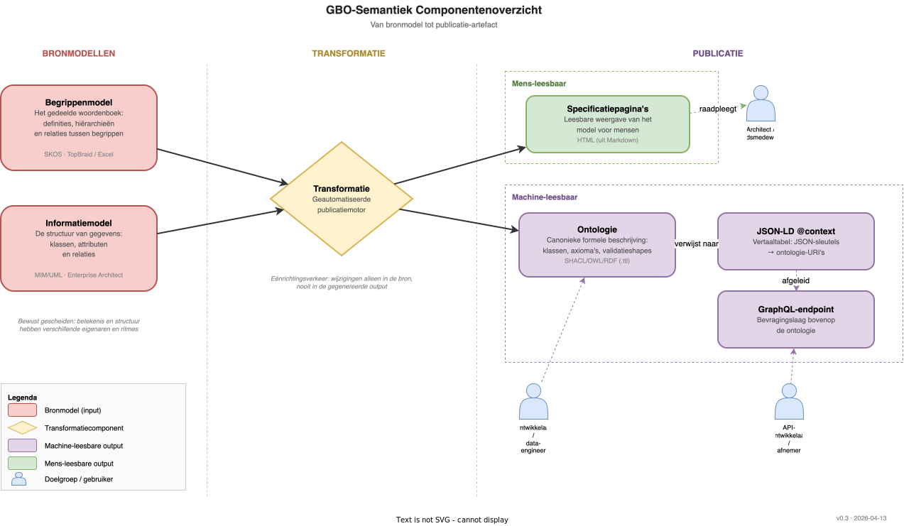

# Componenten en hun onderlinge relaties

De GBO-Semantiek architectuur bestaat uit een beperkt aantal componenten die samen zorgen voor een consistente, herbruikbare beschrijving van gemeentelijke basisgegevens. Dit hoofdstuk beschrijft elke component op conceptueel niveau: wat het is, waarom het bestaat en voor wie het bedoeld is.

Het diagram toont drie fasen: **bronmodellen** (wat wordt vastgelegd), **transformatie** (hoe het wordt verwerkt) en **publicatie** (hoe het beschikbaar wordt gemaakt). Alle publicatie-artefacten worden automatisch afgeleid uit de bronmodellen; handmatige tussenkomst in de output is niet nodig en niet gewenst.

## Bronmodellen

De architectuur kent twee bronmodellen die bewust gescheiden zijn: betekenis en structuur hebben verschillende eigenaren, doelgroepen en veranderritmes.

### Begrippenmodel

Het begrippenmodel is het gedeelde woordenboek van het gemeentelijk domein. Het legt vast wat termen betekenen, hoe ze zich tot elkaar verhouden en welke definities leidend zijn. Denk aan begrippen als "Zaak", "Besluit" of "Natuurlijk persoon", elk voorzien van een eenduidige definitie en geplaatst in een hiërarchie van bredere en smallere termen.

Het begrippenmodel is bedoeld voor **domeinexperts, informatiespecialisten en beleidsmedewerkers**: mensen die overeenstemming moeten bereiken over de betekenis van termen, zonder dat ze zich bezighouden met technische datastructuren. Het wordt beheerd in SKOS-formaat via tooling zoals TopBraid of Excel.

### Informatiemodel

Het informatiemodel beschrijft de structuur van gegevens: welke objecten (klassen) bestaan er, welke eigenschappen (attributen) hebben ze, en hoe verhouden ze zich tot elkaar (relaties). Waar het begrippenmodel zegt *wat iets betekent*, zegt het informatiemodel *hoe informatie over dat begrip is georganiseerd*.

Het informatiemodel is bedoeld voor **modelleurs en informatiearchitecten** en wordt beheerd in UML via Enterprise Architect (.qea). Het volgt de MIM-standaard (Metamodel Informatiemodellering) op niveau II/III.

### Waarom twee aparte bronnen?

Betekenis en structuur veranderen in een ander ritme. Een definitie kan worden aangescherpt zonder dat de datastructuur wijzigt; een nieuw attribuut kan worden toegevoegd zonder dat de betekenis van het begrip verandert. Door de bronnen te scheiden kunnen domeinexperts en modelleurs onafhankelijk werken, elk met hun eigen tooling en governanceproces.

## Transformatie

Een centrale transformatiecomponent neemt beide bronmodellen als input en genereert hieruit alle publicatie-artefacten. Dit is bewust eenrichtingsverkeer: wijzigingen gebeuren uitsluitend in de bronmodellen en stromen automatisch door naar de publicatie. Niemand past de gegenereerde output handmatig aan.

Deze opzet garandeert **consistentie**: wat een architect leest in de specificatiepagina's komt gegarandeerd overeen met wat een machine leest in de ontologie of JSON-LD context. Er is één bron van waarheid; de rest is afgeleid.

## Publicatie-artefacten

De transformatie produceert twee soorten output: machine-leesbaar (voor systemen) en mens-leesbaar (voor mensen). Beide worden uit dezelfde bron gegenereerd, wat garandeert dat ze altijd synchroon lopen.

### Machine-leesbare publicatie

De machine-leesbare publicatie bestaat uit drie artefacten die samen het volledige spectrum van machineconsumptie afdekken.

**Ontologie (SHACL/OWL/RDF)** is de canonieke, formele beschrijving van het model in Turtle-formaat (.ttl). De ontologie definieert klassen, eigenschappen, axioma's en validatieshapes. Het is het anker waaraan alle andere machine-leesbare vormen zijn opgehangen, omdat alleen RDF de uitdrukkingskracht heeft voor formele semantiek.

**JSON-LD @context** is een vertaaltabel die JSON-sleutels koppelt aan URI's in de ontologie. Wanneer een API JSON-LD levert met een verwijzing naar het GBO-contextbestand, weet elke ontvanger precies wat elke sleutel semantisch betekent, zonder de volledige ontologie te hoeven kennen. Dit maakt data zelfbeschrijvend.

**GraphQL-endpoint** biedt een bevragingslaag bovenop dezelfde ontologie. Het schema en de context komen uit dezelfde bron, waardoor query's en antwoorden semantisch verankerd zijn. Dit artefact maakt de gegevens direct bevraagbaar via een API.

### Mens-leesbare publicatie

**Specificatiepagina's (HTML)** worden gegenereerd uit Markdown en bieden een leesbare weergave van het model voor architecten, beleidsmedewerkers en andere niet-technische stakeholders. Omdat deze pagina's uit dezelfde bron worden gegenereerd als de ontologie, is er gegarandeerde overeenkomst tussen wat mensen lezen en wat machines verwerken.

## Samenhang

De kracht van deze architectuur zit in de enkele bron van waarheid. Eén wijziging in het begrippenmodel of informatiemodel, gevolgd door één run van de transformatie, resulteert in consistent bijgewerkte ontologie, JSON-LD context, GraphQL-schema en specificatiepagina's. Dit elimineert de kans op divergentie tussen documentatie en technische artefacten.

| Component | Formaat | Fase | Doelgroep |
|-----------|---------|------|-----------|
| Begrippenmodel | SKOS (Turtle) | Bron | Domeinexperts, beleidsmedewerkers |
| Informatiemodel | MIM/UML (.qea) | Bron | Modelleurs, informatiearchitecten |
| Transformatiecomponent | Geautomatiseerd | Transformatie | Beheerders toolchain |
| Ontologie | OWL/RDF/SHACL (.ttl) | Publicatie | Ontwikkelaars, data-engineers |
| JSON-LD @context | JSON-LD | Publicatie | API-ontwikkelaars |
| GraphQL-endpoint | GraphQL | Publicatie | API-afnemers |
| Specificatiepagina's | HTML | Publicatie | Architecten, beleidsmedewerkers |
