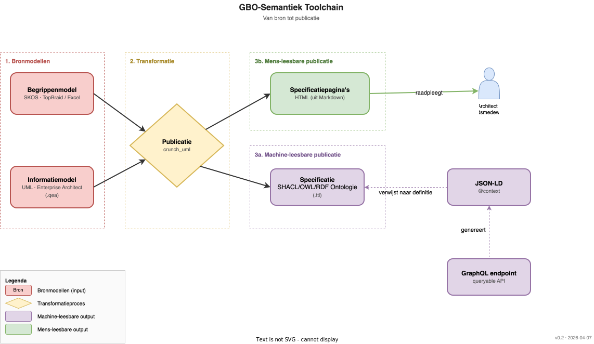

# Conceptueel

De conceptuele architectuur bestaat uit twee diagrammen met elk een eigen tijdlijn: de **toolchain** beschrijft hoe de canonieke artefacten worden geproduceerd, het **runtime-proces** hoe ze worden geconsumeerd. Ze zijn bewust gescheiden — ontwerptijd en runtime hebben verschillende deelnemers, ritmes en uitkomsten.

## 1. Toolchain — van bron tot publicatie

Twee bronmodellen worden door `crunch_uml` op deterministische wijze omgezet naar publicatie-artefacten:

- **Bronnen.** Een SKOS-*begrippenmodel* (MIM-niveau I, beheerd door domeinexperts) en een UML-*informatiemodel* in Enterprise Architect (MIM-niveau II/III). Bewust gescheiden: betekenis en structuur hebben verschillende doelgroepen en ritmes.
- **Transformatie.** Eén centrale tool, eenrichtingsverkeer. Wijzigingen gebeuren alleen in de bron en stromen door naar de publicatie.
- **Machine-leesbare output.** *SHACL/OWL/RDF* (Turtle) als canonieke vorm, met daaruit afgeleid een *JSON-LD @context* en een *GraphQL-endpoint*.
- **Mens-leesbare output.** HTML-*specificatiepagina's* uit dezelfde bron, zodat wat een architect leest gegarandeerd overeenkomt met de SHACL-shapes.

De RDF-ontologie is het anker omdat alleen RDF de uitdrukkingskracht heeft voor formele klassen, axioma's en validatie-shapes; JSON-LD en GraphQL zijn pragmatische projecties.

## 2. Runtime — semantiek in de DvTP-architectuur

Het ontwerpprincipe: *semantiek wordt één keer gedefinieerd en hergebruikt via metadata en rulebooks — niet ingebouwd in elke runtime-payload*. Daaruit volgen drie lagen.

**Governancelaag.** Drie artefacten maken de semantiek bruikbaar voor use cases: *credentialtype-metadata (vct)* — deels gegenereerd uit de ontologie, aangevuld door de use-case-eigenaar; het *rulebook / vertrouwensraamwerk* — een mensgericht document dat naar termen verwijst via stabiele URIs; en het *doel- en datacategorie-vocabulaire* — een uitsnede van de ontologie met eigen governance- en versioneringscyclus.

**Operationele laag — vier lanes**, ingedeeld op interactiepatroon (niet op formaat):

- *Lane A — EUDI credentials.* SD-JWT VCs van PubEAA Provider naar EUDI Wallet en verifier. Semantiek loopt via vct en rulebook, niet via een runtime `@context`.
- *Lane B — Semantische data-delivery.* ASI en SDG-OOTS Adapter leveren JSON-LD/RDF aan externe afnemers; zelf-beschrijvendheid in de payload is hier essentieel.
- *Lane C — Query / bevraging.* De Bronhouder GraphQL API levert JSON-LD-respons; SDL en `@context` komen uit dezelfde ontologie.
- *Lane D — Autorisatie & policy.* OPA-bundles van PAP naar PEP/PDP gebruiken doel- en attribuut-URIs uit het vocabulaire als anker voor audit en handhaving.

**Bron- en registerlaag.** Authentieke registraties (BRP, KvK, BAG, RSGB), bron-systemen en het toestemmingsregister. Bewust grijs: dit is opslag, niet de plek waar semantiek leeft.

SHACL-validatie kan op elke JSON-LD-leverende plek worden ingezet, maar krijgt een eigen tekening — het is een conformiteitsmechanisme met een eigen verhaal.

## Samenhang

De canonieke artefacten bovenin het runtime-diagram zijn letterlijk de output van de toolchain. Eén wijziging in de bron, één run van de toolchain, gegarandeerd consistent doorgevoerd in alle koppelvlakken — dat is de eigenschap die deze architectuur waardevol maakt en die met twee aparte tekeningen beheersbaar uit te leggen blijft.
