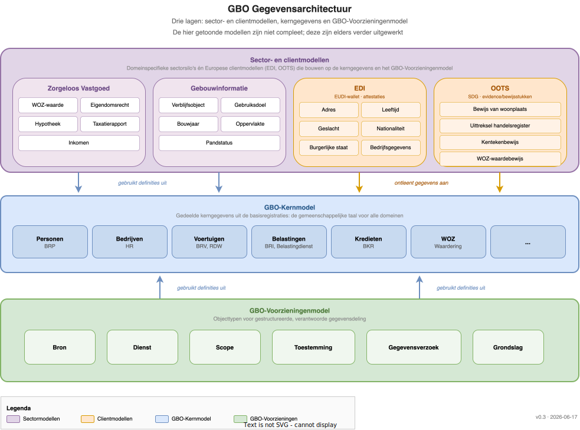

# Gegevensarchitectuur

De GBO-Semantiek gegevensarchitectuur is opgebouwd uit drie lagen die samen het volledige spectrum van gemeentelijke gegevensbeschrijving afdekken. De middelste laag vormt het fundament: een set gedeelde kerngegevens waar zowel de bovenliggende sectormodellen als het onderliggende GBO-informatiemodel op steunen.

Het diagram toont de drie lagen en hun onderlinge afhankelijkheden. De pijlen geven aan dat zowel sectormodellen als het GBO-model hun definities ontlenen aan de Core Data-laag. Dit garandeert dat alle lagen dezelfde begrippen en structuren hanteren.

## Core Data (middenlaag)

De Core Data-laag bevat de kerngegevens die voor alle gemeentelijke domeinen relevant zijn. Het gaat om gegevens uit de basisregistraties en andere bronnen die breed worden hergebruikt: personen (BRP), bedrijven (HR), panden (BAG), locaties (BGT, BRK) en aanverwante registraties.

Deze laag is de gemeenschappelijke taal van het GBO-stelsel. Door kernbegrippen zoals "Natuurlijk persoon", "Verblijfsobject" of "Kadastraal perceel" centraal te definiëren, hoeven individuele domeinen deze begrippen niet opnieuw uit te vinden. Elke verwijzing naar een persoon of een adres in een sectormodel of in het GBO-informatiemodel verwijst naar dezelfde, eenduidig gedefinieerde entiteit in Core Data.

## Sectormodellen (bovenlaag)

Boven de Core Data liggen de sectormodellen: domeinspecifieke silo's die de kerngegevens verrijken met begrippen en structuren die eigen zijn aan een bepaald beleidsterrein. Elk sectormodel definieert zijn eigen informatieobjecten, maar verwijst voor gedeelde begrippen zoals "persoon" of "adres" naar de definities in Core Data. Deze aanpak voorkomt duplicatie en zorgt ervoor dat sectoroverstijgende analyses mogelijk blijven.

Op dit moment zijn twee sectormodellen uitgewerkt; een derde is voorzien maar nog niet ingevuld.

**Zorgeloos Vastgoed** bundelt gegevens rond woningbezit en vastgoedtransacties. Informatieobjecten in dit domein zijn onder meer WOZ-waarde, Eigendomsrecht, Hypotheek, Taxatierapport en Energielabel. Het sectormodel combineert gegevens uit meerdere bronregistraties (WOZ, BRK, BAG) tot een samenhangend beeld per object.

**Gebouwinformatie** richt zich op de fysieke en functionele kenmerken van gebouwen. Dit sectormodel bevat objecten als Verblijfsobject, Gebruiksdoel, Bouwjaar, Oppervlakte en Pandstatus. De gegevens komen primair uit de BAG en worden aangevuld met domeinspecifieke kenmerken.

Een **derde sectormodel** is gereserveerd voor een volgend domein. De architectuur is zo opgezet dat nieuwe domeinen kunnen worden toegevoegd door een sectormodel te definiëren dat de Core Data-definities hergebruikt en het GBO-informatiemodel importeert.

## GBO-model (onderlaag)

De onderlaag beschrijft het [informatiemodel](../informatiemodel-gbo.md) voor de Gemeenschappelijke Bron Ontsluiting. Dit model definieert in één samenhangend geheel hoe gegevens uit de Core Data-laag gestructureerd, ontsloten en uitgewisseld worden: welke gegevens er zijn, wie erbij betrokken is en onder welke voorwaarden gegevens mogen worden gedeeld.

Het model bevat objecttypen voor de structuur van gegevensdeling (zoals Gegevenselement, Bron, Dienst en Scope), voor de betrokken rollen (zoals Burger, Bronhouder en Dienstverlener) en voor het transactieproces (zoals Toestemming, Gegevensverzoek en Grondslag). De volledige uitwerking van deze objecttypen staat in het [Informatiemodel GBO](../informatiemodel-gbo.md).

Het GBO-informatiemodel wordt per domein uitgebreid met specifieke gegevenselementen, bronnen en diensten. Een domeinextensie importeert het generieke model en voegt alleen toe wat domeinspecifiek is. Voorbeelden van domeinen zijn hypotheekadvies, zorgeloos vastgoed en gebouwinformatie.

## Samenhang tussen de lagen

De kracht van deze drielaagse opzet zit in de gedeelde kern. Sectormodellen en het GBO-informatiemodel worden onafhankelijk van elkaar ontwikkeld en beheerd, maar delen dezelfde fundamentele definities uit Core Data. Het GBO-informatiemodel beschrijft *hoe* gegevens worden gedeeld: met welke scope, op welke grondslag en met wiens toestemming.

Dit levert drie concrete voordelen op. Ten eerste **interoperabiliteit**: gegevens uit verschillende bronregistraties zijn via het GBO-informatiemodel uniform opvraagbaar, omdat ze dezelfde kernbegrippen gebruiken. Ten tweede **dataminimalisatie**: het scope-mechanisme garandeert dat alleen de strikt noodzakelijke gegevens worden gedeeld. En ten derde **schaalbaarheid**: nieuwe domeinen kunnen worden toegevoegd door een extensie te maken, zonder de bestaande lagen te verstoren.
