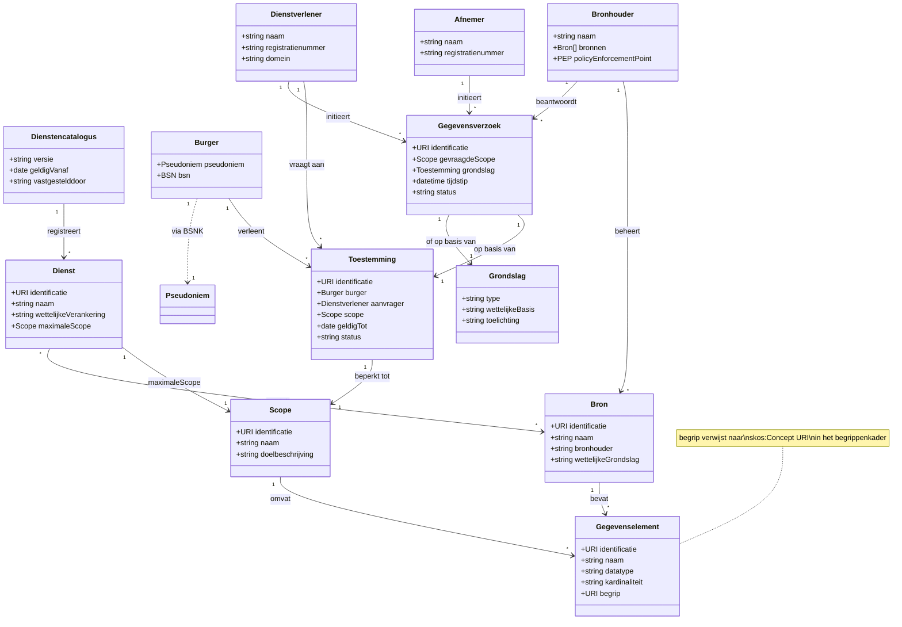

# Informatiemodel GBO

Het informatiemodel voor de Gemeenschappelijke Bron Ontsluiting opereert als laag 2 in de semantische architectuur: het definieert de *structuur* van gegevens en verwijst voor *betekenis* naar het begrippenkader (laag 1, SKOS). Zie de [gegevensarchitectuur](architectuur/gegevensarchitectuur.md) voor de positie van dit model in het geheel.

Het informatiemodel beschrijft in één samenhangend geheel welke gegevens er zijn, wie erbij betrokken is en onder welke voorwaarden gegevens mogen worden gedeeld. Per domein kunnen **extensies** worden gemaakt die het generieke model uitbreiden met domeinspecifieke gegevenselementen.

!!! info "Afbakening"
    Begrippen (definities, labels, relaties tussen termen) worden *niet* in het informatiemodel beheerd maar in het SKOS-begrippenkader. Het informatiemodel verwijst naar begrippen via `mim:begrip` naar `skos:Concept` URI's.

---

## Objecttypen en relaties

Het informatiemodel definieert de herbruikbare objecttypen die voor elk GBO-domein gelden. Een nieuw domein importeert dit model en voegt alleen domeinspecifieke gegevenselementen toe.

---

## Toelichting objecttypen

**Gegevenselement** is de technisch adresseerbare eenheid van data. Elk gegevenselement verwijst via `begrip` (URI) naar precies één `skos:Concept` in het begrippenkader. Het gegevenselement voegt structuurinformatie toe die het begrip niet heeft: datatype, kardinaliteit en positie in een objectstructuur. Bij de MIM-naar-OWL transformatie (laag 3) wordt elk gegevenselement een `owl:DatatypeProperty` of `owl:ObjectProperty`.

**Bron** is een registratie of gegevensverzameling bij een bronhouder. Een bron bevat gegevenselementen en heeft een wettelijke grondslag. Voorbeelden: BRP, Kadaster, BRK. Bij de ontologietransformatie wordt een Bron een `owl:Class` met de gegevenselementen als properties.

**Dienst** beschrijft een afgebakend doel waarvoor gegevens mogen worden opgevraagd. Een dienst is wettelijk verankerd (AMvB of ministeriële regeling) en heeft een maximale scope. In de ontologie wordt dit `gbo:Dienst`; in JSON-LD verschijnt de dienst in het toestemmingsverzoek.

**Scope** is een benoemde verzameling gegevenselementen. De maximale scope wordt bepaald door wetgeving; een afnemer kan een kleinere scope aanvragen (dataminimalisatie). In de ontologie wordt een scope een `gbo:Scope` die via `gbo:omvat` verwijst naar properties. In de JSON-LD @context bepaalt de scope welke keys beschikbaar zijn.

**Dienstencatalogus** is het register van alle beschikbare diensten met hun scopes, gepubliceerd als machine-leesbaar register (JSON-LD).

**Burger** is de persoon over wie gegevens worden uitgewisseld. In de context van GBO heeft de burger altijd een BSN, maar private dienstverleners ontvangen een pseudoniem via het BSNK-koppelregister. De burger verleent expliciet toestemming via het toestemmingsportaal.

**Bronhouder** beheert een of meer bronregistraties en is verantwoordelijk voor het Policy Enforcement Point (PEP) dat elk gegevensverzoek toetst op identiteit, autorisatie en grondslag.

**Dienstverlener** is de partij die namens of ten behoeve van de burger gegevens opvraagt. De dienstverlener vraagt toestemming aan bij de burger en specificeert daarbij een scope.

**Afnemer** is de partij die de gegevens uiteindelijk gebruikt. Dit kan dezelfde partij zijn als de dienstverlener, of een andere partij (bijvoorbeeld de bank die een hypotheek verstrekt, met een aparte toestemming).

**Toestemming** is het expliciete akkoord van de burger dat een specifieke dienstverlener een specifieke set gegevens mag opvragen. Een toestemming is altijd gebonden aan een scope, heeft een geldigheidsduur en is niet overdraagbaar.

**Gegevensverzoek** is de technische transactie waarmee een dienstverlener of afnemer brondata opvraagt. Elk verzoek verwijst naar een toestemming (of een wettelijke grondslag) en specificeert welke gegevenselementen worden opgevraagd.

**Grondslag** beschrijft de juridische basis voor gegevensuitwisseling. Dit kan toestemming van de burger zijn, maar ook een wettelijke verplichting (bijvoorbeeld bij leningverstrekking waar BSN noodzakelijk is).

### Doorvertaling naar andere lagen

| Informatiemodel-element | Begrippenkader (laag 1) | Ontologie (laag 3) | JSON-LD (laag 4) |
|-------------------------|------------------------|---------------------|-------------------|
| Gegevenselement | `mim:begrip` naar `skos:Concept` | `owl:DatatypeProperty` / `owl:ObjectProperty` | JSON-key in @context |
| Bron | `mim:begrip` naar `skos:Concept` | `owl:Class` | niet in response |
| Dienst | `mim:begrip` naar `skos:Concept` | `gbo:Dienst` (owl:Class) | Object in dienstencatalogus-response |
| Scope | `mim:begrip` naar `skos:Concept` | `gbo:Scope` (owl:Class) | Set van keys / OAuth scope |
| Dienstencatalogus | n.v.t. | `gbo:Dienstencatalogus` | JSON-LD register |
| Toestemming | `mim:begrip` naar `skos:Concept` | `gbo:Toestemming` (owl:Class) | Object in toestemmingsverzoek |
| Gegevensverzoek | `mim:begrip` naar `skos:Concept` | `gbo:Gegevensverzoek` (owl:Class) | JSON-LD request payload |

---

## Domeinextensies

Het informatiemodel wordt per domein uitgebreid met specifieke gegevenselementen, bronnen en diensten. Een domeinextensie importeert het GBO-informatiemodel en voegt alleen toe wat domeinspecifiek is.

### Voorbeeld: hypotheekadvies

De hypotheek-extensie illustreert hoe het informatiemodel wordt geëxtendeerd. Het domein voegt gegevenselementen toe die verwijzen naar begrippen in een domeinspecifiek begrippenkader (`gbo-hyp:`):

| Gegevenselement | Datatype | Begrip (URI) | Bron |
|-----------------|----------|-------------|------|
| `inkomen` | Bedrag | `gbo-hyp:inkomen` | UWV |
| `wozWaarde` | Bedrag | `gbo-hyp:wozwaarde` | WOZ-register |
| `heeftEigendom` | boolean | `gbo-hyp:eigendomsrecht` | BRK |
| `verblijfsadres` | Adresstructuur | `gbo-hyp:adres` | BAG |
| `totaleSchuld` | Bedrag | `gbo-hyp:schuld` | BKR |

Bij het hypotheekadvies wordt de dienst "Hypotheekadvies" gedefinieerd met een maximale scope over alle vijf gegevenselementen. Een afnemer kan vervolgens een beperktere scope aanvragen, bijvoorbeeld alleen inkomen en WOZ-waarde voor een oriënterend advies. De dienstverlener vraagt toestemming aan bij de burger; in het toestemmingsportaal ziet de burger de `skos:prefLabel` en `skos:definition` van de begrippen uit het begrippenkader. De data wordt geleverd als JSON-LD, waardoor de keys resolveren naar URI's in de ontologie.
