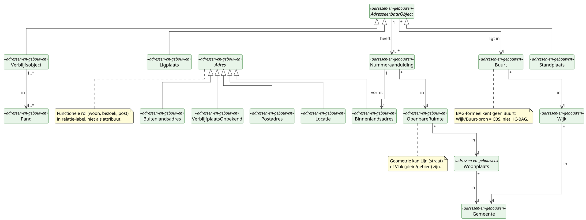

# Deelmodel: Adressen en gebouwen

`Adres` staat voorop, het meest gebruikte objecttype van dit deelmodel.
De BAG-keten (Nummeraanduiding, AdresseerbaarObject, Pand) hangt
eronder; de administratieve indeling (Gemeente, Wijk, Buurt) sluit het
diagram af.

Kadastrale eigendom valt buiten dit deelmodel; zie
[Onroerende zaken](onroerende-zaken.md). Topografische geometrie
(BGT/BRT) valt eveneens buiten dit deelmodel.

## Diagram

## Adres-cluster

### Adres (abstract)

**Definitie**: Een leesbare aanduiding van een locatie of correspondentiepunt waarmee een persoon of organisatie kan worden bereikt of waarop een rechtsbetrekking is gevestigd, samengesteld uit elementen van de bronregisters BAG, RSGB en BRP.

**Herkomst definitie**: Wet basisregistraties adressen en gebouwen (binnenlandsadres via de BAG-keten Nummeraanduiding, OpenbareRuimte, Woonplaats); BRP Logisch Ontwerp §5.8 (woon- en briefadres-context); RSGB-Kern (overkoepelend type Adres).

**Toelichting**: Adres is een samengestelde, leesbare projectie boven BAG-data, niet een zelfstandig authentiek gegeven. BAG levert de authentieke onderliggende data; de adres-projectie is voor afnemers in één keer leesbaar. De functionele rol (woon, bezoek, post, zetel) staat in de verwijzing vanuit de gebruiker (NatuurlijkPersoon, Vestiging), niet als kenmerk van Adres zelf.

| MIM-veld | Waarde |
|---|---|
| Naam | Adres |
| Begrip (URI) | `https://begrippen.gbo-semantiek.nl/id/begrip/Adres` |
| Herkomst | GBO (samengestelde view boven BAG, RSGB en BRP) |
| Datum opname | 2026-04-28 |
| Indicatie abstract object | Ja |
| Unieke aanduiding | `adresId` (UUID, GBO-eigen) |
| Populatie | Alle adressen die voor een overheidsorganisatie als adresseerbaarheid of correspondentiepunt relevant zijn. |

**Attribuutsoorten**:

| Naam | Type | Kard. | Authentiek | Mat. hist. | Form. hist. | Definitie | Herkomst | Toelichting |
|---|---|---|---|---|---|---|---|---|
| `adresId` | UUID | 1 | Overig | Nee | Nee | GBO-eigen sleutel voor één adres-instantie. | GBO | Voorkomt fragmentatie van adres-referenties bij BAG-mutaties. |
| `volledigAdres` | CharacterString | 0..1 | Overig | Nee | Nee | Gedenormaliseerde, leesbare projectie van het adres. | GBO (afgeleid) | Pre-formatted leesregel; afgeleid uit subtype-attributen. |

### Binnenlandsadres

**Definitie**: Een Nederlands adres dat via een BAG-Nummeraanduiding en de bijbehorende openbare ruimte en woonplaats wordt opgebouwd.

**Herkomst definitie**: Wet BAG art. 1 (Nummeraanduiding, OpenbareRuimte, Woonplaats); Catalogus BAG 2018; RSGB-Kern `Binnenlandsadres`.

**Toelichting**: BAG-gekoppeld adres met een eigen instantie per Nummeraanduiding (geen afgeleide view), geconstrueerd uit de Nummeraanduiding en de bovenliggende keten op moment van vorming.

| MIM-veld | Waarde |
|---|---|
| Naam | Binnenlandsadres |
| Begrip (URI) | `https://begrippen.gbo-semantiek.nl/id/begrip/Binnenlandsadres` |
| Herkomst | BAG (afgeleid uit de Nummeraanduiding-keten) |
| Datum opname | 2026-04-28 |
| Unieke aanduiding | `adresId` (geërfd) |
| Populatie | Alle Nederlandse adressen waarvoor een Nummeraanduiding is uitgegeven en die als woon-, bezoek- of correspondentieadres voor een afnemer relevant zijn. |

**Attribuutsoorten**:

| Naam | Type | Kard. | Authentiek | Mat. hist. | Form. hist. | Definitie | Herkomst | Toelichting |
|---|---|---|---|---|---|---|---|---|
| `straatnaam` | AN80 | 1 | Basisgegeven | Nee | Nee | Volledige naam van de openbare ruimte. | BAG (afgeleid OpenbareRuimte) | Authentiek op OR-bron, hier gedenormaliseerd. |
| `huisnummer` | N5 | 1 | Basisgegeven | Nee | Nee | Het huisnummer-deel van de Nummeraanduiding. | BAG (Nummeraanduiding) | |
| `huisletter` | CharacterString | 0..1 | Basisgegeven | Nee | Nee | De huisletter bij het huisnummer. | BAG (Nummeraanduiding) | |
| `huisnummertoevoeging` | CharacterString | 0..1 | Basisgegeven | Nee | Nee | De huisnummertoevoeging (bv. `2hg`, `bis`). | BAG (Nummeraanduiding) | |
| `postcode` | Postcode | 0..1 | Basisgegeven | Nee | Nee | De postcode behorend bij het huisnummer. | BAG (Nummeraanduiding) | Eigen op NA, niet afgeleid van OR. |
| `woonplaatsnaam` | AN80 | 1 | Basisgegeven | Nee | Nee | Naam van de bovenliggende woonplaats. | BAG (afgeleid Woonplaats) | |

**Relatiesoorten** (uitgaand):

| Naam | Doel | Kard. (bron→doel) | Authentiek | Mat. hist. | Form. hist. | Toelichting |
|---|---|---|---|---|---|---|
| `wordtGevormdDoor` | Nummeraanduiding | 1 → 1 | Basisgegeven | Nee | Nee | Spiegel van `Nummeraanduiding vormt Binnenlandsadres`. |

### Buitenlandsadres

**Definitie**: Een adres buiten Nederland weergegeven als één tot drie vrije adresregels samen met een landaanduiding.

**Herkomst definitie**: BRP Logisch Ontwerp §5.8 (buitenlandse adresregels van een niet-ingezetene); RSGB-Kern `Buitenlandsadres`.

**Toelichting**: Adres voor personen of vestigingen zonder Nederlands adres. Geen BAG-koppeling; geen authentieke bron in Nederland. Land verwijst naar de internationale lijst ISO 3166.

| MIM-veld | Waarde |
|---|---|
| Naam | Buitenlandsadres |
| Begrip (URI) | `https://begrippen.gbo-semantiek.nl/id/begrip/Buitenlandsadres` |
| Herkomst | GBO / BRP (RNI-context) |
| Datum opname | 2026-04-28 |
| Unieke aanduiding | `adresId` (geërfd) |
| Populatie | Alle adressen in het buitenland die voor een Nederlandse afnemer als verblijf-, post- of zeteladres relevant zijn. |

**Attribuutsoorten**:

| Naam | Type | Kard. | Authentiek | Mat. hist. | Form. hist. | Definitie | Herkomst | Toelichting |
|---|---|---|---|---|---|---|---|---|
| `adresregel1` | CharacterString | 1 | Overig | Nee | Nee | Eerste regel van het buitenlandse adres. | GBO / BRP | |
| `adresregel2` | CharacterString | 0..1 | Overig | Nee | Nee | Tweede regel van het buitenlandse adres. | GBO / BRP | |
| `adresregel3` | CharacterString | 0..1 | Overig | Nee | Nee | Derde regel van het buitenlandse adres. | GBO / BRP | |
| `land` | `Codelijst~ISO3166` | 1 | Basisgegeven | Nee | Nee | Landaanduiding volgens ISO 3166. | ISO 3166 / LT34 | Cross-walk LT34 (BRP). |

### Locatie

**Definitie**: Een adresseerbare plek zonder eigen Nummeraanduiding, beschreven met een vrije omschrijving en optioneel een landaanduiding.

**Herkomst definitie**: BRP Logisch Ontwerp categorie 08 (verblijfplaats zonder regulier vast adres); RSGB-Kern (Aanduiding vrije locatie).

**Toelichting**: Adres-variant voor situaties zonder regulier vast adres, bijvoorbeeld een omschrijving plus land bij sommige RNI-inschrijvingen, een kraam, een bouwplaats of een tijdelijk verkooppunt.

| MIM-veld | Waarde |
|---|---|
| Naam | Locatie |
| Begrip (URI) | `https://begrippen.gbo-semantiek.nl/id/begrip/Locatie` |
| Herkomst | GBO / BRP (RNI-context) |
| Datum opname | 2026-04-28 |
| Unieke aanduiding | `adresId` (geërfd) |
| Populatie | Plekken die als adres dienen zonder dat het bevoegde gezag er een Nummeraanduiding aan heeft toegekend. |

**Attribuutsoorten**:

| Naam | Type | Kard. | Authentiek | Mat. hist. | Form. hist. | Definitie | Herkomst | Toelichting |
|---|---|---|---|---|---|---|---|---|
| `omschrijving` | CharacterString | 1 | Overig | Nee | Nee | Vrije tekstuele omschrijving van de locatie. | GBO | Max 255 tekens. |
| `land` | `Codelijst~ISO3166` | 0..1 | Basisgegeven | Nee | Nee | Landaanduiding volgens ISO 3166. | ISO 3166 / LT34 | Default `NL` als omschrijving een NL-locatie betreft. |

### Postadres

**Definitie**: Een correspondentie-adres in de vorm van een postbus, antwoordnummer of vergelijkbare briefbus-aanduiding bij een PostNL-locatie.

**Herkomst definitie**: NEN 5825 (notatie van postadressen); PostNL Postcodeboek / Postbusbesluit; BRP Logisch Ontwerp §5.8 (briefadres).

**Toelichting**: Briefadres of postbus voor correspondentie. Niet bedoeld voor verblijf; afnemers gebruiken het naast een woon- of bezoekadres.

| MIM-veld | Waarde |
|---|---|
| Naam | Postadres |
| Begrip (URI) | `https://begrippen.gbo-semantiek.nl/id/begrip/Postadres` |
| Herkomst | GBO / NEN 5825 / PostNL |
| Datum opname | 2026-04-28 |
| Unieke aanduiding | `adresId` (geërfd) |
| Populatie | Postbussen, antwoordnummers en overige briefbus-aanduidingen voor correspondentie van personen of organisaties. |

**Attribuutsoorten**:

| Naam | Type | Kard. | Authentiek | Mat. hist. | Form. hist. | Definitie | Herkomst | Toelichting |
|---|---|---|---|---|---|---|---|---|
| `briefbusnummer` | CharacterString | 0..1 | Overig | Nee | Nee | Het postbus- of antwoordnummer. | GBO / PostNL | |
| `postcode` | Postcode | 0..1 | Overig | Nee | Nee | Postcode behorend bij het postadres. | GBO / PostNL | Pattern `[1-9][0-9]{3}[A-Z]{2}`. |
| `plaats` | AN80 | 1 | Overig | Nee | Nee | Plaatsnaam van het postadres. | GBO / PostNL | |
| `soortPostadres` | `SoortPostadres` | 1 | Overig | Nee | Nee | Type postadres. | GBO | Zie [Enumeraties](#enumeraties). |

### VerblijfplaatsOnbekend

**Definitie**: Een adres-rol voor een ingeschreven persoon van wie de feitelijke verblijfplaats op een bepaalde datum onbekend is geworden, zonder dat een nieuw adres bekend is.

**Herkomst definitie**: BRP Logisch Ontwerp categorie 08 (verblijfplaats; vertrek naar onbekende bestemming, "Land van vertrek onbekend").

**Toelichting**: BRP-specifieke variant. Geen adres in strikte zin, wel een geldige adres-rol bij vertrek naar onbekende bestemming.

| MIM-veld | Waarde |
|---|---|
| Naam | VerblijfplaatsOnbekend |
| Begrip (URI) | `https://begrippen.gbo-semantiek.nl/id/begrip/VerblijfplaatsOnbekend` |
| Herkomst | BRP cat 08 |
| Datum opname | 2026-04-28 |
| Unieke aanduiding | `adresId` (geërfd) |
| Populatie | Ingeschreven personen van wie de feitelijke verblijfplaats op een bepaalde datum onbekend is geworden. |

**Attribuutsoorten**:

| Naam | Type | Kard. | Authentiek | Mat. hist. | Form. hist. | Definitie | Herkomst | Toelichting |
|---|---|---|---|---|---|---|---|---|
| `datumIngangOnbekend` | Datum | 1 | Basisgegeven | Nee | Nee | Datum waarop de verblijfplaats van de ingeschrevene onbekend werd. | BRP cat 08 | |

## BAG-objecten

Alle BAG-objecten dragen het `Voorkomen`-mixin (bitemporeel patroon;
zie het hoofdmodel, sectie [Patronen](../hoofdmodel.md#patronen)) en de datakwaliteits-flags
`geconstateerd`, `inOnderzoek`, `documentdatum`, `documentnummer`. In
de attribuut-tabellen hieronder worden die mixin-attributen omwille
van leesbaarheid weggelaten.

### AdresseerbaarObject (abstract)

**Definitie**: Een object waaraan formeel één of meer adressen kunnen worden toegekend door het bevoegde gemeentelijke gezag, ter identificatie van een eenheid van gebruik, ligging of verblijf.

**Herkomst definitie**: Wet BAG; Catalogus BAG 2018 §2.5, §2.7; IMBAG (gedeeld patroon voor Verblijfsobject, Ligplaats en Standplaats).

**Toelichting**: Overkoepelend type voor de drie BAG-vormen die formeel een adres krijgen: Verblijfsobject (binnen pand), Ligplaats (water) en Standplaats (terrein). Een adresseerbaar object heeft minstens één Nummeraanduiding (het hoofdadres) en eventueel nevenadressen. Afnemers zoals HR (`addresseerbaarObjectId`), BRP (`adresseerbaarObjectIdentificatie`) en WOZ komen vaak via dit overkoepelende type binnen.

| MIM-veld | Waarde |
|---|---|
| Naam | AdresseerbaarObject |
| Alias | AO (BAG-afkorting) |
| Begrip (URI) | `https://begrippen.gbo-semantiek.nl/id/begrip/AdresseerbaarObject` |
| Herkomst | BAG (basisregistratie) |
| Datum opname | 2026-04-28 |
| Indicatie abstract object | Ja |
| Unieke aanduiding | `identificatie` (NEN3610ID) |
| Populatie | Alle adresseerbare objecten in Nederland zoals aangewezen en geregistreerd door de bevoegde gemeente in de BAG. |

**Attribuutsoorten**:

| Naam | Type | Kard. | Authentiek | Mat. hist. | Form. hist. | Definitie | Herkomst | Toelichting |
|---|---|---|---|---|---|---|---|---|
| `identificatie` | NEN3610ID | 1 | Authentiek | Nee | Nee | Unieke identificatie van het adresseerbaar object volgens NEN 3610. | BAG-Catalogus 2018 | Historie zit op de concrete vormen, niet op het abstract supertype. |
| `typeAdresseerbaarObject` | `TypeAdresseerbaarObject` | 1 | Basisgegeven | Nee | Nee | Aanduiding van de concrete vorm: Verblijfsobject, Ligplaats of Standplaats. | BAG-Catalogus 2018 | Discriminator; ook gerepliceerd op Nummeraanduiding voor HC-conformiteit. |

**Relatiesoorten** (uitgaand):

| Naam | Doel | Kard. (bron→doel) | Authentiek | Mat. hist. | Form. hist. | Toelichting |
|---|---|---|---|---|---|---|
| `heeft` | Nummeraanduiding | 1 → 1..* | Authentiek | Nee | Nee | Hoofdadres + nul of meer nevenadressen. |
| `ligtIn` | Buurt | 1 → 1 | Basisgegeven | Nee | Nee | Geometrische plaatsing in precies één Buurt (CBS-laag). |

### Ligplaats

**Definitie**: Een door het bevoegde gemeentelijke gezag aangewezen plaats in het water, eventueel aangevuld met een op de oever aanwezig terrein of een gedeelte daarvan, bestemd voor het permanent afmeren van een voor woon-, bedrijfsmatige of recreatieve doeleinden geschikt drijvend object.

**Herkomst definitie**: Wet BAG art. 1; Catalogus BAG 2018 §2.6; IMBAG `Ligplaats`.

**Toelichting**: Specifieke vorm van `AdresseerbaarObject` zonder pandcontext, in het water. Krijgt minstens één Nummeraanduiding (het hoofdadres) en eventueel nevenadressen.

| MIM-veld | Waarde |
|---|---|
| Naam | Ligplaats |
| Begrip (URI) | `https://begrippen.gbo-semantiek.nl/id/begrip/Ligplaats` |
| Herkomst | BAG (basisregistratie) |
| Datum opname | 2026-04-28 |
| Unieke aanduiding | `identificatie` (NEN3610ID) |
| Populatie | Door gemeenten aangewezen ligplaatsen in Nederland: woonboten, drijvende woningen, recreatieve drijvende objecten. |

**Attribuutsoorten**:

| Naam | Type | Kard. | Authentiek | Mat. hist. | Form. hist. | Definitie | Herkomst | Toelichting |
|---|---|---|---|---|---|---|---|---|
| `status` | `StatusAdresseerbaarObject` | 1 | Authentiek | Ja | Ja | Levenscyclus-status van de ligplaats. | BAG-Catalogus 2018 | Plaats-stack; zie [Enumeraties](#enumeraties). |
| `geometrie` | Vlak | 1 | Authentiek | Ja | Ja | Vlakke begrenzing van de ligplaats. | BAG-Catalogus 2018 | CRS RD-New EPSG:28992. |

### Nummeraanduiding

**Definitie**: Een door het bevoegde gemeentelijke gezag aan een adresseerbaar object toegekende aanduiding bestaande uit een huisnummer met eventueel een huisletter, een huisnummertoevoeging en een postcode, die samen met de naam van de openbare ruimte en de woonplaats het formele adres vormt.

**Herkomst definitie**: Wet BAG art. 1; Catalogus BAG 2018 §2.3; IMBAG `Nummeraanduiding`.

**Toelichting**: Formele adres-eenheid in de BAG. Bundelt huisnummer, huisletter, huisnummertoevoeging en postcode tot één identificeerbaar adres, gekoppeld aan precies één adresseerbaar object en geplaatst in precies één openbare ruimte. Postcode is een eigen kenmerk op Nummeraanduiding, niet afgeleid van openbare ruimte.

| MIM-veld | Waarde |
|---|---|
| Naam | Nummeraanduiding |
| Begrip (URI) | `https://begrippen.gbo-semantiek.nl/id/begrip/Nummeraanduiding` |
| Herkomst | BAG (basisregistratie) |
| Datum opname | 2026-04-28 |
| Unieke aanduiding | `identificatie` (NEN3610ID) |
| Populatie | Alle door gemeenten toegekende nummeraanduidingen in Nederland zoals geregistreerd in de BAG, hoofd- en nevenadressen, inclusief uitgegeven en ingetrokken aanduidingen. |

**Attribuutsoorten**:

| Naam | Type | Kard. | Authentiek | Mat. hist. | Form. hist. | Definitie | Herkomst | Toelichting |
|---|---|---|---|---|---|---|---|---|
| `identificatie` | NEN3610ID | 1 | Authentiek | Ja | Ja | Unieke identificatie van de nummeraanduiding volgens NEN 3610. | BAG-Catalogus 2018 | In KVK/HR-API als `nummerAanduidingId`. |
| `huisnummer` | N5 | 1 | Authentiek | Ja | Ja | Numerieke aanduiding van het adres binnen de openbare ruimte. | BAG-Catalogus 2018 | |
| `huisletter` | CharacterString | 0..1 | Authentiek | Ja | Ja | Letter ter onderscheid binnen één huisnummer. | BAG-Catalogus 2018 | Eén letter (A-Z). |
| `huisnummertoevoeging` | CharacterString | 0..1 | Authentiek | Ja | Ja | Vrije aanvulling op huisnummer en huisletter (bv. `2hg`, `bis`). | BAG-Catalogus 2018 | |
| `postcode` | Postcode | 0..1 | Authentiek | Ja | Ja | Postcode behorend bij het huisnummer. | BAG-Catalogus 2018 | Pattern `[1-9][0-9]{3}[A-Z]{2}`. |
| `typeAdresseerbaarObject` | `TypeAdresseerbaarObject` | 1 | Authentiek | Ja | Ja | Aanduiding van de vorm waarop de nummeraanduiding wijst (Verblijfsobject, Ligplaats of Standplaats). | BAG-Catalogus 2018 | HC-conform Pakket G; replica van discriminator. |
| `status` | `StatusNummeraanduiding` | 1 | Authentiek | Ja | Ja | Levenscyclus-status van de nummeraanduiding. | BAG-Catalogus 2018 | Zie [Enumeraties](#enumeraties). |

**Relatiesoorten** (uitgaand):

| Naam | Doel | Kard. (bron→doel) | Authentiek | Mat. hist. | Form. hist. | Toelichting |
|---|---|---|---|---|---|---|
| `in` | OpenbareRuimte | * → 1 | Authentiek | Ja | Ja | De openbare ruimte waarin de nummeraanduiding is uitgegeven. |
| `vormt` | Binnenlandsadres | 1 → 1 | Basisgegeven | Ja | Ja | Eén nummeraanduiding vormt precies één Binnenlandsadres-instantie. |

### Pand

**Definitie**: De kleinste bij de totstandkoming functioneel en bouwkundig-constructief zelfstandige eenheid die direct en duurzaam met de aarde is verbonden en betreedbaar en afsluitbaar is.

**Herkomst definitie**: Wet BAG art. 1; Catalogus BAG 2018 §2.4; IMBAG `Pand`.

**Toelichting**: Beschrijft de bouwkundige werkelijkheid: een gebouw als zelfstandige constructie, los van het gebruik (dat zit op Verblijfsobject) en los van het adres (dat zit op Nummeraanduiding). Een pand kan nul, één of meer verblijfsobjecten bevatten. Een sluis-VBO kan over meerdere panden lopen, en een leeg pand kan zonder VBO bestaan.

| MIM-veld | Waarde |
|---|---|
| Naam | Pand |
| Begrip (URI) | `https://begrippen.gbo-semantiek.nl/id/begrip/Pand` |
| Herkomst | BAG (basisregistratie) |
| Datum opname | 2026-04-28 |
| Unieke aanduiding | `identificatie` (NEN3610ID) |
| Populatie | Alle panden in Nederland zoals aangewezen en geregistreerd door de bevoegde gemeente in de BAG, inclusief panden in gerealiseerde, in-aanbouw- en gesloopte status. |

**Attribuutsoorten**:

| Naam | Type | Kard. | Authentiek | Mat. hist. | Form. hist. | Definitie | Herkomst | Toelichting |
|---|---|---|---|---|---|---|---|---|
| `identificatie` | NEN3610ID | 1 | Authentiek | Ja | Ja | Unieke identificatie van het pand volgens NEN 3610. | BAG-Catalogus 2018 | |
| `oorspronkelijkBouwjaar` | N4 | 1 | Authentiek | Ja | Ja | Jaar van eerste oplevering van het pand. | BAG-Catalogus 2018 | Bij verbouwing ongewijzigd. |
| `status` | `StatusPand` | 1 | Authentiek | Ja | Ja | Levenscyclus-status van het pand. | BAG-Catalogus 2018 | Zie [Enumeraties](#enumeraties). |
| `geometrie` | Vlak | 1 | Authentiek | Ja | Ja | Bovenaanzicht-geometrie van het pand. | BAG-Catalogus 2018 | CRS RD-New EPSG:28992. |

**Relatiesoorten** (uitgaand):

Pand heeft geen verplichte uitgaande relaties. Inkomend: `Verblijfsobject in Pand` (1..* ↔ 1..*).

### Standplaats

**Definitie**: Een door het bevoegde gemeentelijke gezag aangewezen terrein of gedeelte daarvan dat bestemd is voor het permanent plaatsen van een niet direct en niet duurzaam met de aarde verbonden en voor woon-, bedrijfsmatige of recreatieve doeleinden geschikt bouwwerk.

**Herkomst definitie**: Wet BAG art. 1; Catalogus BAG 2018 §2.7; IMBAG `Standplaats`.

**Toelichting**: Specifieke vorm van `AdresseerbaarObject` zonder pandcontext, op terrein. Typisch een woonwagen, recreatiewoning op een camping of een vaste standplaats van een kraam. Krijgt minstens één Nummeraanduiding (het hoofdadres) en eventueel nevenadressen.

| MIM-veld | Waarde |
|---|---|
| Naam | Standplaats |
| Begrip (URI) | `https://begrippen.gbo-semantiek.nl/id/begrip/Standplaats` |
| Herkomst | BAG (basisregistratie) |
| Datum opname | 2026-04-28 |
| Unieke aanduiding | `identificatie` (NEN3610ID) |
| Populatie | Door gemeenten aangewezen standplaatsen in Nederland: woonwagenlocaties, recreatiewoningen op camping, vaste standplaatsen van kraampjes. |

**Attribuutsoorten**:

| Naam | Type | Kard. | Authentiek | Mat. hist. | Form. hist. | Definitie | Herkomst | Toelichting |
|---|---|---|---|---|---|---|---|---|
| `status` | `StatusAdresseerbaarObject` | 1 | Authentiek | Ja | Ja | Levenscyclus-status van de standplaats. | BAG-Catalogus 2018 | Plaats-stack; zie [Enumeraties](#enumeraties). |
| `geometrie` | Vlak | 1 | Authentiek | Ja | Ja | Vlakke begrenzing van de standplaats. | BAG-Catalogus 2018 | CRS RD-New EPSG:28992. |

### Verblijfsobject

**Definitie**: De kleinste binnen één of meer panden gelegen en voor woon-, bedrijfsmatige of recreatieve doeleinden geschikte eenheid van gebruik die ontsloten wordt via een eigen afsluitbare toegang vanaf de openbare weg, een erf of een gemeenschappelijke verkeersruimte.

**Herkomst definitie**: Wet BAG art. 1; Catalogus BAG 2018 §2.5; IMBAG `Verblijfsobject`.

**Toelichting**: Concrete vorm van `AdresseerbaarObject` voor gebruiks-eenheden binnen één of meer panden: een woning, kantoor, winkel, recreatieobject of bedrijfsruimte. Eén verblijfsobject ligt in één of meer panden; een pand kan nul of meer verblijfsobjecten bevatten. Geometrie is een punt binnen het VBO (verblijfsobjectpunt-conventie), geen vlak.

| MIM-veld | Waarde |
|---|---|
| Naam | Verblijfsobject |
| Alias | VBO |
| Begrip (URI) | `https://begrippen.gbo-semantiek.nl/id/begrip/Verblijfsobject` |
| Herkomst | BAG (basisregistratie) |
| Datum opname | 2026-04-28 |
| Unieke aanduiding | `identificatie` (NEN3610ID) |
| Populatie | Alle verblijfsobjecten in Nederland zoals aangewezen en geregistreerd door de bevoegde gemeente in de BAG: woningen, kantoren, winkels, recreatieobjecten, bedrijfsruimten. |

**Attribuutsoorten**:

| Naam | Type | Kard. | Authentiek | Mat. hist. | Form. hist. | Definitie | Herkomst | Toelichting |
|---|---|---|---|---|---|---|---|---|
| `gebruiksdoel` | `Gebruiksdoel` | 1..* | Authentiek | Ja | Ja | Doel waarvoor het verblijfsobject geschikt is volgens het gemeentelijk besluit. | BAG-Catalogus 2018 | Meervoudig per VBO toegestaan; zie [Enumeraties](#enumeraties). |
| `oppervlakte` | N6 | 1 | Authentiek | Ja | Ja | Gebruiksoppervlakte van het verblijfsobject in m² volgens NEN 2580. | BAG-Catalogus 2018 | |
| `aantalKamers` | N2 | 0..1 | Basisgegeven | Ja | Ja | Aantal kamers bij een verblijfsobject met woonfunctie. | GGM v2.5.0 (BAG-projectie) | Alleen relevant bij Woonfunctie. |
| `soortWoonobject` | CharacterString | 0..1 | Basisgegeven | Ja | Ja | Type woonobject (Woning, Recreatiewoning, Wooneenheid, Bijzonder woongebouw). | GGM v2.5.0 (BAG-projectie) | Alleen bij gebruiksdoel Woonfunctie. |
| `status` | `StatusAdresseerbaarObject` | 1 | Authentiek | Ja | Ja | Levenscyclus-status van het verblijfsobject. | BAG-Catalogus 2018 | Zie [Enumeraties](#enumeraties). |
| `geometriePunt` | Punt | 1 | Authentiek | Ja | Ja | Punt-geometrie binnen het verblijfsobject (verblijfsobjectpunt). | BAG-Catalogus 2018 | CRS RD-New EPSG:28992. |

**Relatiesoorten** (uitgaand):

| Naam | Doel | Kard. (bron→doel) | Authentiek | Mat. hist. | Form. hist. | Toelichting |
|---|---|---|---|---|---|---|
| `in` | Pand | 1..* → 1..* | Authentiek | Ja | Ja | Sluis-VBO kan over meerdere panden lopen; leeg pand zonder VBO is geldig. |

## Administratieve indeling

### Buurt

**Definitie**: Een aaneengesloten gedeelte van een wijk waarvan de grenzen primair zijn gebaseerd op topografische elementen, vastgesteld door het Centraal Bureau voor de Statistiek.

**Herkomst definitie**: CBS Wijk- en Buurtkaart (jaarlijkse vaststelling); NEN 3610 voor het algemene patroon. BAG-formeel kent geen Buurt.

**Toelichting**: Wijk en Buurt staan formeel buiten de BAG (CBS-data); ze zijn in dit deelmodel opgenomen vanwege hun gangbaarheid bij beleids- en analyse-afnemers (sociaal domein, demografie). CBS herziet de buurtgrenzen jaarlijks; mutaties komen via CBS Open Data.

| MIM-veld | Waarde |
|---|---|
| Naam | Buurt |
| Begrip (URI) | `https://begrippen.gbo-semantiek.nl/id/begrip/Buurt` |
| Herkomst | CBS Wijk- en Buurtkaart |
| Datum opname | 2026-04-28 |
| Unieke aanduiding | `buurtcode` (CBS-code) |
| Populatie | Alle CBS-buurten binnen Nederland zoals jaarlijks vastgesteld in de CBS Wijk- en Buurtkaart. |

**Attribuutsoorten**:

| Naam | Type | Kard. | Authentiek | Mat. hist. | Form. hist. | Definitie | Herkomst | Toelichting |
|---|---|---|---|---|---|---|---|---|
| `buurtcode` | `Codelijst~CBS_WijkBuurt` | 1 | Landelijk kerngegeven | Ja | Ja | CBS-buurtcode binnen de Wijk- en Buurtkaart. | CBS | Jaarlijks herzien. |
| `buurtnaam` | AN40 | 1 | Landelijk kerngegeven | Ja | Ja | Volledige naam van de buurt. | CBS | |
| `geometrie` | Vlak | 1 | Landelijk kerngegeven | Ja | Ja | Vlakke begrenzing van de buurt. | CBS | Jaarlijks herzien. |

**Relatiesoorten** (uitgaand):

| Naam | Doel | Kard. (bron→doel) | Authentiek | Mat. hist. | Form. hist. | Toelichting |
|---|---|---|---|---|---|---|
| `in` | Wijk | * → 1 | Landelijk kerngegeven | Ja | Ja | Buurt ligt in precies één Wijk (CBS-hiërarchie). |

### Gemeente

**Definitie**: Een door of krachtens de wet ingestelde territoriale openbare bestuurslaag binnen Nederland, met een eigen volksvertegenwoordiging en bevoegdheden over een afgebakend grondgebied.

**Herkomst definitie**: Grondwet art. 123 (instelling van gemeenten); Gemeentewet; BRP-Landelijke Tabel LT33 (gemeentecodes).

**Toelichting**: Eén gemeente kan meerdere woonplaatsen bevatten; gemeentegrenzen wijzigen sporadisch via herindeling. Codelijst LT33 wordt door BRP onderhouden en kent een einddatum-veld voor opgeheven gemeenten.

| MIM-veld | Waarde |
|---|---|
| Naam | Gemeente |
| Begrip (URI) | `https://begrippen.gbo-semantiek.nl/id/begrip/Gemeente` |
| Herkomst | BRP-LT33 / CBS Kadaster (geometrie) |
| Datum opname | 2026-04-28 |
| Unieke aanduiding | `gemeentecode` |
| Populatie | Alle Nederlandse gemeenten zoals vastgesteld door de Rijksoverheid en bijgehouden in BRP-LT33, inclusief historische gemeenten met einddatum. |

**Attribuutsoorten**:

| Naam | Type | Kard. | Authentiek | Mat. hist. | Form. hist. | Definitie | Herkomst | Toelichting |
|---|---|---|---|---|---|---|---|---|
| `gemeentecode` | `Codelijst~LT33` | 1 | Basisgegeven | Nee | Nee | Door de Rijksoverheid vastgestelde gemeentecode. | LT33 (BRP-tabel) | 4-cijferige code. |
| `gemeentenaam` | AN80 | 1 | Basisgegeven | Nee | Nee | Volledige naam van de gemeente. | LT33 | |
| `geometrie` | Vlak | 1 | Basisgegeven | Nee | Nee | Vlakke begrenzing van de gemeente. | CBS / Kadaster | |

### OpenbareRuimte

**Definitie**: Een door het bevoegde gemeentelijke gezag als zodanig aangewezen en van een naam voorziene buitenruimte die binnen één woonplaats is gelegen.

**Herkomst definitie**: Wet BAG art. 1; Catalogus BAG 2018 §2.2; IMBAG `Openbare ruimte`; NEN 5825 (verkorte naam).

**Toelichting**: BAG-registratie-eenheid voor benoemde buitenruimten: typisch straatnamen (`typeOpenbareRuimte = Weg`), maar ook waterlopen, terreinen, kunstwerken en administratieve gebieden. Levert de straat- of locatienaam voor het volledige adres. Geometrie kan zowel een lijn (straat) als een vlak (plein/gebied) zijn.

| MIM-veld | Waarde |
|---|---|
| Naam | OpenbareRuimte |
| Begrip (URI) | `https://begrippen.gbo-semantiek.nl/id/begrip/OpenbareRuimte` |
| Herkomst | BAG (basisregistratie) |
| Datum opname | 2026-04-28 |
| Unieke aanduiding | `identificatie` (NEN3610ID) |
| Populatie | Alle door gemeenten aangewezen openbare ruimten in Nederland zoals geregistreerd in de BAG, inclusief uitgegeven en ingetrokken openbare ruimten. |

**Attribuutsoorten**:

| Naam | Type | Kard. | Authentiek | Mat. hist. | Form. hist. | Definitie | Herkomst | Toelichting |
|---|---|---|---|---|---|---|---|---|
| `identificatie` | NEN3610ID | 1 | Authentiek | Ja | Ja | Unieke identificatie van de openbare ruimte volgens NEN 3610. | BAG-Catalogus 2018 | |
| `naamOpenbareRuimte` | AN80 | 1 | Authentiek | Ja | Ja | Volledige naam van de openbare ruimte. | BAG-Catalogus 2018 | |
| `korteNaam` | Tekst24 | 0..1 | Basisgegeven | Ja | Ja | Verkorte naam van de openbare ruimte (max 24 tekens). | BAG / NEN 5825 | Voor smalle weergaves (navigatie, etiketten). |
| `typeOpenbareRuimte` | `TypeOpenbareRuimte` | 1 | Authentiek | Ja | Ja | Aanduiding van het soort openbare ruimte. | BAG-Catalogus 2018 | Zie [Enumeraties](#enumeraties). |
| `status` | `StatusOpenbareRuimte` | 1 | Authentiek | Ja | Ja | Levenscyclus-status van de openbare ruimte. | BAG-Catalogus 2018 | Zie [Enumeraties](#enumeraties). |
| `geometrie` | Geometrie | 1 | Basisgegeven | Ja | Ja | Geometrische begrenzing als lijn of vlak. | BAG-Catalogus 2018 | CRS RD-New EPSG:28992. |

**Relatiesoorten** (uitgaand):

| Naam | Doel | Kard. (bron→doel) | Authentiek | Mat. hist. | Form. hist. | Toelichting |
|---|---|---|---|---|---|---|
| `in` | Woonplaats | * → 1 | Authentiek | Ja | Ja | Openbare ruimte ligt in precies één Woonplaats. |

### Wijk

**Definitie**: Een aaneengesloten gedeelte van een gemeente waarvan de grenzen primair zijn gebaseerd op sociaal-geografische kenmerken, vastgesteld door het Centraal Bureau voor de Statistiek.

**Herkomst definitie**: CBS Wijk- en Buurtkaart (jaarlijkse vaststelling); NEN 3610 voor het algemene patroon. BAG-formeel kent geen Wijk.

**Toelichting**: Wijk staat formeel buiten de BAG (CBS-data); opgenomen vanwege gangbaarheid bij beleids- en analyse-afnemers. CBS herziet de wijkgrenzen jaarlijks; mutaties komen via CBS Open Data.

| MIM-veld | Waarde |
|---|---|
| Naam | Wijk |
| Begrip (URI) | `https://begrippen.gbo-semantiek.nl/id/begrip/Wijk` |
| Herkomst | CBS Wijk- en Buurtkaart |
| Datum opname | 2026-04-28 |
| Unieke aanduiding | `wijkcode` (CBS-code) |
| Populatie | Alle CBS-wijken binnen Nederland zoals jaarlijks vastgesteld in de CBS Wijk- en Buurtkaart. |

**Attribuutsoorten**:

| Naam | Type | Kard. | Authentiek | Mat. hist. | Form. hist. | Definitie | Herkomst | Toelichting |
|---|---|---|---|---|---|---|---|---|
| `wijkcode` | `Codelijst~CBS_WijkBuurt` | 1 | Landelijk kerngegeven | Ja | Ja | CBS-wijkcode binnen de Wijk- en Buurtkaart. | CBS | Jaarlijks herzien. |
| `wijknaam` | AN40 | 1 | Landelijk kerngegeven | Ja | Ja | Volledige naam van de wijk. | CBS | |
| `geometrie` | Vlak | 1 | Landelijk kerngegeven | Ja | Ja | Vlakke begrenzing van de wijk. | CBS | Jaarlijks herzien. |

**Relatiesoorten** (uitgaand):

| Naam | Doel | Kard. (bron→doel) | Authentiek | Mat. hist. | Form. hist. | Toelichting |
|---|---|---|---|---|---|---|
| `in` | Gemeente | * → 1 | Landelijk kerngegeven | Ja | Ja | Wijk ligt in precies één Gemeente (CBS-hiërarchie). |

### Woonplaats

**Definitie**: Een door het bevoegde gemeentelijke gezag als zodanig aangewezen en van een naam voorzien gedeelte van het grondgebied van de gemeente, dat dient als plaatsaanduiding voor adressen.

**Herkomst definitie**: Wet BAG art. 1; Catalogus BAG 2018 §2.1; IMBAG `Woonplaats`.

**Toelichting**: Plaatsaanduiding voor adressen; levert de plaatsnaam voor het volledige adres. Niet gelijk aan Gemeente: één gemeente kan meerdere woonplaatsen bevatten (gemeente Súdwest-Fryslân heeft er 70+), en gemeentelijke herindelingen kunnen plaatsvinden zonder dat woonplaatsen wijzigen.

| MIM-veld | Waarde |
|---|---|
| Naam | Woonplaats |
| Begrip (URI) | `https://begrippen.gbo-semantiek.nl/id/begrip/Woonplaats` |
| Herkomst | BAG (basisregistratie) |
| Datum opname | 2026-04-28 |
| Unieke aanduiding | `identificatie` (NEN3610ID) |
| Populatie | Alle door gemeenten aangewezen woonplaatsen in Nederland zoals geregistreerd in de BAG, inclusief aangewezen en ingetrokken woonplaatsen. |

**Attribuutsoorten**:

| Naam | Type | Kard. | Authentiek | Mat. hist. | Form. hist. | Definitie | Herkomst | Toelichting |
|---|---|---|---|---|---|---|---|---|
| `identificatie` | NEN3610ID | 1 | Authentiek | Ja | Ja | Unieke identificatie van de woonplaats volgens NEN 3610. | BAG-Catalogus 2018 | |
| `woonplaatsnaam` | AN80 | 1 | Authentiek | Ja | Ja | Volledige naam van de woonplaats. | BAG-Catalogus 2018 | |
| `status` | `StatusWoonplaats` | 1 | Authentiek | Ja | Ja | Levenscyclus-status van de woonplaats. | BAG-Catalogus 2018 | Zie [Enumeraties](#enumeraties). |
| `geometrie` | Vlak | 1 | Authentiek | Ja | Ja | Vlakke begrenzing van de woonplaats. | BAG-Catalogus 2018 | CRS RD-New EPSG:28992. |

**Relatiesoorten** (uitgaand):

| Naam | Doel | Kard. (bron→doel) | Authentiek | Mat. hist. | Form. hist. | Toelichting |
|---|---|---|---|---|---|---|
| `in` | Gemeente | * → 1 | Basisgegeven | Ja | Ja | Woonplaats ligt in precies één Gemeente. |

## Enumeraties

### Gebruiksdoel

**Definitie**: Aanduiding van het doel waarvoor een verblijfsobject blijkens het gemeentelijke besluit geschikt is.

**Herkomst definitie**: Wet BAG; Catalogus BAG 2018 §2.5; IMBAG-attribuutdomein `Gebruiksdoel`.

**Toelichting**: Eén verblijfsobject mag meerdere gebruiksdoelen dragen (bijvoorbeeld een woning met praktijkruimte). De waardenlijst is gesloten en wettelijk vastgelegd.

| MIM-veld | Waarde |
|---|---|
| Naam | Gebruiksdoel |
| Begrip (URI) | `https://begrippen.gbo-semantiek.nl/id/begrip/Gebruiksdoel` |
| Herkomst | BAG |
| Datum opname | 2026-04-28 |

**Gebruikt door**: `Verblijfsobject.gebruiksdoel`.

**Waarden**:

| Naam | Definitie | Toelichting |
|---|---|---|
| `Woonfunctie` | Gebruik voor wonen. | Reguliere woning, appartement, woonwagen. |
| `Bijeenkomstfunctie` | Gebruik voor het samenkomen van mensen. | Kerk, theater, vergaderzaal. |
| `Celfunctie` | Gebruik voor het opsluiten van personen. | Gevangenis, politiebureau-cel. |
| `Gezondheidszorgfunctie` | Gebruik voor medische verzorging of behandeling. | Ziekenhuis, praktijk, verpleeghuis. |
| `Industriefunctie` | Gebruik voor industriële productie of opslag. | Fabriek, werkplaats, opslagloods. |
| `Kantoorfunctie` | Gebruik voor administratief werk. | Kantoor, praktijk-administratie. |
| `Logiesfunctie` | Gebruik voor verblijf zonder zelfstandige huisvesting. | Hotel, pension, recreatieverblijf. |
| `Onderwijsfunctie` | Gebruik voor het geven van onderwijs. | School, universiteit, opleidingscentrum. |
| `Sportfunctie` | Gebruik voor sportbeoefening. | Sporthal, zwembad, fitnesscentrum. |
| `Winkelfunctie` | Gebruik voor detailhandel. | Winkel, warenhuis, marktkraam in vast pand. |
| `Overigegebruiksfunctie` | Gebruik dat niet onder een andere functie valt. | Restcategorie binnen de gesloten lijst. |

### SoortPostadres

**Definitie**: Aanduiding van het type briefbus-aanduiding bij een postadres.

**Herkomst definitie**: NEN 5825; PostNL Postcodeboek; GBO-projectie ten behoeve van het Postadres-objecttype.

**Toelichting**: Onderscheidt de drie gangbare PostNL-vormen waarmee een correspondentie-adres wordt geleverd: een postbus, een antwoordnummer of een overige variant.

| MIM-veld | Waarde |
|---|---|
| Naam | SoortPostadres |
| Begrip (URI) | `https://begrippen.gbo-semantiek.nl/id/begrip/SoortPostadres` |
| Herkomst | GBO (geprojecteerd op NEN 5825 / PostNL) |
| Datum opname | 2026-04-28 |

**Gebruikt door**: `Postadres.soortPostadres`.

**Waarden**:

| Naam | Definitie | Toelichting |
|---|---|---|
| `Postbus` | Genummerde brievenbus bij een PostNL-locatie. | Klassieke postbus met postcode. |
| `Antwoordnummer` | Door PostNL uitgegeven nummer voor portvrije retourpost. | Bedrijfs- en overheidsantwoorden. |
| `Overig` | Andere briefbus-aanduiding die niet onder Postbus of Antwoordnummer valt. | Restcategorie. |

### StatusAdresseerbaarObject

**Definitie**: Aanduiding van de levenscyclus-status van een verblijfsobject, ligplaats of standplaats.

**Herkomst definitie**: Wet BAG; Catalogus BAG 2018 §2.5, §2.6, §2.7; IMBAG-attribuutdomein.

**Toelichting**: Bundelt de statussen van de drie concrete AdresseerbaarObject-vormen. Een verblijfsobject doorloopt een eigen reeks van bouw tot intrekking; ligplaatsen en standplaatsen kennen een kortere reeks rond aanwijzing en intrekking.

| MIM-veld | Waarde |
|---|---|
| Naam | StatusAdresseerbaarObject |
| Begrip (URI) | `https://begrippen.gbo-semantiek.nl/id/begrip/StatusAdresseerbaarObject` |
| Herkomst | BAG |
| Datum opname | 2026-04-28 |

**Gebruikt door**: `Verblijfsobject.status`, `Ligplaats.status`, `Standplaats.status`.

**Waarden**:

| Naam | Definitie | Toelichting |
|---|---|---|
| `Gerealiseerd` | Het verblijfsobject is gevormd en feitelijk aanwezig. | VBO-tak. |
| `NietGerealiseerd` | Het verblijfsobject is voorgenomen maar niet tot stand gekomen. | VBO-tak. |
| `VerblijfsobjectInGebruikNietIngemeten` | Het verblijfsobject is in gebruik maar nog niet geometrisch ingemeten. | VBO-tak. |
| `VerblijfsobjectInGebruik` | Het verblijfsobject is in gebruik en geometrisch ingemeten. | VBO-tak. |
| `VerbouwingVerblijfsobject` | Het verblijfsobject wordt verbouwd. | VBO-tak. |
| `VerblijfsobjectIngetrokken` | De aanwijzing van het verblijfsobject is ingetrokken. | VBO-tak. |
| `VerblijfsobjectBuitenGebruik` | Het verblijfsobject is buiten gebruik gesteld. | VBO-tak. |
| `PlaatsAangewezen` | De ligplaats of standplaats is door de gemeente aangewezen. | Lig-/Standplaats-tak. |
| `PlaatsIngetrokken` | De aanwijzing van de lig- of standplaats is ingetrokken. | Lig-/Standplaats-tak. |

### StatusNummeraanduiding

**Definitie**: Aanduiding van de levenscyclus-status van een nummeraanduiding.

**Herkomst definitie**: Wet BAG; Catalogus BAG 2018 §2.3; IMBAG-attribuutdomein.

**Toelichting**: Een nummeraanduiding kent twee statussen: uitgegeven of ingetrokken. Materiële historie blijft beschikbaar via het Voorkomen-mixin.

| MIM-veld | Waarde |
|---|---|
| Naam | StatusNummeraanduiding |
| Begrip (URI) | `https://begrippen.gbo-semantiek.nl/id/begrip/StatusNummeraanduiding` |
| Herkomst | BAG |
| Datum opname | 2026-04-28 |

**Gebruikt door**: `Nummeraanduiding.status`.

**Waarden**:

| Naam | Definitie | Toelichting |
|---|---|---|
| `NaamgevingUitgegeven` | De nummeraanduiding is door de gemeente uitgegeven en geldig. | |
| `NaamgevingIngetrokken` | De nummeraanduiding is ingetrokken. | Historische instanties blijven raadpleegbaar. |

### StatusOpenbareRuimte

**Definitie**: Aanduiding van de levenscyclus-status van een openbare ruimte.

**Herkomst definitie**: Wet BAG; Catalogus BAG 2018 §2.2; IMBAG-attribuutdomein.

**Toelichting**: Een openbare ruimte kent twee statussen: uitgegeven of ingetrokken. De waarden delen het naamgeving-patroon met Nummeraanduiding maar vormen een eigen attribuutdomein.

| MIM-veld | Waarde |
|---|---|
| Naam | StatusOpenbareRuimte |
| Begrip (URI) | `https://begrippen.gbo-semantiek.nl/id/begrip/StatusOpenbareRuimte` |
| Herkomst | BAG |
| Datum opname | 2026-04-28 |

**Gebruikt door**: `OpenbareRuimte.status`.

**Waarden**:

| Naam | Definitie | Toelichting |
|---|---|---|
| `NaamgevingUitgegeven` | De naam van de openbare ruimte is uitgegeven en geldig. | |
| `NaamgevingIngetrokken` | De naamgeving van de openbare ruimte is ingetrokken. | Historische instanties blijven raadpleegbaar. |

### StatusPand

**Definitie**: Aanduiding van de levenscyclus-status van een pand.

**Herkomst definitie**: Wet BAG; Catalogus BAG 2018 §2.4; IMBAG-attribuutdomein.

**Toelichting**: Beschrijft de bouwkundige levensloop van een pand, van vergunning tot sloop. Functioneel gebruik (gebruiksdoel) zit op het verblijfsobject, niet op het pand.

| MIM-veld | Waarde |
|---|---|
| Naam | StatusPand |
| Begrip (URI) | `https://begrippen.gbo-semantiek.nl/id/begrip/StatusPand` |
| Herkomst | BAG |
| Datum opname | 2026-04-28 |

**Gebruikt door**: `Pand.status`.

**Waarden**:

| Naam | Definitie | Toelichting |
|---|---|---|
| `Bouwvergunningverleend` | Voor het pand is een bouwvergunning verleend. | Beginstatus. |
| `NietGerealiseerdPand` | Het pand is voorgenomen maar niet tot stand gekomen. | |
| `BouwGestart` | De bouw van het pand is gestart. | |
| `PandInGebruikNietIngemeten` | Het pand is in gebruik maar nog niet geometrisch ingemeten. | |
| `PandInGebruik` | Het pand is in gebruik en geometrisch ingemeten. | |
| `VerbouwingPand` | Het pand wordt verbouwd. | Geometrie en bouwjaar blijven ongewijzigd. |
| `PandGesloopt` | Het pand is gesloopt. | |
| `PandBuitenGebruik` | Het pand is buiten gebruik gesteld. | |
| `PandTenOnrechteOpgevoerd` | Het pand is ten onrechte in de BAG opgenomen. | Correctie-status. |

### StatusWoonplaats

**Definitie**: Aanduiding van de levenscyclus-status van een woonplaats.

**Herkomst definitie**: Wet BAG; Catalogus BAG 2018 §2.1; IMBAG-attribuutdomein.

**Toelichting**: Een woonplaats kent twee statussen: aangewezen of ingetrokken. Historische woonplaatsen blijven raadpleegbaar via het Voorkomen-mixin.

| MIM-veld | Waarde |
|---|---|
| Naam | StatusWoonplaats |
| Begrip (URI) | `https://begrippen.gbo-semantiek.nl/id/begrip/StatusWoonplaats` |
| Herkomst | BAG |
| Datum opname | 2026-04-28 |

**Gebruikt door**: `Woonplaats.status`.

**Waarden**:

| Naam | Definitie | Toelichting |
|---|---|---|
| `WoonplaatsAangewezen` | De woonplaats is door de gemeente aangewezen en geldig. | |
| `WoonplaatsIngetrokken` | De aanwijzing van de woonplaats is ingetrokken. | Historische instanties blijven raadpleegbaar. |

### TypeOpenbareRuimte

**Definitie**: Aanduiding van het soort openbare ruimte, zoals weg, water of terrein.

**Herkomst definitie**: Wet BAG; Catalogus BAG 2018 §2.2; IMBAG-attribuutdomein `TypeOpenbareRuimte`.

**Toelichting**: Gesloten waardenlijst voor de aard van de benoemde buitenruimte. Bepaalt mede hoe afnemers de openbare ruimte interpreteren (straatnaam, watergang, terreinaanduiding).

| MIM-veld | Waarde |
|---|---|
| Naam | TypeOpenbareRuimte |
| Begrip (URI) | `https://begrippen.gbo-semantiek.nl/id/begrip/TypeOpenbareRuimte` |
| Herkomst | BAG |
| Datum opname | 2026-04-28 |

**Gebruikt door**: `OpenbareRuimte.typeOpenbareRuimte`.

**Waarden**:

| Naam | Definitie | Toelichting |
|---|---|---|
| `Weg` | Openbare ruimte primair bedoeld voor verkeer over land. | Straat, laan, plein. |
| `Water` | Openbare ruimte primair bestaand uit water. | Gracht, rivier, kanaal. |
| `Spoor` | Openbare ruimte bedoeld voor railverkeer. | Spoorbaan, tramweg. |
| `Terrein` | Onbebouwde of beperkt bebouwde openbare ruimte op de grond. | Park, plein zonder weg-status, sportcomplex. |
| `Kunstwerk` | Openbare ruimte gevormd door een civieltechnisch bouwwerk. | Brug, viaduct, tunnel. |
| `Landschappelijkgebied` | Openbare ruimte met een landschappelijk karakter. | Natuurgebied, duingebied. |
| `Administratiefgebied` | Openbare ruimte met een administratieve afbakening zonder fysieke verkeersfunctie. | Voor administratieve plaatsing van adressen. |

## Codelijsten

Deelmodel-specifieke codelijsten. Stelselbrede codelijsten
(CBS Wijk- en Buurtcodering voor `Wijk.wijkcode` / `Buurt.buurtcode`,
ISO 3166 voor `Buitenlandsadres.land` en `Locatie.land`) staan op de
[Datatypes en codelijsten](../datatypes-en-codelijsten.md).

| Codelijst | Bron / beheerder | GBO-typering | Gebruikt door |
|---|---|---|---|
| [BRP-LT 33 Gemeenten](https://publicaties.rvig.nl/home) | [RvIG](https://www.rvig.nl/landelijke-tabellen-en-besluiten) / BZK | `Codelijst~LT33` | `Gemeente.gemeentecode`. Ook gebruikt door `IngeschrevenPersoon.gemeenteVanInschrijving` in [Personen](personen.md) en `WOZObject.verantwoordelijkeGemeente` in [Waarde onroerende zaken](waarde-onroerende-zaken.md). De BRP-Landelijke Tabel 33 is daarmee de stelselbrede gemeente-codering, maar wordt formeel als BRP-codelijst gepubliceerd en daarom hier opgenomen onder het deelmodel waar de Gemeente zelf woont. |

De volledige tabel met actuele en historische gemeentecodes is
beschikbaar als
[directe download (Tabel 33 Gemeenten)](https://publicaties.rvig.nl/media/13283/download)
op [publicaties.rvig.nl](https://publicaties.rvig.nl/home) en via de
[Haal Centraal BRP Tabellen-API](https://developer.rvig.nl/brp-api/).

### Versionering: gemeentelijke herindelingen

Bij gemeentelijke herindelingen levert
[BRP-LT 33](https://publicaties.rvig.nl/home) op een vervallen
gemeentecode een `nieuweCode`-attribuut dat naar de opvolger wijst. GBO
hanteert hierop:

- Historische gemeentecode blijft in `Voorkomen`-records met de juiste
  `eindGeldigheid` (datum herindeling).
- Actuele gemeentecode in actuele records.
- Afnemers die historisch bevragen krijgen de oude code; bij
  refresh-cycli wijst `nieuweCode` naar de opvolger.

### Onderhoudsritme

| Codelijst | Mutatieritme | Bron |
|---|---|---|
| [BRP-LT 33 Gemeenten](https://publicaties.rvig.nl/home) | Jaarlijks (1 januari, herindelingen) | [RvIG](https://www.rvig.nl/landelijke-tabellen-en-besluiten) |

## Stelselkoppelingen

- → [Personen](personen.md): `NatuurlijkPersoon woont op Adres`. In
  detail: `Ingezetene` op `Binnenlandsadres`, `NietIngezetene` op
  `Buitenlandsadres`.
- → [Bedrijven en instellingen](bedrijven-en-instellingen.md):
  `Vestiging bezoekadres Binnenlandsadres` (via
  `adresseerbaarObjectId` op Vestiging).
- → [Onroerende zaken](onroerende-zaken.md): `Pand staat op Perceel(en)`:
  een BAG-pand kan over meerdere kadastrale percelen liggen.
- → [Waarde onroerende zaken](waarde-onroerende-zaken.md):
  `WOZObject refereert AdresseerbaarObject(en)`.

## Bron

Autoritatieve bron: **BAG** (Basisregistratie Adressen en Gebouwen).
Bronhouders zijn gemeenten; landelijke voorziening bij Kadaster. IMBAG
en Catalogus BAG 2018 zijn normatief. Onder Haal Centraal: BAG
Individuele Bevragingen API met endpoints per objecttype, volledig
bitemporeel (`voorkomen`-blok per object). CBS levert Wijk- en
Buurt-codering en -geometrie.
