# Deelmodel: Belastingen

Belastingaangiften, vermogen, aftrekposten en toeslagen die op grond
van de Nederlandse fiscale wetgeving worden vastgelegd, plus de
loonaangifteketen die de input vormt voor het authentieke inkomen
van de Belastingdienst. De Belastingdienst is wettelijk eigenaar van
de definities; operationeel verloopt de loonketen via UWV en het
Stelsel van Gemeentelijke Registratie, maar inhoudelijk hoort de
keten in dit deelmodel.

Persoonsgegevens van de belastingplichtige staan in
[Personen](personen.md); de werkgever, inhoudingsplichtige of
renseigneringsplichtige rechtspersoon staat in
[Bedrijven en instellingen](bedrijven-en-instellingen.md); eigenwoning
en onroerendezaak-bezit hangen aan [Onroerende zaken](onroerende-zaken.md).
Het `Partij`-supertype staat in het [hoofdmodel](../hoofdmodel.md).

## Diagram

```plantuml
@startuml
!pragma layout elk

skinparam dpi 140
skinparam classAttributeIconSize 0
skinparam shadowing false
skinparam roundCorner 6
skinparam ClassBackgroundColor #FAFAFA
skinparam ClassBorderColor #555555
skinparam ArrowColor #444444
skinparam ArrowFontColor #333333
skinparam NoteBackgroundColor #FFFCD8
hide empty members
hide circle

skinparam class<<algemeen>> {
  BackgroundColor #f3e5f5
  BorderColor #6a1b9a
  HeaderBackgroundColor #f3e5f5
}
skinparam class<<personen>> {
  BackgroundColor #e8f0fe
  BorderColor #1967d2
  HeaderBackgroundColor #e8f0fe
}
skinparam class<<bedrijven-en-instellingen>> {
  BackgroundColor #fff4e5
  BorderColor #e67e22
  HeaderBackgroundColor #fff4e5
}
skinparam class<<onroerende-zaken>> {
  BackgroundColor #fde8d6
  BorderColor #a04000
  HeaderBackgroundColor #fde8d6
}
skinparam class<<belastingen>> {
  BackgroundColor #ede7f6
  BorderColor #4527a0
  HeaderBackgroundColor #ede7f6
}
skinparam class<<belastingen-loonketen>> {
  BackgroundColor #e3f2fd
  BorderColor #0d47a1
  HeaderBackgroundColor #e3f2fd
}
skinparam class<<belastingen-toeslag>> {
  BackgroundColor #f8e1f4
  BorderColor #6a1b6a
  HeaderBackgroundColor #f8e1f4
}

abstract class Partij <<algemeen>>
class NatuurlijkPersoon <<personen>>
class Onderneming <<bedrijven-en-instellingen>>
class KadastraalOnroerendeZaak <<onroerende-zaken>>

abstract class BelastingAangifte <<belastingen>>
abstract class FiscaalFeit <<belastingen>>
abstract class InkomensOndersteuning <<belastingen>>

together {
  class BelastingjaarAangifte <<belastingen>>
  class AangifteIH <<belastingen>>
  class AangifteSchenk <<belastingen>>
  class AangifteErf <<belastingen>>
}

class FiscalePartner <<belastingen>>
class AuthentiekInkomen <<belastingen>>

together {
  abstract class VermogensBestanddeel <<belastingen>>
  class BankSpaartegoed <<belastingen>>
  class Belegging <<belastingen>>
  class Cryptovaluta <<belastingen>>
  class OnroerendeZaakOverigBezit <<belastingen>>
  class Schuld <<belastingen>>
}

together {
  abstract class Aftrekpost <<belastingen>>
  class Hypotheekrenteaftrek <<belastingen>>
  class AlimentatieAftrek <<belastingen>>
  class LijfrenteAftrek <<belastingen>>
  class GiftenAftrek <<belastingen>>
}

class EigenWoning <<belastingen>>

together {
  abstract class Toeslag <<belastingen-toeslag>>
  class Huurtoeslag <<belastingen-toeslag>>
  class Zorgtoeslag <<belastingen-toeslag>>
  class KinderopvangToeslag <<belastingen-toeslag>>
  class KindgebondenBudget <<belastingen-toeslag>>
}

together {
  class Inkomstenverhouding <<belastingen-loonketen>>
  class Inkomstenopgave <<belastingen-loonketen>>
  class Inkomstenperiode <<belastingen-loonketen>>
  class LoonBestanddeel <<belastingen-loonketen>>
  class LoonAangifte <<belastingen-loonketen>>
}

class Renseignering <<belastingen>>

Partij <|-- NatuurlijkPersoon
Partij <|-- Onderneming
BelastingAangifte <|-- BelastingjaarAangifte
BelastingjaarAangifte <|-- AangifteIH
BelastingjaarAangifte <|-- AangifteSchenk
BelastingjaarAangifte <|-- AangifteErf
FiscaalFeit <|-- VermogensBestanddeel
FiscaalFeit <|-- Aftrekpost
VermogensBestanddeel <|-- BankSpaartegoed
VermogensBestanddeel <|-- Belegging
VermogensBestanddeel <|-- Cryptovaluta
VermogensBestanddeel <|-- OnroerendeZaakOverigBezit
VermogensBestanddeel <|-- Schuld
Aftrekpost <|-- Hypotheekrenteaftrek
Aftrekpost <|-- AlimentatieAftrek
Aftrekpost <|-- LijfrenteAftrek
Aftrekpost <|-- GiftenAftrek
InkomensOndersteuning <|-- Toeslag
Toeslag <|-- Huurtoeslag
Toeslag <|-- Zorgtoeslag
Toeslag <|-- KinderopvangToeslag
Toeslag <|-- KindgebondenBudget

NatuurlijkPersoon "1" <-- "0..*" BelastingjaarAangifte : ingediendDoor
NatuurlijkPersoon "2" <-- "0..*" FiscalePartner : tussenPersonen
NatuurlijkPersoon "1" <-- "0..*" AuthentiekInkomen : gegrondvestOp
NatuurlijkPersoon "1" <-- "0..*" VermogensBestanddeel : houderVan
KadastraalOnroerendeZaak "1" <-- "0..1" OnroerendeZaakOverigBezit : gekoppeldAan
KadastraalOnroerendeZaak "1" <-- "1" EigenWoning : gekoppeldAan
EigenWoning "1" <-- "0..*" Hypotheekrenteaftrek : betreft
NatuurlijkPersoon "1" <-- "0..*" Toeslag : toegekendAan
NatuurlijkPersoon "1" <-- "0..*" Inkomstenverhouding : tussenPersoon
Onderneming "1" <-- "0..*" Inkomstenverhouding : tussenWerkgever
Inkomstenverhouding "1" <-- "0..*" Inkomstenopgave : binnen
Inkomstenopgave "1" <-- "0..*" Inkomstenperiode : binnen
Inkomstenopgave "1" <-- "0..*" LoonBestanddeel : onderdeelVan
Onderneming "1" <-- "0..*" LoonAangifte : ingediendDoor
Onderneming "1" <-- "0..*" Renseignering : aangeleverdDoor

note right of BelastingjaarAangifte
  Concreet objecttype per jaar
  en belastingsoort, met
  SBR-NT entrypoint als anker.
end note

note bottom of EigenWoning
  Eigenwoning-regime in Box 1,
  gebonden aan precies een
  KadastraalOnroerendeZaak.
end note

note right of AuthentiekInkomen
  Enig authentiek gegeven
  binnen de Basisregistratie
  Inkomen (BRI).
end note

note bottom of Inkomstenverhouding
  Loonaangifteketen-spil.
  Belastingdienst is wettelijk
  eigenaar; UWV en SGR
  operationeel.
end note

@enduml
```

## Objecttypen

### AangifteErf

**Definitie**: De aangifte erfbelasting waarin de nalatenschap van
een overledene en de verdeling daarvan over de erfgenamen wordt
opgegeven.

**Herkomst definitie**: Successiewet 1956; SBR-NT NT20 1e extensie.

**Toelichting**: Aangifte per nalatenschap; een aangifte beschrijft
de verdeling over meerdere erfgenamen plus de toepasselijke
vrijstellingen.

| MIM-veld | Waarde |
|---|---|
| Naam | AangifteErf |
| Begrip (URI) | `https://begrippen.gbo-semantiek.nl/id/begrip/AangifteErf` |
| Notation | Erf |
| Herkomst | SBR-NT NT20 |
| Datum opname | 2026-05-19 |
| Populatie | Alle ingediende aangiften erfbelasting per nalatenschap, met de verdeling van die nalatenschap over de erfgenamen. |

**Attribuutsoorten**:

| Naam | Type | Kard. | Definitie | Herkomst |
|---|---|---|---|---|
| `overlijdensdatum` | [Datum](../datatypes-en-codelijsten.md#simpele-datatypes) | 1 | Datum van overlijden. | Successiewet 1956 |
| `omvangNalatenschap` | [Bedrag](../datatypes-en-codelijsten.md#aanvullende-datatypes) | 1 | Fiscale waarde van de nalatenschap. | Successiewet 1956 |
| `aantalErfgenamen` | [Geheel](../datatypes-en-codelijsten.md#simpele-datatypes) | 1 | Aantal erfgenamen. | Successiewet 1956 |

### AangifteIH

**Definitie**: De jaaraangifte inkomstenbelasting van een natuurlijk
persoon waarin het verzamelinkomen over een belastingjaar wordt
opgegeven, opgebouwd uit Box 1 (werk en woning), Box 2 (aanmerkelijk
belang) en Box 3 (sparen en beleggen).

**Herkomst definitie**: Wet IB 2001; SBR-NT NT20 entrypoint
*Aangifte inkomstenbelasting 2025*.

**Toelichting**: Drie-boxenstelsel uit Wet IB 2001. De vooringevulde
aangifte trekt veel data uit de loonaangifteketen en uit
renseigneringen door derden. De definitieve aanslag levert het
authentieke inkomen voor de Basisregistratie Inkomen.

| MIM-veld | Waarde |
|---|---|
| Naam | AangifteIH |
| Begrip (URI) | `https://begrippen.gbo-semantiek.nl/id/begrip/AangifteIH` |
| Notation | IH |
| Herkomst | SBR-NT NT20 |
| Datum opname | 2026-05-19 |
| Populatie | Alle door of namens een natuurlijk persoon ingediende jaaraangiften inkomstenbelasting (Box 1, Box 2 en Box 3). |

**Attribuutsoorten**:

| Naam | Type | Kard. | Definitie | Herkomst |
|---|---|---|---|---|
| `verzamelinkomen` | [Bedrag](../datatypes-en-codelijsten.md#aanvullende-datatypes) | 0..1 | Som van Box 1, Box 2 en Box 3, na aftrek. | Wet IB art. 2.18 |
| `box1Inkomen` | [Bedrag](../datatypes-en-codelijsten.md#aanvullende-datatypes) | 0..1 | Inkomen uit werk en woning. | Wet IB hoofdstuk 3 |
| `box2Inkomen` | [Bedrag](../datatypes-en-codelijsten.md#aanvullende-datatypes) | 0..1 | Inkomen uit aanmerkelijk belang. | Wet IB hoofdstuk 4 |
| `box3Inkomen` | [Bedrag](../datatypes-en-codelijsten.md#aanvullende-datatypes) | 0..1 | Inkomen uit sparen en beleggen. | Wet IB hoofdstuk 5 |
| `boxCategorie` | [BoxCategorie](#boxcategorie) | 0..\* | Toepasselijke boxen. | Wet IB |

### AangifteSchenk

**Definitie**: De aangifte schenkbelasting waarin een schenking met
haar fiscale waarde, betrokken personen, vrijstellingen en eventuele
schenking-op-papier-constructie wordt opgegeven.

**Herkomst definitie**: Successiewet 1956; SBR-NT NT20 1e extensie.

**Toelichting**: Schenking op papier (waarbij de schenker het bedrag
schuldig blijft aan de begiftigde) ontstaat doorgaans uit estate
planning. Aan de schenker-zijde ontstaat een formele schuld in Box 3;
aan de begiftigde-zijde een vordering.

| MIM-veld | Waarde |
|---|---|
| Naam | AangifteSchenk |
| Begrip (URI) | `https://begrippen.gbo-semantiek.nl/id/begrip/AangifteSchenk` |
| Notation | Schenk |
| Herkomst | SBR-NT NT20 |
| Datum opname | 2026-05-19 |
| Populatie | Alle ingediende aangiften schenkbelasting per schenking, inclusief schenking-op-papier-constructies. |

**Attribuutsoorten**:

| Naam | Type | Kard. | Definitie | Herkomst |
|---|---|---|---|---|
| `schenkingsdatum` | [Datum](../datatypes-en-codelijsten.md#simpele-datatypes) | 1 | Datum van de schenking. | Successiewet 1956 |
| `schenkingsbedrag` | [Bedrag](../datatypes-en-codelijsten.md#aanvullende-datatypes) | 1 | Fiscale waarde. | Successiewet 1956 |
| `schenkingOpPapier` | [Indicatie](../datatypes-en-codelijsten.md#simpele-datatypes) | 0..1 | Schuldig-gebleven schenking. | Successiewet 1956 |
| `vrijstellingToegepast` | [Bedrag](../datatypes-en-codelijsten.md#aanvullende-datatypes) | 0..1 | Toegepaste vrijstelling. | Successiewet 1956 |

### Aftrekpost

**Definitie**: Een door de belastingplichtige in de IH-aangifte op
te voeren betaalde uitgave die op grond van Wet IB 2001 het belastbaar
inkomen verlaagt.

**Herkomst definitie**: Wet IB 2001 hoofdstuk 6 (persoonsgebonden
aftrek) en hoofdstuk 3 (eigenwoning); SBR Nederlandse Taxonomie NT20.

**Toelichting**: Abstract. Vier concrete categorieen: hypotheekrente,
alimentatie, lijfrente en giften.

| MIM-veld | Waarde |
|---|---|
| Naam | Aftrekpost |
| Begrip (URI) | `https://begrippen.gbo-semantiek.nl/id/begrip/Aftrekpost` |
| Herkomst | SBR-NT NT20 |
| Datum opname | 2026-05-19 |
| Indicatie abstract object | Ja |
| Populatie | Alle in een IH-aangifte opgevoerde aftrekposten die het belastbaar inkomen verlagen, inclusief hypotheekrente, partneralimentatie, lijfrente en giften. |

**Attribuutsoorten**:

| Naam | Type | Kard. | Definitie | Herkomst |
|---|---|---|---|---|
| `bedragJaar` | [Bedrag](../datatypes-en-codelijsten.md#aanvullende-datatypes) | 1 | Bedrag van de aftrek in het belastingjaar. | Wet IB hoofdstuk 6 |
| `categorie` | [AftrekpostCategorie](#aftrekpostcategorie) | 1 | Categorie-aanduiding. | SBR-NT |

### AlimentatieAftrek

**Definitie**: De op grond van Wet IB 2001 art. 6.3 aftrekbare
partneralimentatie die de belastingplichtige in een belastingjaar aan
een gewezen partner heeft betaald.

**Herkomst definitie**: Wet IB 2001 art. 6.3 jo. art. 6.4; SBR-NT
NT20.

**Toelichting**: Kinderalimentatie is sinds 2015 niet meer aftrekbaar
en valt buiten dit objecttype. Een ontvangen partneralimentatie is
wel belast bij de ontvanger.

| MIM-veld | Waarde |
|---|---|
| Naam | AlimentatieAftrek |
| Begrip (URI) | `https://begrippen.gbo-semantiek.nl/id/begrip/AlimentatieAftrek` |
| Herkomst | SBR-NT NT20 |
| Datum opname | 2026-05-19 |
| Populatie | Alle in een belastingjaar door de belastingplichtige aan een gewezen partner betaalde aftrekbare partneralimentatie. |

**Attribuutsoorten**:

| Naam | Type | Kard. | Definitie | Herkomst |
|---|---|---|---|---|
| `bedragJaar` | [Bedrag](../datatypes-en-codelijsten.md#aanvullende-datatypes) | 1 | Het betaalde bedrag. | Wet IB art. 6.3 |
| `ontvangendePartner` | [Tekst](../datatypes-en-codelijsten.md#simpele-datatypes) | 0..1 | Aanduiding van de gewezen partner. | SBR-NT |

### AuthentiekInkomen

**Definitie**: Het door de Belastingdienst vastgestelde verzamelinkomen
of belastbaar loon van een natuurlijk persoon over een belastingjaar,
aangewezen als authentiek gegeven in de Basisregistratie Inkomen.

**Herkomst definitie**: Wet basisregistratie inkomen; Stelselcatalogus
BRI, begrip `authentiek_inkomen_gegeven`.

**Toelichting**: De BRI is een register met een enkel authentiek
gegeven: het inkomen per persoon per belastingjaar. De waarde komt
uit een definitief vastgestelde IH-aangifte, of, voor personen
zonder IH-aangifte, uit de loonaangifteketen. Afnemers van
inkomensgegevens in inkomensafhankelijke regelingen zijn verplicht
het BRI-inkomen te gebruiken.

| MIM-veld | Waarde |
|---|---|
| Naam | AuthentiekInkomen |
| Begrip (URI) | `https://begrippen.gbo-semantiek.nl/id/begrip/AuthentiekInkomen` |
| Herkomst | BRI; Stelselcatalogus |
| Datum opname | 2026-05-19 |
| Populatie | Alle door de Belastingdienst vastgestelde authentieke inkomensgegevens per natuurlijk persoon per belastingjaar, opgenomen in de Basisregistratie Inkomen. |

**Attribuutsoorten**:

| Naam | Type | Kard. | Definitie | Herkomst |
|---|---|---|---|---|
| `inkomenBedrag` | [Bedrag](../datatypes-en-codelijsten.md#aanvullende-datatypes) | 1 | Verzamelinkomen of belastbaar loon. | Wet BRI art. 4 |
| `belastingjaar` | [Geheel](../datatypes-en-codelijsten.md#simpele-datatypes) | 1 | Het jaar waarop het inkomen betrekking heeft. | Wet BRI |
| `vaststellingsdatum` | [Datum](../datatypes-en-codelijsten.md#simpele-datatypes) | 1 | Datum van authentieke vaststelling. | Wet BRI |
| `vaststellingsbron` | [Tekst](../datatypes-en-codelijsten.md#simpele-datatypes) | 1 | IH-aangifte of loonaangifte. | Wet BRI |

### BankSpaartegoed

**Definitie**: Een bank- of spaartegoed dat een natuurlijk persoon op
de peildatum 1 januari aanhoudt bij een Nederlandse of buitenlandse
financiele instelling en dat in Box 3 wordt opgegeven.

**Herkomst definitie**: Wet IB 2001 art. 5.3; SBR-NT NT20.

**Toelichting**: Banktegoeden worden gewaardeerd tegen saldo per
1 januari, in euro. Buitenlandse banktegoeden hebben aanvullende
rapportage-eisen onder de CRS.

| MIM-veld | Waarde |
|---|---|
| Naam | BankSpaartegoed |
| Begrip (URI) | `https://begrippen.gbo-semantiek.nl/id/begrip/BankSpaartegoed` |
| Notation | BS |
| Herkomst | SBR-NT NT20 |
| Datum opname | 2026-05-19 |
| Populatie | Alle in Box 3 opgegeven bank- en spaartegoeden van een natuurlijk persoon op peildatum 1 januari, bij Nederlandse of buitenlandse financiele instellingen. |

**Attribuutsoorten**:

| Naam | Type | Kard. | Definitie | Herkomst |
|---|---|---|---|---|
| `iban` | [Tekst](../datatypes-en-codelijsten.md#simpele-datatypes) | 0..1 | Internationaal banknummer. | SBR-NT |
| `valuta` | [Tekst](../datatypes-en-codelijsten.md#simpele-datatypes) | 1 | Valuta-code. | SBR-NT |
| `saldoPeildatum` | [Bedrag](../datatypes-en-codelijsten.md#aanvullende-datatypes) | 1 | Saldo op 1 januari belastingjaar. | Wet IB art. 5.3 |
| `land` | [`Codelijst~ISO3166`](../datatypes-en-codelijsten.md#stelselbrede-codelijsten) | 1 | Land van de bankvestiging. | SBR-NT |

### BelastingAangifte

**Definitie**: Een door of namens een belastingplichtige aan de
Belastingdienst ingediende opgave waarmee de grondslag voor een
specifieke belastingsoort en periode wordt vastgesteld.

**Herkomst definitie**: Algemene wet inzake rijksbelastingen art. 6
tot en met 9; SBR-NT NT20.

**Toelichting**: Dit is de algemene categorie die alle
aangifteconcepten groepeert. De jaargang-gebonden variant is
BelastingjaarAangifte; aangiften zonder vaste jaargang (zoals BTW)
zijn voor toekomstige uitbreiding.

| MIM-veld | Waarde |
|---|---|
| Naam | BelastingAangifte |
| Begrip (URI) | `https://begrippen.gbo-semantiek.nl/id/begrip/BelastingAangifte` |
| Herkomst | AWR; SBR-NT NT20 |
| Datum opname | 2026-05-19 |
| Indicatie abstract object | Ja |
| Populatie | Alle door of namens belastingplichtigen ingediende aangiften voor een specifieke belastingsoort en periode. |

**Attribuutsoorten**:

| Naam | Type | Kard. | Definitie | Herkomst |
|---|---|---|---|---|
| `aangifteIdentificatie` | [Tekst](../datatypes-en-codelijsten.md#simpele-datatypes) | 1 | Identificatie van de aangifte. | AWR |
| `indieningsdatum` | [Datum](../datatypes-en-codelijsten.md#simpele-datatypes) | 0..1 | Datum van feitelijke indiening. | AWR art. 9 |
| `status` | [Tekst](../datatypes-en-codelijsten.md#simpele-datatypes) | 1 | Bijvoorbeeld Ingediend, Aangeslagen, Bezwaar lopend. | AWR |

### BelastingjaarAangifte

**Definitie**: Een belastingaangifte die op een specifiek
belastingjaar betrekking heeft en die de grondslag voor de aanslag
over dat jaar vaststelt.

**Herkomst definitie**: AWR art. 9 jo. de materiele belastingwetten;
SBR-NT NT20 entrypoints per belastingsoort en jaar.

**Toelichting**: Drie concrete varianten zijn opgenomen: AangifteIH
(Wet IB), AangifteSchenk en AangifteErf (Successiewet 1956).
Vennootschapsbelasting valt onder de bredere SBR-NT NT20 maar is
voor de eerste batch buiten scope.

| MIM-veld | Waarde |
|---|---|
| Naam | BelastingjaarAangifte |
| Begrip (URI) | `https://begrippen.gbo-semantiek.nl/id/begrip/BelastingjaarAangifte` |
| Herkomst | SBR-NT NT20 |
| Datum opname | 2026-05-19 |
| Indicatie abstract object | Ja |
| Populatie | Alle belastingaangiften die op een specifiek belastingjaar betrekking hebben, ongeacht de belastingsoort (IH, Schenk, Erf). |

**Attribuutsoorten**:

| Naam | Type | Kard. | Definitie | Herkomst |
|---|---|---|---|---|
| `belastingjaar` | [Geheel](../datatypes-en-codelijsten.md#simpele-datatypes) | 1 | Het jaar waarop de aangifte betrekking heeft. | SBR-NT |
| `belastingsoort` | [Tekst](../datatypes-en-codelijsten.md#simpele-datatypes) | 1 | IH, Schenk, Erf. | SBR-NT |
| `ingangsdatumAangifte` | [Datum](../datatypes-en-codelijsten.md#simpele-datatypes) | 0..1 | Begin van de aangifteperiode. | AWR |
| `einddatumAangifte` | [Datum](../datatypes-en-codelijsten.md#simpele-datatypes) | 0..1 | Einde van de aangifteperiode. | AWR |

### Belegging

**Definitie**: Een in Box 3 op te geven vermogensbestanddeel dat
bestaat uit aandelen, obligaties, beleggingsfondsen, derivaten of
vergelijkbare effecten, vastgesteld op marktwaarde per peildatum
1 januari.

**Herkomst definitie**: Wet IB 2001 art. 5.3; SBR-NT NT20.

| MIM-veld | Waarde |
|---|---|
| Naam | Belegging |
| Begrip (URI) | `https://begrippen.gbo-semantiek.nl/id/begrip/Belegging` |
| Notation | BE |
| Herkomst | SBR-NT NT20 |
| Datum opname | 2026-05-19 |
| Populatie | Alle in Box 3 opgegeven beleggingen van een natuurlijk persoon op peildatum 1 januari, in de vorm van aandelen, obligaties, beleggingsfondsen of derivaten. |

**Attribuutsoorten**:

| Naam | Type | Kard. | Definitie | Herkomst |
|---|---|---|---|---|
| `categorieEffect` | [Tekst](../datatypes-en-codelijsten.md#simpele-datatypes) | 1 | Aandelen, obligaties, fondsen of derivaten. | SBR-NT |
| `marktwaardePeildatum` | [Bedrag](../datatypes-en-codelijsten.md#aanvullende-datatypes) | 1 | Marktwaarde op 1 januari. | Wet IB art. 5.3 |
| `valuta` | [Tekst](../datatypes-en-codelijsten.md#simpele-datatypes) | 1 | Valuta-code. | SBR-NT |

### Cryptovaluta

**Definitie**: Een in Box 3 op te geven vermogensbestanddeel dat
bestaat uit een digitale valuta of cryptotegoed, vastgesteld op
marktwaarde per peildatum 1 januari.

**Herkomst definitie**: Wet IB 2001 art. 5.3; SBR-NT NT20.

**Toelichting**: Onder cryptovaluta vallen Bitcoin, Ether,
stablecoins en vergelijkbare digitale tokens.

| MIM-veld | Waarde |
|---|---|
| Naam | Cryptovaluta |
| Begrip (URI) | `https://begrippen.gbo-semantiek.nl/id/begrip/Cryptovaluta` |
| Notation | CR |
| Herkomst | SBR-NT NT20 |
| Datum opname | 2026-05-19 |
| Populatie | Alle in Box 3 opgegeven cryptotegoeden van een natuurlijk persoon op peildatum 1 januari (Bitcoin, Ether, stablecoins en vergelijkbare digitale tokens). |

**Attribuutsoorten**:

| Naam | Type | Kard. | Definitie | Herkomst |
|---|---|---|---|---|
| `tokenSymbool` | [Tekst](../datatypes-en-codelijsten.md#simpele-datatypes) | 1 | Bijvoorbeeld BTC, ETH, USDC. | SBR-NT |
| `marktwaardePeildatum` | [Bedrag](../datatypes-en-codelijsten.md#aanvullende-datatypes) | 1 | Marktwaarde op 1 januari in euro. | Wet IB art. 5.3 |

### EigenWoning

**Definitie**: Een onroerende zaak die op grond van Wet IB 2001
art. 3.111 als hoofdverblijf van de belastingplichtige of zijn fiscale
partner wordt aangemerkt en daarmee binnen het eigenwoning-regime van
Box 1 valt.

**Herkomst definitie**: Wet IB 2001 art. 3.111 en volgende; SBR-NT
NT20.

**Toelichting**: Het eigenwoning-regime kent een eigen aftrek- en
bijtellings-stelsel: hypotheekrenteaftrek en eigenwoning-forfait. Een
tweede woning valt niet onder het regime maar onder Onroerende Zaak
Overig Bezit.

| MIM-veld | Waarde |
|---|---|
| Naam | EigenWoning |
| Begrip (URI) | `https://begrippen.gbo-semantiek.nl/id/begrip/EigenWoning` |
| Herkomst | SBR-NT NT20 |
| Datum opname | 2026-05-19 |
| Populatie | Alle onroerende zaken die als hoofdverblijf van de belastingplichtige of zijn fiscale partner binnen het eigenwoning-regime van Box 1 vallen. |

**Attribuutsoorten**:

| Naam | Type | Kard. | Definitie | Herkomst |
|---|---|---|---|---|
| `wozWaarde` | [Bedrag](../datatypes-en-codelijsten.md#aanvullende-datatypes) | 1 | Door de gemeente vastgestelde WOZ-waarde. | Wet WOZ |
| `eigenwoningForfait` | [Bedrag](../datatypes-en-codelijsten.md#aanvullende-datatypes) | 0..1 | Forfaitaire bijtelling. | Wet IB art. 3.112 |
| `eigenwoningSchuldSaldo` | [Bedrag](../datatypes-en-codelijsten.md#aanvullende-datatypes) | 0..1 | Schuldsaldo binnen het eigenwoning-regime. | Wet IB art. 3.119a |
| `ingangsdatumRegime` | [Datum](../datatypes-en-codelijsten.md#simpele-datatypes) | 0..1 | Datum waarop de eigenwoning-status is ingegaan. | Wet IB |

### FiscaalFeit

**Definitie**: Een fiscaal relevant gegeven over een belastingplichtige
dat in een specifiek belastingjaar als component in een
belastingaangifte verschijnt, zoals een vermogensbestanddeel, een
aftrekpost of een inkomensbestanddeel.

**Herkomst definitie**: SBR-NT NT20; Wet IB 2001 en Successiewet 1956
voor de inhoudelijke grondslag.

**Toelichting**: Twee concrete families: VermogensBestanddeel
(Box 3, peildatum 1 januari) en Aftrekpost (Box 1, gedurende
belastingjaar).

| MIM-veld | Waarde |
|---|---|
| Naam | FiscaalFeit |
| Begrip (URI) | `https://begrippen.gbo-semantiek.nl/id/begrip/FiscaalFeit` |
| Herkomst | SBR-NT NT20 |
| Datum opname | 2026-05-19 |
| Indicatie abstract object | Ja |
| Populatie | Alle fiscaal relevante componenten die in een belastingjaar als onderdeel van een belastingaangifte voorkomen: vermogensbestanddelen, aftrekposten en vergelijkbare inkomensbestanddelen. |

**Attribuutsoorten**:

| Naam | Type | Kard. | Definitie | Herkomst |
|---|---|---|---|---|
| `peildatum` | [Datum](../datatypes-en-codelijsten.md#simpele-datatypes) | 0..1 | Voor Box-3-bestanddelen 1 januari. | Wet IB art. 5.2 |
| `belastingjaar` | [Geheel](../datatypes-en-codelijsten.md#simpele-datatypes) | 1 | Het belastingjaar van toepassing. | Wet IB |
| `categorie` | [Tekst](../datatypes-en-codelijsten.md#simpele-datatypes) | 1 | Categorie-aanduiding per concreet subtype. | SBR-NT |

### FiscalePartner

**Definitie**: Een relatie tussen twee natuurlijke personen die op
grond van Wet IB 2001 art. 5a fiscaal als partners worden aangemerkt
en gezamenlijk gemeenschappelijke inkomensbestanddelen en
aftrekposten kunnen toedelen tussen de boxen.

**Herkomst definitie**: Wet IB 2001 art. 5a; SBR-NT NT20.

**Toelichting**: Fiscaal partnerschap ontstaat automatisch bij
huwelijk of geregistreerd partnerschap; bij samenwoners is een
notarieel samenlevingscontract met partnerverklaring, of een gedeeld
kind, vaak de trigger. Het partnerschap geldt per belastingjaar.

| MIM-veld | Waarde |
|---|---|
| Naam | FiscalePartner |
| Begrip (URI) | `https://begrippen.gbo-semantiek.nl/id/begrip/FiscalePartner` |
| Herkomst | SBR-NT NT20 |
| Datum opname | 2026-05-19 |
| Populatie | Alle in een belastingjaar geldende fiscaal-partnerschapsrelaties tussen twee natuurlijke personen op grond van Wet IB 2001 art. 5a. |

**Attribuutsoorten**:

| Naam | Type | Kard. | Definitie | Herkomst |
|---|---|---|---|---|
| `belastingjaar` | [Geheel](../datatypes-en-codelijsten.md#simpele-datatypes) | 1 | Per belastingjaar vastgesteld. | Wet IB |
| `grondslag` | [Tekst](../datatypes-en-codelijsten.md#simpele-datatypes) | 1 | Huwelijk, GP, notarieel contract, gemeenschappelijk kind. | Wet IB art. 5a |
| `begindatum` | [Datum](../datatypes-en-codelijsten.md#simpele-datatypes) | 0..1 | Aanvang van het partnerschap. | Wet IB |
| `einddatum` | [Datum](../datatypes-en-codelijsten.md#simpele-datatypes) | 0..1 | Einde van het partnerschap. | Wet IB |

### GiftenAftrek

**Definitie**: De op grond van Wet IB 2001 art. 6.32 aftrekbare
giften die de belastingplichtige in een belastingjaar heeft gedaan
aan een algemeen nut beogende instelling of culturele instelling,
voor zover binnen de drempel- en plafondbedragen.

**Herkomst definitie**: Wet IB 2001 art. 6.32 en 6.33; SBR-NT NT20.

**Toelichting**: Periodieke giften zijn aftrekbaar zonder drempel of
plafond; eenmalige giften kennen drempel-bedrag van 1% van het
drempelinkomen en plafond van 10% van het drempelinkomen.

| MIM-veld | Waarde |
|---|---|
| Naam | GiftenAftrek |
| Begrip (URI) | `https://begrippen.gbo-semantiek.nl/id/begrip/GiftenAftrek` |
| Herkomst | SBR-NT NT20 |
| Datum opname | 2026-05-19 |
| Populatie | Alle in een belastingjaar aan ANBI's en culturele instellingen gedane aftrekbare giften, zowel periodieke als eenmalige giften binnen drempel- en plafondbedragen. |

**Attribuutsoorten**:

| Naam | Type | Kard. | Definitie | Herkomst |
|---|---|---|---|---|
| `bedragJaar` | [Bedrag](../datatypes-en-codelijsten.md#aanvullende-datatypes) | 1 | Het gegeven bedrag in het belastingjaar. | Wet IB art. 6.32 |
| `isPeriodiekeGift` | [Indicatie](../datatypes-en-codelijsten.md#simpele-datatypes) | 1 | Periodiek (geen drempel of plafond) of eenmalig. | Wet IB |
| `begunstigdeAnbi` | [Tekst](../datatypes-en-codelijsten.md#simpele-datatypes) | 0..1 | Naam van de ANBI. | SBR-NT |

### Huurtoeslag

**Definitie**: Een inkomensafhankelijke toeslag op grond van de Wet
op de huurtoeslag, toegekend aan huurders met een laag inkomen ter
tegemoetkoming in de woonlasten.

**Herkomst definitie**: Wet op de huurtoeslag; Algemene wet
inkomensafhankelijke regelingen; SBR-NT NT20 Servicebericht Toeslagen.

**Toelichting**: Hoogte hangt af van huurprijs, inkomen, vermogen en
gezinssituatie.

| MIM-veld | Waarde |
|---|---|
| Naam | Huurtoeslag |
| Begrip (URI) | `https://begrippen.gbo-semantiek.nl/id/begrip/Huurtoeslag` |
| Notation | HT |
| Herkomst | Awir |
| Datum opname | 2026-05-19 |
| Populatie | Alle aan huurders toegekende huurtoeslagen op grond van de Wet op de huurtoeslag, ter tegemoetkoming in de woonlasten. |

**Attribuutsoorten**:

| Naam | Type | Kard. | Definitie | Herkomst |
|---|---|---|---|---|
| `rekenhuur` | [Bedrag](../datatypes-en-codelijsten.md#aanvullende-datatypes) | 1 | Genormeerde huurprijs voor de berekening. | Wht art. 5 |

### Hypotheekrenteaftrek

**Definitie**: De op grond van Wet IB 2001 art. 3.120 in Box 1
aftrekbare rente die de belastingplichtige in een belastingjaar heeft
betaald voor een eigenwoningschuld op zijn eigen woning, voor zover
het eigenwoning-regime van toepassing is.

**Herkomst definitie**: Wet IB 2001 art. 3.120; SBR-NT NT20.

**Toelichting**: Het eigenwoning-regime kent voorwaarden zoals een
annuitaire of lineaire aflossingsverplichting voor leningen die na
2013 zijn aangegaan. Overgangsrecht geldt voor oudere leningen.

| MIM-veld | Waarde |
|---|---|
| Naam | Hypotheekrenteaftrek |
| Begrip (URI) | `https://begrippen.gbo-semantiek.nl/id/begrip/Hypotheekrenteaftrek` |
| Herkomst | SBR-NT NT20 |
| Datum opname | 2026-05-19 |
| Populatie | Alle in een belastingjaar in Box 1 aftrekbare rentebetalingen op de eigenwoningschuld van de belastingplichtige binnen het eigenwoning-regime. |

**Attribuutsoorten**:

| Naam | Type | Kard. | Definitie | Herkomst |
|---|---|---|---|---|
| `renteJaar` | [Bedrag](../datatypes-en-codelijsten.md#aanvullende-datatypes) | 1 | Betaalde rente in het belastingjaar. | Wet IB art. 3.120 |
| `eigenwoningSchuldSaldoStart` | [Bedrag](../datatypes-en-codelijsten.md#aanvullende-datatypes) | 0..1 | Schuld bij begin van het jaar. | SBR-NT |
| `eigenwoningSchuldSaldoEinde` | [Bedrag](../datatypes-en-codelijsten.md#aanvullende-datatypes) | 0..1 | Schuld bij einde van het jaar. | SBR-NT |
| `aflossingsschema` | [Tekst](../datatypes-en-codelijsten.md#simpele-datatypes) | 0..1 | Annuitair, lineair of overgangsrecht. | Wet IB |

### InkomensOndersteuning

**Definitie**: Een door of namens de overheid aan een natuurlijk
persoon verstrekte financiele bijdrage met als doel
inkomensondersteuning, in de vorm van een inkomensafhankelijke
regeling of een sociale-zekerheidsuitkering.

**Herkomst definitie**: Algemene wet inkomensafhankelijke regelingen;
GBO-Core-abstractie boven Toeslag en (toekomstig) Uitkering.

**Toelichting**: Cross-domein algemene categorie. Concrete variant
binnen Belastingen: Toeslag. Bij toekomstige ingest van Werk en
Inkomen kan Uitkering daar als parallel-variant worden gemodelleerd.

| MIM-veld | Waarde |
|---|---|
| Naam | InkomensOndersteuning |
| Begrip (URI) | `https://begrippen.gbo-semantiek.nl/id/begrip/InkomensOndersteuning` |
| Herkomst | Awir; cross-domein abstractie |
| Datum opname | 2026-05-19 |
| Indicatie abstract object | Ja |
| Populatie | Alle door of namens de overheid aan natuurlijke personen verstrekte financiele bijdragen ter inkomensondersteuning, in de vorm van inkomensafhankelijke regelingen of sociale-zekerheidsuitkeringen. |

**Attribuutsoorten**:

Geen eigen attributen; subtype voegt eigenschappen toe.

### Inkomstenopgave

**Definitie**: De aggregatie van loongegevens van een werknemer
binnen een aangifte loonheffingen over een aangifteperiode,
opgebouwd uit een of meer inkomstenperioden en alle daarop horende
loonbestanddelen.

**Herkomst definitie**: Gegevensspecificaties aangifte loonheffingen
2026.

**Toelichting**: Per inkomstenverhouding en per aangifteperiode is
er een inkomstenopgave. De aangifteperiode is doorgaans een maand,
vier weken of week, afhankelijk van de loonperiode van de
inhoudingsplichtige.

| MIM-veld | Waarde |
|---|---|
| Naam | Inkomstenopgave |
| Begrip (URI) | `https://begrippen.gbo-semantiek.nl/id/begrip/Inkomstenopgave` |
| Herkomst | Loonheffingen 2026 |
| Datum opname | 2026-05-19 |
| Populatie | Alle aggregaties van loongegevens van een werknemer binnen een aangifte loonheffingen over een aangifteperiode (typisch maand, vier weken of week). |

**Attribuutsoorten**:

| Naam | Type | Kard. | Definitie | Herkomst |
|---|---|---|---|---|
| `aangifteperiode` | [Tekst](../datatypes-en-codelijsten.md#simpele-datatypes) | 1 | Bijvoorbeeld 2026-M01, 2026-W04. | Loonheffingen |
| `loonHuidigPeriodeBedrag` | [Bedrag](../datatypes-en-codelijsten.md#aanvullende-datatypes) | 0..1 | Bruto loon in de aangifteperiode. | Loonheffingen rubriek 100100 |
| `loonSvBedrag` | [Bedrag](../datatypes-en-codelijsten.md#aanvullende-datatypes) | 0..1 | Loon voor sociale verzekeringen. | Loonheffingen |
| `ingehoudenLoonheffing` | [Bedrag](../datatypes-en-codelijsten.md#aanvullende-datatypes) | 0..1 | Ingehouden loonheffing. | Loonheffingen |

### Inkomstenperiode

**Definitie**: Een tijdvak binnen een inkomstenopgave waarin
specifieke loongegevens gelden, zoals een week, een vier-weken-periode
of een maand, met daarbinnen gewerkte uren, loonbestanddelen en
eventuele afwijkingen.

**Herkomst definitie**: Gegevensspecificaties aangifte loonheffingen
2026.

**Toelichting**: Binnen een aangifteperiode kunnen meerdere
inkomstenperioden voorkomen, bijvoorbeeld bij wijziging van
contractuele uren of looncorrecties.

| MIM-veld | Waarde |
|---|---|
| Naam | Inkomstenperiode |
| Begrip (URI) | `https://begrippen.gbo-semantiek.nl/id/begrip/Inkomstenperiode` |
| Herkomst | Loonheffingen 2026 |
| Datum opname | 2026-05-19 |
| Populatie | Alle tijdvakken binnen een inkomstenopgave waarin specifieke loongegevens gelden, met gewerkte uren, loonbestanddelen en eventuele afwijkingen. |

**Attribuutsoorten**:

| Naam | Type | Kard. | Definitie | Herkomst |
|---|---|---|---|---|
| `begindatum` | [Datum](../datatypes-en-codelijsten.md#simpele-datatypes) | 1 | Startdatum van de periode. | Loonheffingen |
| `einddatum` | [Datum](../datatypes-en-codelijsten.md#simpele-datatypes) | 1 | Einddatum van de periode. | Loonheffingen |
| `aantalSvDagen` | [Geheel](../datatypes-en-codelijsten.md#simpele-datatypes) | 0..1 | Aantal SV-dagen. | Loonheffingen rubriek 100400 |
| `aantalContractUren` | [Decimaal](../datatypes-en-codelijsten.md#simpele-datatypes) | 0..1 | Contracturen in de periode. | Loonheffingen rubriek 100200 |

### Inkomstenverhouding

**Definitie**: De administratieve relatie tussen een
inhoudingsplichtige en een natuurlijk persoon op grond waarvan over
een doorlopende periode loon wordt uitbetaald, sociale-zekerheids-
premies worden ingehouden en aangifte loonheffingen wordt gedaan.

**Herkomst definitie**: Wet LB 1964; Wfsv; Besluit SUWI art. 5.1;
Gegevensspecificaties aangifte loonheffingen 2026.

**Toelichting**: Spil van de loonaangifteketen. Een inkomstenverhouding
per combinatie van werkgever en werknemer; bij meerdere parallelle
banen bestaan meerdere inkomstenverhoudingen.

| MIM-veld | Waarde |
|---|---|
| Naam | Inkomstenverhouding |
| Begrip (URI) | `https://begrippen.gbo-semantiek.nl/id/begrip/Inkomstenverhouding` |
| Herkomst | Loonheffingen 2026 |
| Datum opname | 2026-05-19 |
| Populatie | Alle administratieve relaties tussen een inhoudingsplichtige en een natuurlijk persoon waarover doorlopend loon wordt uitbetaald en aangifte loonheffingen wordt gedaan. |

**Attribuutsoorten**:

| Naam | Type | Kard. | Definitie | Herkomst |
|---|---|---|---|---|
| `nummerInkomstenverhouding` | [Tekst](../datatypes-en-codelijsten.md#simpele-datatypes) | 1 | Uniek nummer voor de IKV. | Loonheffingen rubriek 010300 |
| `begindatumIkv` | [Datum](../datatypes-en-codelijsten.md#simpele-datatypes) | 1 | Begindatum van de IKV. | Loonheffingen |
| `einddatumIkv` | [Datum](../datatypes-en-codelijsten.md#simpele-datatypes) | 0..1 | Einddatum van de IKV. | Loonheffingen |
| `codeAardArbeidsverhouding` | [CodeAardArbeidsverhouding](#codeaardarbeidsverhouding) | 1 | Aard van de arbeidsverhouding. | Loonheffingen bijlage |
| `codeSoortInkomstenverhouding` | [CodeSoortInkomstenverhouding](#codesoortinkomstenverhouding) | 1 | Soort IKV. | Loonheffingen bijlage |
| `codeRedenEinde` | [CodeRedenEindeArbeidsverhouding](#coderedeneindearbeidsverhouding) | 0..1 | Reden van einde IKV. | Loonheffingen bijlage |

### KinderopvangToeslag

**Definitie**: Een inkomensafhankelijke tegemoetkoming in de kosten
van formele kinderopvang, toegekend op grond van de Wet kinderopvang.

**Herkomst definitie**: Wet kinderopvang; Awir; SBR-NT NT20
Servicebericht Toeslagen.

**Toelichting**: Hoogte hangt af van inkomen, aantal gewerkte uren
van beide ouders, aantal uren opvang en uurtarief.

| MIM-veld | Waarde |
|---|---|
| Naam | KinderopvangToeslag |
| Begrip (URI) | `https://begrippen.gbo-semantiek.nl/id/begrip/KinderopvangToeslag` |
| Notation | KOT |
| Herkomst | Awir |
| Datum opname | 2026-05-19 |
| Populatie | Alle toegekende kinderopvangtoeslagen op grond van de Wet kinderopvang, ter tegemoetkoming in de kosten van formele kinderopvang. |

**Attribuutsoorten**:

| Naam | Type | Kard. | Definitie | Herkomst |
|---|---|---|---|---|
| `aantalUrenOpvang` | [Geheel](../datatypes-en-codelijsten.md#simpele-datatypes) | 1 | Aantal opvang-uren in de periode. | Wet kinderopvang |
| `uurtariefOpvang` | [Bedrag](../datatypes-en-codelijsten.md#aanvullende-datatypes) | 1 | Tarief per uur kinderopvang. | Wet kinderopvang |
| `opvanginstelling` | [Tekst](../datatypes-en-codelijsten.md#simpele-datatypes) | 1 | Aanduiding van de erkende opvang-instelling. | Wet kinderopvang |

### KindgebondenBudget

**Definitie**: Een inkomensafhankelijke tegemoetkoming in de kosten
voor de opvoeding en het levensonderhoud van kinderen, toegekend op
grond van de Wet op het kindgebonden budget.

**Herkomst definitie**: Wet op het kindgebonden budget; Awir; SBR-NT
NT20 Servicebericht Toeslagen.

**Toelichting**: Onderscheid met kinderbijslag (uitgevoerd door SVB):
kinderbijslag is niet-inkomensafhankelijk; kindgebonden budget is
inkomensafhankelijk en wordt door Belastingdienst en Toeslagen
uitgevoerd.

| MIM-veld | Waarde |
|---|---|
| Naam | KindgebondenBudget |
| Begrip (URI) | `https://begrippen.gbo-semantiek.nl/id/begrip/KindgebondenBudget` |
| Notation | KGB |
| Herkomst | Awir |
| Datum opname | 2026-05-19 |
| Populatie | Alle toegekende kindgebonden budgetten op grond van de Wet op het kindgebonden budget, ter tegemoetkoming in opvoeding- en levensonderhoudskosten van kinderen. |

**Attribuutsoorten**:

| Naam | Type | Kard. | Definitie | Herkomst |
|---|---|---|---|---|
| `aantalKinderen` | [Geheel](../datatypes-en-codelijsten.md#simpele-datatypes) | 1 | Aantal kinderen onder de regeling. | Wet KGB |
| `leeftijdJongste` | [Geheel](../datatypes-en-codelijsten.md#simpele-datatypes) | 0..1 | Leeftijd jongste kind. | Wet KGB |

### LijfrenteAftrek

**Definitie**: De op grond van Wet IB 2001 art. 3.124 aftrekbare
lijfrente-premies en stortingen op bancaire lijfrente-rekeningen die
de belastingplichtige in een belastingjaar heeft betaald binnen de
jaarruimte- of reserveringsruimte.

**Herkomst definitie**: Wet IB 2001 art. 3.124 tot en met 3.130;
SBR-NT NT20.

**Toelichting**: De derde pensioenpijler. Aftrek is begrensd door
jaarruimte (op basis van pensioentekort uit de tweede pijler) en
reserveringsruimte over zeven voorafgaande jaren.

| MIM-veld | Waarde |
|---|---|
| Naam | LijfrenteAftrek |
| Begrip (URI) | `https://begrippen.gbo-semantiek.nl/id/begrip/LijfrenteAftrek` |
| Herkomst | SBR-NT NT20 |
| Datum opname | 2026-05-19 |
| Populatie | Alle in een belastingjaar binnen jaarruimte of reserveringsruimte aftrekbare lijfrente-premies en stortingen op bancaire lijfrente-rekeningen. |

**Attribuutsoorten**:

| Naam | Type | Kard. | Definitie | Herkomst |
|---|---|---|---|---|
| `bedragJaar` | [Bedrag](../datatypes-en-codelijsten.md#aanvullende-datatypes) | 1 | Betaalde lijfrente-premie. | Wet IB art. 3.124 |
| `jaarruimte` | [Bedrag](../datatypes-en-codelijsten.md#aanvullende-datatypes) | 0..1 | Maximaal aftrekbaar in dit jaar. | Wet IB |
| `reserveringsruimte` | [Bedrag](../datatypes-en-codelijsten.md#aanvullende-datatypes) | 0..1 | Maximaal benutbaar uit voorgaande zeven jaar. | Wet IB |

### LoonAangifte

**Definitie**: De periodieke aangifte loonheffingen die een
inhoudingsplichtige op grond van de Wet LB 1964 indient bij de
Belastingdienst over een aangifteperiode, met alle inkomsten-
verhoudingen en de daaruit voortvloeiende loonbestanddelen en in te
houden bedragen.

**Herkomst definitie**: Wet LB 1964 art. 28; Wfsv; Gegevens-
specificaties aangifte loonheffingen 2026.

**Toelichting**: Spil van de aanlever-kant van de loonketen. Een
loonaangifte bevat alle inkomstenopgaven van een inhoudingsplichtige
over een aangifteperiode. UWV ontvangt aangiften via Digipoort en
levert ze door aan Belastingdienst.

| MIM-veld | Waarde |
|---|---|
| Naam | LoonAangifte |
| Begrip (URI) | `https://begrippen.gbo-semantiek.nl/id/begrip/LoonAangifte` |
| Herkomst | Loonheffingen 2026 |
| Datum opname | 2026-05-19 |
| Populatie | Alle periodieke aangiften loonheffingen die inhoudingsplichtigen indienen bij de Belastingdienst over een aangifteperiode, inclusief reguliere en correctie-aangiften. |

**Attribuutsoorten**:

| Naam | Type | Kard. | Definitie | Herkomst |
|---|---|---|---|---|
| `aangifteperiode` | [Tekst](../datatypes-en-codelijsten.md#simpele-datatypes) | 1 | Aangifteperiode-aanduiding. | Loonheffingen |
| `totaalLoonHeffingenBedrag` | [Bedrag](../datatypes-en-codelijsten.md#aanvullende-datatypes) | 0..1 | Totaal in te houden loonheffingen. | Loonheffingen |
| `totaalPremieBedrag` | [Bedrag](../datatypes-en-codelijsten.md#aanvullende-datatypes) | 0..1 | Totaal in te houden premies werknemersverzekeringen. | Loonheffingen |
| `isCorrectieAangifte` | [Indicatie](../datatypes-en-codelijsten.md#simpele-datatypes) | 1 | Reguliere aangifte of correctie op een eerdere. | Loonheffingen |

### LoonBestanddeel

**Definitie**: Een afzonderlijke component van het loon binnen een
inkomstenopgave, gecodeerd volgens de soort-inkomen-codelijst en met
een eigen bedrag, herkomst en fiscale behandeling.

**Herkomst definitie**: Gegevensspecificaties aangifte loonheffingen
2026.

**Toelichting**: Loonbestanddelen dekken bruto loon, vakantiegeld,
dertiende maand, eindejaarsuitkering, structurele toeslagen, bonus,
provisie, overwerk, bijtelling auto van de zaak, fietsleaseplan,
pensioenpremie-eigen-bijdrage en meer. Per soort gelden eigen
fiscale regels.

| MIM-veld | Waarde |
|---|---|
| Naam | LoonBestanddeel |
| Begrip (URI) | `https://begrippen.gbo-semantiek.nl/id/begrip/LoonBestanddeel` |
| Herkomst | Loonheffingen 2026 |
| Datum opname | 2026-05-19 |
| Populatie | Alle afzonderlijke loon-componenten binnen een inkomstenopgave: bruto loon, vakantiegeld, dertiende maand, toeslagen, bonus, bijtelling, pensioenpremie-eigen-bijdrage en vergelijkbare bestanddelen. |

**Attribuutsoorten**:

| Naam | Type | Kard. | Definitie | Herkomst |
|---|---|---|---|---|
| `codeSoortInkomen` | [CodeSoortInkomen](#codesoortinkomen) | 1 | Aanduiding van het loonbestanddeel-type. | Loonheffingen bijlage |
| `bedrag` | [Bedrag](../datatypes-en-codelijsten.md#aanvullende-datatypes) | 1 | Bedrag van het loonbestanddeel. | Loonheffingen |
| `omschrijving` | [Tekst](../datatypes-en-codelijsten.md#simpele-datatypes) | 0..1 | Vrije omschrijving. | Loonheffingen |
| `valuta` | [Tekst](../datatypes-en-codelijsten.md#simpele-datatypes) | 1 | Valuta-code. | Loonheffingen |

### OnroerendeZaakOverigBezit

**Definitie**: Een in Box 3 op te geven onroerende zaak die niet de
eigen woning is, zoals een tweede woning, een verhuurd pand of grond,
vastgesteld op WOZ-waarde of marktwaarde per peildatum 1 januari.

**Herkomst definitie**: Wet IB 2001 art. 5.3; SBR-NT NT20.

**Toelichting**: Waardering doorgaans op WOZ-waarde voor woningen.
Voor verhuurde objecten gelden leegwaarde-ratios. Onderscheid met
EigenWoning gaat op grond van bewoning door de belastingplichtige.

| MIM-veld | Waarde |
|---|---|
| Naam | OnroerendeZaakOverigBezit |
| Begrip (URI) | `https://begrippen.gbo-semantiek.nl/id/begrip/OnroerendeZaakOverigBezit` |
| Notation | OZ-overig |
| Herkomst | SBR-NT NT20 |
| Datum opname | 2026-05-19 |
| Populatie | Alle in Box 3 opgegeven onroerende zaken die niet de eigen woning zijn: tweede woningen, verhuurde panden, grond en vergelijkbare bezittingen, gewaardeerd op WOZ- of marktwaarde per peildatum 1 januari. |

**Attribuutsoorten**:

| Naam | Type | Kard. | Definitie | Herkomst |
|---|---|---|---|---|
| `wozWaarde` | [Bedrag](../datatypes-en-codelijsten.md#aanvullende-datatypes) | 0..1 | Gemeentelijke WOZ-vaststelling. | Wet WOZ |
| `marktwaardePeildatum` | [Bedrag](../datatypes-en-codelijsten.md#aanvullende-datatypes) | 0..1 | Marktwaarde voor zover relevant. | Wet IB art. 5.3 |
| `isVerhuurd` | [Indicatie](../datatypes-en-codelijsten.md#simpele-datatypes) | 0..1 | Aanduiding verhuurd of niet. | SBR-NT |

### Renseignering

**Definitie**: Een melding die een renseigneringsplichtige derde,
zoals een bank, verzekeraar of pensioenuitvoerder, op grond van AWR
art. 53 aan de Belastingdienst doet over gegevens die relevant zijn
voor de belastingheffing van een natuurlijk persoon.

**Herkomst definitie**: Algemene wet inzake rijksbelastingen art. 53;
Ondersteunend Dossier Bestand Belastingdienst.

**Toelichting**: Renseigneringen vormen de voornaamste vulling van de
vooringevulde aangifte. De Belastingdienst publiceert per
renseigneringssoort een specificatie. Detail-specs zijn echter gated
achter een ondersteuningsabonnement; voor het GBO-Core-model is dat
geen blokkade.

| MIM-veld | Waarde |
|---|---|
| Naam | Renseignering |
| Begrip (URI) | `https://begrippen.gbo-semantiek.nl/id/begrip/Renseignering` |
| Herkomst | ODB; AWR art. 53 |
| Datum opname | 2026-05-19 |
| Populatie | Alle door renseigneringsplichtige derden (banken, verzekeraars, pensioenuitvoerders) aan de Belastingdienst gemelde gegevens die relevant zijn voor de belastingheffing van een natuurlijk persoon. |

**Attribuutsoorten**:

| Naam | Type | Kard. | Definitie | Herkomst |
|---|---|---|---|---|
| `renseigneringsjaar` | [Geheel](../datatypes-en-codelijsten.md#simpele-datatypes) | 1 | Het belastingjaar waarop de renseignering ziet. | AWR art. 53 |
| `aanleversoort` | [Tekst](../datatypes-en-codelijsten.md#simpele-datatypes) | 1 | Bankproduct, verzekeringsproduct of pensioenproduct. | ODB |
| `renseigneringsdatum` | [Datum](../datatypes-en-codelijsten.md#simpele-datatypes) | 1 | Datum van aanlevering. | ODB |

### Schuld

**Definitie**: Een in Box 3 op te geven schuld van een natuurlijk
persoon die boven de schulddrempel uitkomt en die op peildatum
1 januari het Box-3-vermogen vermindert.

**Herkomst definitie**: Wet IB 2001 art. 5.3 jo. art. 5.5
(schulddrempel); SBR-NT NT20.

**Toelichting**: Box-3-Schuld is een fiscaal-administratief concept
dat niet gelijk is aan KredietOvereenkomst in het deelmodel
[Krediet](krediet.md). Voorbeelden: onderhandse leningen, leningen
bij familie, schenking-op-papier-schulden, SVn-leningen voor zover
in Box 3 vallend.

| MIM-veld | Waarde |
|---|---|
| Naam | Schuld |
| Begrip (URI) | `https://begrippen.gbo-semantiek.nl/id/begrip/Schuld` |
| Notation | SC |
| Herkomst | SBR-NT NT20 |
| Datum opname | 2026-05-19 |
| Populatie | Alle in Box 3 opgegeven schulden van een natuurlijk persoon die boven de schulddrempel uitkomen en op peildatum 1 januari het Box-3-vermogen verminderen. |

**Attribuutsoorten**:

| Naam | Type | Kard. | Definitie | Herkomst |
|---|---|---|---|---|
| `schuldsoort` | [Tekst](../datatypes-en-codelijsten.md#simpele-datatypes) | 1 | Familie, schenking op papier, SVn, overig. | SBR-NT |
| `openstaandSaldoPeildatum` | [Bedrag](../datatypes-en-codelijsten.md#aanvullende-datatypes) | 1 | Saldo op 1 januari belastingjaar. | Wet IB art. 5.3 |
| `rentepercentage` | [Decimaal](../datatypes-en-codelijsten.md#simpele-datatypes) | 0..1 | Op de schuld toepasselijke rente. | SBR-NT |
| `einddatumRentevasteperiode` | [Datum](../datatypes-en-codelijsten.md#simpele-datatypes) | 0..1 | Datum waarop rentevasteperiode eindigt. | SBR-NT |

### Toeslag

**Definitie**: Een inkomensafhankelijke bijdrage die op grond van de
Algemene wet inkomensafhankelijke regelingen door Belastingdienst en
Toeslagen aan een natuurlijk persoon wordt toegekend voor een
specifiek doel.

**Herkomst definitie**: Awir; per toeslag de materiele wet (Wet op
de huurtoeslag, Zorgverzekeringswet, Wet kinderopvang, Wet op het
kindgebonden budget); SBR-NT NT20 Servicebericht Toeslagen.

**Toelichting**: Vier concrete varianten: huurtoeslag, zorgtoeslag,
kinderopvangtoeslag en kindgebonden budget. Toekenning verloopt in
twee fasen: voorlopige beschikking op basis van geschat inkomen, en
definitieve vaststelling na vaststelling van het authentieke
inkomen voor het betreffende jaar. Verschillen leiden tot bijbetaling
of terugvordering.

| MIM-veld | Waarde |
|---|---|
| Naam | Toeslag |
| Begrip (URI) | `https://begrippen.gbo-semantiek.nl/id/begrip/Toeslag` |
| Herkomst | Awir |
| Datum opname | 2026-05-19 |
| Indicatie abstract object | Ja |
| Populatie | Alle door Belastingdienst en Toeslagen aan natuurlijke personen toegekende inkomensafhankelijke bijdragen op grond van de Awir: huurtoeslag, zorgtoeslag, kinderopvangtoeslag en kindgebonden budget. |

**Attribuutsoorten**:

| Naam | Type | Kard. | Definitie | Herkomst |
|---|---|---|---|---|
| `toeslagSoort` | [ToeslagSoort](#toeslagsoort) | 1 | Welke toeslag. | Awir |
| `ingangsdatum` | [Datum](../datatypes-en-codelijsten.md#simpele-datatypes) | 1 | Aanvang van de toekenning. | Awir |
| `einddatum` | [Datum](../datatypes-en-codelijsten.md#simpele-datatypes) | 0..1 | Einde van de toekenning. | Awir |
| `bedragMaand` | [Bedrag](../datatypes-en-codelijsten.md#aanvullende-datatypes) | 1 | Maandelijks bedrag. | Awir |
| `isVoorlopig` | [Indicatie](../datatypes-en-codelijsten.md#simpele-datatypes) | 1 | Voorlopig of definitief vastgesteld. | Awir |

### VermogensBestanddeel

**Definitie**: Een bezitting of schuld die op de peildatum 1 januari
onder Box 3 van de inkomstenbelasting valt en als zelfstandige post
in de aangifte wordt opgevoerd.

**Herkomst definitie**: Wet IB 2001 hoofdstuk 5; SBR-NT NT20.

**Toelichting**: Abstract. Vijf concrete categorieen: bank- of
spaartegoed, belegging, cryptovaluta, onroerende zaak overig bezit
en schuld. Per categorie gelden eigen waarderings-regels.

| MIM-veld | Waarde |
|---|---|
| Naam | VermogensBestanddeel |
| Begrip (URI) | `https://begrippen.gbo-semantiek.nl/id/begrip/VermogensBestanddeel` |
| Herkomst | SBR-NT NT20 |
| Datum opname | 2026-05-19 |
| Indicatie abstract object | Ja |
| Populatie | Alle bezittingen en schulden die op peildatum 1 januari onder Box 3 vallen en als zelfstandige post in een IH-aangifte worden opgevoerd. |

**Attribuutsoorten**:

| Naam | Type | Kard. | Definitie | Herkomst |
|---|---|---|---|---|
| `waardePeildatum` | [Bedrag](../datatypes-en-codelijsten.md#aanvullende-datatypes) | 1 | Waarde op peildatum 1 januari. | Wet IB art. 5.2 |
| `categorie` | [VermogensBestanddeelCategorie](#vermogensbestanddeelcategorie) | 1 | Categorie-aanduiding. | SBR-NT |

### Zorgtoeslag

**Definitie**: Een inkomensafhankelijke tegemoetkoming in de premie
van de basiszorgverzekering, toegekend op grond van de Wet op de
zorgtoeslag.

**Herkomst definitie**: Wet op de zorgtoeslag; Awir; SBR-NT NT20
Servicebericht Toeslagen.

**Toelichting**: Hoogte hangt af van inkomen, vermogen en eventuele
partner-status.

| MIM-veld | Waarde |
|---|---|
| Naam | Zorgtoeslag |
| Begrip (URI) | `https://begrippen.gbo-semantiek.nl/id/begrip/Zorgtoeslag` |
| Notation | ZT |
| Herkomst | Awir |
| Datum opname | 2026-05-19 |
| Populatie | Alle aan natuurlijke personen toegekende zorgtoeslagen op grond van de Wet op de zorgtoeslag, ter tegemoetkoming in de premie van de basiszorgverzekering. |

**Attribuutsoorten**:

Geen eigen attributen op GBO-Core-niveau; alle eigenschappen geërfd
van Toeslag.

## Enumeraties

### AftrekpostCategorie

**Definitie**: De categorieen van aftrekposten die op grond van Wet
IB 2001 in de IH-aangifte kunnen worden opgevoerd.

**Herkomst definitie**: Wet IB 2001 hoofdstuk 6 (persoonsgebonden
aftrek) en hoofdstuk 3 (eigenwoning); SBR-NT NT20.

**Toelichting**: Circa 20 categorieen. Onderstaande tabel toont de
meest voorkomende.

| MIM-veld | Waarde |
|---|---|
| Naam | AftrekpostCategorie |
| Begrip (URI) | `https://begrippen.gbo-semantiek.nl/id/begrip/AftrekpostCategorie` |
| Herkomst | Wet IB 2001 + SBR-NT |
| Datum opname | 2026-05-19 |

**Gebruikt door**: `Aftrekpost.categorie`.

**Waarden (top selectie)**:

| Code | Naam | Definitie | Wet IB-art. |
|---|---|---|---|
| HRA | Hypotheekrenteaftrek | Rente op eigenwoningschuld binnen het eigenwoning-regime. | art. 3.120 |
| ALI | Partneralimentatie | Betaalde alimentatie aan een gewezen partner. | art. 6.3 |
| LIJ | Lijfrente | Premies en stortingen binnen jaarruimte of reserveringsruimte. | art. 3.124 |
| GIF | Giften | Giften aan ANBI's en culturele instellingen. | art. 6.32 |
| ZRG | Zorgkosten | Niet-vergoede specifieke zorgkosten. | art. 6.17 |
| WAA | Weekenduitgaven gehandicapt kind | Uitgaven voor weekendopvang van een gehandicapt kind. | art. 6.25 |

### BoxCategorie

**Definitie**: De drie boxen van de Wet IB 2001 waarin het inkomen
van een belastingplichtige wordt onderverdeeld.

**Herkomst definitie**: Wet IB 2001 hoofdstuk 3, hoofdstuk 4 en
hoofdstuk 5.

| MIM-veld | Waarde |
|---|---|
| Naam | BoxCategorie |
| Begrip (URI) | `https://begrippen.gbo-semantiek.nl/id/begrip/BoxCategorie` |
| Herkomst | Wet IB 2001 |
| Datum opname | 2026-05-19 |

**Gebruikt door**: `AangifteIH.boxCategorie`.

**Waarden**:

| Code | Naam | Definitie | Toelichting |
|---|---|---|---|
| 1 | Box 1 (werk en woning) | Inkomen uit werk en eigenwoning. | Wet IB hoofdstuk 3. |
| 2 | Box 2 (aanmerkelijk belang) | Inkomen uit aanmerkelijk belang in vennootschappen. | Wet IB hoofdstuk 4. |
| 3 | Box 3 (sparen en beleggen) | Forfaitair inkomen uit vermogen op peildatum 1 januari. | Wet IB hoofdstuk 5. |

### CodeAardArbeidsverhouding

**Definitie**: De codelijst voor de aard van de arbeidsverhouding
tussen werkgever en werknemer, voor gebruik in de aangifte
loonheffingen.

**Herkomst definitie**: Gegevensspecificaties aangifte loonheffingen
2026 bijlage.

**Toelichting**: Circa 25 waarden. Top 10:

| MIM-veld | Waarde |
|---|---|
| Naam | CodeAardArbeidsverhouding |
| Begrip (URI) | `https://begrippen.gbo-semantiek.nl/id/begrip/CodeAardArbeidsverhouding` |
| Herkomst | Loonheffingen 2026 bijlage |
| Datum opname | 2026-05-19 |

**Gebruikt door**: `Inkomstenverhouding.codeAardArbeidsverhouding`.

**Waarden**:

| Code | Naam | Definitie |
|---|---|---|
| 1 | Arbeidsovereenkomst (vast) | Arbeidsovereenkomst voor onbepaalde tijd. |
| 2 | Arbeidsovereenkomst (tijdelijk) | Arbeidsovereenkomst voor bepaalde tijd. |
| 3 | Stagiair | Stage-overeenkomst in opleiding. |
| 4 | Uitzendovereenkomst | Driehoeksrelatie via uitzendbureau. |
| 5 | Oproepovereenkomst | Min-max- of nul-uren-overeenkomst. |
| 6 | Arbeidsovereenkomst BBL-onderwijs | Beroepsbegeleidende leerweg-overeenkomst. |
| 7 | Wachtgeld | Wachtgeld-regeling overheid. |
| 8 | Directeur-grootaandeelhouder | Bestuurder met aanmerkelijk belang. |
| 9 | Vrijwilligersregeling | Onbetaalde of beperkt vergoede inzet binnen fiscale grens. |
| 11 | Publiekrechtelijke aanstelling | Ambtelijke aanstelling overheid. |

### CodeRedenEindeArbeidsverhouding

**Definitie**: De codelijst voor de reden van het einde van een
arbeidsverhouding voor gebruik in de aangifte loonheffingen.

**Herkomst definitie**: Gegevensspecificaties aangifte loonheffingen
2026 bijlage.

**Toelichting**: Circa 25 waarden. Top 10:

| MIM-veld | Waarde |
|---|---|
| Naam | CodeRedenEindeArbeidsverhouding |
| Begrip (URI) | `https://begrippen.gbo-semantiek.nl/id/begrip/CodeRedenEindeArbeidsverhouding` |
| Herkomst | Loonheffingen 2026 bijlage |
| Datum opname | 2026-05-19 |

**Gebruikt door**: `Inkomstenverhouding.codeRedenEinde`.

**Waarden**:

| Code | Naam | Definitie |
|---|---|---|
| 01 | Einde op initiatief werknemer | Opzegging door de werknemer. |
| 02 | Einde op initiatief werkgever | Opzegging of ontslag door de werkgever. |
| 03 | Wederzijds goedvinden | Beeindiging via vaststellingsovereenkomst. |
| 04 | Einde tijdelijk contract van rechtswege | Aflopen tijdelijke arbeidsovereenkomst zonder verlenging. |
| 05 | Ontbinding door kantonrechter | Rechterlijke ontbinding van de arbeidsovereenkomst. |
| 20 | Van rechtswege bij pensioen-gerechtigde leeftijd | Pensionering volgens contract of cao. |
| 30 | Overlijden van de werknemer | Einde door overlijden. |
| 40 | Faillissement werkgever | Einde door faillissement van de inhoudingsplichtige. |
| 50 | Overgang naar andere werkgever | Overgang van onderneming. |
| 90 | Overig | Overige redenen niet expliciet genoemd. |

### CodeSectorindelingWhk

**Definitie**: De codelijst voor de sectorindeling Werkhervattingskas
die de hoogte van de gedifferentieerde premie voor werknemers-
verzekeringen bepaalt.

**Herkomst definitie**: Gegevensspecificaties aangifte loonheffingen
2026 bijlage; UWV-Werkgeversadministratie.

**Toelichting**: Doorgaans ruim 60 sectoren. Top 10:

| MIM-veld | Waarde |
|---|---|
| Naam | CodeSectorindelingWhk |
| Begrip (URI) | `https://begrippen.gbo-semantiek.nl/id/begrip/CodeSectorindelingWhk` |
| Herkomst | Loonheffingen 2026 + UWV |
| Datum opname | 2026-05-19 |

**Gebruikt door**: Loonheffingenaangifte-rubriek, sector-context (geen direct attribuut binnen dit deelmodel).

**Waarden**:

| Code | Naam | Definitie |
|---|---|---|
| 01 | Agrarisch bedrijf | Land- en tuinbouw, veeteelt. |
| 03 | Bouwbedrijf | Burgerlijke en utiliteitsbouw. |
| 12 | Metaalindustrie | Productie en bewerking van metaal. |
| 17 | Detailhandel en ambachten | Kleinhandel en ambachtelijke productie. |
| 19 | Grootwinkelbedrijf | Filiaal- en grootwinkelketens. |
| 35 | Gezondheidszorg | Zorgsector breed. |
| 50 | Overheid (Rijk) | Rijksoverheid. |
| 51 | Overheid (provincie) | Provinciale overheid. |
| 52 | Overheid (gemeente) | Gemeentelijke overheid. |
| 67 | Werk en re-integratie | Re-integratiebedrijven en sociale werkvoorziening. |

### CodeSoortInkomen

**Definitie**: De codelijst voor de soort inkomstenbestanddeel zoals
dat in een aangifte loonheffingen of in een SBR-NT VIA-bericht wordt
aangeleverd.

**Herkomst definitie**: Gegevensspecificaties aangifte loonheffingen
2026 bijlage; SBR-NT NT20 VIA-onderdeel.

**Toelichting**: Circa 80 waarden. Top 10:

| MIM-veld | Waarde |
|---|---|
| Naam | CodeSoortInkomen |
| Begrip (URI) | `https://begrippen.gbo-semantiek.nl/id/begrip/CodeSoortInkomen` |
| Herkomst | Loonheffingen 2026 + SBR-NT VIA |
| Datum opname | 2026-05-19 |

**Gebruikt door**: `LoonBestanddeel.codeSoortInkomen`.

**Waarden**:

| Code | Naam | Definitie |
|---|---|---|
| LOON | Bruto loon | Reguliere periodieke loonbetaling. |
| VKG | Vakantiegeld | Vakantietoeslag. |
| MD13 | Dertiende maand | Dertiende-maandsuitkering. |
| EJU | Eindejaarsuitkering | Eindejaarsuitkering buiten dertiende maand. |
| BNS | Bonus | Incidentele bonusbetaling. |
| PROV | Provisie | Provisie of commissie. |
| OVW | Overwerk-vergoeding | Vergoeding voor overuren. |
| TS | Structurele toeslagen | Structurele toeslagen zoals ploegen- of onregelmatigheidstoeslag. |
| BTL | Bijtelling | Bijtelling auto van de zaak of vergelijkbaar. |
| PNS | Pensioenpremie werknemer-eigen | Eigen pensioenpremie-bijdrage van de werknemer. |

### CodeSoortInkomstenverhouding

**Definitie**: De codelijst voor de soort inkomstenverhouding voor
gebruik in de aangifte loonheffingen.

**Herkomst definitie**: Gegevensspecificaties aangifte loonheffingen
2026 bijlage.

**Toelichting**: Circa 30 waarden. Top 10:

| MIM-veld | Waarde |
|---|---|
| Naam | CodeSoortInkomstenverhouding |
| Begrip (URI) | `https://begrippen.gbo-semantiek.nl/id/begrip/CodeSoortInkomstenverhouding` |
| Herkomst | Loonheffingen 2026 bijlage |
| Datum opname | 2026-05-19 |

**Gebruikt door**: `Inkomstenverhouding.codeSoortInkomstenverhouding`.

**Waarden**:

| Code | Naam | Definitie |
|---|---|---|
| 11 | Inkomsten uit tegenwoordige dienstbetrekking | Lopend dienstverband met actieve arbeid. |
| 13 | Inkomsten uit vroegere dienstbetrekking | Inkomsten uit beeindigde dienstbetrekking (bijv. pensioen, VUT). |
| 15 | Wajong-uitkering | Uitkering Wet arbeidsongeschiktheidsvoorziening jonggehandicapten. |
| 17 | Ziektewet-uitkering | Uitkering Ziektewet. |
| 21 | WIA-uitkering | Uitkering Wet werk en inkomen naar arbeidsvermogen. |
| 22 | WW-uitkering | Uitkering Werkloosheidswet. |
| 23 | Bijstandsuitkering | Uitkering Participatiewet. |
| 31 | AOW-uitkering | Algemene Ouderdomswet-uitkering. |
| 33 | ANW-uitkering | Algemene nabestaandenwet-uitkering. |
| 41 | Pensioen-uitkering | Tweede-pijler-pensioenuitkering. |

### ToeslagSoort

**Definitie**: De vier inkomensafhankelijke toeslagen die op grond
van de Awir door Belastingdienst en Toeslagen worden uitgevoerd.

**Herkomst definitie**: Awir; per toeslag de materiele wet.

| MIM-veld | Waarde |
|---|---|
| Naam | ToeslagSoort |
| Begrip (URI) | `https://begrippen.gbo-semantiek.nl/id/begrip/ToeslagSoort` |
| Herkomst | Awir |
| Datum opname | 2026-05-19 |

**Gebruikt door**: `Toeslag.toeslagSoort`.

**Waarden**:

| Code | Naam | Definitie | Wet |
|---|---|---|---|
| HT | Huurtoeslag | Tegemoetkoming in de woonlasten voor huurders met laag inkomen. | Wet op de huurtoeslag |
| ZT | Zorgtoeslag | Tegemoetkoming in de premie van de basiszorgverzekering. | Wet op de zorgtoeslag |
| KOT | Kinderopvangtoeslag | Tegemoetkoming in de kosten van formele kinderopvang. | Wet kinderopvang |
| KGB | Kindgebondenbudget | Tegemoetkoming in de kosten van opvoeding en levensonderhoud van kinderen. | Wet op het kindgebondenbudget |

### VermogensBestanddeelCategorie

**Definitie**: De categorieen waarin Box-3-vermogensbestanddelen
worden onderverdeeld op grond van Wet IB 2001 hoofdstuk 5 en SBR-NT
NT20.

**Herkomst definitie**: Wet IB 2001 hoofdstuk 5; SBR-NT NT20.

**Toelichting**: Circa 10 waarden.

| MIM-veld | Waarde |
|---|---|
| Naam | VermogensBestanddeelCategorie |
| Begrip (URI) | `https://begrippen.gbo-semantiek.nl/id/begrip/VermogensBestanddeelCategorie` |
| Herkomst | Wet IB 2001 + SBR-NT |
| Datum opname | 2026-05-19 |

**Gebruikt door**: `VermogensBestanddeel.categorie`.

**Waarden**:

| Code | Naam | Definitie | Concept |
|---|---|---|---|
| BST | Banktegoed binnenland | Bank- of spaartegoed bij Nederlandse financiele instelling. | BankSpaartegoed |
| BSI | Banktegoed buitenland | Bank- of spaartegoed bij buitenlandse financiele instelling. | BankSpaartegoed |
| EFA | Aandelen | Beursgenoteerde of niet-genoteerde aandelen. | Belegging |
| EFO | Obligaties | Vastrentende effecten. | Belegging |
| EFF | Beleggingsfondsen | Deelnemingen in beleggingsinstellingen. | Belegging |
| EFD | Derivaten | Afgeleide financiele instrumenten. | Belegging |
| CRY | Cryptovaluta | Digitale tokens en cryptotegoeden. | Cryptovaluta |
| OZO | Onroerende zaak overig | Onroerende zaak die geen eigen woning is. | OnroerendeZaakOverigBezit |
| VRD | Vordering | Vordering op een derde (bijv. uit schenking op papier). | (apart te modelleren) |
| SCH | Schuld | Schuld die het Box-3-vermogen vermindert. | Schuld |

## Codelijsten

Deelmodel-specifieke codelijsten. Stelselbrede codelijsten staan op
de [Datatypes en codelijsten](../datatypes-en-codelijsten.md).

| Codelijst | Bron / beheerder | GBO-typering | Gebruikt door |
|---|---|---|---|
| [AftrekpostCategorie](#aftrekpostcategorie) | Wet IB 2001 + SBR-NT / Belastingdienst | inline-enum | `Aftrekpost.categorie` |
| [BoxCategorie](#boxcategorie) | Wet IB 2001 / Belastingdienst | inline-enum | `AangifteIH.boxCategorie` |
| [CodeAardArbeidsverhouding](#codeaardarbeidsverhouding) | Loonheffingen 2026 / Belastingdienst en UWV | inline-enum | `Inkomstenverhouding.codeAardArbeidsverhouding` |
| [CodeRedenEindeArbeidsverhouding](#coderedeneindearbeidsverhouding) | Loonheffingen 2026 / Belastingdienst en UWV | inline-enum | `Inkomstenverhouding.codeRedenEinde` |
| [CodeSectorindelingWhk](#codesectorindelingwhk) | Loonheffingen 2026 + UWV | inline-enum | sectie-context |
| [CodeSoortInkomen](#codesoortinkomen) | Loonheffingen 2026 + SBR-NT VIA | inline-enum | `LoonBestanddeel.codeSoortInkomen` |
| [CodeSoortInkomstenverhouding](#codesoortinkomstenverhouding) | Loonheffingen 2026 / Belastingdienst en UWV | inline-enum | `Inkomstenverhouding.codeSoortInkomstenverhouding` |
| [ToeslagSoort](#toeslagsoort) | Awir / Belastingdienst | inline-enum | `Toeslag.toeslagSoort` |
| [VermogensBestanddeelCategorie](#vermogensbestanddeelcategorie) | Wet IB 2001 + SBR-NT / Belastingdienst | inline-enum | `VermogensBestanddeel.categorie` |

### Onderhoudsritme

| Codelijst | Mutatieritme | Bron |
|---|---|---|
| AftrekpostCategorie | Per wetswijziging | Belastingdienst |
| BoxCategorie | Sporadisch (stelselwijziging) | Belastingdienst |
| Loonheffingen-codes (5x) | Per jaargang | Belastingdienst en UWV |
| ToeslagSoort | Per wetswijziging | Belastingdienst |
| VermogensBestanddeelCategorie | Per wetswijziging | Belastingdienst |

## Stelselkoppelingen

- Naar [Personen](personen.md): `NatuurlijkPersoon` is de
  belastingplichtige, de toegekende in een toeslag, de werknemer in
  een inkomstenverhouding en het subject van een renseignering.
  Identificatie via BSN; bij ontbreken van BSN binnen de loonketen
  het sofinummer.
- Naar [Bedrijven en instellingen](bedrijven-en-instellingen.md):
  een `Onderneming` is de inhoudingsplichtige in een loonaangifte,
  de werkgever in een inkomstenverhouding, de renseigneringsplichtige
  derde of de begiftigde rechtspersoon van een schenking. Identificatie
  via KVK-nummer en loonheffingennummer.
- Naar [Onroerende zaken](onroerende-zaken.md): `EigenWoning` en
  `OnroerendeZaakOverigBezit` zijn gevestigd op een kadastraal
  onroerende zaak.

## Bron

Autoritatieve bronnen voor het deelmodel Belastingen:

**Voor de aangifte-objecten en attribuut-definities**:
**SBR Nederlandse Taxonomie NT20**, beheerd door de Belastingdienst
binnen de SBR-NL governance. NT20 omvat een hoofdrelease
(NT20_20251210) en een eerste extensie (NT20_20260218.a). De
taxonomie definieert per belastingsoort en jaargang een entrypoint
met XBRL-concepten, labels en wettelijke referenties.

**Voor de loonaangifteketen**:
**Gegevensspecificaties aangifte loonheffingen 2026**, gezamenlijk
beheerd door Belastingdienst en UWV. Wettelijke grondslag in
Wet LB 1964, Wfsv en Besluit SUWI artikel 5.1.

**Voor het authentieke inkomen**:
**Basisregistratie Inkomen (BRI)**, beheerd door de Belastingdienst
op grond van de Wet basisregistratie inkomen. Het authentieke gegeven
is gedefinieerd in de Stelselcatalogus, beheerd door Logius.

**Voor de toeslagen**:
**Algemene wet inkomensafhankelijke regelingen (Awir)** plus per
toeslag de materiele wet. Operationeel uitgevoerd door
Belastingdienst en Toeslagen.

**Voor renseigneringen**:
**ODB Belastingdienst** als operationele specificatie-index,
wettelijke grondslag in AWR artikel 53. Detail-specificaties zijn
gated achter een ondersteuningsabonnement.
