# Deelmodel: Krediet

Kredietovereenkomsten en kredietregistraties zoals vastgelegd in het
Centraal Krediet Informatiesysteem (CKI), plus schuldhulpverlenings-
trajecten en borgstellingen voor zover die op grond van het Algemeen
Reglement CKI in de registratie betrokken zijn. Inclusief de
gebeurtenissen tijdens een kredietovereenkomst, namelijk
achterstanden, herstel en bijzonderheden, en de codelijsten waarmee
die gebeurtenissen worden geclassificeerd.

Persoonsgegevens van de kredietnemer zijn gedefinieerd in
[Personen](personen.md); de rechtspersoon van een kredietverstrekker
of leasemaatschappij staat in
[Bedrijven en instellingen](bedrijven-en-instellingen.md). Het
`Partij`-supertype staat in het [hoofdmodel](../hoofdmodel.md).

## Diagram

```plantuml
@startuml
!pragma layout elk

skinparam dpi 140
skinparam classAttributeIconSize 0
skinparam shadowing false
skinparam roundCorner 6
skinparam ClassBackgroundColor #FAFAFA
skinparam ClassBorderColor #555555
skinparam ArrowColor #444444
skinparam ArrowFontColor #333333
skinparam NoteBackgroundColor #FFFCD8
hide empty members
hide circle

skinparam class<<algemeen>> {
  BackgroundColor #f3e5f5
  BorderColor #6a1b9a
  HeaderBackgroundColor #f3e5f5
}
skinparam class<<personen>> {
  BackgroundColor #e8f0fe
  BorderColor #1967d2
  HeaderBackgroundColor #e8f0fe
}
skinparam class<<bedrijven-en-instellingen>> {
  BackgroundColor #fff4e5
  BorderColor #e67e22
  HeaderBackgroundColor #fff4e5
}
skinparam class<<onroerende-zaken>> {
  BackgroundColor #fde8d6
  BorderColor #a04000
  HeaderBackgroundColor #fde8d6
}
skinparam class<<krediet>> {
  BackgroundColor #e1f0fa
  BorderColor #1e6091
  HeaderBackgroundColor #e1f0fa
}
skinparam class<<krediet-feit>> {
  BackgroundColor #cde8d6
  BorderColor #2c7a3f
  HeaderBackgroundColor #cde8d6
}
skinparam class<<krediet-rol>> {
  BackgroundColor #f1e0e0
  BorderColor #8b3a3a
  HeaderBackgroundColor #f1e0e0
}

abstract class Partij <<algemeen>>
class NatuurlijkPersoon <<personen>>
class NietNatuurlijkPersoon <<personen>>
class Onderneming <<bedrijven-en-instellingen>>
class KadastraalOnroerendeZaak <<onroerende-zaken>>

abstract class FinancieleVerplichting <<krediet>>
abstract class KredietOvereenkomst <<krediet>>
abstract class KredietFeit <<krediet-feit>>

together {
  class AflopendKrediet <<krediet>>
  class DoorlopendKrediet <<krediet>>
  class Saneringskrediet <<krediet>>
  class KortKrediet <<krediet>>
}

together {
  class HypothecairKredietEigenWoning <<krediet>>
  class HypothecairKredietOverigeOnroerendeZaken <<krediet>>
  class RestschuldHypothecairKredietZonderNHG <<krediet>>
  class RestschuldHypothecairKredietMetNHG <<krediet>>
}

together {
  class OperationalAutolease <<krediet>>
  class OverigeFinancieleVerplichtingPrive <<krediet>>
  class ZakelijkKrediet <<krediet>>
  class ZakelijkeOverigeFinancieleVerplichting <<krediet>>
}

together {
  class AchterstandRegistratie <<krediet-feit>>
  class HerstelMelding <<krediet-feit>>
  class BijzonderheidsCodering <<krediet-feit>>
}

class SchuldhulpverleningTraject <<krediet>>
class BorgstellingRol <<krediet-rol>>

Partij <|-- NatuurlijkPersoon
Partij <|-- NietNatuurlijkPersoon
NietNatuurlijkPersoon <|-- Onderneming
FinancieleVerplichting <|-- KredietOvereenkomst
FinancieleVerplichting <|-- SchuldhulpverleningTraject
KredietOvereenkomst <|-- AflopendKrediet
KredietOvereenkomst <|-- DoorlopendKrediet
KredietOvereenkomst <|-- Saneringskrediet
KredietOvereenkomst <|-- KortKrediet
KredietOvereenkomst <|-- HypothecairKredietEigenWoning
KredietOvereenkomst <|-- HypothecairKredietOverigeOnroerendeZaken
KredietOvereenkomst <|-- RestschuldHypothecairKredietZonderNHG
KredietOvereenkomst <|-- RestschuldHypothecairKredietMetNHG
KredietOvereenkomst <|-- OperationalAutolease
KredietOvereenkomst <|-- OverigeFinancieleVerplichtingPrive
KredietOvereenkomst <|-- ZakelijkKrediet
KredietOvereenkomst <|-- ZakelijkeOverigeFinancieleVerplichting
KredietFeit <|-- AchterstandRegistratie
KredietFeit <|-- HerstelMelding
KredietFeit <|-- BijzonderheidsCodering

NatuurlijkPersoon "1" <-- "0..*" KredietOvereenkomst : aangegaanDoor
NietNatuurlijkPersoon "1" <-- "0..*" KredietOvereenkomst : verstrektDoor
KadastraalOnroerendeZaak "1" <-- "0..*" HypothecairKredietEigenWoning : gevestigdOp
KadastraalOnroerendeZaak "1" <-- "0..*" HypothecairKredietOverigeOnroerendeZaken : gevestigdOp
HypothecairKredietEigenWoning "1" <-- "0..1" RestschuldHypothecairKredietZonderNHG : voortgekomenUit
HypothecairKredietEigenWoning "1" <-- "0..1" RestschuldHypothecairKredietMetNHG : voortgekomenUit
Onderneming "1" <-- "0..*" ZakelijkKrediet : tenBehoeveVan

KredietOvereenkomst "1" --> "0..*" AchterstandRegistratie : kent
AchterstandRegistratie "1" --> "0..1" HerstelMelding : opgelostDoor
AchterstandRegistratie "1" --> "0..*" BijzonderheidsCodering : begeleidDoor
NatuurlijkPersoon "1" <-- "0..*" SchuldhulpverleningTraject : toegekendAan
NietNatuurlijkPersoon "1" <-- "0..*" SchuldhulpverleningTraject : beschikkingDoor
NatuurlijkPersoon "1" <-- "0..*" BorgstellingRol : gedragenDoor
KredietOvereenkomst "1" <-- "0..*" BorgstellingRol : voor

note right of KredietOvereenkomst
  Wat in CKI wordt vastgelegd.
  Niet-CKI-verplichtingen
  (BNPL, huurschuld, energierekening,
  belastingschuld) vallen buiten dit
  objecttype.
end note

note bottom of HypothecairKredietEigenWoning
  Alleen negatieve betalingservaringen
  worden in CKI gemeld; reguliere
  registratie van het krediet zelf
  ontbreekt.
end note

note bottom of BijzonderheidsCodering
  Codes 1 t/m 5 conform
  art. 13 Algemeen Reglement CKI.
  Combinaties zijn toegestaan.
end note

@enduml
```

## Objecttypen

### AchterstandRegistratie

**Definitie**: Een melding aan het Centraal Krediet Informatiesysteem
dat een kredietnemer een achterstand heeft opgelopen in de nakoming
van zijn verplichtingen onder een specifieke kredietovereenkomst, na
het verstrijken van de voor die kredietvorm geldende
achterstandstermijn.

**Herkomst definitie**: Algemeen Reglement CKI van 1 juli 2024,
art. 12 lid 1 en 2; aanlevering door de erkende kredietverstrekker.

**Toelichting**: De achterstandstermijn start bij de eerste niet of
niet-volledig voldane termijn en verschilt per kredietvorm: twee
maanden voor aflopend krediet, hypothecair krediet overige
onroerende zaken, saneringskrediet, zakelijk krediet en operational
autolease; drie maanden voor doorlopend krediet, hypothecair krediet
eigen woning en restschuld; vier maanden voor de overige financiele
verplichtingen prive en zakelijk.

| MIM-veld | Waarde |
|---|---|
| Naam | AchterstandRegistratie |
| Begrip (URI) | `https://begrippen.gbo-semantiek.nl/id/begrip/AchterstandRegistratie` |
| Herkomst | CKI |
| Datum opname | 2026-05-19 |
| Populatie | Alle aan CKI gemelde achterstanden, inclusief inmiddels herstelde voor zover binnen de bewaartermijn van vijf jaar. |

**Attribuutsoorten**:

| Naam | Type | Kard. | Authentiek | Mat. hist. | Form. hist. | Definitie | Herkomst | Toelichting |
|---|---|---|---|---|---|---|---|---|
| `datumGebeurtenis` | [Datum](../datatypes-en-codelijsten.md#simpele-datatypes) | 1 | Basisgegeven | Nee | Ja | De startdatum van de achterstand. | Algemeen Reglement CKI art. 12 | |
| `omvangAchterstand` | [Bedrag](../datatypes-en-codelijsten.md#aanvullende-datatypes) | 0..1 | Basisgegeven | Ja | Ja | Het bedrag van de achterstand op moment van melding. | Algemeen Reglement CKI art. 12 | |

**Relatiesoorten** (uitgaand):

| Naam | Doel | Kard. (bron→doel) | Authentiek | Toelichting |
|---|---|---|---|---|
| betreft | KredietOvereenkomst | n → 1 | Basisgegeven | De overeenkomst waarop de achterstand betrekking heeft. |
| opgelostDoor | HerstelMelding | 1 → 0..1 | Basisgegeven | Indien de achterstand is ingehaald. |
| begeleidDoor | BijzonderheidsCodering | 1 → 0..\* | Basisgegeven | Aanvullende bijzonderheidscodes op dezelfde achterstand. |

### AflopendKrediet

**Definitie**: Een kredietovereenkomst met een vooraf vastgesteld
kredietbedrag, een vaste looptijd en periodieke aflossingen die het
krediet stapsgewijs verminderen tot nul aan het einde van de
looptijd.

**Herkomst definitie**: Algemeen Reglement CKI van 1 juli 2024,
art. 16.

**Toelichting**: De klassieke persoonlijke lening met vaste
maandtermijnen. Het verschil met doorlopend krediet zit in de looptijd
en het eindbedrag: een aflopend krediet heeft een vaste looptijd en
loopt aan het einde af tot nul; een doorlopend krediet kent geen
vaste looptijd. Meldingsplichtig boven EUR 250.

| MIM-veld | Waarde |
|---|---|
| Naam | AflopendKrediet |
| Begrip (URI) | `https://begrippen.gbo-semantiek.nl/id/begrip/AflopendKrediet` |
| Notation | AK |
| Herkomst | CKI |
| Datum opname | 2026-05-19 |

**Attribuutsoorten**:

| Naam | Type | Kard. | Definitie | Herkomst |
|---|---|---|---|---|
| `kredietvormCode` | [KredietVormCode](#kredietvormcode) | 1 | Vast: AK. | Algemeen Reglement CKI art. 15 |
| `achterstandstermijn` | [Duur](../datatypes-en-codelijsten.md#aanvullende-datatypes) | 1 | P2M (twee maanden). | Algemeen Reglement CKI art. 12 |
| `meldingsdrempel` | [Bedrag](../datatypes-en-codelijsten.md#aanvullende-datatypes) | 1 | EUR 250. | Algemeen Reglement CKI art. 16 |
| `looptijdMaanden` | [Geheel](../datatypes-en-codelijsten.md#simpele-datatypes) | 1 | De vaste looptijd in maanden. | Algemeen Reglement CKI art. 16 |

Overige attributen ontleend aan KredietOvereenkomst.

### BijzonderheidsCodering

**Definitie**: Een melding aan het Centraal Krediet Informatiesysteem
dat een specifieke bijzonderheid is opgetreden bij de afhandeling
van een kredietovereenkomst, gecodeerd volgens de waardenset van
art. 13 Algemeen Reglement CKI.

**Herkomst definitie**: Algemeen Reglement CKI van 1 juli 2024,
art. 13.

**Toelichting**: De vijf codes verwijzen naar aflossings­regeling na
achterstand, opgeeisen door zakelijke klant, afboeking door zakelijke
klant, onbereikbaarheid van de consument en schriftelijke preventieve
betaalregeling voor hypothecair krediet. Combinaties op één
achterstand zijn toegestaan: één kredietovereenkomst kan meerdere
bijzonderheids-coderingen kennen, elk met een eigen code en datum.

| MIM-veld | Waarde |
|---|---|
| Naam | BijzonderheidsCodering |
| Begrip (URI) | `https://begrippen.gbo-semantiek.nl/id/begrip/BijzonderheidsCodering` |
| Herkomst | CKI |
| Datum opname | 2026-05-19 |

**Attribuutsoorten**:

| Naam | Type | Kard. | Definitie | Herkomst |
|---|---|---|---|---|
| `datumGebeurtenis` | [Datum](../datatypes-en-codelijsten.md#simpele-datatypes) | 1 | Datum waarop de bijzonderheid is opgetreden. | Algemeen Reglement CKI art. 13 |
| `bijzonderheidsCode` | [BijzonderheidsCode](#bijzonderheidscode) | 1 | Een van 1 t/m 5. | Algemeen Reglement CKI art. 13 |

**Relatiesoorten** (uitgaand):

| Naam | Doel | Kard. (bron→doel) | Toelichting |
|---|---|---|---|
| betreft | KredietOvereenkomst | n → 1 | De overeenkomst waarop de bijzonderheid betrekking heeft. |
| begeleidt | AchterstandRegistratie | n → 0..1 | Optioneel; sommige bijzonderheden staan los van een lopende achterstand. |

### DoorlopendKrediet

**Definitie**: Een kredietovereenkomst waarbij de kredietnemer tot
een afgesproken kredietlimiet steeds opnieuw kan opnemen en aflossen,
zonder vaste looptijd en zonder verplicht aflossingsschema.

**Herkomst definitie**: Algemeen Reglement CKI van 1 juli 2024,
art. 17.

**Toelichting**: Revolverend krediet tot de afgesproken
kredietlimiet. De maandtermijn kan rente-only zijn of rente plus
minimale aflossing. Onder deze categorie vallen ook kredietkaarten
met spreidingsfunctie en sommige private leases.

| MIM-veld | Waarde |
|---|---|
| Naam | DoorlopendKrediet |
| Notation | RK |
| Herkomst | CKI |
| Datum opname | 2026-05-19 |

**Attribuutsoorten**:

| Naam | Type | Kard. | Definitie | Herkomst |
|---|---|---|---|---|
| `kredietvormCode` | [KredietVormCode](#kredietvormcode) | 1 | Vast: RK. | art. 15 |
| `achterstandstermijn` | [Duur](../datatypes-en-codelijsten.md#aanvullende-datatypes) | 1 | P3M (drie maanden). | art. 12 |
| `meldingsdrempel` | [Bedrag](../datatypes-en-codelijsten.md#aanvullende-datatypes) | 1 | EUR 250 als kredietlimiet, niet als uitstaand saldo. | art. 17 |
| `kredietlimiet` | [Bedrag](../datatypes-en-codelijsten.md#aanvullende-datatypes) | 1 | Maximaal opneembaar bedrag. | art. 17 |

### FinancieleVerplichting

**Definitie**: Een verplichting van een natuurlijk persoon of
niet-natuurlijk persoon tot het verrichten van een geldelijke
prestatie aan een tegenpartij, ontstaan uit overeenkomst of uit een
wettelijke regeling.

**Herkomst definitie**: GBO-Core. Afgeleid uit het verbintenisrecht
in het Burgerlijk Wetboek en uit de Wet op het financieel toezicht
art. 4:32 (sectorregistratie kredietverlening). Operationele
invulling: Algemeen Reglement CKI 2024-07-01 art. 1 voor het
kredietdomein en Wet gemeentelijke schuldhulpverlening voor het
schuldhulpverleningstraject.

**Toelichting**: Abstract; concrete varianten zijn
KredietOvereenkomst en SchuldhulpverleningTraject. De grens van het
concept ligt bij verplichtingen die via een geformaliseerde
registratie zichtbaar zijn voor derden. Privaatrechtelijke
verplichtingen zonder registratie zoals een persoonlijke lening
tussen familieleden vallen er niet onder.

| MIM-veld | Waarde |
|---|---|
| Naam | FinancieleVerplichting |
| Begrip (URI) | `https://begrippen.gbo-semantiek.nl/id/begrip/FinancieleVerplichting` |
| Herkomst | CKI; Wgs |
| Indicatie abstract object | Ja |
| Datum opname | 2026-05-19 |

**Attribuutsoorten**:

| Naam | Type | Kard. | Definitie | Herkomst |
|---|---|---|---|---|
| `identificatie` | [Tekst](../datatypes-en-codelijsten.md#simpele-datatypes) | 1 | Interne identificatie. | GBO-Core |
| `ingangsdatum` | [Datum](../datatypes-en-codelijsten.md#simpele-datatypes) | 1 | Datum waarop de verplichting is aangegaan. | Algemeen Reglement CKI art. 16-26 |
| `einddatumWerkelijk` | [Datum](../datatypes-en-codelijsten.md#simpele-datatypes) | 0..1 | Werkelijke einddatum (afgelost, ontbonden of overgenomen). | Algemeen Reglement CKI art. 14 |
| `bewaartermijnPeriode` | [Duur](../datatypes-en-codelijsten.md#aanvullende-datatypes) | 1 | ISO 8601 duration; default P5Y, P1Y bij overlijdensmelding. | Algemeen Reglement CKI art. 14 |

### HerstelMelding

**Definitie**: Een melding aan het Centraal Krediet Informatiesysteem
dat een eerder gemelde achterstand op een kredietovereenkomst is
opgelost doordat de kredietnemer zijn betalingsverplichtingen weer
volledig nakomt of de gehele schuld heeft voldaan.

**Herkomst definitie**: Algemeen Reglement CKI van 1 juli 2024,
art. 12 lid 3.

**Toelichting**: De melding markeert het einde van de actieve
achterstand. Het moment is bindend voor de bewaartermijn van de
oorspronkelijke achterstandsregistratie. Voor de
kredietwaardigheidsbeoordeling door derden blijft een gemelde maar
herstelde achterstand zichtbaar, doch telt zachter mee dan een
lopende.

| MIM-veld | Waarde |
|---|---|
| Naam | HerstelMelding |
| Herkomst | CKI |
| Datum opname | 2026-05-19 |

**Attribuutsoorten**:

| Naam | Type | Kard. | Definitie | Herkomst |
|---|---|---|---|---|
| `datumGebeurtenis` | [Datum](../datatypes-en-codelijsten.md#simpele-datatypes) | 1 | Datum waarop het herstel zich heeft voorgedaan. | art. 12 lid 3 |

**Relatiesoorten** (uitgaand):

| Naam | Doel | Kard. (bron→doel) | Toelichting |
|---|---|---|---|
| volgtOp | AchterstandRegistratie | n → 1 | De achterstand die hiermee is afgesloten. |

### HypothecairKredietEigenWoning

**Definitie**: Een kredietovereenkomst tot financiering van de eigen
woning van de kredietnemer, waarbij een hypotheekrecht is gevestigd
op die onroerende zaak, en waarvan op grond van het Algemeen
Reglement CKI uitsluitend negatieve betalingservaringen aan het
Centraal Krediet Informatiesysteem worden gemeld.

**Herkomst definitie**: Algemeen Reglement CKI van 1 juli 2024,
art. 19; aanvullend Wet op het financieel toezicht art. 4:34
(overkredie­teringsverbod) en de richtlijn hypothecair krediet
2014/17/EU.

**Toelichting**: Afwijkend regime ten opzichte van de overige
kredietvormen. Het krediet zelf verschijnt niet in CKI bij aangaan;
alleen negatieve betalingservaringen worden geregistreerd. Voor het
volledige beeld van de eigenwoning-portefeuille zijn aanvullende
bronnen nodig zoals de Nationale Hypotheek Garantie-administratie
of de eigen kredietadministratie van de geldverstrekker.

| MIM-veld | Waarde |
|---|---|
| Naam | HypothecairKredietEigenWoning |
| Notation | HY |
| Herkomst | CKI |
| Datum opname | 2026-05-19 |

**Attribuutsoorten**:

| Naam | Type | Kard. | Definitie | Herkomst |
|---|---|---|---|---|
| `kredietvormCode` | [KredietVormCode](#kredietvormcode) | 1 | Vast: HY. | art. 15 |
| `achterstandstermijn` | [Duur](../datatypes-en-codelijsten.md#aanvullende-datatypes) | 1 | P3M (drie volledige maandtermijnen). | art. 12 |

**Relatiesoorten** (uitgaand):

| Naam | Doel | Kard. (bron→doel) | Toelichting |
|---|---|---|---|
| gevestigdOp | KadastraalOnroerendeZaak | n → 1 | Het onderpand; zie [Onroerende zaken](onroerende-zaken.md). |

### HypothecairKredietOverigeOnroerendeZaken

**Definitie**: Een kredietovereenkomst waarbij een hypotheekrecht is
gevestigd op een onroerende zaak die niet de eigen woning van de
kredietnemer is, zoals een tweede woning, een verhuurde woning of een
beleggingspand, en die boven de meldingsdrempel valt.

**Herkomst definitie**: Algemeen Reglement CKI van 1 juli 2024,
art. 20.

**Toelichting**: Reguliere aanlevering bij aangaan, in tegenstelling
tot hypothecair krediet eigen woning. De distinctie tussen HY en HO
zit in de rol van de onroerende zaak.

| MIM-veld | Waarde |
|---|---|
| Naam | HypothecairKredietOverigeOnroerendeZaken |
| Notation | HO |
| Herkomst | CKI |
| Datum opname | 2026-05-19 |

**Attribuutsoorten**:

| Naam | Type | Kard. | Definitie | Herkomst |
|---|---|---|---|---|
| `kredietvormCode` | [KredietVormCode](#kredietvormcode) | 1 | Vast: HO. | art. 15 |
| `achterstandstermijn` | [Duur](../datatypes-en-codelijsten.md#aanvullende-datatypes) | 1 | P2M. | art. 12 |
| `meldingsdrempel` | [Bedrag](../datatypes-en-codelijsten.md#aanvullende-datatypes) | 1 | EUR 250. | art. 20 |

**Relatiesoorten** (uitgaand):

| Naam | Doel | Kard. (bron→doel) | Toelichting |
|---|---|---|---|
| gevestigdOp | KadastraalOnroerendeZaak | n → 1 | Het onderpand; zie [Onroerende zaken](onroerende-zaken.md). |

### KortKrediet

**Definitie**: Een kredietovereenkomst met een korte looptijd,
doorgaans korter dan drie maanden, met een betrekkelijk klein
kredietbedrag, en die op grond van de specifieke bepalingen van het
Algemeen Reglement CKI in CKI wordt geregistreerd.

**Herkomst definitie**: Algemeen Reglement CKI van 1 juli 2024,
art. 26.

**Toelichting**: Anders dan de overige kredietvormen heeft kort
krediet geen vaste tweeletter-code in de codelijst KredietVormCode.
Het reglement bespreekt deze vorm afzonderlijk vanwege de afwijkende
looptijd en informatie-eisen. Toepassings-context: dagkredieten en
mini-leningen van enkele honderden euros met een termijn van weken.

| MIM-veld | Waarde |
|---|---|
| Naam | KortKrediet |
| Herkomst | CKI |
| Datum opname | 2026-05-19 |

**Attribuutsoorten**:

| Naam | Type | Kard. | Definitie | Herkomst |
|---|---|---|---|---|
| `looptijdMaanden` | [Geheel](../datatypes-en-codelijsten.md#simpele-datatypes) | 1 | Doorgaans korter dan drie. | art. 26 |
| `meldingsdrempel` | [Bedrag](../datatypes-en-codelijsten.md#aanvullende-datatypes) | 0..1 | Situatie-afhankelijk; geen vaste drempel. | art. 26 |

### KredietFeit

**Definitie**: Een tijdens de looptijd van een kredietovereenkomst
opgetreden gebeurtenis die op grond van het Algemeen Reglement CKI
aan het Centraal Krediet Informatiesysteem wordt gemeld, zoals het
ontstaan van een achterstand, het herstel van een achterstand of het
optreden van een bijzonderheid.

**Herkomst definitie**: Algemeen Reglement CKI van 1 juli 2024,
art. 12 en art. 13.

**Toelichting**: Abstract; concrete varianten zijn
AchterstandRegistratie, HerstelMelding en BijzonderheidsCodering.
Gebeurtenis-modellering is hier gekozen boven attribuut-modellering
op de kredietovereenkomst zelf, omdat een overeenkomst in haar
looptijd meerdere keren een achterstand kan kennen, gevolgd door
herstel, gevolgd door opnieuw een achterstand.

| MIM-veld | Waarde |
|---|---|
| Naam | KredietFeit |
| Indicatie abstract object | Ja |
| Herkomst | CKI |
| Datum opname | 2026-05-19 |

**Attribuutsoorten**:

| Naam | Type | Kard. | Definitie | Herkomst |
|---|---|---|---|---|
| `datumGebeurtenis` | [Datum](../datatypes-en-codelijsten.md#simpele-datatypes) | 1 | Datum van de gebeurtenis; bindend voor termijnen. | art. 12-13 |

### KredietOvereenkomst

**Definitie**: Een overeenkomst tussen een kredietverstrekker en een
kredietnemer waarbij de verstrekker een geldsom of geldbedragen ter
beschikking stelt en de nemer zich verbindt tot terugbetaling onder
afgesproken voorwaarden, en die op grond van het Algemeen Reglement
CKI aan het Centraal Krediet Informatiesysteem wordt gemeld.

**Herkomst definitie**: Algemeen Reglement CKI van 1 juli 2024,
art. 1 en art. 15.

**Toelichting**: Abstract; twaalf concrete kredietvormen volgen
art. 16 tot en met 26 van het reglement. Elke vorm heeft een eigen
tweeletter-code, een eigen meldings­drempel en een eigen
achterstandstermijn. Voor één persoon kunnen meerdere overeenkomsten
naast elkaar in CKI staan.

Een onderschreiding van de meldings­drempel betekent niet dat de
overeenkomst niet bestaat; zij bestaat civielrechtelijk, maar wordt
alleen niet aan CKI gemeld.

**Wat KredietOvereenkomst niet dekt**: het CKI is een Nederlands
kredietregister met expliciete scope-beperkingen. De volgende
verplichtingen vallen niet binnen het bereik van dit objecttype omdat
zij niet aan CKI worden gemeld:

| Type verplichting | Reden uitsluiting | Alternatieve bron |
|---|---|---|
| Buy Now Pay Later | Niet in CKI; vordering via incassobureau | PSD2-data of administratie kredietverstrekker |
| Studieleningen DUO | Niet in CKI | Subdomein Onderwijs; geen B2B-koppelvlak |
| Huurschuld | Niet in CKI | Administratie verhuurder, incassobureau |
| Energie, gas, water | Niet in CKI | Energiebedrijf, schuldhulpverlening |
| Belastingschuld | Niet in CKI | Belastingdienst-incassoadministratie |
| Zakelijk krediet bij BV/NV zonder persoonlijke aansprakelijkheid | Geen melding | Kredietadministratie bank, jaarrekening |

| MIM-veld | Waarde |
|---|---|
| Naam | KredietOvereenkomst |
| Indicatie abstract object | Ja |
| Herkomst | CKI |
| Datum opname | 2026-05-19 |

**Attribuutsoorten**:

| Naam | Type | Kard. | Definitie | Herkomst |
|---|---|---|---|---|
| `kredietvormCode` | [KredietVormCode](#kredietvormcode) | 1 | Tweeletter-code per concrete subklasse. | art. 15 |
| `kredietbedragOorspronkelijk` | [Bedrag](../datatypes-en-codelijsten.md#aanvullende-datatypes) | 0..1 | Niet gemeld voor HY (alleen negatieve betalingservaringen). | art. 16-26 |
| `kredietbedragActueel` | [Bedrag](../datatypes-en-codelijsten.md#aanvullende-datatypes) | 0..1 | Restschuld op peildatum. | art. 16-26 |
| `looptijdMaanden` | [Geheel](../datatypes-en-codelijsten.md#simpele-datatypes) | 0..1 | Niet voor doorlopend krediet. | art. 16-26 |
| `rentepercentage` | [Decimaal](../datatypes-en-codelijsten.md#simpele-datatypes) | 0..1 | Niet altijd gemeld. | art. 16-26 |
| `achterstandstermijn` | [Duur](../datatypes-en-codelijsten.md#aanvullende-datatypes) | 1 | Afhankelijk van kredietvorm; zie subtypen. | art. 12 |

**Relatiesoorten** (uitgaand):

| Naam | Doel | Kard. (bron→doel) | Toelichting |
|---|---|---|---|
| aangegaanDoor | NatuurlijkPersoon | n → 1 | De kredietnemer; zie [Personen](personen.md). |
| verstrektDoor | NietNatuurlijkPersoon | n → 1 | De kredietverstrekker. |
| kent | AchterstandRegistratie | 1 → 0..\* | Achterstanden op deze overeenkomst. |
| begeleidDoor | BijzonderheidsCodering | 1 → 0..\* | Bijzonderheidscodes op deze overeenkomst. |

### OperationalAutolease

**Definitie**: Een leaseovereenkomst voor een personenvoertuig waarbij
de leasemaatschappij eigenaar blijft van het voertuig en de leasenemer
een maandelijkse vergoeding betaalt voor het gebruik, het onderhoud
en de afschrijving, en die boven de meldingsdrempel valt.

**Herkomst definitie**: Algemeen Reglement CKI van 1 juli 2024,
art. 22.

**Toelichting**: Onderscheid met financial lease. Financial lease
leidt tot eigendoms-overgang en wordt onder aflopend of doorlopend
krediet gemeld. Operational autolease houdt de leasemaatschappij als
eigenaar en kent een eigen kredietvorm-code sinds 1 januari 2017.

| MIM-veld | Waarde |
|---|---|
| Naam | OperationalAutolease |
| Notation | OA |
| Herkomst | CKI |
| Datum opname | 2026-05-19 |

**Attribuutsoorten**:

| Naam | Type | Kard. | Definitie | Herkomst |
|---|---|---|---|---|
| `kredietvormCode` | [KredietVormCode](#kredietvormcode) | 1 | Vast: OA. | art. 15 |
| `achterstandstermijn` | [Duur](../datatypes-en-codelijsten.md#aanvullende-datatypes) | 1 | P2M. | art. 12 |
| `meldingsdrempel` | [Bedrag](../datatypes-en-codelijsten.md#aanvullende-datatypes) | 1 | EUR 250 op totaal contractbedrag. | art. 22 |
| `looptijdMaanden` | [Geheel](../datatypes-en-codelijsten.md#simpele-datatypes) | 1 | De vaste leaseperiode. | art. 22 |

### OverigeFinancieleVerplichtingPrive

**Definitie**: Een overige privefinanciele verplichting van een
natuurlijk persoon die niet onder een specifieke kredietvorm valt en
waarvan op grond van het Algemeen Reglement CKI alleen negatieve
betalingservaringen aan het Centraal Krediet Informatiesysteem
worden gemeld.

**Herkomst definitie**: Algemeen Reglement CKI van 1 juli 2024,
art. 23.

**Toelichting**: Restcategorie voor private verplichtingen die niet
in een andere kredietvorm passen. Veelvoorkomende toepassing:
borgstellingen (zie BorgstellingRol bij Schuldhulpverlening en
borgstelling).

| MIM-veld | Waarde |
|---|---|
| Naam | OverigeFinancieleVerplichtingPrive |
| Notation | RO |
| Herkomst | CKI |
| Datum opname | 2026-05-19 |

**Attribuutsoorten**:

| Naam | Type | Kard. | Definitie | Herkomst |
|---|---|---|---|---|
| `kredietvormCode` | [KredietVormCode](#kredietvormcode) | 1 | Vast: RO. | art. 15 |
| `achterstandstermijn` | [Duur](../datatypes-en-codelijsten.md#aanvullende-datatypes) | 1 | P4M; drempel EUR 250. | art. 12 |

### RestschuldHypothecairKredietMetNHG

**Definitie**: Een resterende schuld na verkoop van een onroerende
zaak waarop een hypothecair krediet rustte met dekking door de
Nationale Hypotheek Garantie, voor zover de restschuld boven de
meldingsdrempel valt en in CKI wordt geregistreerd.

**Herkomst definitie**: Algemeen Reglement CKI van 1 juli 2024,
art. 21.

**Toelichting**: Met NHG-dekking kan de restschuld onder voorwaarden
worden kwijtgescholden door het Waarborgfonds Eigen Woningen of
worden overgenomen door derden binnen het NHG-stelsel. De
CKI-registratie loopt gedurende dit proces door.

| MIM-veld | Waarde |
|---|---|
| Naam | RestschuldHypothecairKredietMetNHG |
| Notation | RN |
| Herkomst | CKI |
| Datum opname | 2026-05-19 |

**Attribuutsoorten**:

| Naam | Type | Kard. | Definitie | Herkomst |
|---|---|---|---|---|
| `kredietvormCode` | [KredietVormCode](#kredietvormcode) | 1 | Vast: RN. | art. 15 |
| `achterstandstermijn` | [Duur](../datatypes-en-codelijsten.md#aanvullende-datatypes) | 1 | P3M. | art. 12 |
| `meldingsdrempel` | [Bedrag](../datatypes-en-codelijsten.md#aanvullende-datatypes) | 1 | EUR 250. | art. 21 |

**Relatiesoorten** (uitgaand):

| Naam | Doel | Kard. (bron→doel) | Toelichting |
|---|---|---|---|
| voortgekomenUit | HypothecairKredietEigenWoning | 1 → 1 | De oorspronkelijke hypotheek waar deze restschuld uit voortkomt. |

### RestschuldHypothecairKredietZonderNHG

**Definitie**: Een resterende schuld die overblijft na verkoop van
een onroerende zaak waarop een hypothecair krediet rustte zonder
dekking door de Nationale Hypotheek Garantie, voor zover de
restschuld boven de meldingsdrempel valt en in CKI wordt
geregistreerd.

**Herkomst definitie**: Algemeen Reglement CKI van 1 juli 2024,
art. 21.

**Toelichting**: Zonder NHG-dekking blijft de schuld volledig bij de
kredietnemer en wordt zij als zelfstandige kredietovereenkomst aan
CKI gemeld. Het onderscheid met de NHG-variant is wettelijk relevant
voor de aansprakelijkheid en de afbetalingsverplichting.

| MIM-veld | Waarde |
|---|---|
| Naam | RestschuldHypothecairKredietZonderNHG |
| Notation | RH |
| Herkomst | CKI |
| Datum opname | 2026-05-19 |

**Attribuutsoorten**:

| Naam | Type | Kard. | Definitie | Herkomst |
|---|---|---|---|---|
| `kredietvormCode` | [KredietVormCode](#kredietvormcode) | 1 | Vast: RH. | art. 15 |
| `achterstandstermijn` | [Duur](../datatypes-en-codelijsten.md#aanvullende-datatypes) | 1 | P3M. | art. 12 |
| `meldingsdrempel` | [Bedrag](../datatypes-en-codelijsten.md#aanvullende-datatypes) | 1 | EUR 250. | art. 21 |

**Relatiesoorten** (uitgaand):

| Naam | Doel | Kard. (bron→doel) | Toelichting |
|---|---|---|---|
| voortgekomenUit | HypothecairKredietEigenWoning | 1 → 1 | De oorspronkelijke hypotheek waar deze restschuld uit voortkomt. |

### Saneringskrediet

**Definitie**: Een kredietovereenkomst waarbij een gemeente of een
door de gemeente aangewezen kredietbank een persoonlijke lening
verstrekt aan een schuldenaar om bestaande schulden te bundelen en
gefaseerd af te lossen onder begeleiding van schuldhulpverlening.

**Herkomst definitie**: Algemeen Reglement CKI van 1 juli 2024,
art. 18; Wet gemeentelijke schuldhulpverlening.

**Toelichting**: Specifieke vorm van aflopend krediet met een
schuldhulpverlenings-doel. Wordt verstrekt door een gemeente of door
een door de gemeente aangewezen kredietbank, niet door een commerciele
bank. Kan zelfstandig bestaan of onderdeel zijn van een
schuldhulpverleningstraject.

| MIM-veld | Waarde |
|---|---|
| Naam | Saneringskrediet |
| Notation | SK |
| Herkomst | CKI |
| Datum opname | 2026-05-19 |

**Attribuutsoorten**:

| Naam | Type | Kard. | Definitie | Herkomst |
|---|---|---|---|---|
| `kredietvormCode` | [KredietVormCode](#kredietvormcode) | 1 | Vast: SK. | art. 15 |
| `achterstandstermijn` | [Duur](../datatypes-en-codelijsten.md#aanvullende-datatypes) | 1 | P2M. | art. 12 |
| `meldingsdrempel` | [Bedrag](../datatypes-en-codelijsten.md#aanvullende-datatypes) | 1 | EUR 250. | art. 18 |

### ZakelijkKrediet

**Definitie**: Een kredietovereenkomst aangegaan ten behoeve van een
onderneming waarbij sprake is van persoonlijke aansprakelijkheid van
een of meer natuurlijke personen, en die boven de meldingsdrempel
valt.

**Herkomst definitie**: Algemeen Reglement CKI van 1 juli 2024,
art. 24.

**Toelichting**: Sleutel-criterium voor opname in CKI is persoonlijke
aansprakelijkheid. Een BV of NV met eigen rechtspersoonlijkheid
zonder borgstelling of medeschuldenaarschap van een natuurlijk
persoon wordt niet gemeld. Bij ZZP-ondernemers en eenmanszaken is
de aansprakelijkheid prive en zijn de kredieten dus wel
meldingsplichtig.

| MIM-veld | Waarde |
|---|---|
| Naam | ZakelijkKrediet |
| Notation | ZK |
| Herkomst | CKI |
| Datum opname | 2026-05-19 |

**Attribuutsoorten**:

| Naam | Type | Kard. | Definitie | Herkomst |
|---|---|---|---|---|
| `kredietvormCode` | [KredietVormCode](#kredietvormcode) | 1 | Vast: ZK. | art. 15 |
| `achterstandstermijn` | [Duur](../datatypes-en-codelijsten.md#aanvullende-datatypes) | 1 | P2M. | art. 12 |
| `meldingsdrempel` | [Bedrag](../datatypes-en-codelijsten.md#aanvullende-datatypes) | 1 | EUR 1.000. | art. 24 |

**Relatiesoorten** (uitgaand):

| Naam | Doel | Kard. (bron→doel) | Toelichting |
|---|---|---|---|
| tenBehoeveVan | Onderneming | n → 1 | De onderneming waarvoor het krediet is aangegaan; zie [Bedrijven en instellingen](bedrijven-en-instellingen.md). |

### ZakelijkeOverigeFinancieleVerplichting

**Definitie**: Een overige zakelijke financiele verplichting die niet
onder zakelijk krediet valt en waarvan op grond van het Algemeen
Reglement CKI alleen negatieve betalingservaringen aan het Centraal
Krediet Informatiesysteem worden gemeld.

**Herkomst definitie**: Algemeen Reglement CKI van 1 juli 2024,
art. 25.

**Toelichting**: Zakelijke tegenhanger van de overige financiele
verplichting prive. Net als RO alleen negatieve registratie. Bij
combinatie van persoonlijke aansprakelijkheid en zakelijke
verplichting kunnen zowel ZK als ZO van toepassing zijn.

| MIM-veld | Waarde |
|---|---|
| Naam | ZakelijkeOverigeFinancieleVerplichting |
| Notation | ZO |
| Herkomst | CKI |
| Datum opname | 2026-05-19 |

**Attribuutsoorten**:

| Naam | Type | Kard. | Definitie | Herkomst |
|---|---|---|---|---|
| `kredietvormCode` | [KredietVormCode](#kredietvormcode) | 1 | Vast: ZO. | art. 15 |
| `achterstandstermijn` | [Duur](../datatypes-en-codelijsten.md#aanvullende-datatypes) | 1 | P4M; drempel EUR 1.000. | art. 12 |

## Schuldhulpverlening en borgstelling

Twee objecttypen vallen aan de rand van het CKI-register:
schuldhulpverlening is een wettelijke voorziening onder de Wet
gemeentelijke schuldhulpverlening en wordt op grond van art. 18a
Algemeen Reglement CKI in CKI gemeld; borgstelling is een rol-relatie
die in CKI alleen indirect verschijnt via een negatieve
betalingservaring op de bijbehorende kredietovereenkomst.

### BorgstellingRol

**Definitie**: De rol van een natuurlijk persoon die zich heeft
verbonden tot het voldoen van de verplichtingen van een kredietnemer
onder een specifieke kredietovereenkomst indien de kredietnemer zelf
in gebreke blijft.

**Herkomst definitie**: Algemeen Reglement CKI van 1 juli 2024, art. 1
(definitie Borg) en art. 23, 25; Burgerlijk Wetboek Boek 7 titel 14
(borgtocht), met name art. 7:850.

**Toelichting**: De borg is geen partij bij de hoofdverplichting maar
staat ervoor in. Bij activering, wanneer de kredietnemer zijn
verplichtingen niet nakomt en de borg moet betalen, kan de
borgstelling als negatieve betalingservaring in CKI verschijnen onder
de overige financiele verplichting prive of zakelijk afhankelijk van
de aard.

| MIM-veld | Waarde |
|---|---|
| Naam | BorgstellingRol |
| Herkomst | CKI; BW |
| Datum opname | 2026-05-19 |

**Attribuutsoorten**:

| Naam | Type | Kard. | Definitie | Herkomst |
|---|---|---|---|---|
| `ingangsdatum` | [Datum](../datatypes-en-codelijsten.md#simpele-datatypes) | 1 | Datum waarop de borgstelling is aangegaan. | BW 7:850 |
| `omvangBorg` | [Bedrag](../datatypes-en-codelijsten.md#aanvullende-datatypes) | 0..1 | Maximaal bedrag waarvoor de borg garant staat. | BW 7:850 |
| `einddatumWerkelijk` | [Datum](../datatypes-en-codelijsten.md#simpele-datatypes) | 0..1 | Datum waarop de borgstelling is geeindigd. | Algemeen Reglement CKI art. 14 |

**Relatiesoorten** (uitgaand):

| Naam | Doel | Kard. (bron→doel) | Toelichting |
|---|---|---|---|
| gedragenDoor | NatuurlijkPersoon | n → 1 | De borg-stellende persoon. |
| voor | KredietOvereenkomst | n → 1 | De overeenkomst waarvoor wordt borg gestaan. |

### SchuldhulpverleningTraject

**Definitie**: Een wettelijk schuldhulpverleningstraject dat door een
gemeente bij beschikking aan een natuurlijk persoon wordt toegekend
op grond van de Wet gemeentelijke schuldhulpverlening, met als doel
financiele rust en stapsgewijze oplossing van problematische schulden.

**Herkomst definitie**: Wet gemeentelijke schuldhulpverlening art. 4a
(toegang) en art. 4b (plan van aanpak); Algemeen Reglement CKI van
1 juli 2024, art. 18a.

**Toelichting**: De Wgs maakt de gemeente verantwoordelijk voor
schuldhulpverlening. De beschikking bevat ten minste een plan van
aanpak. Het traject kent verschillende vormen, waaronder
budgetbeheer, schuldregeling en toelating tot de wettelijke
schuldsanering natuurlijke personen. Een schuldhulpverleningstraject
is geen kredietovereenkomst maar wel een financiele verplichting met
rapportageverplichting en gedragslijn. Een saneringskrediet kan
onderdeel zijn van het traject.

| MIM-veld | Waarde |
|---|---|
| Naam | SchuldhulpverleningTraject |
| Herkomst | Wgs; CKI |
| Datum opname | 2026-05-19 |

**Attribuutsoorten**:

| Naam | Type | Kard. | Definitie | Herkomst |
|---|---|---|---|---|
| `beschikkingsdatum` | [Datum](../datatypes-en-codelijsten.md#simpele-datatypes) | 1 | Datum van de gemeentelijke beschikking. | Wgs art. 4a |
| `trajectvorm` | [Tekst](../datatypes-en-codelijsten.md#simpele-datatypes) | 1 | Budgetbeheer, schuldregeling, wettelijke sanering, of combinatie. | Wgs art. 4b |

**Relatiesoorten** (uitgaand):

| Naam | Doel | Kard. (bron→doel) | Toelichting |
|---|---|---|---|
| toegekendAan | NatuurlijkPersoon | n → 1 | De persoon aan wie het traject is toegekend. |
| beschikkingDoor | NietNatuurlijkPersoon | n → 1 | De gemeente als verlenend bevoegd gezag. |
| omvat | Saneringskrediet | 1 → 0..\* | Eventueel onderdeel; niet verplicht. |

## Enumeraties

### BijzonderheidsCode

**Definitie**: De waardenset van bijzonderheidscodes die op grond van
art. 13 Algemeen Reglement CKI bij een kredietovereenkomst aan het
Centraal Krediet Informatiesysteem kunnen worden gemeld.

**Herkomst definitie**: Algemeen Reglement CKI van 1 juli 2024,
art. 13.

**Toelichting**: Combinaties zijn toegestaan: een kredietovereenkomst
kan meerdere bijzonderheids-coderingen kennen, elk met een eigen code
en datum.

| MIM-veld | Waarde |
|---|---|
| Naam | BijzonderheidsCode |
| Herkomst | CKI |
| Datum opname | 2026-05-19 |

**Gebruikt door**: `BijzonderheidsCodering.bijzonderheidsCode`.

**Waarden**:

| Code (notation) | Definitie |
|---|---|
| 1 | Aflossingsregeling getroffen na ontstane achterstand. |
| 2 | Zakelijke klant heeft betaling van restant of gehele vordering geeist. |
| 3 | Zakelijke klant heeft EUR 250 of meer afgeboekt. |
| 4 | Consument blijkt onbereikbaar. |
| 5 | Schriftelijke preventieve betaalregeling voor hypothecair krediet van minimaal vier maanden. |

### KredietVormCode

**Definitie**: De codelijst van kredietvormen die op grond van het
Algemeen Reglement CKI in het Centraal Krediet Informatiesysteem
worden geregistreerd, met per kredietvorm een unieke tweeletter-code.

**Herkomst definitie**: Algemeen Reglement CKI van 1 juli 2024,
art. 15 en art. 16 tot en met 26.

**Toelichting**: Twaalf vaste waarden. Kort krediet (art. 26) heeft
geen vaste tweeletter-code.

| MIM-veld | Waarde |
|---|---|
| Naam | KredietVormCode |
| Herkomst | CKI |
| Datum opname | 2026-05-19 |

**Gebruikt door**: `KredietOvereenkomst.kredietvormCode`.

**Waarden**:

| Code (notation) | Naam | Bron |
|---|---|---|
| AK | Aflopend krediet | art. 16 |
| RK | Doorlopend krediet | art. 17 |
| SH | Schuldhulpverlening | art. 18a |
| SK | Saneringskrediet | art. 18 |
| HY | Hypothecair krediet eigen woning | art. 19 |
| HO | Hypothecair krediet overige onroerende zaken | art. 20 |
| RH | Restschuld hypothecair krediet zonder NHG | art. 21 |
| RN | Restschuld hypothecair krediet met NHG | art. 21 |
| OA | Operational autolease | art. 22 |
| RO | Overige financiele verplichting prive | art. 23 |
| ZK | Zakelijk krediet | art. 24 |
| ZO | Zakelijke overige financiele verplichting | art. 25 |

### PersoonsgegevensCategorieCKI

**Definitie**: De vier categorieen persoonsgegevens die op grond van
art. 9 lid 2 Algemeen Reglement CKI door Stichting BKR in het
Centraal Krediet Informatiesysteem worden verwerkt.

**Herkomst definitie**: Algemeen Reglement CKI van 1 juli 2024,
art. 9 lid 2.

**Toelichting**: Anders dan elders binnen GBO-Core gebruikt Stichting
BKR het BSN niet als interne identifier. In plaats daarvan een
combinatie-sleutel op basis van postcode-cijferdeel en geboortedatum.

| MIM-veld | Waarde |
|---|---|
| Naam | PersoonsgegevensCategorieCKI |
| Herkomst | CKI |
| Datum opname | 2026-05-19 |

**Waarden**:

| Code | Categorie | Inhoud |
|---|---|---|
| a | Identificerende gegevens | Geboortenaam, geboortedatum, eerste voornaam, initialen, geslacht. |
| b | Adresgegevens | Adres inclusief postcode. |
| c | Overeenkomstgegevens | Verwijzing naar geregistreerde kredietovereenkomsten. |
| d | Bijzonderheidsgegevens | Verwijzing naar achterstanden, herstellen en bijzonderheidscoderingen. |

## Codelijsten

Deelmodel-specifieke codelijsten. Stelselbrede codelijsten staan op de
[Datatypes en codelijsten](../datatypes-en-codelijsten.md).

| Codelijst | Bron / beheerder | GBO-typering | Gebruikt door |
|---|---|---|---|
| [KredietVormCode](#kredietvormcode) | Algemeen Reglement CKI art. 15 / Stichting BKR | inline-enum | `KredietOvereenkomst.kredietvormCode` |
| [BijzonderheidsCode](#bijzonderheidscode) | Algemeen Reglement CKI art. 13 / Stichting BKR | inline-enum | `BijzonderheidsCodering.bijzonderheidsCode` |
| [PersoonsgegevensCategorieCKI](#persoonsgegevenscategoriecki) | Algemeen Reglement CKI art. 9 lid 2 / Stichting BKR | inline-enum | identificatie-praktijk in CKI |

### Onderhoudsritme

| Codelijst | Mutatieritme | Bron |
|---|---|---|
| KredietVormCode | Sporadisch (per reglement-uitgave) | Stichting BKR |
| BijzonderheidsCode | Sporadisch | Stichting BKR |
| PersoonsgegevensCategorieCKI | Sporadisch | Stichting BKR |

## Stelselkoppelingen

- Naar [Personen](personen.md): `NatuurlijkPersoon` is de kredietnemer
  in `KredietOvereenkomst`, de toegekende in
  `SchuldhulpverleningTraject` en de borg in `BorgstellingRol`.
  Anders dan elders binnen GBO-Core gebruikt Stichting BKR het BSN
  niet als interne identifier; zie `PersoonsgegevensCategorieCKI`.
- Naar [Bedrijven en instellingen](bedrijven-en-instellingen.md): de
  kredietverstrekker, leasemaatschappij of kredietbank is een
  `NietNatuurlijkPersoon`. `ZakelijkKrediet` kent daarnaast een
  expliciete relatie naar `Onderneming` via `tenBehoeveVan`.
- Naar [Onroerende zaken](onroerende-zaken.md):
  `HypothecairKredietEigenWoning` en
  `HypothecairKredietOverigeOnroerendeZaken` zijn gevestigd op een
  kadastraal onroerende zaak.

## Bron

Autoritatieve bron voor de twaalf kredietvormen, de drie krediet-
gebeurtenissen en het Saneringskrediet binnen schuldhulpverlening:
het **Centraal Krediet Informatiesysteem (CKI)**, beheerd door
Stichting BKR te Tiel. CKI is een private sectorregistratie onder
artikel 4:32 Wet op het financieel toezicht. Het is geen
basisregistratie en geen wettelijk verplicht overheidsregister,
maar wel via Wft art. 4:34 en gedragsregels feitelijk verplicht te
raadplegen bij kredietaanvragen van enige omvang.

Het Algemeen Reglement CKI van 1 juli 2024 is normatief; de
operationele koppelvlak-handleiding is alleen toegankelijk voor door
Stichting BKR erkende zakelijke klanten en draagt niet bij aan de
GBO-Core-concept-definities.

Autoritatieve bron voor `SchuldhulpverleningTraject` is de Wet
gemeentelijke schuldhulpverlening; de gemeente beschikt het traject
toe op grond van artikel 4a en 4b. Aanmelding bij CKI verloopt via
art. 18a Algemeen Reglement CKI.
