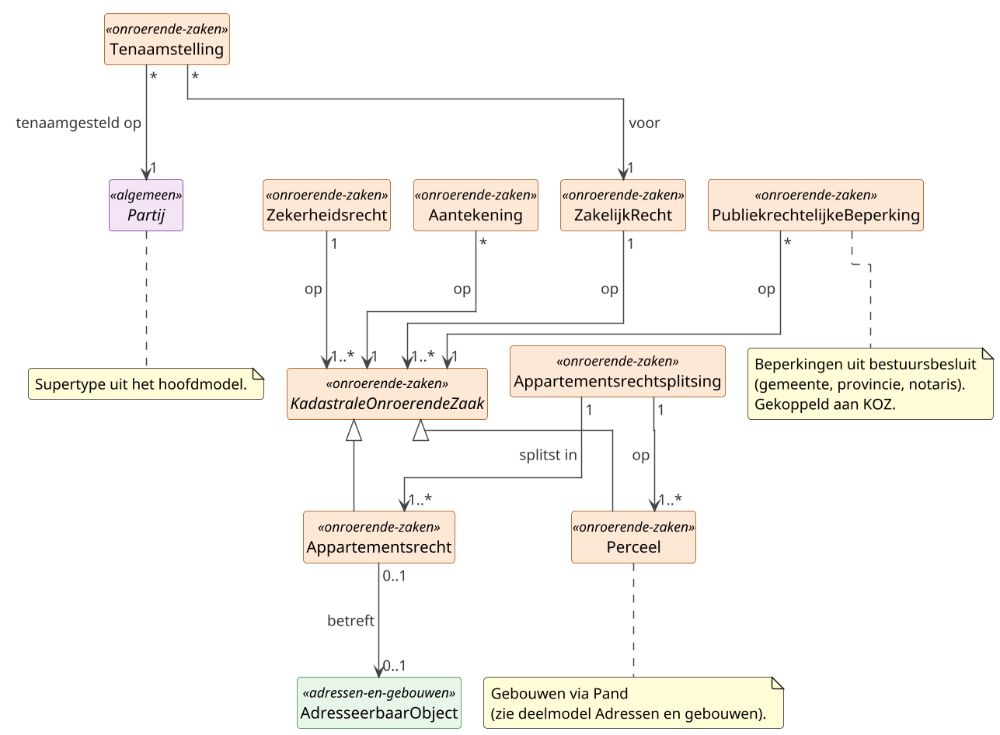

# Deelmodel: Onroerende zaken

Kadastrale onroerende zaken en de zakelijke rechten daarop. Inclusief
hypotheek/beslag (`Zekerheidsrecht`), kwalitatieve verplichtingen
(`Aantekening`) en publiekrechtelijke beperkingen.

WOZ-waarde valt buiten dit deelmodel; zie
[Waarde onroerende zaken](waarde-onroerende-zaken.md). Geometrische
projecties van percelen (BRK-geometrie) vallen eveneens buiten dit
deelmodel.

## Diagram

## Objecttypen

### Aantekening

**Definitie**: Een privaatrechtelijke vermelding bij een kadastraal
onroerende zaak die een kwalitatieve verplichting, bewindstelling of
soortgelijke notarieel ontstane last vastlegt en die via de
Basisregistratie Kadaster kenbaar wordt gemaakt.

**Herkomst definitie**: Kadasterwet art. 17; Burgerlijk Wetboek Boek 6
(kwalitatieve verplichting); BRK-Catalogus (objecttype `Aantekening`).

**Toelichting**: Aantekening is de privaatrechtelijke tegenhanger van
`PubliekrechtelijkeBeperking`: beide kunnen tegelijk op dezelfde
kadastrale onroerende zaak rusten. Een aantekening ontstaat uit een
notariële handeling (bijvoorbeeld de vestiging van een kwalitatieve
verplichting of een bewindstelling), niet uit een bestuursbesluit.

| MIM-veld | Waarde |
|---|---|
| Naam | Aantekening |
| Begrip (URI) | `https://begrippen.gbo-semantiek.nl/id/begrip/Aantekening` |
| Herkomst | BRK (basisregistratie) |
| Datum opname | 2026-04-28 |
| Unieke aanduiding | identificatie |
| Populatie | Alle privaatrechtelijke aantekeningen die op grond van de Kadasterwet bij een kadastraal onroerende zaak in de BRK zijn geregistreerd. |

**Attribuutsoorten**:

| Naam | Type | Kard. | Authentiek | Mat. hist. | Form. hist. | Definitie | Herkomst | Toelichting |
|---|---|---|---|---|---|---|---|---|
| aardAantekening | Codelijst | 1 | Basisgegeven | Ja | Ja | Aard van de aantekening, bijvoorbeeld kwalitatieve verplichting of bewindstelling. | BRK-Catalogus | Codelijst-waarden afgeleid van BRK. |
| omschrijving | CharacterString | 0..1 | Basisgegeven | Ja | Ja | Korte vrije omschrijving van de inhoud van de aantekening. | BRK-Catalogus | |
| datumIngang | Datum | 1 | Basisgegeven | Ja | Ja | Datum waarop de aantekening van kracht is geworden. | BRK-Catalogus | |
| voorkomen | Voorkomen | 1 | Basisgegeven | Ja | Ja | Bitemporele markering van werkelijke en registratie-tijdlijn. | GBO (mixin) | Zie patroon Voorkomen-mixin in [Patronen](../hoofdmodel.md#voorkomen-mixin-bitemporaliteit). |

**Relatiesoorten** (uitgaand):

| Naam | Doel | Kard. (bron→doel) | Authentiek | Mat. hist. | Form. hist. | Toelichting |
|---|---|---|---|---|---|---|
| op | KadastraleOnroerendeZaak | * → 1 | Basisgegeven | Ja | Ja | Kadastrale onroerende zaak waarop de aantekening rust. |

### Appartementsrecht

**Definitie**: Een aandeel in een door splitsing ontstane onroerende
zaak dat recht geeft op het uitsluitend gebruik van een specifiek
aangewezen privégedeelte, samen met een aandeel in de gemeenschap;
geregistreerd in de Basisregistratie Kadaster als kadastraal
onroerende zaak.

**Herkomst definitie**: Burgerlijk Wetboek Boek 5 titel 9 (art. 106
e.v.); Kadasterwet; BRK-Catalogus (objecttype `Appartementsrecht`);
IMKAD.

**Toelichting**: Appartementsrecht is het juridische eigendomsobject
voor flatgebouwen, gedeelde-grond-woningcomplexen en
bedrijfsverzamelgebouwen. Bewoners zijn eigenaar van het recht, niet
van de onderliggende grond, die in mede-eigendom is. Een
appartementsrecht ontstaat uit een notariële splitsingsakte
(`Appartementsrechtsplitsing`) die één of meer percelen verdeelt in
één of meer appartementsrechten. Het juridische begrip
*appartementsrecht* komt ook voor als waarde van `AardZakelijkRecht`;
GBO neemt het kadastrale object hier op omdat BRK het zo registreert.

| MIM-veld | Waarde |
|---|---|
| Naam | Appartementsrecht |
| Begrip (URI) | `https://begrippen.gbo-semantiek.nl/id/begrip/Appartementsrecht` |
| Herkomst | BRK (basisregistratie) |
| Datum opname | 2026-04-28 |
| Unieke aanduiding | kadastraleAanduiding (incl. indexnummer) |
| Populatie | Alle appartementsrechten die in Nederland door notariële splitsingsakte zijn ontstaan en als kadastraal onroerende zaak in de BRK zijn geregistreerd. |

**Attribuutsoorten** (eigen attribuutsoorten; `identificatie`,
`kadastraleAanduiding`, `soortGrootte` en
`kadastraalOnroerendeZaakStatus` zijn geërfd van
KadastraleOnroerendeZaak):

| Naam | Type | Kard. | Authentiek | Mat. hist. | Form. hist. | Definitie | Herkomst | Toelichting |
|---|---|---|---|---|---|---|---|---|
| indexnummer | CharacterString | 1 | Authentiek | Ja | Ja | Volgnummer binnen een appartementsrechtsplitsing dat het privégedeelte aanduidt. | BRK-Catalogus | Onderscheidt appartementen binnen dezelfde grondaanduiding. |

**Relatiesoorten** (uitgaand):

| Naam | Doel | Kard. (bron→doel) | Authentiek | Mat. hist. | Form. hist. | Toelichting |
|---|---|---|---|---|---|---|
| betreft | AdresseerbaarObject | 0..1 → 0..1 | Basisgegeven | Ja | Ja | Adresseerbaar object (verblijfsobject of standplaats) dat met het appartementsrecht samenvalt. |

### Appartementsrechtsplitsing

**Definitie**: De notariële akte waarbij één of meer percelen worden
gesplitst in één of meer appartementsrechten, met vermelding van de
verdeling en de aandelen in de gemeenschap.

**Herkomst definitie**: Burgerlijk Wetboek Boek 5 titel 9 (art. 106
e.v., splitsing in appartementsrechten); Kadasterwet; BRK-Catalogus.

**Toelichting**: De splitsingsakte is een eenmalige rechtshandeling
die het ontstaan van de appartementsrechten vastlegt. Het akte-object
zelf kent geen levensloop met materiële of formele historie; nieuwe
of gewijzigde rechtssituaties leiden tot nieuwe akten met eigen
identificatie.

| MIM-veld | Waarde |
|---|---|
| Naam | Appartementsrechtsplitsing |
| Begrip (URI) | `https://begrippen.gbo-semantiek.nl/id/begrip/Appartementsrechtsplitsing` |
| Herkomst | BRK (basisregistratie) |
| Datum opname | 2026-04-28 |
| Unieke aanduiding | documentnummer |
| Populatie | Alle in Nederland verleden notariële splitsingsakten waarbij percelen worden gesplitst in appartementsrechten. |

**Attribuutsoorten**:

| Naam | Type | Kard. | Authentiek | Mat. hist. | Form. hist. | Definitie | Herkomst | Toelichting |
|---|---|---|---|---|---|---|---|---|
| akteverwijzing | CharacterString | 1 | Authentiek | Nee | Nee | Verwijzing naar de notariële splitsingsakte. | BRK-Catalogus | |
| datumSplitsing | Datum | 1 | Authentiek | Nee | Nee | Datum waarop de splitsing rechtsgeldig is geworden. | BRK-Catalogus | |
| documentdatum | Datum | 1 | Authentiek | Nee | Nee | Datum van het verlijden van de splitsingsakte. | BRK-Catalogus | |
| documentnummer | Identificatie | 1 | Authentiek | Nee | Nee | Identificatie van de splitsingsakte. | BRK-Catalogus | |

**Relatiesoorten** (uitgaand):

| Naam | Doel | Kard. (bron→doel) | Authentiek | Mat. hist. | Form. hist. | Toelichting |
|---|---|---|---|---|---|---|
| splitstIn | Appartementsrecht | 1 → 1..* | Authentiek | Nee | Nee | Appartementsrechten die door de splitsing ontstaan. |
| op | Perceel | 1 → 1..* | Authentiek | Nee | Nee | Onderliggende percelen die door de splitsing worden geraakt. |

### KadastraleOnroerendeZaak

**Definitie**: Het overkoepelende begrip voor een kadastraal afgebakend
en als zelfstandige eenheid in de Basisregistratie Kadaster
geregistreerd object: een perceel of een appartementsrecht.

**Herkomst definitie**: Kadasterwet art. 1; BRK-Catalogus (abstract
supertype `KadastraalOnroerendeZaak`); IMKAD.

**Toelichting**: Abstract supertype dat de gemeenschappelijke kenmerken
en relaties van `Perceel` en `Appartementsrecht` bundelt. Zakelijke
rechten, zekerheidsrechten, aantekeningen en publiekrechtelijke
beperkingen worden via dit supertype gekoppeld zodat zij even goed op
een perceel als op een appartementsrecht kunnen rusten.

| MIM-veld | Waarde |
|---|---|
| Naam | KadastraleOnroerendeZaak |
| Alias | KOZ (BRK-afkorting) |
| Begrip (URI) | `https://begrippen.gbo-semantiek.nl/id/begrip/KadastraleOnroerendeZaak` |
| Herkomst | BRK (basisregistratie) |
| Datum opname | 2026-04-28 |
| Indicatie abstract object | Ja |
| Unieke aanduiding | identificatie |
| Populatie | Alle kadastraal afgebakende objecten (percelen en appartementsrechten) in Nederland zoals geregistreerd in de BRK door het Kadaster. |

**Attribuutsoorten**:

| Naam | Type | Kard. | Authentiek | Mat. hist. | Form. hist. | Definitie | Herkomst | Toelichting |
|---|---|---|---|---|---|---|---|---|
| identificatie | NEN3610ID | 1 | Authentiek | Ja | Ja | Objectidentificatie volgens NEN 3610. | BRK-Catalogus | Stabiel identificerend over de levensloop heen. |
| kadastraleAanduiding | CharacterString | 1 | Authentiek | Ja | Ja | Samengestelde aanduiding (kadastrale gemeente / sectie / perceelnummer / eventueel indexnummer). | BRK-Catalogus | Menselijk leesbare aanduiding. |
| soortGrootte | SoortGrootte | 1 | Authentiek | Ja | Ja | Kwaliteit van de geometrische afbakening. | BRK-Catalogus | Zie enumeratie SoortGrootte. |
| kadastraalOnroerendeZaakStatus | KOZStatus | 1 | Authentiek | Ja | Ja | Levensfase-status van de kadastrale onroerende zaak. | BRK-Catalogus | Zie enumeratie KOZStatus. |
| voorkomen | Voorkomen | 1 | Basisgegeven | Ja | Ja | Bitemporele markering van werkelijke en registratie-tijdlijn. | GBO (mixin) | Zie patroon Voorkomen-mixin in [Patronen](../hoofdmodel.md#voorkomen-mixin-bitemporaliteit). |

### Perceel

**Definitie**: Een kadastraal afgebakend en als zelfstandige eenheid
in de Basisregistratie Kadaster geregistreerd stuk grond,
identificeerbaar via de kadastrale aanduiding (kadastrale gemeente,
sectie, perceelnummer).

**Herkomst definitie**: Kadasterwet art. 1; BRK-Catalogus (objecttype
`KadastraalPerceel`); IMKAD.

**Toelichting**: Perceel beschrijft de kadastraal-juridische
werkelijkheid: een afgebakend stuk grond als registratie-eenheid, los
van de fysieke bebouwing (Pand in BAG) en los van de fiscale
waardering (WOZ-object). Een perceel kan onbebouwd zijn, één pand
dragen, of door meerdere panden gedeeltelijk worden bedekt; een pand
kan over meerdere percelen liggen.

| MIM-veld | Waarde |
|---|---|
| Naam | Perceel |
| Alias | Kadastraal perceel (BRK-LO volledige naam) |
| Begrip (URI) | `https://begrippen.gbo-semantiek.nl/id/begrip/Perceel` |
| Herkomst | BRK (basisregistratie) |
| Datum opname | 2026-04-28 |
| Unieke aanduiding | kadastraleAanduiding |
| Populatie | Alle kadastraal afgebakende stukken grond in Nederland zoals geregistreerd in de BRK door het Kadaster, inclusief actuele en historische percelen. |

**Attribuutsoorten** (eigen attribuutsoorten; `identificatie`,
`kadastraleAanduiding`, `soortGrootte` en
`kadastraalOnroerendeZaakStatus` zijn geërfd van
KadastraleOnroerendeZaak):

| Naam | Type | Kard. | Authentiek | Mat. hist. | Form. hist. | Definitie | Herkomst | Toelichting |
|---|---|---|---|---|---|---|---|---|
| kadastraleGemeente | Codelijst~Kadaster | 1 | Authentiek | Ja | Ja | Kadastrale gemeente waarin het perceel ligt. | BRK-Catalogus | Kadasterwet-codering. |
| sectie | CharacterString | 1 | Authentiek | Ja | Ja | Sectie-letter binnen de kadastrale gemeente. | BRK-Catalogus | |
| perceelnummer | Numeriek | 1 | Authentiek | Ja | Ja | Volgnummer van het perceel binnen de sectie. | BRK-Catalogus | |
| oppervlakte | Numeriek | 0..1 | Authentiek | Ja | Ja | Kadastrale oppervlakte in vierkante meters. | BRK-Catalogus | HC-naam: `grootte`. |

**Relatiesoorten** (uitgaand): geen eigen uitgaande relaties.

### PubliekrechtelijkeBeperking

**Definitie**: Een beperking van het gebruiksrecht op een kadastraal
onroerende zaak die voortvloeit uit een publiekrechtelijk besluit van
een bestuursorgaan en die op grond van de Wet kenbaarheid
publiekrechtelijke beperkingen kenbaar wordt gemaakt via de
Basisregistratie Kadaster.

**Herkomst definitie**: Wet kenbaarheid publiekrechtelijke beperkingen
onroerende zaken (Wkpb) art. 1; Kadasterwet; BRK-Catalogus
(objecttype `PubliekrechtelijkeBeperking`).

**Toelichting**: Eigen registratie binnen de Kadasterwet, los van het
zakelijk-recht-cluster. Beperkingen worden opgelegd door de overheid
(gemeente, provincie, Rijk) zonder instemming van de eigenaar, in
tegenstelling tot privaatrechtelijke aantekeningen die uit notariële
handelingen voortvloeien. Eén besluit kan meerdere kadastrale
onroerende zaken raken: in dat geval ontstaan meerdere registraties
die naar hetzelfde brondocument verwijzen.

| MIM-veld | Waarde |
|---|---|
| Naam | PubliekrechtelijkeBeperking |
| Alias | BRK-PB |
| Begrip (URI) | `https://begrippen.gbo-semantiek.nl/id/begrip/PubliekrechtelijkeBeperking` |
| Herkomst | BRK (basisregistratie) |
| Datum opname | 2026-04-28 |
| Unieke aanduiding | identificatie |
| Populatie | Alle door bestuursorganen opgelegde publiekrechtelijke beperkingen die op grond van de Wkpb in de BRK worden geregistreerd (monumentenstatus, voorkeursrecht, onteigening, archeologische bescherming, bodemsanering-plicht en dergelijke). |

**Attribuutsoorten**:

| Naam | Type | Kard. | Authentiek | Mat. hist. | Form. hist. | Definitie | Herkomst | Toelichting |
|---|---|---|---|---|---|---|---|---|
| identificatie | NEN3610ID | 1 | Authentiek | Ja | Ja | Unieke beperking-identificatie volgens NEN 3610. | BRK-Catalogus | |
| typeBeperking | TypePubliekrechtelijkeBeperking | 1 | Authentiek | Ja | Ja | Type van de publiekrechtelijke beperking. | BRK-Catalogus | Zie enumeratie TypePubliekrechtelijkeBeperking. |
| omschrijving | CharacterString | 0..1 | Basisgegeven | Ja | Ja | Korte vrije omschrijving van de beperking. | BRK-Catalogus | |
| grondslag | CharacterString | 1 | Authentiek | Ja | Ja | Wettelijke grondslag (artikel + wet). | BRK-Catalogus | |
| datumIngang | Datum | 1 | Authentiek | Ja | Ja | Datum waarop de beperking is ingegaan. | BRK-Catalogus | |
| datumEinde | Datum | 0..1 | Basisgegeven | Ja | Ja | Datum waarop de beperking is beëindigd. | BRK-Catalogus | Leeg betekent lopend. |
| documentdatum | Datum | 1 | Authentiek | Ja | Ja | Datum van het brondocument (bestuursbesluit). | BRK-Catalogus | |
| documentnummer | Identificatie | 1 | Authentiek | Ja | Ja | Identificatie van het brondocument. | BRK-Catalogus | |
| voorkomen | Voorkomen | 1 | Basisgegeven | Ja | Ja | Bitemporele markering van werkelijke en registratie-tijdlijn. | GBO (mixin) | Zie patroon Voorkomen-mixin in [Patronen](../hoofdmodel.md#voorkomen-mixin-bitemporaliteit). |

**Relatiesoorten** (uitgaand):

| Naam | Doel | Kard. (bron→doel) | Authentiek | Mat. hist. | Form. hist. | Toelichting |
|---|---|---|---|---|---|---|
| op | KadastraleOnroerendeZaak | * → 1 | Authentiek | Ja | Ja | Kadastrale onroerende zaak waarop de beperking rust. |

### Tenaamstelling

**Definitie**: De geregistreerde rechtsbetrekking tussen een
rechthebbende partij en een zakelijk recht op een kadastraal
onroerende zaak, met vermelding van het aandeel waarmee de partij in
het recht deelneemt.

**Herkomst definitie**: Kadasterwet; Burgerlijk Wetboek Boek 3
(registergoederen, mede-eigendom art. 166 e.v.); BRK-Catalogus
(associatieklasse `Tenaamstelling`).

**Toelichting**: Tenaamstelling is een verbinding met eigen kenmerken
tussen `Partij` en `ZakelijkRecht`. Meervoudige eigendomsverhoudingen
worden expliciet gemodelleerd: een echtpaar in gemeenschap van
goederen krijgt twee tenaamstellingen met `gezamenlijkAandeel = ja`,
mede-eigendom van een vakantiehuis krijgt meerdere tenaamstellingen
met elk een breuk-aandeel, en erfopvolging leidt tot een nieuwe
tenaamstelling met latere `datumIngang` terwijl de oude een
`datumEinde` krijgt. De Haal-Centraal-API consolideert
`Tenaamstelling × ZakelijkRecht × Partij` tot één
`ZakelijkGerechtigde`-resource; GBO houdt de drie zaken gescheiden
omdat dat rijker is voor historie en meervoudige tenaamstelling.

| MIM-veld | Waarde |
|---|---|
| Naam | Tenaamstelling |
| MIM-element | Relatieklasse |
| Begrip (URI) | `https://begrippen.gbo-semantiek.nl/id/begrip/Tenaamstelling` |
| Herkomst | BRK (basisregistratie) |
| Datum opname | 2026-04-28 |
| Unieke aanduiding | Samengesteld uit (Partij, ZakelijkRecht, datumIngang) |
| Populatie | Alle in de BRK geregistreerde tenaamstellingen, historisch en actueel, die een rechthebbende koppelen aan een zakelijk recht op een kadastraal onroerende zaak. |

**Attribuutsoorten**:

| Naam | Type | Kard. | Authentiek | Mat. hist. | Form. hist. | Definitie | Herkomst | Toelichting |
|---|---|---|---|---|---|---|---|---|
| aandeel | Breuk | 1 | Authentiek | Ja | Ja | Aandeel van de partij in het zakelijk recht, uitgedrukt als breuk. | BRK-Catalogus | Bijvoorbeeld 1/2, 1/3, 1/1. |
| gezamenlijkAandeel | Indicatie | 0..1 | Authentiek | Ja | Ja | Markeert mede-eigendom met gemeenschappelijk aandeel (zoals een echtpaar in gemeenschap van goederen). | BRK-Catalogus | |
| datumIngang | Datum | 1 | Authentiek | Ja | Ja | Datum waarop de tenaamstelling is ingegaan. | BRK-Catalogus | |
| datumEinde | Datum | 0..1 | Authentiek | Ja | Ja | Datum waarop de tenaamstelling is geëindigd. | BRK-Catalogus | Leeg betekent lopend. |
| voorkomen | Voorkomen | 1 | Basisgegeven | Ja | Ja | Bitemporele markering van werkelijke en registratie-tijdlijn. | GBO (mixin) | Zie patroon Voorkomen-mixin in [Patronen](../hoofdmodel.md#voorkomen-mixin-bitemporaliteit). |

**Relatiesoorten** (uitgaand):

| Naam | Doel | Kard. (bron→doel) | Authentiek | Mat. hist. | Form. hist. | Toelichting |
|---|---|---|---|---|---|---|
| tenaamgesteldOp | Partij | * → 1 | Authentiek | Ja | Ja | Rechthebbende partij. |
| voor | ZakelijkRecht | * → 1 | Authentiek | Ja | Ja | Zakelijk recht waarvoor de tenaamstelling geldt. |

### ZakelijkRecht

**Definitie**: Een vermogensrecht op een zaak dat tegen iedereen kan
worden uitgeoefend en dat in de Basisregistratie Kadaster wordt
geregistreerd; voorbeelden zijn eigendom, erfpacht, opstal en
vruchtgebruik.

**Herkomst definitie**: Burgerlijk Wetboek Boek 5 (zakelijke rechten,
art. 1 e.v., art. 85 t/m 105); Burgerlijk Wetboek Boek 3
(registergoederen, art. 10 e.v.); Kadasterwet; BRK-Catalogus
(objecttype `ZakelijkRecht`).

**Toelichting**: ZakelijkRecht is de koppeling tussen rechthebbende
(via `Tenaamstelling`) en kadastrale onroerende zaak. Het
onderscheidt zich van een persoonlijk recht doordat het tegen
iedereen kan worden uitgeoefend (zaaksgebondenheid). Vormen worden
onderscheiden via de aard-aanduiding (Eigendom, Erfpacht, Opstal,
Vruchtgebruik, GebruikEnBewoning, Beklemrecht, Erfdienstbaarheid
heersend/lijdend). Hypotheek en beslag staan los in
`Zekerheidsrecht`: die dienen ter zekerheid van een vordering, niet
als eigendomstitel.

| MIM-veld | Waarde |
|---|---|
| Naam | ZakelijkRecht |
| Begrip (URI) | `https://begrippen.gbo-semantiek.nl/id/begrip/ZakelijkRecht` |
| Herkomst | BRK (basisregistratie) |
| Datum opname | 2026-04-28 |
| Unieke aanduiding | identificatie |
| Populatie | Alle zakelijke rechten op kadastrale onroerende zaken in Nederland zoals geregistreerd in de BRK; vormen worden onderscheiden via `AardZakelijkRecht`. |

**Attribuutsoorten**:

| Naam | Type | Kard. | Authentiek | Mat. hist. | Form. hist. | Definitie | Herkomst | Toelichting |
|---|---|---|---|---|---|---|---|---|
| identificatie | NEN3610ID | 1 | Authentiek | Ja | Ja | Objectidentificatie van het zakelijk recht. | BRK-Catalogus | |
| aardZakelijkRecht | AardZakelijkRecht | 1 | Authentiek | Ja | Ja | Vorm van het zakelijk recht. | BRK-Catalogus | Zie enumeratie AardZakelijkRecht. |
| akteverwijzing | CharacterString | 1 | Authentiek | Ja | Ja | Verwijzing naar de notariële akte van vestiging. | BRK-Catalogus | |
| datumIngang | Datum | 1 | Authentiek | Ja | Ja | Datum waarop het recht is ingegaan. | BRK-Catalogus | |
| datumEinde | Datum | 0..1 | Basisgegeven | Ja | Ja | Datum waarop het recht is geëindigd. | BRK-Catalogus | Leeg betekent lopend. |
| documentdatum | Datum | 1 | Authentiek | Ja | Ja | Datum van de vestigings- of wijzigingsakte. | BRK-Catalogus | |
| documentnummer | Identificatie | 1 | Authentiek | Ja | Ja | Akte-identificatie. | BRK-Catalogus | |
| voorkomen | Voorkomen | 1 | Basisgegeven | Ja | Ja | Bitemporele markering van werkelijke en registratie-tijdlijn. | GBO (mixin) | Zie patroon Voorkomen-mixin in [Patronen](../hoofdmodel.md#voorkomen-mixin-bitemporaliteit). |

**Relatiesoorten** (uitgaand):

| Naam | Doel | Kard. (bron→doel) | Authentiek | Mat. hist. | Form. hist. | Toelichting |
|---|---|---|---|---|---|---|
| op | KadastraleOnroerendeZaak | 1 → 1..* | Authentiek | Ja | Ja | Kadastrale onroerende zaken waarop het recht rust. |

### Zekerheidsrecht

**Definitie**: Een op een kadastraal onroerende zaak rustend recht dat
strekt tot zekerheid van een schuldvordering, te weten een hypotheek
of een beslag.

**Herkomst definitie**: Burgerlijk Wetboek Boek 3 titel 9 (recht van
pand en hypotheek); Wetboek van Burgerlijke Rechtsvordering
(beslagregels); Kadasterwet; BRK-Catalogus.

**Toelichting**: Zekerheidsrecht staat los van `ZakelijkRecht` omdat
het geen eigendomstitel is maar een zekerstelling: bij hypotheek
strekt het recht tot zekerheid van een geldlening, bij beslag tot
zekerstelling van een vordering. Beide rusten op een kadastraal
onroerende zaak en bestaan zelfstandig naast de zakelijke rechten op
diezelfde zaak.

| MIM-veld | Waarde |
|---|---|
| Naam | Zekerheidsrecht |
| Begrip (URI) | `https://begrippen.gbo-semantiek.nl/id/begrip/Zekerheidsrecht` |
| Herkomst | BRK (basisregistratie) |
| Datum opname | 2026-04-28 |
| Unieke aanduiding | identificatie |
| Populatie | Alle hypotheken en beslagen die in Nederland op kadastrale onroerende zaken zijn gevestigd en in de BRK zijn geregistreerd. |

**Attribuutsoorten**:

| Naam | Type | Kard. | Authentiek | Mat. hist. | Form. hist. | Definitie | Herkomst | Toelichting |
|---|---|---|---|---|---|---|---|---|
| typeZekerheidsrecht | TypeZekerheidsrecht | 1 | Authentiek | Ja | Ja | Type van het zekerheidsrecht. | BRK-Catalogus | Zie enumeratie TypeZekerheidsrecht. |
| bedrag | Bedrag | 0..1 | Basisgegeven | Ja | Ja | Bedrag waarvoor het zekerheidsrecht is gevestigd. | BRK-Catalogus | Bij hypotheek de hoofdsom; bij beslag de gevorderde som indien geregistreerd. |
| datumVestiging | Datum | 1 | Authentiek | Ja | Ja | Datum waarop het zekerheidsrecht is gevestigd. | BRK-Catalogus | |
| aardBeslag | AardBeslag | 0..1 | Basisgegeven | Ja | Ja | Aard van het beslag. | BRK-Catalogus | Alleen relevant bij `typeZekerheidsrecht = Beslag`. Zie enumeratie AardBeslag. |
| voorkomen | Voorkomen | 1 | Basisgegeven | Ja | Ja | Bitemporele markering van werkelijke en registratie-tijdlijn. | GBO (mixin) | Zie patroon Voorkomen-mixin in [Patronen](../hoofdmodel.md#voorkomen-mixin-bitemporaliteit). |

**Relatiesoorten** (uitgaand):

| Naam | Doel | Kard. (bron→doel) | Authentiek | Mat. hist. | Form. hist. | Toelichting |
|---|---|---|---|---|---|---|
| op | KadastraleOnroerendeZaak | 1 → 1..* | Authentiek | Ja | Ja | Kadastrale onroerende zaken waarop het zekerheidsrecht rust. |

## Enumeraties

### AardBeslag

**Definitie**: Aard van een op een kadastraal onroerende zaak gelegd beslag, gerelateerd aan de juridische grondslag en het doel ervan.

**Herkomst definitie**: Wetboek van Burgerlijke Rechtsvordering (beslagregels); Invorderingswet 1990 (fiscaal beslag); BRK-Catalogus.

**Toelichting**: Alleen van toepassing bij `Zekerheidsrecht.typeZekerheidsrecht = Beslag`. Conservatoir beslag dient ter zekerstelling vooruitlopend op een gerechtelijke uitspraak; executoriaal beslag volgt op een titel en strekt tot verhaal; fiscaal beslag wordt door de Belastingdienst gelegd op grond van de Invorderingswet.

| MIM-veld | Waarde |
|---|---|
| Naam | AardBeslag |
| Begrip (URI) | `https://begrippen.gbo-semantiek.nl/id/begrip/AardBeslag` |
| Herkomst | BRK |
| Datum opname | 2026-04-28 |

**Gebruikt door**: `Zekerheidsrecht.aardBeslag`.

**Waarden**:

| Naam | Definitie | Toelichting |
|---|---|---|
| Conservatoir | Beslag ter zekerstelling vooruitlopend op een gerechtelijke uitspraak. | Bewaart de zaak voor verhaal tijdens een lopende procedure. |
| Executoriaal | Beslag op grond van een executoriale titel ter daadwerkelijke verhaal van een vordering. | Leidt typisch tot openbare verkoop. |
| Fiscaal | Beslag gelegd door de Belastingdienst ter invordering van een belastingschuld. | Grondslag in de Invorderingswet 1990. |
| OverigBeslag | Beslag dat niet onder een van de andere categorieën valt. | Restcategorie. |

### AardZakelijkRecht

**Definitie**: Vorm van een zakelijk recht op een kadastraal onroerende zaak, bepalend voor de inhoud en de bevoegdheden van de rechthebbende.

**Herkomst definitie**: Burgerlijk Wetboek Boek 5 (zakelijke rechten, art. 1 e.v., art. 85 t/m 105); Burgerlijk Wetboek Boek 3 (registergoederen); BRK-Catalogus.

**Toelichting**: Onderscheidt eigendomsrechten van beperkt zakelijke rechten. Erfdienstbaarheid komt voor in twee varianten: heersend (ten gunste van het eigen perceel) en lijdend (ten laste van het eigen perceel). Beklemrecht is een eeuwigdurend gebruiksrecht op grond met een vaste vergoeding, voornamelijk historisch in Groningen en Friesland.

| MIM-veld | Waarde |
|---|---|
| Naam | AardZakelijkRecht |
| Begrip (URI) | `https://begrippen.gbo-semantiek.nl/id/begrip/AardZakelijkRecht` |
| Herkomst | BRK |
| Datum opname | 2026-04-28 |

**Gebruikt door**: `ZakelijkRecht.aardZakelijkRecht`.

**Waarden**:

| Naam | Definitie | Toelichting |
|---|---|---|
| Beklemrecht | Eeuwigdurend, overerfbaar gebruiksrecht op grond tegen een vaste jaarlijkse vergoeding. | Historisch voornamelijk in Groningen en Friesland. |
| Eigendom | Het meest omvattende recht dat een persoon op een zaak kan hebben. | BW Boek 5 art. 1. |
| ErfdienstbaarheidHeersend | Erfdienstbaarheid ten gunste van het kadastraal onroerende zaak (het heersende erf). | Bijvoorbeeld een recht van overpad over een buurperceel. |
| ErfdienstbaarheidLijdend | Erfdienstbaarheid ten laste van het kadastraal onroerende zaak (het dienende erf). | De tegenkant van de heersende erfdienstbaarheid. |
| Erfpacht | Recht om het kadastraal onroerende zaak van een ander te houden en te gebruiken, doorgaans tegen canon. | BW Boek 5 art. 85 e.v. |
| GebruikEnBewoning | Persoonlijk recht om een zaak te gebruiken en te bewonen voor zover nodig voor de gerechtigde en zijn gezin. | BW Boek 3 art. 226. |
| Opstal | Recht om in, op of boven een kadastraal onroerende zaak van een ander gebouwen, werken of beplantingen in eigendom te hebben. | BW Boek 5 art. 101 e.v. |
| Vruchtgebruik | Recht om de zaken van een ander te gebruiken en daarvan de vruchten te genieten. | BW Boek 3 art. 201 e.v. |

### KOZStatus

**Definitie**: Levenscyclus-status van een kadastrale onroerende zaak in de Basisregistratie Kadaster.

**Herkomst definitie**: BRK-Catalogus (Kadaster); Kadasterwet.

**Toelichting**: Een kadastrale onroerende zaak (perceel of appartementsrecht) heeft op elk moment één status. Bij overgang naar Historisch is de zaak niet langer geldig, typisch het gevolg van splitsing, samenvoeging of grenscorrectie. De identificatie blijft beschikbaar via BRK-Levering.

| MIM-veld | Waarde |
|---|---|
| Naam | KOZStatus |
| Alias | kadastraalOnroerendeZaakStatus |
| Begrip (URI) | `https://begrippen.gbo-semantiek.nl/id/begrip/KOZStatus` |
| Herkomst | BRK |
| Datum opname | 2026-04-28 |

**Gebruikt door**: `KadastraleOnroerendeZaak.kadastraalOnroerendeZaakStatus`.

**Waarden**:

| Naam | Definitie | Toelichting |
|---|---|---|
| Actueel | De kadastrale onroerende zaak is op dit moment geldig en kent een lopende registratie. | Default-toestand. |
| Historisch | De kadastrale onroerende zaak is opgevolgd of opgeheven en niet meer geldig als actuele registratie. | Blijft beschikbaar via BRK-Levering. |

### SoortGrootte

**Definitie**: Vaststellingsstatus van de oppervlakte van een kadastrale onroerende zaak.

**Herkomst definitie**: BRK-Catalogus (Kadaster); Kadasterwet.

**Toelichting**: Geeft aan met welk niveau van zekerheid de oppervlakte is bepaald. Een vastgestelde grootte volgt uit een kadastrale meting en is definitief; een vermoedelijke grootte is een eerste indicatie zonder meting (typisch direct na splitsing); een voorlopige kadastrale grens betreft een nog niet definitief vastgestelde perceelgrens, waardoor ook de oppervlakte voorlopig is.

| MIM-veld | Waarde |
|---|---|
| Naam | SoortGrootte |
| Begrip (URI) | `https://begrippen.gbo-semantiek.nl/id/begrip/SoortGrootte` |
| Herkomst | BRK |
| Datum opname | 2026-04-28 |

**Gebruikt door**: `KadastraleOnroerendeZaak.soortGrootte`.

**Waarden**:

| Naam | Definitie | Toelichting |
|---|---|---|
| Vastgesteld | De oppervlakte is door kadastrale meting definitief vastgesteld. | Default na meting. |
| Vermoedelijk | De oppervlakte is een indicatieve waarde zonder meting. | Typisch direct na splitsing. |
| VoorlopigeKadastraleGrens | De perceelgrens is nog niet definitief vastgesteld; de oppervlakte is daarmee voorlopig. | Tussen-status; eindigt na inmeten. |

### TypePubliekrechtelijkeBeperking

**Definitie**: Type van een publiekrechtelijke beperking op een kadastraal onroerende zaak, bepalend voor de wettelijke grondslag en de aard van de beperking.

**Herkomst definitie**: Wet kenbaarheid publiekrechtelijke beperkingen onroerende zaken (Wkpb); Monumentenwet 1988 / Erfgoedwet; Wet ruimtelijke ordening (voorkeursrecht); Onteigeningswet; Wet bodembescherming; BRK-Catalogus.

**Toelichting**: Indicatief overzicht van de meest voorkomende grondslagen waarop bestuursorganen een publiekrechtelijke beperking kunnen vestigen. De rubriek Overig dekt beperkingen op andere wettelijke grondslagen waarvoor geen aparte categorie is opgenomen.

| MIM-veld | Waarde |
|---|---|
| Naam | TypePubliekrechtelijkeBeperking |
| Begrip (URI) | `https://begrippen.gbo-semantiek.nl/id/begrip/TypePubliekrechtelijkeBeperking` |
| Herkomst | BRK |
| Datum opname | 2026-04-28 |

**Gebruikt door**: `PubliekrechtelijkeBeperking.typeBeperking`.

**Waarden**:

| Naam | Definitie | Toelichting |
|---|---|---|
| BodemBescherming | Beperking op grond van de Wet bodembescherming, bijvoorbeeld een saneringsplicht of een gebruiksbeperking na verontreiniging. | Vaak gekoppeld aan een beschikking ernst en spoedeisendheid. |
| Erfgoedwet | Beperking op grond van de Erfgoedwet (sinds 2016 opvolger van delen van de Monumentenwet 1988), zoals archeologische bescherming. | Voor zaken die na 1 juli 2016 onder de Erfgoedwet zijn aangewezen. |
| Monumentenwet | Beperking op grond van de Monumentenwet 1988, doorgaans aanwijzing als rijksmonument. | Historisch label; aanwijzingen na 2016 vallen onder Erfgoedwet. |
| Onteigening | Beperking op grond van de Onteigeningswet, voorafgaand of leidend tot eigendomsovergang aan de overheid. | Kenbaar gemaakt via de BRK voorafgaand aan de daadwerkelijke onteigening. |
| Overig | Publiekrechtelijke beperking op een andere wettelijke grondslag dan de overige genoemde categorieën. | Restcategorie. |
| Wro_Voorkeursrecht | Gemeentelijk voorkeursrecht op grond van de Wet voorkeursrecht gemeenten (Wro-kader). | Verplicht eerste aanbieding aan de gemeente bij vervreemding. |

### TypeZekerheidsrecht

**Definitie**: Type van een op een kadastraal onroerende zaak rustend zekerheidsrecht, onderscheidend tussen hypotheek en beslag.

**Herkomst definitie**: Burgerlijk Wetboek Boek 3 titel 9 (recht van pand en hypotheek); Wetboek van Burgerlijke Rechtsvordering (beslag); BRK-Catalogus.

**Toelichting**: Bepaalt of het zekerheidsrecht voortvloeit uit een hypotheekvestiging dan wel uit een gerechtelijk of fiscaal beslag. Bij waarde Beslag wordt het aanvullende attribuut `aardBeslag` ingevuld (zie enumeratie AardBeslag).

| MIM-veld | Waarde |
|---|---|
| Naam | TypeZekerheidsrecht |
| Begrip (URI) | `https://begrippen.gbo-semantiek.nl/id/begrip/TypeZekerheidsrecht` |
| Herkomst | BRK |
| Datum opname | 2026-04-28 |

**Gebruikt door**: `Zekerheidsrecht.typeZekerheidsrecht`.

**Waarden**:

| Naam | Definitie | Toelichting |
|---|---|---|
| Beslag | Zekerheidsrecht voortvloeiend uit een gerechtelijk of fiscaal beslag op een kadastraal onroerende zaak. | Verdere typering via `aardBeslag`. |
| Hypotheek | Zekerheidsrecht gevestigd door een hypotheekakte ter zekerstelling van een geldvordering. | Hoofdsom in `bedrag`. |

## Stelselkoppelingen

- → [Personen](personen.md): `NatuurlijkPersoon` via `Tenaamstelling` op
  `ZakelijkRecht`.
- → [Bedrijven en instellingen](bedrijven-en-instellingen.md):
  `NietNatuurlijkPersoon` via `Tenaamstelling`. Beide takken via het
  `Partij`-supertype uit het [hoofdmodel](../hoofdmodel.md).
- → [Adressen en gebouwen](adressen-en-gebouwen.md):
  `Pand staat op Perceel(en)`: m:n via geometrische projectie.
- → [Waarde onroerende zaken](waarde-onroerende-zaken.md):
  `WOZ-object ligt op Perceel(en)`.

## Bron

Autoritatieve bron: **BRK** (Basisregistratie Kadaster), beheerd door
het Kadaster. Juridische basis: Kadasterwet, Burgerlijk Wetboek Boek 5
en 3, IMKAD, BRK-Levering. Onder Haal Centraal: BRK Bevragen API met
onroerende zaken en sub-resources zakelijkgerechtigden, hypotheken,
beslagen en publiekrechtelijke beperkingen. Voor volledige
tenaamstellings-historie blijft afhankelijkheid van **BRK-Levering**
bestaan; HC-BRK levert actuele stand plus sub-resources.

**Modelleer-keuze t.o.v. HC-BRK**: Haal Centraal consolideert
`Tenaamstelling × ZakelijkRecht × Partij` tot één `ZakelijkGerechtigde`-
resource. Het Core-model splitst expliciet in drie zelfstandige
objecttypen; historie en meervoudige tenaamstelling worden daarmee
modellbaar.
