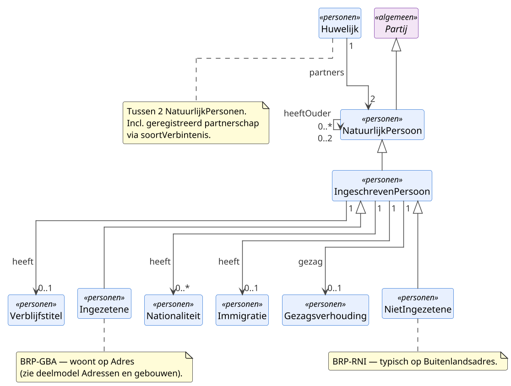

# Deelmodel: Personen

Natuurlijke personen: ingezetenen (BRP-GBA), niet-ingezetenen (BRP-RNI),
en overige natuurlijke personen zonder BRP-inschrijving (buitenlandse
eenmanszaak-eigenaar, partner van een ingezetene bij buitenlands
huwelijk, historisch persoon). Inclusief de BRP-PL-categorieën die aan de
ingeschreven persoon hangen: nationaliteit, huwelijk, verblijfstitel,
gezagsverhouding, ouder-relaties.

Niet-natuurlijke personen vallen buiten dit deelmodel; zie
[Bedrijven en instellingen](bedrijven-en-instellingen.md). Het
`Partij`-supertype is gedefinieerd in het [hoofdmodel](../hoofdmodel.md).

## Diagram

## Objecttypen

### IngeschrevenPersoon

**Definitie**: Een natuurlijke persoon die in de Basisregistratie Personen is
opgenomen, hetzij als ingezetene van een Nederlandse gemeente, hetzij als
niet-ingezetene in de Registratie Niet-Ingezetenen.

**Herkomst definitie**: Wet BRP art. 1.2 en art. 2.1; Logisch Ontwerp BRP
v4.3.0 §1 (registratiedomein BRP).

**Toelichting**: IngeschrevenPersoon is de drager van de
BRP-persoonslijst-gegevens (identificatienummers, bijhouding-status,
kiesrechtgegevens) en het aanknopingspunt voor de
BRP-persoonslijst-categorieën (nationaliteit, huwelijk, verblijfstitel,
gezagsverhouding, immigratie). Het objecttype draagt het Voorkomen-mixin
zodat alle BRP-gegevens bitemporeel kunnen worden gevoerd. De twee
concrete varianten Ingezetene en NietIngezetene staan onder dit
objecttype.

| MIM-veld | Waarde |
|---|---|
| Naam | IngeschrevenPersoon |
| Begrip (URI) | `https://begrippen.gbo-semantiek.nl/id/begrip/IngeschrevenPersoon` |
| Herkomst | BRP |
| Datum opname | 2026-04-28 |
| Indicatie abstract object | Ja |
| Unieke aanduiding | `bsn` |
| Populatie | Alle natuurlijke personen met een actieve of opgeschorte BRP-inschrijving (BRP-GBA of BRP-RNI). |
| Kwaliteit | Geborgd via BRP-bijhouding-status: `opschortingBijhouding`, `inOnderzoek`, `verificatie`. |

**Attribuutsoorten**:

| Naam | Type | Kard. | Authentiek | Mat. hist. | Form. hist. | Definitie | Herkomst | Toelichting |
|---|---|---|---|---|---|---|---|---|
| `bsn` | [Numeriek9](../datatypes-en-codelijsten.md#simpele-datatypes) | 1 | Authentiek | Ja | Ja | Het door de Beheervoorziening BSN uitgegeven persoonsnummer. | BRP cat 01 grp 01 | Primaire identifier; uniek per actieve inschrijving. |
| `aNummer` | [Alfanumeriek10](../datatypes-en-codelijsten.md#simpele-datatypes) | 0..1 | Basisgegeven | Ja | Ja | Het interne BRP-administratienummer. | BRP cat 01 grp 01 | Intern BRP, niet als externe identifier gebruikt. |
| `tin` | [Alfanumeriek](../datatypes-en-codelijsten.md#simpele-datatypes) | 0..1 | Basisgegeven | Ja | Ja | Het persoonsnummer dat een ander land aan deze persoon heeft toegekend. | BRP cat 04 grp 73 | Alleen aanwezig binnen een EU-nationaliteit-stapel. |
| `datumEersteInschrijving` | [DatumIncompleet](../datatypes-en-codelijsten.md#aanvullende-datatypes) | 0..1 | Basisgegeven | Ja | Ja | De datum waarop deze persoon voor het eerst in de BRP werd opgenomen. | BRP cat 07 grp 67 | |
| `gemeenteVanInschrijving` | [`Codelijst~LT33`](adressen-en-gebouwen.md#codelijsten) | 0..1 | Basisgegeven | Ja | Ja | De gemeente die de persoonslijst bijhoudt. | BRP cat 07 grp 67 | Voor RNI-inschrijvingen leeg of gevuld met een RNI-deelnemer-equivalent. |
| `opschortingBijhouding` | [`OpschortingBijhouding`](#opschortingbijhouding) | 0..1 | Basisgegeven | Ja | Ja | Reden waarom bijhouding van de persoonslijst is opgeschort. | BRP cat 07 grp 67 | Bijhouding stopt bij overlijden, emigratie of opname in RNI. |
| `uitsluitingKiesrecht` | [`UitsluitingKiesrecht`](#uitsluitingkiesrecht) | 0..1 | Basisgegeven | Ja | Ja | Aanduiding dat de persoon van het kiesrecht is uitgesloten. | BRP cat 13 | Rechterlijke uitspraak conform Kieswet. |
| `europeesKiesrecht` | [`EuropeesKiesrecht`](#europeeskiesrecht) | 0..1 | Basisgegeven | Ja | Ja | Aanduiding dat de persoon kiesgerechtigd is voor het Europees Parlement vanuit Nederland. | BRP cat 13 | Relevant voor EU-onderdanen die in Nederland het Europees kiesrecht uitoefenen. |
| `verificatie` | [`Verificatie`](#verificatie) | 0..1 | Basisgegeven | Ja | Ja | Datum en bron van de laatste gegevensverificatie. | BRP cat 07 | |
| `inOnderzoek` | [Indicatie](../datatypes-en-codelijsten.md#simpele-datatypes) | 1 | Basisgegeven | Ja | Ja | Indicatie dat een of meer gegevens van de persoonslijst onderwerp zijn van onderzoek. | BRP cat 07 | Datakwaliteits-flag. |

**Relatiesoorten** (uitgaand):

| Naam | Doel | Kard. (bron→doel) | Authentiek | Mat. hist. | Form. hist. | Toelichting |
|---|---|---|---|---|---|---|
| heeft | Nationaliteit | 1 → 0..* | Authentiek | Ja | Ja | Nationaliteiten conform BRP cat 04. |
| heeft | Verblijfstitel | 1 → 0..1 | Basisgegeven | Ja | Ja | Aanwezig bij niet-Nederlandse onderdanen. |
| gezag | Gezagsverhouding | 1 → 0..1 | Basisgegeven | Ja | Ja | Aanwezig bij minderjarigheid of curatele. |
| heeft | Immigratie | 1 → 0..1 | Basisgegeven | Ja | Ja | Aanwezig bij vestiging vanuit het buitenland. |

### Ingezetene

**Definitie**: Een ingeschreven persoon die zijn adres heeft op het
grondgebied van een Nederlandse gemeente en daar door die gemeente in de
basisregistratie wordt bijgehouden.

**Herkomst definitie**: Wet BRP art. 1.1 onder e (definitie ingezetene)
en art. 2.4; Logisch Ontwerp BRP v4.3.0 §1.5 (BRP-GBA-spoor).

**Toelichting**: Ingezetene is het BRP-GBA-spoor, de gemeentelijk
bijgehouden tak van de basisregistratie. Een Ingezetene woont op een
Binnenlandsadres of, in uitzonderingsgevallen, op een Postadres
(briefadres) of een verblijfplaats-aanduiding zonder vast adres. Het
verband Adres ↔ Ingezetene draagt zelf het Voorkomen-mixin voor
verblijfshistorie.

| MIM-veld | Waarde |
|---|---|
| Naam | Ingezetene |
| Begrip (URI) | `https://begrippen.gbo-semantiek.nl/id/begrip/Ingezetene` |
| Herkomst | BRP |
| Datum opname | 2026-04-28 |
| Unieke aanduiding | `bsn` (geërfd) |
| Populatie | Alle in een Nederlandse gemeente ingeschreven natuurlijke personen, met of zonder Nederlandse nationaliteit. |
| Kwaliteit | Geborgd via BRP-bijhouding (gemeente verantwoordelijk). |

**Attribuutsoorten**:

| Naam | Type | Kard. | Authentiek | Mat. hist. | Form. hist. | Definitie | Herkomst | Toelichting |
|---|---|---|---|---|---|---|---|---|
| `datumInschrijvingGemeente` | [Datum](../datatypes-en-codelijsten.md#simpele-datatypes) | 0..1 | Basisgegeven | Ja | Ja | De datum waarop de persoon zich in de huidige gemeente heeft ingeschreven. | BRP cat 07 grp 67 | |
| `indicatieGeheim` | [Indicatie](../datatypes-en-codelijsten.md#simpele-datatypes) | 1 | Basisgegeven | Ja | Ja | Aanduiding dat de gemeente verstrekking van gegevens aan derden heeft beperkt. | BRP cat 07 grp 70 | Verfijning naar 7-niveau-geheimhouding is een open onderwerp; in dit deelmodel staat het als enkele indicatie. |

**Relatiesoorten** (uitgaand):

| Naam | Doel | Kard. (bron→doel) | Authentiek | Mat. hist. | Form. hist. | Toelichting |
|---|---|---|---|---|---|---|
| woontOp | Binnenlandsadres | 1 → 0..1 | Authentiek | Ja | Ja | Verblijfadres; zie deelmodel [Adressen en gebouwen](adressen-en-gebouwen.md). |
| heeftBriefadres | Postadres | 1 → 0..1 | Basisgegeven | Ja | Ja | Briefadres bij ontbreken regulier woonadres. |

### NatuurlijkPersoon

**Definitie**: Een mens als drager van burgerlijke rechten en plichten.

**Herkomst definitie**: Burgerlijk Wetboek art. 1:1 BW (algemene
grondslag voor het rechtssubject mens); Logisch Ontwerp BRP v4.3.0 §1
voor de operationele invulling binnen de basisregistratie.

**Toelichting**: NatuurlijkPersoon omvat zowel mensen die in een
Nederlandse persoonsregistratie zijn opgenomen als mensen daarbuiten
(buitenlandse partner van een ingezetene, historisch persoon zonder
persoonslijst, buitenlandse eigenaar van een eenmanszaak).
Registratielagen, namelijk IngeschrevenPersoon, Ingezetene en
NietIngezetene, zijn specifieke varianten binnen het natuurlijk-persoon-
concept. Overlijden hangt als attribuut-cluster aan NatuurlijkPersoon
zelf, omdat het feit per mens ten hoogste eenmaal voorkomt en geen
contextvelden kent buiten datum, plaats en land.

| MIM-veld | Waarde |
|---|---|
| Naam | NatuurlijkPersoon |
| Begrip (URI) | `https://begrippen.gbo-semantiek.nl/id/begrip/NatuurlijkPersoon` |
| Herkomst | BRP cat 01 (basis); semantische verbreding voor personen buiten de Nederlandse persoonsregistratie |
| Datum opname | 2026-04-28 |
| Unieke aanduiding | `partijnummer` (geërfd van Partij) |
| Populatie | Alle natuurlijke personen die voor een overheidsorganisatie relevant zijn: ingeschrevenen in BRP-GBA en BRP-RNI, en niet-ingeschrevenen (buitenlandse partner van een ingezetene, historisch persoon zonder persoonslijst, buitenlandse eigenaar van een eenmanszaak). |
| Kwaliteit | Voor BRP-ingeschrevenen geldt de BRP-bijhouding-status (`opschortingBijhouding`, `inOnderzoek`) als kwaliteitsindicator. Voor niet-ingeschrevenen ontbreekt zo'n centrale kwaliteitsstempel; bronvermelding per attribuut is dan leidend. |

**Attribuutsoorten**:

| Naam | Type | Kard. | Authentiek | Mat. hist. | Form. hist. | Definitie | Herkomst | Toelichting |
|---|---|---|---|---|---|---|---|---|
| `geslachtsnaam` | [Tekst](../datatypes-en-codelijsten.md#simpele-datatypes) | 1 | Basisgegeven | Nee | Nee | De officiële familienaam van de persoon. | BRP cat 01 grp 02 | Verplicht; zonder geslachtsnaam geen NatuurlijkPersoon. |
| `voornamen` | [Tekst](../datatypes-en-codelijsten.md#simpele-datatypes) | 0..1 | Basisgegeven | Nee | Nee | Alle officiële voornamen van de persoon. | BRP cat 01 grp 02 | |
| `voorvoegsel` | [Tekst](../datatypes-en-codelijsten.md#simpele-datatypes) | 0..1 | Basisgegeven | Nee | Nee | Het voorvoegsel bij de geslachtsnaam. | BRP cat 01 grp 02 | Alias: `voorvoegselGeslachtsnaam` (BRP-LO-elementnaam). Conform [`Codelijst~LT36`](#codelijsten) als validatie. |
| `adellijkeTitelPredicaat` | [`Codelijst~LT38`](#codelijsten) | 0..1 | Basisgegeven | Nee | Nee | Adellijke titel of predicaat. | BRP cat 01 grp 02 | Codelijst LT 38. |
| `geboortedatum` | [DatumIncompleet](../datatypes-en-codelijsten.md#aanvullende-datatypes) | 0..1 | Basisgegeven | Nee | Nee | De datum waarop de persoon is geboren. | BRP cat 01 grp 03 | Jaar/maand/dag kunnen apart onbekend zijn. |
| `geboorteplaats` | [Tekst](../datatypes-en-codelijsten.md#simpele-datatypes) | 0..1 | Basisgegeven | Nee | Nee | De gemeente of plaats waar de persoon is geboren. | BRP cat 01 grp 03 | |
| `geboorteland` | [`Codelijst~ISO3166`](../datatypes-en-codelijsten.md#stelselbrede-codelijsten) | 0..1 | Basisgegeven | Nee | Nee | Het land waar de persoon is geboren. | BRP cat 01 grp 03 | Cross-walk naar LT 34. |
| `geslacht` | Codelijst | 0..1 | Basisgegeven | Nee | Nee | Het geslacht van de persoon. | BRP cat 01 grp 04 | Enumeratie Vrouw, Man, VastgesteldOnbekend. |
| `datumOverlijden` | [DatumIncompleet](../datatypes-en-codelijsten.md#aanvullende-datatypes) | 0..1 | Basisgegeven | Nee | Nee | De datum waarop de persoon is overleden. | BRP cat 06 grp 08 | |
| `plaatsOverlijden` | [Tekst](../datatypes-en-codelijsten.md#simpele-datatypes) | 0..1 | Basisgegeven | Nee | Nee | De plaats waar de persoon is overleden. | BRP cat 06 grp 08 | |
| `landOverlijden` | [`Codelijst~ISO3166`](../datatypes-en-codelijsten.md#stelselbrede-codelijsten) | 0..1 | Basisgegeven | Nee | Nee | Het land waar de persoon is overleden. | BRP cat 06 grp 08 | |

**Relatiesoorten** (uitgaand):

| Naam | Doel | Kard. (bron→doel) | Authentiek | Mat. hist. | Form. hist. | Toelichting |
|---|---|---|---|---|---|---|
| heeftOuder | NatuurlijkPersoon | 0..* → 0..2 | Basisgegeven | Nee | Nee | Met `ouderAanduiding` (Ouder1/Ouder2) als attribuut op de relatie; herkomst BRP cat 02/03. |
| partner | NatuurlijkPersoon | 2 (via Huwelijk) | Basisgegeven | Nee | Nee | Symmetrisch deel van `Huwelijk` (`partners 2..2`). |

### NietIngezetene

**Definitie**: Een ingeschreven persoon die niet als ingezetene van een
Nederlandse gemeente is geregistreerd en wiens persoonslijst centraal
wordt bijgehouden in de Registratie Niet-Ingezetenen.

**Herkomst definitie**: Wet BRP art. 1.1 onder f en art. 2.1; Logisch
Ontwerp BRP v4.3.0 §1.5 (BRP-RNI-spoor).

**Toelichting**: NietIngezetene is het BRP-RNI-spoor: centraal
bijgehouden onder verantwoordelijkheid van de Minister van BZK voor
personen met een relatie tot Nederland zonder gemeentelijke
inschrijving. Een NietIngezetene verblijft typisch in het buitenland en
woont in dat geval op een Buitenlandsadres. De persoonslijst is
gereduceerd: geen ouders, kinderen, huwelijk, gezag, reisdocument of
kiesrecht.

| MIM-veld | Waarde |
|---|---|
| Naam | NietIngezetene |
| Begrip (URI) | `https://begrippen.gbo-semantiek.nl/id/begrip/NietIngezetene` |
| Herkomst | BRP |
| Datum opname | 2026-04-28 |
| Unieke aanduiding | `bsn` (geërfd) |
| Populatie | Alle in de RNI ingeschreven natuurlijke personen: voormalig ingezetenen die zijn geëmigreerd én nooit-ingezetenen met een Nederlandse relatie (grensarbeider, buitenlandse student, ambtenaar in het buitenland). |
| Kwaliteit | Geborgd via RNI-bijhouding door aangewezen RNI-deelnemers (Belastingdienst, IND, UWV, SVB en grensgemeenten). |

**Attribuutsoorten**:

| Naam | Type | Kard. | Authentiek | Mat. hist. | Form. hist. | Definitie | Herkomst | Toelichting |
|---|---|---|---|---|---|---|---|---|
| `datumInschrijvingRNI` | [Datum](../datatypes-en-codelijsten.md#simpele-datatypes) | 0..1 | Basisgegeven | Ja | Ja | De datum waarop de persoon in de RNI is ingeschreven. | BRP cat 07 grp 88 | |
| `landVanVerblijf` | [`Codelijst~ISO3166`](../datatypes-en-codelijsten.md#stelselbrede-codelijsten) | 0..1 | Basisgegeven | Ja | Ja | Het land waarin de niet-ingezetene zijn verblijfplaats heeft. | BRP cat 08 grp 13 | |
| `deelnemerCodeRNI` | [`Codelijst~LT88`](#codelijsten) | 0..1 | Basisgegeven | Ja | Ja | De RNI-deelnemer die de inschrijving heeft aangemaakt of bijgehouden. | BRP cat 07 grp 88 | Codelijst LT 88. |

**Relatiesoorten** (uitgaand):

| Naam | Doel | Kard. (bron→doel) | Authentiek | Mat. hist. | Form. hist. | Toelichting |
|---|---|---|---|---|---|---|
| woontOp | Buitenlandsadres | 1 → 0..1 | Basisgegeven | Ja | Ja | Verblijfadres in het buitenland; zie deelmodel [Adressen en gebouwen](adressen-en-gebouwen.md). |

## BRP-persoonslijst-categorieën

### Gezagsverhouding

**Definitie**: De juridische gezagssituatie van een ingeschreven persoon:
ouderlijk gezag bij minderjarigheid of onder-curatele-stelling bij
meerderjarigheid.

**Herkomst definitie**: Burgerlijk Wetboek Boek 1 titel 14 (ouderlijk
gezag) en BW art. 1:378 (curatele); BRP cat 11 Gezagsverhouding;
Logisch Ontwerp BRP v4.3.0.

**Toelichting**: Gezagsverhouding hangt aan IngeschrevenPersoon en is
aanwezig bij minderjarigen (`indicatieGezagMinderjarige`) of bij
meerderjarigen onder curatele (`indicatieCuratele`). Een verfijnde
subtype-modellering met onderscheid naar gezamenlijk ouderlijk gezag,
voogdij en curatele is een open onderwerp; voorlopig volstaat de
gecombineerde objectstructuur.

| MIM-veld | Waarde |
|---|---|
| Naam | Gezagsverhouding |
| Begrip (URI) | `https://begrippen.gbo-semantiek.nl/id/begrip/Gezagsverhouding` |
| Herkomst | BRP cat 11 |
| Datum opname | 2026-04-28 |
| Populatie | Alle gezagssituaties van ingeschreven personen waarvoor een gezags- of curatele-aanduiding is geregistreerd. |

**Attribuutsoorten**:

| Naam | Type | Kard. | Authentiek | Mat. hist. | Form. hist. | Definitie | Herkomst | Toelichting |
|---|---|---|---|---|---|---|---|---|
| `indicatieGezagMinderjarige` | [`IndicatieGezag`](#indicatiegezag) | 0..1 | Basisgegeven | Nee | Nee | Aanduiding van het ouderlijk gezag over een minderjarige. | BRP cat 11 | Enum-waarden vanuit BRP; subtype-modellering staat open voor verfijning. |
| `indicatieCuratele` | [Indicatie](../datatypes-en-codelijsten.md#simpele-datatypes) | 1 | Basisgegeven | Nee | Nee | Aanduiding dat de meerderjarige persoon onder curatele is gesteld. | BRP cat 11 | |

### Huwelijk

**Definitie**: Een formele verbintenis tussen twee natuurlijke personen,
hetzij een huwelijk in de zin van het burgerlijk recht, hetzij een
geregistreerd partnerschap.

**Herkomst definitie**: Burgerlijk Wetboek Boek 1 titel 5 (huwelijk) en
titel 5A (geregistreerd partnerschap); BRP cat 05 Huwelijk/Geregistreerd
Partnerschap; Logisch Ontwerp BRP v4.3.0.

**Toelichting**: Huwelijk koppelt twee NatuurlijkPersonen symmetrisch
via één `partners 2..2`-relatie, ongeacht hun BRP-inschrijfstatus. Dit
laat huwelijken tussen niet-ingeschreven personen toe (buitenlandse
huwelijken die later in RNI belanden). Het onderscheid tussen huwelijk
en geregistreerd partnerschap loopt via `soortVerbintenis`. Ontbinding,
inclusief overlijden van een partner of echtscheiding, zit als attribuut
op het huwelijk zelf.

| MIM-veld | Waarde |
|---|---|
| Naam | Huwelijk |
| Begrip (URI) | `https://begrippen.gbo-semantiek.nl/id/begrip/Huwelijk` |
| Herkomst | BRP cat 05 |
| Datum opname | 2026-04-28 |
| Populatie | Alle geregistreerde huwelijken en geregistreerde partnerschappen waarvan ten minste één partner in de BRP is opgenomen, plus huwelijken tussen niet-ingeschreven natuurlijke personen voor zover relevant. |

**Attribuutsoorten**:

| Naam | Type | Kard. | Authentiek | Mat. hist. | Form. hist. | Definitie | Herkomst | Toelichting |
|---|---|---|---|---|---|---|---|---|
| `soortVerbintenis` | [`SoortVerbintenis`](#soortverbintenis) | 1 | Basisgegeven | Nee | Nee | Onderscheidt huwelijk van geregistreerd partnerschap. | BRP cat 05 | |
| `datumVoltrekking` | [DatumIncompleet](../datatypes-en-codelijsten.md#aanvullende-datatypes) | 0..1 | Basisgegeven | Nee | Nee | De datum waarop de verbintenis is aangegaan. | BRP cat 05 grp 06 | |
| `plaatsVoltrekking` | [Tekst](../datatypes-en-codelijsten.md#simpele-datatypes) | 0..1 | Basisgegeven | Nee | Nee | De plaats waar de verbintenis is aangegaan. | BRP cat 05 grp 06 | |
| `landVoltrekking` | [`Codelijst~ISO3166`](../datatypes-en-codelijsten.md#stelselbrede-codelijsten) | 0..1 | Basisgegeven | Nee | Nee | Het land waarin de verbintenis is aangegaan. | BRP cat 05 grp 06 | |
| `datumOntbinding` | [DatumIncompleet](../datatypes-en-codelijsten.md#aanvullende-datatypes) | 0..1 | Basisgegeven | Nee | Nee | De datum waarop de verbintenis is ontbonden. | BRP cat 05 grp 07 | |
| `redenOntbinding` | `Codelijst~BRP` | 0..1 | Basisgegeven | Nee | Nee | De reden van ontbinding (echtscheiding, overlijden, nietigverklaring). | BRP cat 05 grp 07 | |

**Relatiesoorten** (uitgaand):

| Naam | Doel | Kard. (bron→doel) | Authentiek | Mat. hist. | Form. hist. | Toelichting |
|---|---|---|---|---|---|---|
| partners | NatuurlijkPersoon | 1 → 2 | Basisgegeven | Nee | Nee | Symmetrisch; geen aangaande/partner-onderscheid. |

### Immigratie

**Definitie**: De gebeurtenis waarbij een ingeschreven persoon zich vanuit
het buitenland in Nederland vestigt en daarmee in de BRP wordt
opgenomen of zijn inschrijving wordt heractiveerd.

**Herkomst definitie**: Wet BRP art. 2.39 (aangifte van vestiging
vanuit het buitenland); BRP cat 08 grp 14 Inschrijving;
Logisch Ontwerp BRP v4.3.0.

**Toelichting**: Immigratie hangt eenmalig (0..1) aan IngeschrevenPersoon
en legt vast wanneer en waarvandaan de persoon zich in Nederland heeft
gevestigd. Latere wijzigingen van adres binnen Nederland zijn geen
immigratie; daarvoor geldt het verblijfshistorie-mechanisme op
adresrelaties.

| MIM-veld | Waarde |
|---|---|
| Naam | Immigratie |
| Begrip (URI) | `https://begrippen.gbo-semantiek.nl/id/begrip/Immigratie` |
| Herkomst | BRP cat 08 |
| Datum opname | 2026-04-28 |
| Populatie | Alle ingeschreven personen die zich vanuit het buitenland in Nederland hebben gevestigd, voor zover die vestigingsgebeurtenis als immigratie is geregistreerd. |

**Attribuutsoorten**:

| Naam | Type | Kard. | Authentiek | Mat. hist. | Form. hist. | Definitie | Herkomst | Toelichting |
|---|---|---|---|---|---|---|---|---|
| `datumVestigingInNederland` | [Datum](../datatypes-en-codelijsten.md#simpele-datatypes) | 0..1 | Basisgegeven | Nee | Nee | De datum waarop de persoon zich in Nederland heeft gevestigd. | BRP cat 08 grp 14 | |
| `landVanwaar` | [`Codelijst~ISO3166`](../datatypes-en-codelijsten.md#stelselbrede-codelijsten) | 0..1 | Basisgegeven | Nee | Nee | Het land waarvandaan de persoon zich in Nederland heeft gevestigd. | BRP cat 08 grp 14 | |
| `landBinnenkomst` | [`Codelijst~ISO3166`](../datatypes-en-codelijsten.md#stelselbrede-codelijsten) | 0..1 | Basisgegeven | Nee | Nee | Het land via welke grens de persoon Nederland is binnengekomen. | BRP cat 08 grp 14 | |

### Nationaliteit

**Definitie**: Een nationaliteit die aan een ingeschreven persoon is
toegekend, inclusief de gebeurtenis van verkrijging en eventueel verlies.

**Herkomst definitie**: Rijkswet op het Nederlanderschap voor de
Nederlandse nationaliteit; BRP cat 04 Nationaliteit; Logisch Ontwerp
BRP v4.3.0.

**Toelichting**: Een ingeschreven persoon kan meerdere nationaliteiten
hebben. Elke nationaliteit is een zelfstandig objecttype zodat
verkrijging en verlies per nationaliteit historisch traceerbaar zijn.
De codelijst voor het land volgt ISO 3166, met een cross-walk naar de
landelijke tabel LT 32 voor BRP-equivalentie.

| MIM-veld | Waarde |
|---|---|
| Naam | Nationaliteit |
| Begrip (URI) | `https://begrippen.gbo-semantiek.nl/id/begrip/Nationaliteit` |
| Herkomst | BRP cat 04 |
| Datum opname | 2026-04-28 |
| Populatie | Alle aan een ingeschreven persoon toegekende nationaliteiten, inclusief inmiddels verloren nationaliteiten voor zover die historisch worden bijgehouden. |

**Attribuutsoorten**:

| Naam | Type | Kard. | Authentiek | Mat. hist. | Form. hist. | Definitie | Herkomst | Toelichting |
|---|---|---|---|---|---|---|---|---|
| `nationaliteit` | [`Codelijst~ISO3166`](../datatypes-en-codelijsten.md#stelselbrede-codelijsten) | 1 | Authentiek | Nee | Nee | De nationaliteit zelf, als landcode. | BRP cat 04 grp 05 | Cross-walk naar LT 32. |
| `redenVerkrijging` | [`Codelijst~LT37`](#codelijsten) | 0..1 | Basisgegeven | Nee | Nee | De reden waarom de nationaliteit is verkregen. | BRP cat 04 grp 63 | Codelijst LT 37. |
| `redenVerlies` | [`Codelijst~LT37`](#codelijsten) | 0..1 | Basisgegeven | Nee | Nee | De reden waarom de nationaliteit is verloren. | BRP cat 04 grp 64 | Codelijst LT 37. |
| `datumVerkrijging` | [DatumIncompleet](../datatypes-en-codelijsten.md#aanvullende-datatypes) | 0..1 | Basisgegeven | Nee | Nee | De datum waarop de nationaliteit is verkregen. | BRP cat 04 grp 63 | |
| `datumVerlies` | [DatumIncompleet](../datatypes-en-codelijsten.md#aanvullende-datatypes) | 0..1 | Basisgegeven | Nee | Nee | De datum waarop de nationaliteit is verloren. | BRP cat 04 grp 64 | |

### Verblijfstitel

**Definitie**: De verblijfsrechtelijke status van een ingeschreven
persoon die niet de Nederlandse nationaliteit bezit.

**Herkomst definitie**: Vreemdelingenwet 2000; BRP cat 10
Verblijfstitel; Logisch Ontwerp BRP v4.3.0. Codelijst gebaseerd op
IND-aanduidingen, met cross-walk naar landelijke tabel LT 56.

**Toelichting**: Verblijfstitel hangt 0..1 aan IngeschrevenPersoon en
is aanwezig bij personen zonder Nederlandse nationaliteit voor wie de
IND een verblijfsrecht heeft vastgesteld. De aanduiding volgt de
IND-codelijst; de cross-walk naar LT 56 ondersteunt BRP-equivalentie.

| MIM-veld | Waarde |
|---|---|
| Naam | Verblijfstitel |
| Begrip (URI) | `https://begrippen.gbo-semantiek.nl/id/begrip/Verblijfstitel` |
| Herkomst | BRP cat 10 |
| Datum opname | 2026-04-28 |
| Populatie | Alle aan ingeschreven personen toegekende verblijfstitels conform de Vreemdelingenwet 2000, voor zover door de IND aan de BRP gemeld. |

**Attribuutsoorten**:

| Naam | Type | Kard. | Authentiek | Mat. hist. | Form. hist. | Definitie | Herkomst | Toelichting |
|---|---|---|---|---|---|---|---|---|
| `aanduiding` | [`Codelijst~IND`](#codelijsten) | 1 | Basisgegeven | Nee | Nee | De aanduiding van het verblijfsrecht (IND-codelijst). | BRP cat 10 grp 39 | Cross-walk naar LT 56. |
| `datumIngang` | [Datum](../datatypes-en-codelijsten.md#simpele-datatypes) | 1 | Basisgegeven | Nee | Nee | De datum waarop het verblijfsrecht is ingegaan. | BRP cat 10 grp 39 | |
| `datumEinde` | [Datum](../datatypes-en-codelijsten.md#simpele-datatypes) | 0..1 | Basisgegeven | Nee | Nee | De datum waarop het verblijfsrecht is geëindigd. | BRP cat 10 grp 39 | |

## Adres-subtypen specifiek voor Personen

`Locatie` (omschrijving + land) en `VerblijfplaatsOnbekend`
(`datumIngangOnbekend`) zijn adres-subtypen die voorkomen wanneer een
ingeschreven persoon geen regulier adres heeft. Beide zijn formeel
gedefinieerd in [Adressen en gebouwen](adressen-en-gebouwen.md).

## Enumeraties

### EuropeesKiesrecht

**Definitie**: Indicatie of een EU-burger in Nederland is geregistreerd voor het kiesrecht voor het Europees Parlement.

**Herkomst definitie**: Kieswet hoofdstuk Y (kiesrecht Europees Parlement, registratie EU-burgers in andere lidstaat); Logisch Ontwerp BRP v4.3.0 cat 13.

**Toelichting**: Geldt alleen voor EU-burgers met andere nationaliteit dan de Nederlandse die in Nederland wonen. Zij kunnen voor EP-verkiezingen kiezen tussen stemrecht in Nederland en in hun land van nationaliteit. Voor Nederlanders is dit veld niet van toepassing en mag de waarde ontbreken. Opgezet als Ja/Nee-keuzelijst zodat "geen waarde" (niet geregistreerd of niet van toepassing) onderscheidbaar blijft van "Nee" (expliciet niet gekozen voor NL-registratie).

| MIM-veld | Waarde |
|---|---|
| Naam | EuropeesKiesrecht |
| Begrip (URI) | `https://begrippen.gbo-semantiek.nl/id/begrip/EuropeesKiesrecht` |
| Herkomst | BRP cat 13 Kiesrecht |
| Datum opname | 2026-04-28 |

**Gebruikt door**: `IngeschrevenPersoon.europeesKiesrecht`.

**Waarden**:

| Naam | Definitie | Toelichting |
|---|---|---|
| Ja | De persoon is geregistreerd voor EP-kiesrecht in Nederland. | |
| Nee | De persoon is niet geregistreerd voor EP-kiesrecht in Nederland. | "Geen waarde" betekent niet van toepassing (Nederlander, of registratie niet vastgesteld). |

### Geslacht

**Definitie**: Geregistreerde geslachtsaanduiding van een natuurlijk persoon.

**Herkomst definitie**: Logisch Ontwerp BRP v4.3.0 §4.6 element 04.10 (groep 04 Geslacht op de persoonslijst); juridische grondslag Wet BRP en Burgerlijk Wetboek Boek 1.

**Toelichting**: Driewaardige keuzelijst conform BRP-praktijk. GBO volgt expliciet BRP en niet ISO 5218 (dat een vier-waarde-codering 0/1/2/9 kent). `VastgesteldOnbekend` is een BRP-specifieke waarde voor situaties waarin het geslacht expliciet als onbekend is vastgesteld, niet voor het ontbreken van registratie.

| MIM-veld | Waarde |
|---|---|
| Naam | Geslacht |
| Begrip (URI) | `https://begrippen.gbo-semantiek.nl/id/begrip/Geslacht` |
| Herkomst | BRP cat 01 grp 04 Geslacht |
| Datum opname | 2026-04-28 |

**Gebruikt door**: `NatuurlijkPersoon.geslacht`.

**Waarden**:

| Naam | Definitie | Toelichting |
|---|---|---|
| Man | Persoon met geslachtsregistratie "Man" in BRP. | BRP-code M of 1. |
| Vrouw | Persoon met geslachtsregistratie "Vrouw" in BRP. | BRP-code V of 2. |
| VastgesteldOnbekend | Persoon waarvan het geslacht expliciet als onbekend is vastgesteld. | BRP-code O of 9; afwijkend van "geen waarde" (ontbreken registratie). |

### IndicatieGezag

**Definitie**: Vorm van het ouderlijk gezag of de voogdij over een minderjarige.

**Herkomst definitie**: Burgerlijk Wetboek Boek 1 titel 14 (gezag over minderjarigen: ouderlijk gezag, gezamenlijk gezag, voogdij, ondertoezichtstelling); Logisch Ontwerp BRP v4.3.0 cat 11 Gezagsverhouding.

**Toelichting**: Platte keuzelijst die de gezagssituatie van een minderjarige typeert. De koppeling met de BRP-vormen van gezag (ouderlijk gezag, voogdij) verloopt via deze waardenset; cluster-modellering met datums en betrokkenen ligt op `Gezagsverhouding` zelf.

| MIM-veld | Waarde |
|---|---|
| Naam | IndicatieGezag |
| Begrip (URI) | `https://begrippen.gbo-semantiek.nl/id/begrip/IndicatieGezag` |
| Herkomst | BRP cat 11 Gezagsverhouding |
| Datum opname | 2026-04-28 |

**Gebruikt door**: `Gezagsverhouding.indicatieGezagMinderjarige`.

**Waarden**:

| Naam | Definitie | Toelichting |
|---|---|---|
| EenhoofdigOuder | Eén ouder oefent alleen het gezag uit. | BW 1:251a: gezag na scheiding bij één ouder. |
| GezamenlijkOuders | Beide ouders oefenen gezamenlijk het gezag uit. | BW 1:251: standaard binnen huwelijk. |
| GezamenlijkOuderEnDerde | Eén ouder en een niet-ouder oefenen gezamenlijk gezag uit. | BW 1:253t. |
| Voogdij | Gezag bij een niet-ouder (voogd), benoemd of van rechtswege. | BW 1:282 e.v. |
| TijdelijkGeenGezag | Gezag is tijdelijk niet aanwezig in afwachting van een beslissing. | Tijdelijke leemte in gezag. |

### OpschortingBijhouding

**Definitie**: Reden waarom de bijhouding van een persoonslijst in de basisregistratie is opgeschort.

**Herkomst definitie**: Logisch Ontwerp BRP v4.3.0 §4.6 cat 07 grp 67 Opschorting bijhouding; Wet BRP (opgenomen gegevens blijven opgenomen, ook na opschorting).

**Toelichting**: Een opgeschorte persoonslijst wordt niet langer bijgewerkt maar blijft beschikbaar voor historisch en juridisch gebruik. De reden van opschorting is een belangrijk datakwaliteits-signaal voor afnemers: een persoonslijst met opschorting Overlijden is bijvoorbeeld niet meer geldig als adresreferentie.

| MIM-veld | Waarde |
|---|---|
| Naam | OpschortingBijhouding |
| Begrip (URI) | `https://begrippen.gbo-semantiek.nl/id/begrip/OpschortingBijhouding` |
| Herkomst | BRP cat 07 grp 67 Opschorting |
| Datum opname | 2026-04-28 |

**Gebruikt door**: `IngeschrevenPersoon.opschortingBijhouding`.

**Waarden**:

| Naam | Definitie | Toelichting |
|---|---|---|
| Overlijden | Bijhouding opgeschort omdat de geregistreerde is overleden. | Meest voorkomende reden; mapping met cat 06 Overlijden. |
| Emigratie | Bijhouding opgeschort omdat de geregistreerde naar het buitenland is vertrokken zonder RNI-overgang. | Te onderscheiden van overgang naar RNI. |
| Vermissing | Bijhouding opgeschort vanwege langdurige vermissing. | Juridische status, geen bewezen overlijden. |
| FoutAangelegdOfFraude | Bijhouding opgeschort vanwege foutieve aanleg, dubbele persoonslijst of vastgestelde identiteitsfraude. | Restwaarde voor administratieve correcties. |

### SoortVerbintenis

**Definitie**: Juridisch type van een formele verbintenis tussen twee natuurlijke personen.

**Herkomst definitie**: Burgerlijk Wetboek Boek 1 titel 5 (huwelijk) en titel 5A (geregistreerd partnerschap); Logisch Ontwerp BRP v4.3.0 cat 05 Huwelijk/Geregistreerd partnerschap.

**Toelichting**: Het objecttype `Huwelijk` omvat beide vormen van formele verbintenis; deze keuzelijst onderscheidt huwelijk van geregistreerd partnerschap. Informele samenwoning (samenlevingscontract bij notaris) wordt in BRP niet als verbintenis geregistreerd en is geen waarde in deze keuzelijst.

| MIM-veld | Waarde |
|---|---|
| Naam | SoortVerbintenis |
| Begrip (URI) | `https://begrippen.gbo-semantiek.nl/id/begrip/SoortVerbintenis` |
| Herkomst | BRP cat 05 Huwelijk/Geregistreerd partnerschap |
| Datum opname | 2026-04-28 |

**Gebruikt door**: `Huwelijk.soortVerbintenis`.

**Waarden**:

| Naam | Definitie | Toelichting |
|---|---|---|
| Huwelijk | Verbintenis volgens BW Boek 1 titel 5 (burgerlijk huwelijk). | |
| GeregistreerdPartnerschap | Verbintenis volgens BW Boek 1 titel 5A. | Sinds 1998 in Nederland mogelijk. |

### UitsluitingKiesrecht

**Definitie**: Indicatie of een persoon door rechterlijke uitspraak is uitgesloten van het kiesrecht voor de Tweede Kamer en provinciale staten.

**Herkomst definitie**: Kieswet art. B 5 en J 25 (gronden voor uitsluiting kiesrecht); Logisch Ontwerp BRP v4.3.0 cat 13 Kiesrecht.

**Toelichting**: Opgezet als Ja/Nee-keuzelijst en niet als algemene `Indicatie`, omdat afnemers het onderscheid tussen "geen waarde" (niet vastgesteld of niet relevant, bijvoorbeeld onder de stemgerechtigde leeftijd) en "Nee" (expliciet niet uitgesloten) moeten kunnen maken. De einddatum van een rechterlijke uitsluiting wordt elders op de persoonslijst vastgelegd, niet in deze keuzelijst.

| MIM-veld | Waarde |
|---|---|
| Naam | UitsluitingKiesrecht |
| Begrip (URI) | `https://begrippen.gbo-semantiek.nl/id/begrip/UitsluitingKiesrecht` |
| Herkomst | BRP cat 13 Kiesrecht |
| Datum opname | 2026-04-28 |

**Gebruikt door**: `IngeschrevenPersoon.uitsluitingKiesrecht`.

**Waarden**:

| Naam | Definitie | Toelichting |
|---|---|---|
| Ja | De persoon is uitgesloten van het kiesrecht. | |
| Nee | De persoon is expliciet niet uitgesloten van het kiesrecht. | "Geen waarde" betekent niet vastgesteld. |

### Verificatie

**Definitie**: Status van de meest recente identiteitsverificatie van een persoonslijst.

**Herkomst definitie**: Logisch Ontwerp BRP v4.3.0 §4.6 cat 07 grp 71 Verificatie; Wet BRP (verplichting tot periodieke identiteitscontrole).

**Toelichting**: Datakwaliteits-aanduiding die aangeeft of identiteitsbewijzen recent zijn gecontroleerd (paspoort- of ID-kaart-controle aan het gemeenteloket). De keuzelijst levert alleen de status; datum en omschrijving van de verificatie worden elders op de persoonslijst vastgelegd.

| MIM-veld | Waarde |
|---|---|
| Naam | Verificatie |
| Begrip (URI) | `https://begrippen.gbo-semantiek.nl/id/begrip/Verificatie` |
| Herkomst | BRP cat 07 grp 71 Verificatie |
| Datum opname | 2026-04-28 |

**Gebruikt door**: `IngeschrevenPersoon.verificatie`.

**Waarden**:

| Naam | Definitie | Toelichting |
|---|---|---|
| Geverifieerd | Identiteit is recent met geldig document geverifieerd. | |
| NietGeverifieerd | Identiteit is niet recent geverifieerd. | Geen actief signaal van onderzoek. |
| InOnderzoek | Identiteit staat onder actief onderzoek door de gemeente of RvIG. | Te onderscheiden van het generieke `inOnderzoek`-attribuut op groepsniveau. |

## Codelijsten

Deelmodel-specifieke codelijsten. Stelselbrede codelijsten
(ISO 3166 voor landcodes en nationaliteiten) staan op de
[Datatypes en codelijsten](../datatypes-en-codelijsten.md).

De BRP-Landelijke Tabellen worden gepubliceerd door
[RvIG](https://www.rvig.nl/landelijke-tabellen-en-besluiten); de
feitelijke tabellen staan op
[publicaties.rvig.nl](https://publicaties.rvig.nl/home) en zijn ook
op te halen via de
[Haal Centraal BRP Tabellen-API](https://developer.rvig.nl/brp-api/).

| Codelijst | Bron / beheerder | GBO-typering | Gebruikt door |
|---|---|---|---|
| [IND Verblijfstitels](https://ind.nl/nl/verblijfsvergunningen) | [IND](https://ind.nl/) | `Codelijst~IND` | `Verblijfstitel.aanduiding` (cross-walk naar BRP-LT 56 hieronder). |
| [BRP-LT 36 Voorvoegsels](https://publicaties.rvig.nl/home) | [RvIG](https://www.rvig.nl/landelijke-tabellen-en-besluiten) / BZK | `Codelijst~LT36` | `NatuurlijkPersoon.voorvoegsel` (validatie). |
| [BRP-LT 37 Reden opnemen / beëindigen nationaliteit](https://publicaties.rvig.nl/home) | [RvIG](https://www.rvig.nl/landelijke-tabellen-en-besluiten) / BZK | `Codelijst~LT37` | `Nationaliteit.redenVerkrijging`, `Nationaliteit.redenVerlies`. |
| [BRP-LT 38 Adellijke titel / predicaat](https://publicaties.rvig.nl/home) | [RvIG](https://www.rvig.nl/landelijke-tabellen-en-besluiten) / BZK | `Codelijst~LT38` | `NatuurlijkPersoon.adellijkeTitelPredicaat`. |
| [BRP-LT 88 RNI-deelnemer](https://publicaties.rvig.nl/home) | [RvIG](https://www.rvig.nl/landelijke-tabellen-en-besluiten) / BZK | `Codelijst~LT88` | `NietIngezetene.deelnemerCodeRNI`. |

### Cross-walk: IND-codelijst ↔ BRP-LT 56 (verblijfstitel)

[BRP-LT 56](https://publicaties.rvig.nl/home) levert verblijfstitel-codes
met IND-cross-link. GBO modelleert `Verblijfstitel.aanduiding` als
`Codelijst~IND` (autoritatief vanuit [IND](https://ind.nl/)) met
cross-walk naar LT 56 voor BRP-uitwisseling.

Een fragment uit de cross-walk; de volledige tabel beschrijft tientallen
verblijfstitels en wordt onderhouden door RvIG in afstemming met de IND.

| BRP-code (LT 56) | IND-aanduiding | Omschrijving |
|---|---|---|
| 9 | (geen verblijfstitel) | Onderdaan EU / EER, geen titel nodig |
| 10 | verblijf onbeperkt | Verblijfsvergunning regulier voor onbepaalde tijd |
| 11 | verblijf bepaald | Verblijfsvergunning regulier voor bepaalde tijd |
| 12 | asiel onbeperkt | Verblijfsvergunning asiel onbepaalde tijd |
| 13 | asiel bepaald | Verblijfsvergunning asiel bepaalde tijd |
| … | … | … |

**Volledige lijsten**:

- [BRP-LT 56 Verblijfstitel — publicaties.rvig.nl](https://publicaties.rvig.nl/home) — ook beschikbaar via de [Haal Centraal BRP Tabellen-API](https://developer.rvig.nl/brp-api/).
- [Logisch Ontwerp BRP](https://www.rvig.nl/lo-brp) §11.10.
- [IND Verblijfsvergunningen](https://ind.nl/nl/verblijfsvergunningen).

De cross-walk evolueert mee met IND-beleidswijzigingen.

### Onderhoudsritme

| Codelijst | Mutatieritme | Bron |
|---|---|---|
| [IND Verblijfstitels](https://ind.nl/nl/verblijfsvergunningen) | Per IND-beleidswijziging | [IND](https://ind.nl/) |
| [BRP-LT 36 / LT 38](https://publicaties.rvig.nl/home) | Sporadisch | [RvIG](https://www.rvig.nl/landelijke-tabellen-en-besluiten) |
| [BRP-LT 37](https://publicaties.rvig.nl/home) | Sporadisch | [RvIG](https://www.rvig.nl/landelijke-tabellen-en-besluiten) |
| [BRP-LT 56](https://publicaties.rvig.nl/home) | Per IND-beleidswijziging | [RvIG](https://www.rvig.nl/landelijke-tabellen-en-besluiten) (afstemming met IND) |
| [BRP-LT 88](https://publicaties.rvig.nl/home) | Sporadisch | [RvIG](https://www.rvig.nl/landelijke-tabellen-en-besluiten) |

## Stelselkoppelingen

- → [Adressen en gebouwen](adressen-en-gebouwen.md):
  `NatuurlijkPersoon woont op Adres` op hoofdmodel-niveau. In detail:
  `Ingezetene` op `Binnenlandsadres`, `NietIngezetene` op
  `Buitenlandsadres`, briefadres als `Postadres`.
- → [Bedrijven en instellingen](bedrijven-en-instellingen.md): gedeeld
  via het `Partij`-supertype. `NatuurlijkPersoon` kan eigenaar zijn van
  een eenmanszaak of vennoot in een VOF.
- → [Onroerende zaken](onroerende-zaken.md): `NatuurlijkPersoon` is via
  `Tenaamstelling` tenaamgesteld op een `ZakelijkRecht`.

## Bron

Autoritatieve bron: **BRP** (Basisregistratie Personen), beheerd door de
Rijksdienst voor Identiteitsgegevens (RvIG). Logisch Ontwerp BRP v4.3.0
is normatief; primaire identifier is het BSN. Onder Haal Centraal levert
RvIG zes API's (Personen Bevragen, Historie Bevragen, Bewoning,
Reisdocumenten, Landelijke Tabellen, Update) met mTLS-authenticatie en
veld-niveau-autorisatie.
