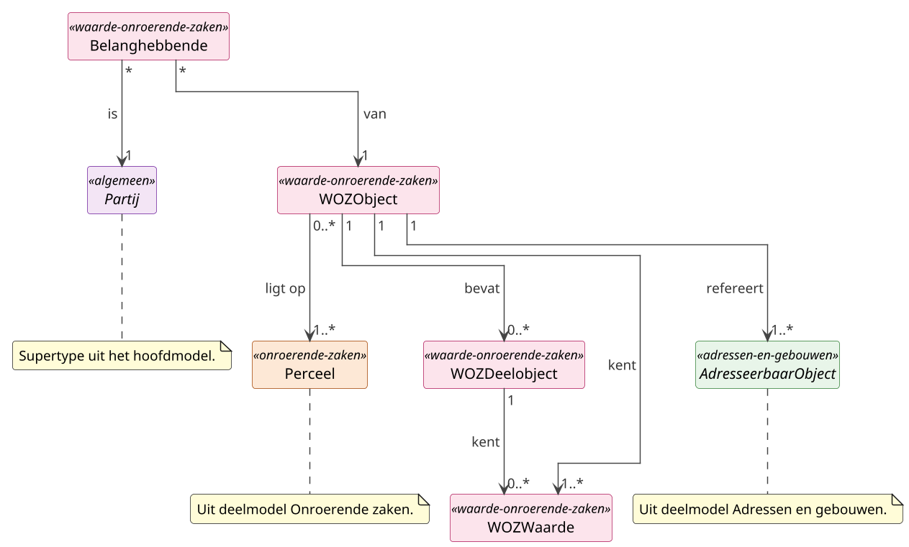

# Deelmodel: Waarde onroerende zaken

WOZ-objecten als fiscale eenheid voor de Wet WOZ en hun waarden per
peildatum. Een WOZ-object is een samenstelling, niet identiek aan één
pand of één perceel.

Kadastrale eigendom valt buiten dit deelmodel; zie
[Onroerende zaken](onroerende-zaken.md). Het fysieke gebouw zelf hoort
bij [Adressen en gebouwen](adressen-en-gebouwen.md).

## Diagram

## Objecttypen

### Belanghebbende

**Definitie**: De geregistreerde rechtsbetrekking tussen een partij en
een WOZ-object, waarbij de partij voor de Wet WOZ als eigenaar,
gebruiker of beide rollen heeft en daarom de WOZ-beschikking ontvangt
voor het object.

**Herkomst definitie**: Wet WOZ art. 24 e.v. (bekendmaking beschikking),
Algemene wet bestuursrecht art. 1:2 (algemeen belanghebbende-begrip) en
de LV-WOZ-catalogus.

**Toelichting**: Belanghebbende is de fiscale tegenpartij die de
WOZ-beschikking ontvangt en aanslagontvanger is voor afgeleide
heffingen. De relatie kan afwijken van de BRK-tenaamstelling (juridisch
eigenaar uit het Kadaster) bij erfpacht of opstal, en van de
BAG-bewoner (feitelijk gebruiker uit BRP) die niet altijd
fiscaal-gebruiker is. GBO gebruikt één relatie met een rol-aanduiding
(`Eigenaar`, `Gebruiker`, `EigenaarEnGebruiker`), in plaats van twee
afzonderlijke velden op het WOZ-object zoals in HC-WOZ.

| MIM-veld | Waarde |
|---|---|
| Naam | Belanghebbende |
| Begrip (URI) | `https://begrippen.gbo-semantiek.nl/id/begrip/Belanghebbende` |
| Herkomst | WOZ |
| Datum opname | 2026-04-28 |
| Unieke aanduiding | Samengesteld uit (Partij, WOZObject, rolBelanghebbende, datumIngang) |
| Populatie | Alle in de LV-WOZ geregistreerde belanghebbende-relaties: eigenaars en gebruikers van WOZ-objecten, inclusief historische rollen. |

**Attribuutsoorten**:

| Naam | Type | Kard. | Authentiek | Mat. hist. | Form. hist. | Definitie | Herkomst | Toelichting |
|---|---|---|---|---|---|---|---|---|
| `rolBelanghebbende` | [`RolBelanghebbende`](#rolbelanghebbende) | 1 | Authentiek | Ja | Ja | Hoedanigheid van de belanghebbende ten aanzien van het WOZ-object. | LV-WOZ-catalogus | `Eigenaar`, `Gebruiker`, `EigenaarEnGebruiker`. |
| `aandeel` | Breuk | 0..1 | Authentiek | Ja | Ja | Het breukdeel waarmee de partij in de rol deelneemt. | LV-WOZ-catalogus | Analoog aan `Tenaamstelling.aandeel`. |
| `datumIngang` | [Datum](../datatypes-en-codelijsten.md#simpele-datatypes) | 1 | Authentiek | Ja | Ja | Datum waarop de rol is ingegaan. | LV-WOZ-catalogus | |
| `datumEinde` | [Datum](../datatypes-en-codelijsten.md#simpele-datatypes) | 0..1 | Authentiek | Ja | Ja | Datum waarop de rol is geëindigd. | LV-WOZ-catalogus | Leeg betekent lopend. |

**Relatiesoorten** (uitgaand):

| Naam | Doel | Kard. (bron→doel) | Authentiek | Mat. hist. | Form. hist. | Toelichting |
|---|---|---|---|---|---|---|
| van | WOZObject | * → 1 | Authentiek | Ja | Ja | WOZ-object waarop de rol betrekking heeft. |
| is | Partij | * → 1 | Authentiek | Ja | Ja | Partij die de rol vervult; direct op `Partij`, niet via `Tenaamstelling`. Geldt ook voor de gebruiker zonder kadastraal recht. |

### WOZDeelobject

**Definitie**: Een afzonderlijk gewaardeerd onderdeel binnen een
WOZ-object, dat een eigen gebruik of eigen waardering kent ten opzichte
van het samengestelde hoofdobject.

**Herkomst definitie**: Uitvoeringsregeling instructie waardebepaling
Wet WOZ en de Waarderingsinstructie van de Waarderingskamer.

**Toelichting**: Deelobjecten komen voor bij gemengd gebruik of
gedifferentieerde waardering binnen één fiscale eenheid, bijvoorbeeld
wonen en bedrijf in één pand. Deelobjecten zijn niet in scope van
HC-WOZ v1.0; alleen via StUF-WOZ beschikbaar. In dit deelmodel staat de
klasse opgenomen voor bron-compatibiliteit; verdere attribuut-uitwerking
volgt bij een concrete use-case.

| MIM-veld | Waarde |
|---|---|
| Naam | WOZDeelobject |
| Begrip (URI) | `https://begrippen.gbo-semantiek.nl/id/begrip/WOZDeelobject` |
| Herkomst | WOZ |
| Datum opname | 2026-04-28 |
| Unieke aanduiding | `deelobjectnummer` binnen WOZObject |
| Populatie | Alle in de LV-WOZ via StUF-WOZ geregistreerde deelobjecten binnen WOZ-objecten met gedifferentieerde waardering. |

**Attribuutsoorten**:

| Naam | Type | Kard. | Authentiek | Mat. hist. | Form. hist. | Definitie | Herkomst | Toelichting |
|---|---|---|---|---|---|---|---|---|
| `deelobjectnummer` | [Numeriek](../datatypes-en-codelijsten.md#simpele-datatypes) | 1 | Basisgegeven | Nee | Nee | Volgnummer van het deelobject binnen het WOZ-object. | LV-WOZ (StUF-WOZ) | |
| `omschrijving` | [Tekst](../datatypes-en-codelijsten.md#simpele-datatypes) | 0..1 | Basisgegeven | Nee | Nee | Korte beschrijving van het deelobject. | LV-WOZ (StUF-WOZ) | |

**Relatiesoorten** (uitgaand):

| Naam | Doel | Kard. (bron→doel) | Authentiek | Mat. hist. | Form. hist. | Toelichting |
|---|---|---|---|---|---|---|
| kent | WOZWaarde | 1 → 0..* | Basisgegeven | Nee | Nee | Waarden die specifiek aan het deelobject worden toegekend. |

### WOZObject

**Definitie**: De fiscale eenheid van onroerende zaak waarop de Wet
waardering onroerende zaken van toepassing is: het kleinste
samengestelde geheel dat als één eenheid wordt gewaardeerd voor de
onroerendezaakbelasting en andere op de WOZ-waarde gebaseerde heffingen.

**Herkomst definitie**: Wet WOZ art. 16 (object-afbakening),
Uitvoeringsbesluit Wet WOZ en de LV-WOZ-catalogus.

**Toelichting**: WOZ-object is een derde werkelijkheid naast de
juridische (BRK-perceel of appartementsrecht) en de fysieke
(BAG-pand of verblijfsobject) werkelijkheid. Een WOZ-object kan uit
meerdere percelen en/of meerdere adresseerbare objecten zijn
samengesteld, bijvoorbeeld kantoor met parkeerplaats, of juist uit een
deel daarvan. Het `wozObjectnummer` is niet uniek tussen gemeenten;
`aanduiding` (gestandaardiseerde gemeentecode plus objectnummer) of de
combinatie met `verantwoordelijkeGemeente` levert de stabiele globale
aanduiding.

| MIM-veld | Waarde |
|---|---|
| Naam | WOZObject |
| Begrip (URI) | `https://begrippen.gbo-semantiek.nl/id/begrip/WOZObject` |
| Herkomst | WOZ |
| Datum opname | 2026-04-28 |
| Unieke aanduiding | `aanduiding` (gestandaardiseerde gemeentecode + wozObjectnummer) |
| Populatie | Alle in Nederland door gemeenten of belastingsamenwerkingen in de Landelijke Voorziening WOZ geregistreerde WOZ-objecten, inclusief actuele en historische objecten. |

**Attribuutsoorten**:

| Naam | Type | Kard. | Authentiek | Mat. hist. | Form. hist. | Definitie | Herkomst | Toelichting |
|---|---|---|---|---|---|---|---|---|
| `wozObjectnummer` | [Numeriek](../datatypes-en-codelijsten.md#simpele-datatypes) | 1 | Authentiek | Ja | Ja | WOZ-eigen objectnummer binnen een gemeente. | LV-WOZ-catalogus | Niet uniek tussen gemeenten. |
| `aanduiding` | [`ObjectAanduiding`](../datatypes-en-codelijsten.md#aanvullende-datatypes) | 1 | Authentiek | Ja | Ja | Gestandaardiseerde aanduiding bestaande uit gemeentecode en objectnummer. | LV-WOZ-catalogus | HC-conform; stabiele globale aanduiding. |
| `verantwoordelijkeGemeente` | [`Codelijst~LT33`](adressen-en-gebouwen.md#codelijsten) | 1 | Authentiek | Ja | Ja | Gemeente die verantwoordelijk is voor de waardering. | LV-WOZ-catalogus | Essentieel wegens niet-uniciteit `wozObjectnummer` over gemeenten. |
| `grondoppervlakte` | [Numeriek](../datatypes-en-codelijsten.md#simpele-datatypes) | 0..1 | Basisgegeven | Ja | Ja | Oppervlakte van de bij het object behorende grond in m². | LV-WOZ-catalogus | |
| `gebruikscode` | [`Codelijst~WOZ`](#codelijsten) | 0..1 | Basisgegeven | Ja | Ja | Type gebruik van het object. | LV-WOZ-catalogus | Woning, winkel, kantoor en dergelijke. |
| `statusWOZObject` | [`StatusWOZObject`](#statuswozobject) | 1 | Basisgegeven | Ja | Ja | Levenscyclus-status van het WOZ-object. | LV-WOZ-catalogus | `Actief`, `VervallenVoorWOZ`. |

Draagt het `Voorkomen`-mixin (bitemporeel patroon; zie sectie [Patronen](../hoofdmodel.md#patronen)).

**Relatiesoorten** (uitgaand):

| Naam | Doel | Kard. (bron→doel) | Authentiek | Mat. hist. | Form. hist. | Toelichting |
|---|---|---|---|---|---|---|
| kent | WOZWaarde | 1 → 1..* | Authentiek | Ja | Ja | Vastgestelde waarden door de tijd; één per peildatum-instantie. |
| bevat | WOZDeelobject | 1 → 0..* | Basisgegeven | Ja | Ja | Afzonderlijk gewaardeerde onderdelen binnen het hoofdobject. |
| refereert | AdresseerbaarObject | 1 → 1..* | Basisgegeven | Ja | Ja | Eén of meer BAG-adresseerbare objecten die samen het WOZ-object vormen. |
| ligtOp | Perceel | 0..* → 1..* | Basisgegeven | Ja | Ja | Eén of meer BRK-percelen waarop de fiscale eenheid ligt. |

### WOZWaarde

**Definitie**: De op grond van de Wet waardering onroerende zaken
vastgestelde waarde van een WOZ-object op een waardepeildatum, voor een
aaneengesloten periode van geldigheid, vastgelegd in een WOZ-beschikking.

**Herkomst definitie**: Wet WOZ art. 17 en 18 (waardebepaling),
art. 22 (beschikking), de Uitvoeringsregeling instructie waardebepaling
Wet WOZ en de LV-WOZ-catalogus.

**Toelichting**: WOZ-waarde is een onveranderlijke feitstelling per
peildatum: gegeven een waardepeildatum en een geldigheidsperiode geldt
één vastgestelde waarde. Wijziging van die waarde, bijvoorbeeld na
bezwaar of beroep, leidt tot een nieuwe WOZ-waarde, niet tot aanpassing
van de bestaande. Eén WOZ-object kent door de tijd meerdere WOZ-waarden;
historie staat centraal. De keten `beschikkingsStatussen[]` (`ConceptBeschikking`,
`DefinitieveBeschikking`, `Bezwaar`, `Beroep`, `HogerBeroep`,
`Onherroepelijk`) legt het procesverloop per WOZ-waarde vast.

| MIM-veld | Waarde |
|---|---|
| Naam | WOZWaarde |
| Alias | Waarde (HC-WOZ-naam zonder WOZ-prefix) |
| Begrip (URI) | `https://begrippen.gbo-semantiek.nl/id/begrip/WOZWaarde` |
| Herkomst | WOZ |
| Datum opname | 2026-04-28 |
| Unieke aanduiding | Samengesteld uit (WOZObject, waardepeildatum) |
| Populatie | Alle voor WOZ-objecten in Nederland vastgestelde waarden: concept, voorlopig en definitief, inclusief bezwaar- en beroep-correcties. |

**Attribuutsoorten**:

| Naam | Type | Kard. | Authentiek | Mat. hist. | Form. hist. | Definitie | Herkomst | Toelichting |
|---|---|---|---|---|---|---|---|---|
| `vastgesteldeWaarde` | [Bedrag](../datatypes-en-codelijsten.md#aanvullende-datatypes) | 1 | Authentiek | Nee | Nee | De vastgestelde waarde van het WOZ-object op de peildatum. | LV-WOZ-catalogus | |
| `waardepeildatum` | [Datum](../datatypes-en-codelijsten.md#simpele-datatypes) | 1 | Authentiek | Nee | Nee | Datum waarnaar de waarde is bepaald. | LV-WOZ-catalogus | Typisch 1 januari van het voorgaande jaar. |
| `ingangsdatum` | [Datum](../datatypes-en-codelijsten.md#simpele-datatypes) | 1 | Authentiek | Nee | Nee | Datum vanaf wanneer de waarde geldigheid heeft. | LV-WOZ-catalogus | Materiële geldigheid. |
| `einddatum` | [Datum](../datatypes-en-codelijsten.md#simpele-datatypes) | 0..1 | Basisgegeven | Nee | Nee | Datum waarop de waarde vervalt. | LV-WOZ-catalogus | |
| `beschikkingsnummer` | [Identificatie](../datatypes-en-codelijsten.md#simpele-datatypes) | 0..1 | Authentiek | Nee | Nee | Identificatie van de WOZ-beschikking. | LV-WOZ-catalogus | |
| `statusWOZWaarde` | [`StatusWOZWaarde`](#statuswozwaarde) | 1 | Basisgegeven | Nee | Nee | Vaststellingsstatus van de waarde. | LV-WOZ-catalogus | `DefinitiefVastgesteld`, `VoorlopigVastgesteld`, `Vervallen`. |
| `beschikkingsStatussen` | [`BeschikkingStatus`](#beschikkingstatus) | 1..* | Basisgegeven | Nee | Nee | Chronologische statussen die de beschikking heeft doorlopen. | LV-WOZ-catalogus | HC-conforme rijke modellering. |
| `indicatieBezwaarBeroep` | [Indicatie](../datatypes-en-codelijsten.md#simpele-datatypes) | 1 | Basisgegeven | Nee | Nee | Geeft aan of een bezwaar of beroep loopt tegen de beschikking. | LV-WOZ-catalogus | |

Op WOZ-waarde wordt geen historie binnen één registratie bijgehouden:
het tijdsverloop ontstaat door opvolgende beschikkingen (nieuwe
WOZ-waarden) en via de `beschikkingsStatussen[]`-keten.

**Relatiesoorten** (uitgaand):

WOZWaarde kent geen eigen uitgaande relaties; de relaties zijn inkomend
vanuit `WOZObject.kent` en `WOZDeelobject.kent`.

## Enumeraties

### BeschikkingStatus

**Definitie**: Chronologische statussen die een WOZ-beschikking doorloopt vanaf concept tot onherroepelijk worden.

**Herkomst definitie**: Wet WOZ art. 22 en art. 24 e.v. (beschikking en bekendmaking), Algemene wet bestuursrecht hoofdstuk 6 en 7 (bezwaar en beroep) en de LV-WOZ-catalogus.

**Toelichting**: De keten legt het procesverloop per WOZ-waarde vast, zodat naast de actuele status ook eerdere stadia traceerbaar blijven. Een nieuwe beschikkingsstatus voegt een rij toe aan de keten en vervangt geen eerdere waarde.

| MIM-veld | Waarde |
|---|---|
| Naam | BeschikkingStatus |
| Begrip (URI) | `https://begrippen.gbo-semantiek.nl/id/begrip/BeschikkingStatus` |
| Herkomst | WOZ |
| Datum opname | 2026-04-28 |

**Gebruikt door**: `WOZWaarde.beschikkingsStatussen`.

**Waarden**:

| Naam | Definitie | Toelichting |
|---|---|---|
| Beroep | Tegen de beschikking is beroep ingesteld bij de rechter. | Volgt op een afgewezen of gedeeltelijk afgewezen bezwaar. |
| Bezwaar | Tegen de beschikking is bezwaar gemaakt bij de gemeente. | Eerste stap van het rechtsmiddelentraject. |
| ConceptBeschikking | De beschikking is in voorbereiding en nog niet aan de belanghebbende bekendgemaakt. | Interne werkstatus voor de gemeente. |
| DefinitieveBeschikking | De beschikking is vastgesteld en aan de belanghebbende bekendgemaakt. | Reguliere eindstatus zolang geen rechtsmiddel wordt ingezet. |
| HogerBeroep | Tegen de uitspraak in beroep is hoger beroep ingesteld. | Behandeling door het gerechtshof. |
| Onherroepelijk | De beschikking staat juridisch vast en is niet meer voor rechtsmiddelen vatbaar. | Bezwaar- en beroepstermijn is verstreken of alle rechtsmiddelen zijn uitgeput. |

### RolBelanghebbende

**Definitie**: Hoedanigheid waarin een partij voor de Wet WOZ bij een WOZ-object betrokken is.

**Herkomst definitie**: Wet WOZ art. 24 (bekendmaking beschikking aan belanghebbenden) en de LV-WOZ-catalogus.

**Toelichting**: GBO gebruikt één rol-aanduiding op de Belanghebbende-relatie, in plaats van afzonderlijke eigenaars- en gebruikersrelaties op het WOZ-object. Eén partij kan tegelijk eigenaar en gebruiker zijn; dat wordt met de gecombineerde waarde uitgedrukt.

| MIM-veld | Waarde |
|---|---|
| Naam | RolBelanghebbende |
| Begrip (URI) | `https://begrippen.gbo-semantiek.nl/id/begrip/RolBelanghebbende` |
| Herkomst | WOZ |
| Datum opname | 2026-04-28 |

**Gebruikt door**: `Belanghebbende.rolBelanghebbende`.

**Waarden**:

| Naam | Definitie | Toelichting |
|---|---|---|
| Eigenaar | De partij is voor de Wet WOZ eigenaar van het WOZ-object. | Ontvangt de eigenaarsbeschikking; basis voor onroerendezaakbelasting eigenaarsdeel. |
| EigenaarEnGebruiker | De partij is voor de Wet WOZ zowel eigenaar als gebruiker van het WOZ-object. | Typisch bij eigenaar-bewoner van een woning. |
| Gebruiker | De partij is voor de Wet WOZ gebruiker van het WOZ-object. | Ontvangt de gebruikersbeschikking; relevant voor niet-woningen. |

### StatusWOZObject

**Definitie**: Levenscyclus-status van een WOZ-object binnen de Landelijke Voorziening WOZ.

**Herkomst definitie**: LV-WOZ-catalogus en de Waarderingsinstructie van de Waarderingskamer.

**Toelichting**: De status geeft aan of het object nog meedoet in de WOZ-administratie of buiten gebruik is gesteld voor de WOZ. Een vervallen WOZ-object blijft in de historie aanwezig voor terugkijk-bevragingen.

| MIM-veld | Waarde |
|---|---|
| Naam | StatusWOZObject |
| Begrip (URI) | `https://begrippen.gbo-semantiek.nl/id/begrip/StatusWOZObject` |
| Herkomst | WOZ |
| Datum opname | 2026-04-28 |

**Gebruikt door**: `WOZObject.statusWOZObject`.

**Waarden**:

| Naam | Definitie | Toelichting |
|---|---|---|
| Actief | Het WOZ-object is actueel in gebruik voor de waardering. | Reguliere status voor een lopend object. |
| VervallenVoorWOZ | Het WOZ-object is voor de WOZ niet langer in gebruik. | Bijvoorbeeld na samenvoeging, splitsing of sloop; historie blijft beschikbaar. |

### StatusWOZWaarde

**Definitie**: Vaststellingsstatus van een WOZ-waarde voor een waardepeildatum.

**Herkomst definitie**: Wet WOZ art. 22 (beschikking), de Uitvoeringsregeling instructie waardebepaling Wet WOZ en de LV-WOZ-catalogus.

**Toelichting**: De status onderscheidt voorlopige van definitief vastgestelde waarden en markeert vervallen waarden, zodat afnemers weten welke waarde rechtsgeldig is. Een gewijzigde waarde na bezwaar of beroep leidt tot een nieuwe WOZ-waarde met een eigen status.

| MIM-veld | Waarde |
|---|---|
| Naam | StatusWOZWaarde |
| Begrip (URI) | `https://begrippen.gbo-semantiek.nl/id/begrip/StatusWOZWaarde` |
| Herkomst | WOZ |
| Datum opname | 2026-04-28 |

**Gebruikt door**: `WOZWaarde.statusWOZWaarde`.

**Waarden**:

| Naam | Definitie | Toelichting |
|---|---|---|
| DefinitiefVastgesteld | De waarde is definitief vastgesteld en is rechtsgeldig. | Reguliere status na bekendmaking van de definitieve beschikking. |
| Vervallen | De waarde is komen te vervallen. | Bijvoorbeeld door correctie via een nieuwe beschikking of na herziening na bezwaar of beroep. |
| VoorlopigVastgesteld | De waarde is voorlopig vastgesteld in afwachting van definitieve vaststelling. | Wordt gebruikt voorafgaand aan de definitieve beschikking. |

## Codelijsten

Deelmodel-specifieke codelijsten. LT 33 Gemeenten
(`WOZObject.verantwoordelijkeGemeente`) wordt gedeeld met de
gemeente-typering in [Adressen en gebouwen](adressen-en-gebouwen.md);
stelselbrede codelijsten staan op de
[Datatypes en codelijsten](../datatypes-en-codelijsten.md).

| Codelijst | Bron / beheerder | GBO-typering | Gebruikt door |
|---|---|---|---|
| [WOZ Gebruikscode](https://www.waarderingskamer.nl/voor-gemeenten/gegevensbeheer) | [Waarderingskamer](https://www.waarderingskamer.nl/) | `Codelijst~WOZ` | `WOZObject.gebruikscode` (functioneel gebruik van het WOZ-object, bijvoorbeeld woning, kantoor, agrarisch object). |

De WOZ-gebruikscodes worden vastgesteld door de
[Waarderingskamer](https://www.waarderingskamer.nl/) en zijn onderdeel
van de [LV-WOZ-catalogus](https://www.waarderingskamer.nl/voor-gemeenten/gegevensbeheer) (gegevensbeschrijving
en stuf-/REST-koppelvlak).

### Onderhoudsritme

| Codelijst | Mutatieritme | Bron |
|---|---|---|
| [WOZ Gebruikscode](https://www.waarderingskamer.nl/voor-gemeenten/gegevensbeheer) | Sporadisch | [Waarderingskamer](https://www.waarderingskamer.nl/) |

## Stelselkoppelingen

- → [Adressen en gebouwen](adressen-en-gebouwen.md):
  `WOZ-object refereert AdresseerbaarObject(en)`: één WOZ-object kan
  meerdere AO's omvatten (kantoor + parkeerplaats).
- → [Onroerende zaken](onroerende-zaken.md):
  `WOZ-object ligt op Perceel(en)`: één of meer percelen vormen de
  fiscale eenheid.
- → [Personen](personen.md) en
  [Bedrijven en instellingen](bedrijven-en-instellingen.md): de
  `Belanghebbende` is een `NatuurlijkPersoon` of `NietNatuurlijkPersoon`
  via het `Partij`-supertype.

## Bron

Autoritatieve bron: **WOZ** (Basisregistratie Waarde Onroerende Zaken).
Bronhouders zijn gemeenten (uitvoering vaak via belastingsamenwerking);
landelijke voorziening LV-WOZ ontsluit gegevens, toezicht door de
Waarderingskamer. Wet WOZ, Uitvoeringsbesluit Wet WOZ en
Uitvoeringsregeling instructie waardebepaling Wet WOZ zijn normatief.
Onder Haal Centraal: WOZ Bevragen API.

Het Core-model is rijker dan HC-WOZ op een aantal punten:
`WOZDeelobject`, volledige peildatum-historie en gebruikscode/status;
voor die data blijft StUF-WOZ naast HC bestaan.
