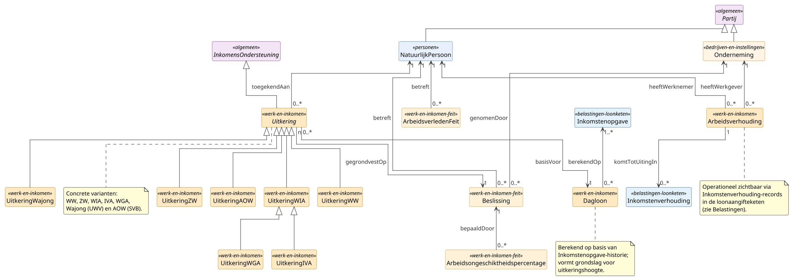

# Deelmodel: Werk en Inkomen

Uitkeringsrelaties, arbeidsverhoudingen en daaraan gekoppelde
besluitvorming op grond van de Wet SUWI en de afzonderlijke
werknemers- en volksverzekeringswetten. Operationele ontsluiting via
het Suwi Gegevensregister, beheerd door BKWI namens UWV; uitvoering
door UWV (werknemersverzekeringen plus Wajong en WIA) of SVB (AOW
en ANW).

Persoonsgegevens van de uitkeringsgerechtigde of werknemer staan in
[Personen](personen.md). De werkgever, uitvoeringsinstelling of
inhoudingsplichtige rechtspersoon staat in
[Bedrijven en instellingen](bedrijven-en-instellingen.md). De
loonaangifteketen-data zelf (Inkomstenverhouding, Inkomstenopgave,
Inkomstenperiode, LoonBestanddeel) staat in
[Belastingen](belastingen.md), omdat de Belastingdienst wettelijk
eigenaar is van die definities. Het `Partij`-supertype staat in het
[hoofdmodel](../hoofdmodel.md).

## Diagram

## Objecttypen

### Arbeidsongeschiktheidspercentage

**Definitie**: Het door een verzekeringsarts en arbeidsdeskundige
vastgestelde percentage waarmee de verdiencapaciteit van een
werknemer ten opzichte van zijn oude loon is verminderd, op grond
waarvan de WIA-uitkering wordt geclassificeerd in IVA of WGA met hun
fasen.

**Herkomst definitie**: Schattingsbesluit arbeidsongeschiktheidswetten;
Wet werk en inkomen naar arbeidsvermogen.

**Toelichting**: Het percentage bepaalt de uitkeringstak: 80% of meer
duurzaam geeft IVA; 35% tot 80% of 80% of meer niet-duurzaam geeft
WGA; minder dan 35% geeft geen recht op WIA. Een herziening kan
leiden tot een wijziging van uitkeringssoort en hoogte.

| MIM-veld | Waarde |
|---|---|
| Naam | Arbeidsongeschiktheidspercentage |
| Herkomst | SGR cluster Beslissing |
| Datum opname | 2026-05-19 |

**Attribuutsoorten**:

| Naam | Type | Kard. | Definitie | Herkomst |
|---|---|---|---|---|
| `percentage` | [Decimaal](../datatypes-en-codelijsten.md#simpele-datatypes) | 1 | Het AO-percentage. | WIA-beschikking |
| `vaststellingsdatum` | [Datum](../datatypes-en-codelijsten.md#simpele-datatypes) | 1 | Datum waarop het percentage is vastgesteld. | SGR |
| `duurzaamIndicatie` | [Indicatie](../datatypes-en-codelijsten.md#simpele-datatypes) | 1 | Bepaalt IVA versus WGA bij volledig AO. | Schattingsbesluit |

### Arbeidsverhouding

**Definitie**: De juridische en feitelijke relatie tussen een
natuurlijk persoon als werknemer en een werkgever op grond waarvan
arbeid wordt verricht tegen beloning, gedurende een bepaalde of
onbepaalde periode.

**Herkomst definitie**: Burgerlijk Wetboek Boek 7 titel 10
(arbeidsovereenkomst); Wet SUWI voor het SUWI-aspect.

**Toelichting**: Arbeidsverhouding ligt boven Inkomstenverhouding
in [Belastingen](belastingen.md): één arbeidsverhouding kan in de
tijd meerdere inkomstenverhoudingen genereren (na contractvernieuwing
of bij wisseling van loonperiode-type). De Arbeidsverhouding-
attributen leggen de afspraak vast; de bijbehorende
inkomstenverhoudingen leggen de uitvoering en de aangifte
loonheffingen vast.

| MIM-veld | Waarde |
|---|---|
| Naam | Arbeidsverhouding |
| Herkomst | SGR cluster Arbeidsverhouding |
| Datum opname | 2026-05-19 |

**Attribuutsoorten**:

| Naam | Type | Kard. | Definitie | Herkomst |
|---|---|---|---|---|
| `soortDienstverband` | CodeAardArbeidsverhouding | 1 | Aard van de arbeidsverhouding. | SGR + Loonheffingen |
| `ingangsdatum` | [Datum](../datatypes-en-codelijsten.md#simpele-datatypes) | 1 | Begindatum dienstverband. | SGR |
| `einddatum` | [Datum](../datatypes-en-codelijsten.md#simpele-datatypes) | 0..1 | Einddatum dienstverband. | SGR |
| `proeftijdEinddatum` | [Datum](../datatypes-en-codelijsten.md#simpele-datatypes) | 0..1 | Einde proeftijd. | SGR |
| `beroep` | [Tekst](../datatypes-en-codelijsten.md#simpele-datatypes) | 0..1 | Functie of vakgebied. | SGR |
| `codeRedenEinde` | CodeRedenEindeArbeidsverhouding | 0..1 | Reden van einde. | Loonheffingen bijlage |
| `overnameIndicatie` | [Indicatie](../datatypes-en-codelijsten.md#simpele-datatypes) | 0..1 | Onderneming in overnameproces. | SGR |

### ArbeidsverledenFeit

**Definitie**: Een afzonderlijk feit in het arbeids- of inkomensverleden
van een natuurlijk persoon, zoals een periode in dienst, een periode
met uitkering of een leerwerk-periode, dat relevant is voor de
berekening van werknemersverzekerings-rechten.

**Herkomst definitie**: Werkloosheidswet (refertes 26-uit-36-weken en
4-uit-5-jaren); SGR cluster Arbeidsverhouding.

**Toelichting**: Arbeidsverleden bepaalt onder andere de WW-duur.
ArbeidsverledenFeit dient als bouwsteen waarmee UWV een
arbeidsverleden-overzicht kan opstellen, met feit-typen voor
dienstverband, uitkeringsperiode, leerwerk-periode en periode van
zelfstandig werk.

| MIM-veld | Waarde |
|---|---|
| Naam | ArbeidsverledenFeit |
| Herkomst | SGR cluster Arbeidsverhouding |
| Datum opname | 2026-05-19 |

**Attribuutsoorten**:

| Naam | Type | Kard. | Definitie | Herkomst |
|---|---|---|---|---|
| `soortFeit` | [Tekst](../datatypes-en-codelijsten.md#simpele-datatypes) | 1 | Dienstverband, Uitkering, Leerwerk of ZelfstandigWerk. | SGR |
| `begindatum` | [Datum](../datatypes-en-codelijsten.md#simpele-datatypes) | 1 | Aanvang van het feit. | SGR |
| `einddatum` | [Datum](../datatypes-en-codelijsten.md#simpele-datatypes) | 0..1 | Einde van het feit. | SGR |
| `sv-loonbedrag` | [Bedrag](../datatypes-en-codelijsten.md#aanvullende-datatypes) | 0..1 | Cumulatief SV-loon over de periode. | Loonaangifteketen |

### Beslissing

**Definitie**: Een door een uitvoerings-instelling in het SUWI-stelsel
genomen besluit over het recht op, de hoogte van of de beeindiging
van een uitkering of een andere voorziening voor een natuurlijk
persoon.

**Herkomst definitie**: Wet SUWI; Algemene wet bestuursrecht (Awb)
hoofdstuk 4 (beschikking); de afzonderlijke werknemers- en
volksverzekeringswetten.

**Toelichting**: Beslissing is de juridische grondslag onder een
uitkering. Een uitkering bestaat alleen als er een geldige
beschikking onder ligt. Wijzigingen (verhoging, verlaging,
beeindiging) zijn elk afzonderlijke beschikkingen.

| MIM-veld | Waarde |
|---|---|
| Naam | Beslissing |
| Herkomst | SGR cluster Beslissing |
| Datum opname | 2026-05-19 |

**Attribuutsoorten**:

| Naam | Type | Kard. | Definitie | Herkomst |
|---|---|---|---|---|
| `beschikkingsnummer` | [Tekst](../datatypes-en-codelijsten.md#simpele-datatypes) | 1 | Identifier van de beschikking. | SGR |
| `beschikkingsdatum` | [Datum](../datatypes-en-codelijsten.md#simpele-datatypes) | 1 | Datum van de beschikking. | SGR |
| `beslissingSoort` | [BeslissingSoort](#beslissingsoort) | 1 | Toekenning, herziening of beeindiging. | SGR |
| `betrefftSoortUitkering` | [SoortUitkering](#soortuitkering) | 0..1 | Op welke uitkering de beschikking ziet. | SGR |

### Dagloon

**Definitie**: Het op grond van de Dagloonregels werknemersverzekeringen
voor een specifieke uitkering vastgestelde dagloon, dat dient als
grondslag voor de hoogte van de uitkering en wordt berekend op basis
van de inkomstenopgaven over de referteperiode.

**Herkomst definitie**: Dagloonregels werknemersverzekeringen 2015
(ministeriele regeling); Werkloosheidswet, Ziektewet en Wet WIA.

**Toelichting**: Het dagloon wordt door UWV berekend uit de
loonaangifteketen-data (Inkomstenopgave-records in de
referteperiode, doorgaans een jaar). Het wordt gemaximeerd op het
wettelijk maximumdagloon, jaarlijks door SZW vastgesteld.

| MIM-veld | Waarde |
|---|---|
| Naam | Dagloon |
| Herkomst | SGR cluster Uitkering |
| Datum opname | 2026-05-19 |

**Attribuutsoorten**:

| Naam | Type | Kard. | Definitie | Herkomst |
|---|---|---|---|---|
| `dagloonBedrag` | [Bedrag](../datatypes-en-codelijsten.md#aanvullende-datatypes) | 1 | Het vastgestelde dagloon. | Dagloonregels |
| `peildatum` | [Datum](../datatypes-en-codelijsten.md#simpele-datatypes) | 1 | Peilmoment voor de berekening. | SGR |
| `referteperiodeStart` | [Datum](../datatypes-en-codelijsten.md#simpele-datatypes) | 1 | Aanvang van de referteperiode. | Dagloonregels art. 2 |
| `referteperiodeEinde` | [Datum](../datatypes-en-codelijsten.md#simpele-datatypes) | 1 | Einde van de referteperiode. | Dagloonregels art. 2 |
| `maximumDagloon` | [Bedrag](../datatypes-en-codelijsten.md#aanvullende-datatypes) | 0..1 | Wettelijk maximum-dagloon op de peildatum. | SZW jaartabel |

### InkomensOndersteuning

**Definitie**: Een door of namens de overheid aan een natuurlijk
persoon verstrekte financiele bijdrage met als doel
inkomensondersteuning, in de vorm van een inkomensafhankelijke
regeling of een sociale-zekerheidsuitkering.

**Herkomst definitie**: Algemene wet inkomensafhankelijke regelingen
(Awir) voor toeslagen; Wet SUWI en de afzonderlijke werknemers- en
volksverzekeringswetten voor uitkeringen; GBO-Core-abstractie.

**Toelichting**: Cross-domein algemene categorie boven Toeslag (in
[Belastingen](belastingen.md)) en Uitkering (in dit deelmodel).
Beide takken delen de basis-eigenschappen rechthebbende natuurlijk
persoon, toekenningsperiode, bedrag en grondslag-beschikking; de
varianten verschillen in juridische basis, uitvoerings-organisatie
en aanvraagprocedure.

| MIM-veld | Waarde |
|---|---|
| Naam | InkomensOndersteuning |
| Indicatie abstract object | Ja |
| Herkomst | Cross-domein abstractie |
| Datum opname | 2026-05-19 |

**Attribuutsoorten**:

| Naam | Type | Kard. | Definitie | Herkomst |
|---|---|---|---|---|
| `identificatie` | [Tekst](../datatypes-en-codelijsten.md#simpele-datatypes) | 1 | Interne identificatie. | GBO-Core |
| `ingangsdatum` | [Datum](../datatypes-en-codelijsten.md#simpele-datatypes) | 1 | Aanvang van de toekenning. | Awir / Wet SUWI |
| `einddatum` | [Datum](../datatypes-en-codelijsten.md#simpele-datatypes) | 0..1 | Einde van de toekenning. | Awir / Wet SUWI |
| `bedragPeriode` | [Bedrag](../datatypes-en-codelijsten.md#aanvullende-datatypes) | 1 | Bedrag per periode. | per regeling |

### Uitkering

**Definitie**: Een door of namens de overheid aan een natuurlijk
persoon toegekende periodieke uitkering op grond van een
werknemersverzekering of volksverzekering, ter vervanging of
aanvulling van loon.

**Herkomst definitie**: Wet SUWI plus de afzonderlijke werknemers-
en volksverzekeringswetten (Werkloosheidswet, Ziektewet, Wet WIA,
Wajong, AOW).

**Toelichting**: Zeven concrete varianten, uitgevoerd door UWV
(WW, ZW, WIA, IVA, WGA, Wajong) of SVB (AOW).

| MIM-veld | Waarde |
|---|---|
| Naam | Uitkering |
| Indicatie abstract object | Ja |
| Herkomst | SGR cluster Uitkering |
| Datum opname | 2026-05-19 |

**Attribuutsoorten**:

| Naam | Type | Kard. | Definitie | Herkomst |
|---|---|---|---|---|
| `soortUitkering` | [SoortUitkering](#soortuitkering) | 1 | Welke uitkering. | SGR |
| `ingangsdatum` | [Datum](../datatypes-en-codelijsten.md#simpele-datatypes) | 1 | Aanvang van de uitkering. | SGR |
| `einddatum` | [Datum](../datatypes-en-codelijsten.md#simpele-datatypes) | 0..1 | Einde van de uitkering. | SGR |
| `bedragMaand` | [Bedrag](../datatypes-en-codelijsten.md#aanvullende-datatypes) | 0..1 | Maandelijks bedrag. | SGR |
| `redenEinde` | [RedenEindeUitkering](#redeneindeuitkering) | 0..1 | Reden van einde van de uitkering. | SGR |

### UitkeringAOW

**Definitie**: Een door SVB op grond van de Algemene Ouderdomswet
toegekende periodieke uitkering aan personen vanaf de AOW-gerechtigde
leeftijd, gebaseerd op de in Nederland opgebouwde verzekerde jaren.

**Herkomst definitie**: Algemene Ouderdomswet (AOW).

**Toelichting**: Anders dan de overige uitkeringen, die UWV uitvoert,
wordt AOW uitgevoerd door SVB. Het Suwi Gegevensregister ontsluit
een deel van de AOW-administratie voor afnemers in het SUWI-stelsel;
voor het volledige beeld is mogelijk een directe SVB-aansluiting
nodig.

| MIM-veld | Waarde |
|---|---|
| Naam | UitkeringAOW |
| Notation | AOW |
| Herkomst | SGR (ontsluiting); SVB (uitvoering) |
| Datum opname | 2026-05-19 |

**Attribuutsoorten**:

| Naam | Type | Kard. | Definitie | Herkomst |
|---|---|---|---|---|
| `aowGerechtigdeLeeftijd` | [Geheel](../datatypes-en-codelijsten.md#simpele-datatypes) | 1 | Ingangsleeftijd voor deze persoon. | AOW |
| `opgebouwdeVerzekerdeJaren` | [Geheel](../datatypes-en-codelijsten.md#simpele-datatypes) | 0..1 | Maximaal 50; bepaalt 100%-opbouw. | SVB |
| `aowHoogteCategorie` | [Tekst](../datatypes-en-codelijsten.md#simpele-datatypes) | 0..1 | Alleenstaande, gehuwd of samenwonend. | SVB |

### UitkeringIVA

**Definitie**: De Inkomensvoorziening Volledig Arbeidsongeschikten op
grond van de WIA, toegekend aan werknemers die duurzaam minder dan
twintig procent van hun oude loon kunnen verdienen.

**Herkomst definitie**: Wet WIA hoofdstuk IV (IVA-regeling).

**Toelichting**: IVA-criterium: minder dan 20% van het oude loon
kunnen verdienen en geen herstel verwacht. De uitkering is hoger en
stabieler dan WGA omdat het duurzaamheids-criterium is gehaald.

| MIM-veld | Waarde |
|---|---|
| Naam | UitkeringIVA |
| Notation | IVA |
| Herkomst | SGR cluster Uitkering |
| Datum opname | 2026-05-19 |

**Attribuutsoorten**:

| Naam | Type | Kard. | Definitie | Herkomst |
|---|---|---|---|---|
| `dagloonBedrag` | [Bedrag](../datatypes-en-codelijsten.md#aanvullende-datatypes) | 1 | Berekeningsbasis. | SGR |
| `uitkeringspercentage` | [Decimaal](../datatypes-en-codelijsten.md#simpele-datatypes) | 1 | 75% van dagloon. | Wet WIA |

### UitkeringWajong

**Definitie**: Een door UWV op grond van de Wet
arbeidsongeschiktheidsvoorziening jonggehandicapten toegekende
periodieke uitkering aan jonggehandicapten die door
arbeidsongeschiktheid niet of beperkt kunnen werken.

**Herkomst definitie**: Wajong (drie generaties: oude Wajong,
Wajong 2010, Wajong 2015).

**Toelichting**: Drie historische generaties met eigen voorwaarden:
oude Wajong (toekenningen voor 2010), Wajong 2010 (instroom
2010-2014, met werkregeling) en Wajong 2015 (vanaf 2015, uitsluitend
voor duurzaam volledig arbeidsongeschikten).

| MIM-veld | Waarde |
|---|---|
| Naam | UitkeringWajong |
| Notation | Wajong |
| Herkomst | SGR cluster Uitkering |
| Datum opname | 2026-05-19 |

**Attribuutsoorten**:

| Naam | Type | Kard. | Definitie | Herkomst |
|---|---|---|---|---|
| `wajongGeneratie` | [Tekst](../datatypes-en-codelijsten.md#simpele-datatypes) | 1 | OudeWajong, Wajong2010 of Wajong2015. | SGR |
| `arbeidsongeschiktheidspercentage` | [Decimaal](../datatypes-en-codelijsten.md#simpele-datatypes) | 0..1 | Bij relevante generatie. | Wajong-beschikking |

### UitkeringWGA

**Definitie**: De Werkhervatting Gedeeltelijk Arbeidsongeschikten op
grond van de WIA, toegekend aan werknemers die vijfendertig procent
tot tachtig procent arbeidsongeschikt zijn, of volledig
arbeidsongeschikt maar niet duurzaam.

**Herkomst definitie**: Wet WIA hoofdstuk VII (WGA-regeling).

**Toelichting**: Drie fasen: LGU (loongerelateerde uitkering, op
basis van arbeidsverleden), LAU (loonaanvullingsuitkering, wanneer
de uitkering minus resterende verdiencapaciteit boven een drempel
uitkomt) en VVU (vervolguitkering, gerelateerd aan
minimumloon-percentages).

| MIM-veld | Waarde |
|---|---|
| Naam | UitkeringWGA |
| Notation | WGA |
| Herkomst | SGR cluster Uitkering |
| Datum opname | 2026-05-19 |

**Attribuutsoorten**:

| Naam | Type | Kard. | Definitie | Herkomst |
|---|---|---|---|---|
| `dagloonBedrag` | [Bedrag](../datatypes-en-codelijsten.md#aanvullende-datatypes) | 1 | Berekeningsbasis. | SGR |
| `arbeidsongeschiktheidspercentage` | [Decimaal](../datatypes-en-codelijsten.md#simpele-datatypes) | 1 | Bepaalt fase en hoogte. | WIA-beschikking |
| `wgaFase` | [Tekst](../datatypes-en-codelijsten.md#simpele-datatypes) | 0..1 | LGU, LAU of VVU. | SGR |

### UitkeringWIA

**Definitie**: Een door UWV op grond van de Wet werk en inkomen naar
arbeidsvermogen toegekende periodieke uitkering aan een werknemer
die na een wachttijd van twee jaar van ziekte gedeeltelijk of
volledig arbeidsongeschikt is.

**Herkomst definitie**: Wet WIA.

**Toelichting**: De WIA splitst zich in IVA (volledig duurzaam
arbeidsongeschikt) en WGA (gedeeltelijk of niet-duurzaam
arbeidsongeschikt). UitkeringWIA is in dit deelmodel de
gemeenschappelijke aanwijzing; concrete varianten zijn UitkeringIVA
en UitkeringWGA.

| MIM-veld | Waarde |
|---|---|
| Naam | UitkeringWIA |
| Notation | WIA |
| Herkomst | SGR cluster Uitkering |
| Datum opname | 2026-05-19 |

**Attribuutsoorten**:

| Naam | Type | Kard. | Definitie | Herkomst |
|---|---|---|---|---|
| `dagloonBedrag` | [Bedrag](../datatypes-en-codelijsten.md#aanvullende-datatypes) | 1 | Berekeningsbasis. | SGR |
| `arbeidsongeschiktheidspercentage` | [Decimaal](../datatypes-en-codelijsten.md#simpele-datatypes) | 1 | Vastgesteld door UWV. | WIA-beschikking |

### UitkeringWW

**Definitie**: Een door UWV aan een werkloze werknemer toegekende
periodieke uitkering op grond van de Werkloosheidswet, ter
vervanging van het weggevallen loon.

**Herkomst definitie**: Werkloosheidswet hoofdstukken II en III.

**Toelichting**: Hoogte gebaseerd op het dagloon vermenigvuldigd met
een percentage dat in de tijd kan dalen. Duur afhankelijk van
arbeidsverledenjaren (basis-WW plus eventueel verlengde uitkering).

| MIM-veld | Waarde |
|---|---|
| Naam | UitkeringWW |
| Notation | WW |
| Herkomst | SGR cluster Uitkering |
| Datum opname | 2026-05-19 |

**Attribuutsoorten**:

| Naam | Type | Kard. | Definitie | Herkomst |
|---|---|---|---|---|
| `dagloonBedrag` | [Bedrag](../datatypes-en-codelijsten.md#aanvullende-datatypes) | 1 | Berekeningsbasis. | SGR |
| `uitkeringspercentage` | [Decimaal](../datatypes-en-codelijsten.md#simpele-datatypes) | 1 | Aanvankelijk 75%, daarna 70%. | WW art. 47 |
| `arbeidsverledenJaren` | [Geheel](../datatypes-en-codelijsten.md#simpele-datatypes) | 0..1 | Bepaalt duur uitkering. | SGR |

### UitkeringZW

**Definitie**: Een door UWV aan een zieke werknemer of vangnetter
toegekende periodieke uitkering op grond van de Ziektewet, ter
vervanging van het door ziekte weggevallen loon.

**Herkomst definitie**: Ziektewet.

**Toelichting**: ZW dekt het vangnet-deel van de ziektevoorziening:
uitzendkrachten, oproepkrachten, werklozen en werknemers zonder
doorbetalingsplichtige werkgever. Werknemers met een
doorbetalingsplichtige werkgever krijgen loondoorbetaling van die
werkgever en vallen niet onder ZW.

| MIM-veld | Waarde |
|---|---|
| Naam | UitkeringZW |
| Notation | ZW |
| Herkomst | SGR cluster Uitkering |
| Datum opname | 2026-05-19 |

**Attribuutsoorten**:

| Naam | Type | Kard. | Definitie | Herkomst |
|---|---|---|---|---|
| `dagloonBedrag` | [Bedrag](../datatypes-en-codelijsten.md#aanvullende-datatypes) | 1 | Berekeningsbasis. | SGR |
| `uitkeringspercentage` | [Decimaal](../datatypes-en-codelijsten.md#simpele-datatypes) | 1 | Doorgaans 70%. | ZW art. 29 |

## Enumeraties

### BeslissingSoort

**Definitie**: De soorten besluit die in het SUWI-stelsel door UWV
of SVB kunnen worden genomen over uitkeringen en voorzieningen.

**Herkomst definitie**: SGR cluster Beslissing.

| MIM-veld | Waarde |
|---|---|
| Naam | BeslissingSoort |
| Herkomst | SGR |
| Datum opname | 2026-05-19 |

**Waarden**:

| Code | Naam | Toelichting |
|---|---|---|
| Toekenning | Toekenning uitkering | Nieuwe uitkering wordt toegekend. |
| Herziening | Herziening uitkering | Hoogte of grondslag verandert. |
| Beeindiging | Beeindiging uitkering | Uitkering eindigt. |
| Afwijzing | Afwijzing aanvraag | Aanvraag wordt afgewezen. |
| Bezwaar | Beslissing op bezwaar | Heroverweging na ingediend bezwaar. |
| Sanctie | Sanctie-besluit | Bijvoorbeeld korting wegens niet-naleving. |

### RedenEindeUitkering

**Definitie**: De redenen waarom een uitkering kan eindigen op grond
van de werknemers- of volksverzekeringswetten.

**Herkomst definitie**: SGR cluster Uitkering.

**Toelichting**: Top 10 weergegeven; volledige set te bevestigen
tegen SGR-publicatie.

| MIM-veld | Waarde |
|---|---|
| Naam | RedenEindeUitkering |
| Herkomst | SGR |
| Datum opname | 2026-05-19 |

**Waarden (top 10)**:

| Code | Naam |
|---|---|
| WerkHervat | Werk hervat |
| TermijnVerstreken | Maximale uitkeringsduur bereikt |
| Herkeuring | Herkeuring leidt tot beeindiging |
| BereiktAOW | AOW-leeftijd bereikt |
| Overlijden | Persoon is overleden |
| Emigratie | Persoon is gemigreerd |
| Sanctie | Sanctie wegens niet-nakomen verplichtingen |
| Detentie | Persoon zit in detentie |
| WeigeringMedewerking | Weigering medewerking re-integratie |
| BeeindigingDoorWerknemer | Vrijwillige beeindiging |

### SoortUitkering

**Definitie**: De soorten uitkering die in het deelmodel Werk en
Inkomen worden onderscheiden, gebaseerd op de werknemers- en
volksverzekeringswetten.

**Herkomst definitie**: SGR cluster Uitkering.

| MIM-veld | Waarde |
|---|---|
| Naam | SoortUitkering |
| Herkomst | SGR |
| Datum opname | 2026-05-19 |

**Waarden**:

| Code | Naam | Wettelijke basis |
|---|---|---|
| WW | Werkloosheidsuitkering | Werkloosheidswet |
| ZW | Ziektewet-uitkering | Ziektewet |
| WIA | WIA-uitkering | Wet WIA |
| IVA | IVA-uitkering | Wet WIA hoofdstuk IV |
| WGA | WGA-uitkering | Wet WIA hoofdstuk VII |
| Wajong | Wajong-uitkering | Wajong |
| AOW | AOW-uitkering | Algemene Ouderdomswet |

## Codelijsten

Deelmodel-specifieke codelijsten. Stelselbrede codelijsten staan op
de [Datatypes en codelijsten](../datatypes-en-codelijsten.md).
Loonketen-codelijsten (CodeAardArbeidsverhouding,
CodeSoortInkomstenverhouding, CodeRedenEindeArbeidsverhouding) staan
in [Belastingen](belastingen.md), omdat de Belastingdienst eigenaar
is van de loonketen-definities; ze worden hier alleen gerefereerd.

| Codelijst | Bron / beheerder | GBO-typering | Gebruikt door |
|---|---|---|---|
| [SoortUitkering](#soortuitkering) | SGR cluster Uitkering / BKWI namens UWV | inline-enum | `Uitkering.soortUitkering` |
| [RedenEindeUitkering](#redeneindeuitkering) | SGR cluster Uitkering / BKWI namens UWV | inline-enum | `Uitkering.redenEinde` |
| [BeslissingSoort](#beslissingsoort) | SGR cluster Beslissing / BKWI namens UWV | inline-enum | `Beslissing.beslissingSoort` |

### Onderhoudsritme

| Codelijst | Mutatieritme | Bron |
|---|---|---|
| SoortUitkering | Per wetswijziging | UWV via SGR |
| RedenEindeUitkering | Per wetswijziging | UWV via SGR |
| BeslissingSoort | Per wetswijziging | UWV via SGR |

## Stelselkoppelingen

- Naar [Personen](personen.md): `NatuurlijkPersoon` is de werknemer
  in een arbeidsverhouding, de uitkeringsgerechtigde in een uitkering,
  het subject van een beslissing en de drager van een arbeidsverleden.
- Naar [Bedrijven en instellingen](bedrijven-en-instellingen.md): een
  `Onderneming` is de werkgever in een arbeidsverhouding; UWV en SVB
  zijn `NietNatuurlijkPersoon`-instanties die optreden als
  uitvoerings-instelling bij een beslissing.
- Naar [Belastingen](belastingen.md): de loonketen-objecten zijn
  inhoudelijk eigendom van de Belastingdienst en zitten daar in het
  deelmodel. Werk en Inkomen verwijst:
  `Arbeidsverhouding.komtTotUitingIn` naar `Inkomstenverhouding`;
  `Dagloon.berekendOp` naar `Inkomstenopgave`.

## Bron

Autoritatieve bron voor dit deelmodel: het **Suwi Gegevensregister
(SGR)**, beheerd door BKWI namens UWV. Wettelijke grondslag in de
Wet SUWI en het Besluit SUWI; Bijlage 1 SGR koppelt per attribuut
een wetsartikel.

De afzonderlijke werknemers- en volksverzekeringswetten leveren de
inhoudelijke kaders:

- **Werkloosheidswet (WW)** voor UitkeringWW.
- **Ziektewet (ZW)** voor UitkeringZW.
- **Wet werk en inkomen naar arbeidsvermogen (WIA)** voor
  UitkeringWIA met de subtype-tak naar UitkeringIVA en UitkeringWGA.
- **Wajong** voor UitkeringWajong met drie generaties.
- **Algemene Ouderdomswet (AOW)** voor UitkeringAOW (uitgevoerd door
  SVB).

De loonaangifteketen waarop dit deelmodel operationeel leunt
(Inkomstenverhouding, Inkomstenopgave, Inkomstenperiode,
LoonBestanddeel) is inhoudelijk eigendom van de Belastingdienst
(Wet LB 1964; Besluit SUWI art. 5.1) en staat in
[Belastingen](belastingen.md). SGR is voor die laag een
ontsluitingskanaal, niet de definitie-bron.
