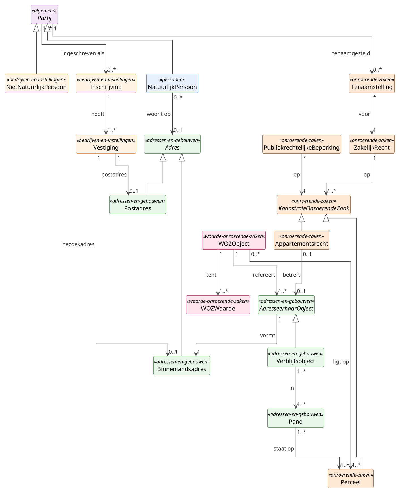

# Hoofdmodel

Het hoofdmodel is een **brug-diagram**: het toont uitsluitend objecttypen
die deelmodel-grenzen overschrijden. Attribuut-detail per klasse staat in
het bijbehorende deelmodel.

## Diagram

## Brug-klassen per deelmodel

| Deelmodel | Brug-klassen | Detail in |
|---|---|---|
| Personen | `NatuurlijkPersoon` | [Personen](deelmodellen/personen.md) |
| Bedrijven en instellingen | `NietNatuurlijkPersoon`, `Inschrijving`, `Vestiging` | [Bedrijven en instellingen](deelmodellen/bedrijven-en-instellingen.md) |
| Adressen en gebouwen | `Adres`, `Binnenlandsadres`, `Postadres`, `AdresseerbaarObject`, `Verblijfsobject`, `Pand` | [Adressen en gebouwen](deelmodellen/adressen-en-gebouwen.md) |
| Onroerende zaken | `KadastraleOnroerendeZaak`, `Perceel`, `Appartementsrecht`, `ZakelijkRecht`, `Tenaamstelling`, `PubliekrechtelijkeBeperking` | [Onroerende zaken](deelmodellen/onroerende-zaken.md) |
| Waarde onroerende zaken | `WOZObject`, `WOZWaarde` | [Waarde onroerende zaken](deelmodellen/waarde-onroerende-zaken.md) |

## Sleutelrelaties: toelichting

**`Partij` → `Inschrijving`** (`1..*` → `0..*`).
Een partij, natuurlijk persoon of niet-natuurlijke persoon, kan
ingeschreven zijn in het Handelsregister. Het patroon is symmetrisch
voor: een eenmanszaak (NP-eigenaar), een holding (NNP-NNP), een VOF
(meerdere NP-vennoten), of een eenvoudige BV (één NNP-inschrijving). De
relatie hangt aan `Partij` zodat al deze vormen op één manier
modelleerbaar zijn.

**`Partij` ↔ `Tenaamstelling` ↔ `ZakelijkRecht` ↔ `KadastraleOnroerendeZaak`**.
Eigendom en andere zakelijke rechten worden via een aparte
`Tenaamstelling` aan een partij gekoppeld. Daardoor zijn meervoudige
tenaamstelling (echtparen, mede-eigendom) en historie zonder
duplicate-rij-modellering uit te drukken.

**`Pand` ↔ `Perceel`** (`1..*` ↔ `1..*`).
Een BAG-pand kan over meerdere kadastrale percelen liggen, en een perceel
kan meerdere panden dragen. Geen 1-op-1-koppeling; bij projectie altijd
geometrische overlap.

**`WOZObject` → `AdresseerbaarObject(en)` en `Perceel(en)`**.
De fiscale eenheid van een WOZ-object is een samenstelling, niet
identiek aan één pand of één perceel. Een kantoor met parkeerplaats kan
twee adresseerbare objecten omvatten; een agrarisch bedrijf meerdere
percelen.

**`AdresseerbaarObject` → `Binnenlandsadres`** (`1` → `1`).
Elk adresseerbaar object (verblijfsobject, ligplaats, standplaats)
vormt precies één binnenlands adres. Postadres en buitenlandsadres
zijn zelfstandige adres-subtypen, niet aan een AdresseerbaarObject
gebonden.

**`Verblijfsobject` → `Pand`** (`1..*` ↔ `1..*`).
Een verblijfsobject ligt in één of meer panden (sluis-VBO over twee
panden komt voor), en een pand kan meerdere VBOs bevatten, of leeg
zijn zonder VBO. Ligplaats en Standplaats hebben géén pand-relatie;
daarom loopt de pand-koppeling via het `Verblijfsobject`-subtype,
niet via het abstracte `AdresseerbaarObject`.

**`Appartementsrecht` ↔ `AdresseerbaarObject`** (`0..1` ↔ `0..1`).
Een appartementsrecht correspondeert typisch met één fysieke ruimte:
meestal een verblijfsobject (appartement), soms een standplaats
(garagebox). Niet elk AO is gesplitst als appartementsrecht, en niet
elk appartementsrecht heeft een corresponderende BAG-AO (gedeelde
ruimtes bij een Vereniging van Eigenaren). HC-BRK v2.0 levert deze
koppeling expliciet.

**Adressen van een `NietNatuurlijkPersoon`**: direct via het
`zetel`-attribuut (statutaire vestigingsplaats, alleen plaatsnaam) en
indirect via z'n `Vestiging`-instanties:

- `Vestiging` → `Binnenlandsadres` (`1` → `0..1`, *bezoekadres*):
  fysieke NL-locatie afgeleid van de BAG-keten. De technische
  koppeling naar `AdresseerbaarObject` loopt via het
  `adresseerbaarObjectId`-attribuut op `Vestiging`.
- `Vestiging` → `Postadres` (`1` → `0..1`, *postadres*):
  correspondentieadres; vaak een postbus, soms identiek aan
  bezoekadres. Apart objecttype omdat HR/KVK postadres- en
  bezoekadres-historie los administreert.
- Voor `BuitenlandseEntiteit` zit het buitenlands hoofdadres als
  attribuut (`landVanOprichting`, `rechtsvormBuitenland`); geen
  Buitenlandsadres-relatie op hoofdmodel-niveau.

## Gedeelde bouwstenen

De typering van attribuutsoorten staat op één gedeelde pagina:
[Datatypes en codelijsten](datatypes-en-codelijsten.md). Daar zijn beschreven:

- **Simpele datatypes** (MIM-primitieven `CharacterString`, `Integer`,
  `Real`, `Boolean`, `Date`, `DateTime`, `Year`, `URI`) en hun
  Nederlandse aliassen `Tekst`, `Numeriek`, `Indicatie`, `Datum`,
  `DatumTijd`, `Jaar`, inclusief lengte- en precisie-varianten
  (`Tekst24`, `Numeriek9`, `Alfanumeriek10`).
- **Aanvullende datatypes** (`DatumIncompleet`, `NEN3610ID`, `UUID`,
  `Geometrie` met subtypes `Punt`, `Vlak`, `Lijn`, `Bedrag`, `Breuk`,
  `ObjectAanduiding`, `Codelijst~bron`).
- **Stelselbrede codelijsten** (CBS SBI, CBS Wijk- en Buurtcodering,
  ISO 3166, Kadaster Kadastrale Gemeenten, TOOI) met cross-walks
  (ISO 3166 ↔ BRP-LT 32 nationaliteit, ISO 3166 ↔ BRP-LT 34 landen) en
  onderhoudsritme.

Deelmodel-specifieke codelijsten (BRP-LT op het personen-spoor,
KVK-rechtsvormen, LT 33 Gemeenten, IND Verblijfstitel, WOZ Gebruikscode)
staan op de bijbehorende deelmodel-pagina.

## Patronen

### Codelijst-strategie

GBO hanteert een **hybride aanpak**: internationale norm leidend voor
**semantiek** waar die bestaat (ISO 3166, IND), BRP-Landelijke Tabel
leidend voor **uitwisseling** met de BRP-keten. Zie
[Datatypes en codelijsten](datatypes-en-codelijsten.md) voor het volledige overzicht
en de cross-walks.

### Identifier-strategie

Per objecttype is afgesproken welke identifier autoritatief is:

- BSN voor `NatuurlijkPersoon` (BRP-bron).
- RSIN voor `NietNatuurlijkPersoon` (HR-bron).
- KVK-nummer voor `Inschrijving`; vestigingsnummer voor `Vestiging`.
- NEN3610-ID voor BAG-objecten en BRK-objecten.
- WOZ-objectnummer + verantwoordelijke gemeente voor `WOZObject`
  (WOZ-objectnummer is alleen uniek binnen één gemeente).
- GBO-eigen UUID (`partijnummer`, `adresId`) waar geen externe
  identifier bestaat of meerdere bronnen samenkomen.

### Voorkomen-mixin (bitemporaliteit)

`Voorkomen` is **geen klasse** maar een **mixin van attributen** die elk
basisregistratie-objecttype kan dragen. De mixin levert bitemporele
expressiviteit conform HC-BAG en BRP-Historie (twee tijdlijnen:
materiële geldigheid en formele registratie).

| Mixin-attribuut | Type | Cardinaliteit | Tijdlijn |
|---|---|---|---|
| `beginGeldigheid` | Datum | 1 | Materieel: start |
| `eindGeldigheid` | Datum | 0..1 | Materieel: einde (open = lopend) |
| `tijdstipRegistratie` | DatumTijd | 1 | Formeel: start |
| `eindRegistratie` | DatumTijd | 0..1 | Formeel: einde (open = actueel) |
| `versie` | Numeriek | 1 | Monotone teller |

Daarnaast vier **datakwaliteits-flags** die los van Voorkomen kunnen
leven maar er vaak mee gepaard gaan:

| Flag | Type | Cardinaliteit | Toelichting |
|---|---|---|---|
| `geconstateerd` | Datum | 0..1 | Datum waarop officieel geconstateerd. |
| `inOnderzoek` | Indicatie | 1 | Markering dat de kwaliteit in onderzoek is. |
| `documentdatum` | Datum | 0..1 | Datum van het bron-document (akte). |
| `documentnummer` | Identificatie | 0..1 | Identificatie van het bron-document. |

## Diagram-conventie

Diagrammen op deze site tonen geen attribuut-blokken in class-boxes;
attributen, datatypes en codelijsten staan steeds in tekst onder het
diagram, per objecttype. Die scheiding houdt de plaat scanbaar en de
detailniveau-keuze expliciet. Rendering: PlantUML met ELK-layout.
