# Hoofdmodel

## Compacte Weergave en Uitwerking

Compacte projectie van het [hoofdmodel](hoofdmodel.md), bedoeld voor
presentaties en overzichts-slides. Subtypen, cardinaliteiten en
edge-labels zijn weggelaten; alleen de klassen die de DVTP-databehoefte
dragen blijven zichtbaar.

Per deelmodel staat de klasse waarmee de DVTP-pilot-rijen direct
mappen voorop: `StudieLening` (saldo, maandtermijn, aflostermijn)
voor DUO, `Arbeidsverhouding` plus `LoonBestanddeel` voor de
UWV-loonketen, `Aftrekpost` plus `AuthentiekInkomen` voor de
Belastingdienst, `KredietOvereenkomst` plus `AchterstandRegistratie`
voor BKR, en `Tenaamstelling` plus `ZakelijkRecht` voor Kadaster.

Voor de volledige versie met subtypen en cardinaliteiten, zie
[hoofdmodel](hoofdmodel.md). Voor de details per deelmodel, zie de
[deelmodellen](deelmodellen/).

### Diagram

```plantuml
@startuml
!pragma layout elk

skinparam dpi 110
skinparam classAttributeIconSize 0
skinparam shadowing false
skinparam roundCorner 6
skinparam ClassBackgroundColor #FAFAFA
skinparam ClassBorderColor #555555
skinparam ArrowColor #444444
skinparam ArrowFontColor #333333
skinparam ArrowFontSize 10
hide empty members
hide circle

skinparam class<<algemeen>> {
  BackgroundColor #f3e5f5
  BorderColor #6a1b9a
  HeaderBackgroundColor #f3e5f5
}
skinparam class<<personen>> {
  BackgroundColor #e8f0fe
  BorderColor #1967d2
  HeaderBackgroundColor #e8f0fe
}
skinparam class<<bedrijven-en-instellingen>> {
  BackgroundColor #fff4e5
  BorderColor #e67e22
  HeaderBackgroundColor #fff4e5
}
skinparam class<<adressen-en-gebouwen>> {
  BackgroundColor #e8f5e9
  BorderColor #2e7d32
  HeaderBackgroundColor #e8f5e9
}
skinparam class<<onroerende-zaken>> {
  BackgroundColor #fde8d6
  BorderColor #a04000
  HeaderBackgroundColor #fde8d6
}
skinparam class<<waarde-onroerende-zaken>> {
  BackgroundColor #fce4ec
  BorderColor #ad1457
  HeaderBackgroundColor #fce4ec
}
skinparam class<<belastingen>> {
  BackgroundColor #ede7f6
  BorderColor #4527a0
  HeaderBackgroundColor #ede7f6
}
skinparam class<<krediet>> {
  BackgroundColor #e1f0fa
  BorderColor #1e6091
  HeaderBackgroundColor #e1f0fa
}
skinparam class<<onderwijs>> {
  BackgroundColor #fff8e1
  BorderColor #b08800
  HeaderBackgroundColor #fff8e1
}
skinparam class<<werk-en-inkomen>> {
  BackgroundColor #ffe9c2
  BorderColor #b87a00
  HeaderBackgroundColor #ffe9c2
}

' ---- Supertype + persoons-kern (BRP / KVK) ----
abstract class Partij <<algemeen>>
class NatuurlijkPersoon <<personen>>
class Verbintenis <<personen>>
abstract class NietNatuurlijkPersoon <<bedrijven-en-instellingen>>
class Vestiging <<bedrijven-en-instellingen>>

' ---- Vastgoed: BAG ----
together {
  abstract class Adres <<adressen-en-gebouwen>>
  abstract class AdresseerbaarObject <<adressen-en-gebouwen>>
  class Pand <<adressen-en-gebouwen>>
}

' ---- Vastgoed: Kadaster (BRK) ----
together {
  abstract class KadastraleOnroerendeZaak <<onroerende-zaken>>
  class Tenaamstelling <<onroerende-zaken>>
  class ZakelijkRecht <<onroerende-zaken>>
}

' ---- Vastgoed: WOZ ----
class WOZWaarde <<waarde-onroerende-zaken>>

' ---- Fiscaal (Belastingdienst) ----
together {
  class AuthentiekInkomen <<belastingen>>
  class LoonBestanddeel <<belastingen>>
  abstract class Aftrekpost <<belastingen>>
}

' ---- Werk en inkomen (UWV / SVB) ----
together {
  class Arbeidsverhouding <<werk-en-inkomen>>
  abstract class Uitkering <<werk-en-inkomen>>
}

' ---- Krediet (BKR) ----
together {
  abstract class KredietOvereenkomst <<krediet>>
  class AchterstandRegistratie <<krediet>>
}

' ---- Onderwijs (DUO) ----
class StudieLening <<onderwijs>>

' ---- Generalisatie ----
Partij <|-- NatuurlijkPersoon
Partij <|-- NietNatuurlijkPersoon

' ---- Persoons-relaties ----
NatuurlijkPersoon --> Verbintenis
NietNatuurlijkPersoon --> Vestiging

' ---- Adressen + BAG ----
NatuurlijkPersoon --> Adres
Vestiging --> Adres
AdresseerbaarObject --> Adres
Pand --> KadastraleOnroerendeZaak

' ---- BRK + WOZ ----
ZakelijkRecht --> KadastraleOnroerendeZaak
Tenaamstelling --> ZakelijkRecht
Partij --> Tenaamstelling
WOZWaarde --> AdresseerbaarObject

' ---- Fiscaal (BD) ----
AuthentiekInkomen --> NatuurlijkPersoon
LoonBestanddeel --> Arbeidsverhouding
Aftrekpost --> NatuurlijkPersoon
Aftrekpost --> KadastraleOnroerendeZaak

' ---- Werk en inkomen (UWV) ----
Arbeidsverhouding --> NatuurlijkPersoon
Arbeidsverhouding --> NietNatuurlijkPersoon
Uitkering --> NatuurlijkPersoon

' ---- Krediet (BKR) ----
KredietOvereenkomst --> NatuurlijkPersoon
KredietOvereenkomst --> KadastraleOnroerendeZaak
AchterstandRegistratie --> KredietOvereenkomst

' ---- Onderwijs (DUO) ----
StudieLening --> NatuurlijkPersoon

@enduml
```

## Uitgebreide Weergave en Uitwerking

Het hoofdmodel is een **brug-diagram**: het toont uitsluitend
objecttypen die deelmodel-grenzen overschrijden, plus de
top-supertypen die binnen één deelmodel wonen maar als
aanknopingspunt voor cross-domein-relaties dienen. Subtypen,
attributen en codelijsten staan in het betreffende deelmodel.

`Partij` staat centraal: alle persoons- en organisatie-rollen erven
ervan, en de meeste brug-relaties hangen aan een variant van
`Partij`. De brug-klassen die als ingang voor de DVTP-databehoefte
dienen zijn opgenomen: `Verbintenis` (fiscale partner), `LoonBestanddeel`
(loonketen), `Aftrekpost` (Box 1-aftrekken), `AchterstandRegistratie`
(BKR-toets) en `StudieLening` (DUO-schuld).

### Diagram

```plantuml
@startuml
!pragma layout elk

top to bottom direction

skinparam dpi 120
skinparam classAttributeIconSize 0
skinparam shadowing false
skinparam roundCorner 6
skinparam nodesep 18
skinparam ranksep 28
skinparam ClassBackgroundColor #FAFAFA
skinparam ClassBorderColor #555555
skinparam ArrowColor #444444
skinparam ArrowFontColor #333333
skinparam ArrowFontSize 10
skinparam NoteBackgroundColor #FFFCD8
skinparam NoteBorderColor #B8B8B8
hide empty members
hide circle

skinparam class<<algemeen>> {
  BackgroundColor #f3e5f5
  BorderColor #6a1b9a
  HeaderBackgroundColor #f3e5f5
}
skinparam class<<personen>> {
  BackgroundColor #e8f0fe
  BorderColor #1967d2
  HeaderBackgroundColor #e8f0fe
}
skinparam class<<bedrijven-en-instellingen>> {
  BackgroundColor #fff4e5
  BorderColor #e67e22
  HeaderBackgroundColor #fff4e5
}
skinparam class<<adressen-en-gebouwen>> {
  BackgroundColor #e8f5e9
  BorderColor #2e7d32
  HeaderBackgroundColor #e8f5e9
}
skinparam class<<onroerende-zaken>> {
  BackgroundColor #fde8d6
  BorderColor #a04000
  HeaderBackgroundColor #fde8d6
}
skinparam class<<waarde-onroerende-zaken>> {
  BackgroundColor #fce4ec
  BorderColor #ad1457
  HeaderBackgroundColor #fce4ec
}
skinparam class<<belastingen>> {
  BackgroundColor #ede7f6
  BorderColor #4527a0
  HeaderBackgroundColor #ede7f6
}
skinparam class<<krediet>> {
  BackgroundColor #e1f0fa
  BorderColor #1e6091
  HeaderBackgroundColor #e1f0fa
}
skinparam class<<onderwijs>> {
  BackgroundColor #fff8e1
  BorderColor #b08800
  HeaderBackgroundColor #fff8e1
}
skinparam class<<werk-en-inkomen>> {
  BackgroundColor #ffe9c2
  BorderColor #b87a00
  HeaderBackgroundColor #ffe9c2
}

' ---- Supertype kern ----
abstract class Partij <<algemeen>>

' ---- Personen (BRP) ----
together {
  class NatuurlijkPersoon <<personen>>
  class Verbintenis <<personen>>
}

' ---- Bedrijven en instellingen (KVK) ----
together {
  abstract class NietNatuurlijkPersoon <<bedrijven-en-instellingen>>
  class Inschrijving <<bedrijven-en-instellingen>>
  class Vestiging <<bedrijven-en-instellingen>>
}

' ---- Adressen en gebouwen (BAG) ----
together {
  abstract class Adres <<adressen-en-gebouwen>>
  class Binnenlandsadres <<adressen-en-gebouwen>>
  class Postadres <<adressen-en-gebouwen>>
  abstract class AdresseerbaarObject <<adressen-en-gebouwen>>
  class Verblijfsobject <<adressen-en-gebouwen>>
  class Pand <<adressen-en-gebouwen>>
}

' ---- Onroerende zaken (Kadaster / BRK) ----
together {
  abstract class KadastraleOnroerendeZaak <<onroerende-zaken>>
  class Perceel <<onroerende-zaken>>
  class Appartementsrecht <<onroerende-zaken>>
  class ZakelijkRecht <<onroerende-zaken>>
  class Tenaamstelling <<onroerende-zaken>>
  class PubliekrechtelijkeBeperking <<onroerende-zaken>>
}

' ---- Waarde onroerende zaken (WOZ) ----
together {
  class WOZObject <<waarde-onroerende-zaken>>
  class WOZWaarde <<waarde-onroerende-zaken>>
}

' ---- Belastingen (Belastingdienst / BRI / loonketen) ----
together {
  abstract class BelastingjaarAangifte <<belastingen>>
  class AuthentiekInkomen <<belastingen>>
  class EigenWoning <<belastingen>>
  abstract class Aftrekpost <<belastingen>>
  abstract class Toeslag <<belastingen>>
  class Inkomstenverhouding <<belastingen>>
  class LoonAangifte <<belastingen>>
  class LoonBestanddeel <<belastingen>>
  class Renseignering <<belastingen>>
}

' ---- Werk en inkomen (UWV / SVB) ----
together {
  abstract class Uitkering <<werk-en-inkomen>>
  class Arbeidsverhouding <<werk-en-inkomen>>
}

' ---- Krediet (BKR) ----
together {
  abstract class KredietOvereenkomst <<krediet>>
  class HypothecairKredietEigenWoning <<krediet>>
  class AchterstandRegistratie <<krediet>>
}

' ---- Onderwijs (DUO) ----
together {
  class OnderwijsInstelling <<onderwijs>>
  class OpleidingDeelname <<onderwijs>>
  class StudieLening <<onderwijs>>
}

' ---- Generalisatie-relaties ----
Partij <|-- NatuurlijkPersoon
Partij <|-- NietNatuurlijkPersoon
NietNatuurlijkPersoon <|-- OnderwijsInstelling
Adres <|-- Binnenlandsadres
Adres <|-- Postadres
AdresseerbaarObject <|-- Verblijfsobject
KadastraleOnroerendeZaak <|-- Perceel
KadastraleOnroerendeZaak <|-- Appartementsrecht
KredietOvereenkomst <|-- HypothecairKredietEigenWoning

' ---- Verticale layout-hints (onzichtbaar) ----
NatuurlijkPersoon -[hidden]down- Verbintenis
NietNatuurlijkPersoon -[hidden]down- Inschrijving
Inschrijving -[hidden]down- Vestiging
Adres -[hidden]down- AdresseerbaarObject
AdresseerbaarObject -[hidden]down- Pand
KadastraleOnroerendeZaak -[hidden]down- ZakelijkRecht
ZakelijkRecht -[hidden]down- Tenaamstelling
WOZObject -[hidden]down- WOZWaarde
BelastingjaarAangifte -[hidden]down- AuthentiekInkomen
AuthentiekInkomen -[hidden]down- Aftrekpost
Aftrekpost -[hidden]down- Inkomstenverhouding
Inkomstenverhouding -[hidden]down- LoonBestanddeel
KredietOvereenkomst -[hidden]down- AchterstandRegistratie
Arbeidsverhouding -[hidden]down- Uitkering
OnderwijsInstelling -[hidden]down- OpleidingDeelname
OpleidingDeelname -[hidden]down- StudieLening

' ---- Personen-keten ----
NatuurlijkPersoon "2" --> "0..*" Verbintenis : partner in

' ---- Bedrijven en instellingen-keten ----
Partij "1..*" --> "0..*" Inschrijving : ingeschreven als
Inschrijving "1" --> "1..*" Vestiging : heeft

' ---- Adres- en BAG-koppelingen ----
NatuurlijkPersoon "0..*" --> "0..1" Adres : woont op
Vestiging "1" --> "0..1" Binnenlandsadres : bezoekadres
Vestiging "1" --> "0..1" Postadres : postadres
AdresseerbaarObject "1" --> "1" Binnenlandsadres : vormt
Verblijfsobject "1..*" --> "1..*" Pand : in
Pand "1..*" --> "1..*" Perceel : staat op

' ---- BRK-keten ----
ZakelijkRecht "1" --> "1..*" KadastraleOnroerendeZaak : op
Tenaamstelling "*" --> "1" ZakelijkRecht : voor
Partij "1" --> "0..*" Tenaamstelling : tenaamgesteld
PubliekrechtelijkeBeperking "*" --> "1" KadastraleOnroerendeZaak : op
Appartementsrecht "0..1" --> "0..1" AdresseerbaarObject : betreft

' ---- WOZ-keten ----
WOZObject "1" --> "1..*" WOZWaarde : kent
WOZObject "1" --> "1..*" AdresseerbaarObject : refereert
WOZObject "0..*" --> "1..*" Perceel : ligt op

' ---- Belastingen-bruggen ----
NatuurlijkPersoon "1" <-- "0..*" BelastingjaarAangifte : ingediendDoor
NatuurlijkPersoon "1" <-- "0..*" AuthentiekInkomen : gegrondvestOp
NatuurlijkPersoon "1" <-- "0..*" Aftrekpost : opgevoerdDoor
NatuurlijkPersoon "1" <-- "0..*" Toeslag : toegekendAan
KadastraleOnroerendeZaak "1" <-- "1" EigenWoning : gekoppeldAan
Aftrekpost "0..*" --> "0..1" EigenWoning : betreft
NatuurlijkPersoon "1" <-- "0..*" Inkomstenverhouding : tussenPersoon
NietNatuurlijkPersoon "1" <-- "0..*" Inkomstenverhouding : tussenWerkgever
Inkomstenverhouding "1" --> "0..*" LoonBestanddeel : bevat
NietNatuurlijkPersoon "1" <-- "0..*" LoonAangifte : ingediendDoor
NietNatuurlijkPersoon "1" <-- "0..*" Renseignering : aangeleverdDoor

' ---- Krediet-bruggen ----
NatuurlijkPersoon "1" <-- "0..*" KredietOvereenkomst : aangegaanDoor
NietNatuurlijkPersoon "1" <-- "0..*" KredietOvereenkomst : verstrektDoor
KadastraleOnroerendeZaak "1" <-- "0..*" HypothecairKredietEigenWoning : gevestigdOp
KredietOvereenkomst "1" <-- "0..*" AchterstandRegistratie : gemeldOp

' ---- Werk en Inkomen-bruggen ----
NatuurlijkPersoon "1" <-- "0..*" Uitkering : toegekendAan
NatuurlijkPersoon "1" <-- "0..*" Arbeidsverhouding : heeftWerknemer
NietNatuurlijkPersoon "1" <-- "0..*" Arbeidsverhouding : heeftWerkgever
Arbeidsverhouding "1" --> "0..*" Inkomstenverhouding : komtTotUitingIn

' ---- Onderwijs-bruggen ----
NatuurlijkPersoon "1" --> "0..*" OpleidingDeelname : deelnemer
OnderwijsInstelling "1" --> "0..*" OpleidingDeelname : bijInstelling
NatuurlijkPersoon "1" <-- "0..*" StudieLening : aangegaanDoor

@enduml
```

## Brug-klassen per deelmodel

| Deelmodel | Brug-klassen op hoofdmodel-niveau | Detail in |
|---|---|---|
| Personen | `NatuurlijkPersoon`, `Verbintenis` | [Personen](deelmodellen/personen.md) |
| Bedrijven en instellingen | `NietNatuurlijkPersoon`, `Inschrijving`, `Vestiging` | [Bedrijven en instellingen](deelmodellen/bedrijven-en-instellingen.md) |
| Adressen en gebouwen | `Adres`, `Binnenlandsadres`, `Postadres`, `AdresseerbaarObject`, `Verblijfsobject`, `Pand` | [Adressen en gebouwen](deelmodellen/adressen-en-gebouwen.md) |
| Onroerende zaken | `KadastraleOnroerendeZaak`, `Perceel`, `Appartementsrecht`, `ZakelijkRecht`, `Tenaamstelling`, `PubliekrechtelijkeBeperking` | [Onroerende zaken](deelmodellen/onroerende-zaken.md) |
| Waarde onroerende zaken | `WOZObject`, `WOZWaarde` | [Waarde onroerende zaken](deelmodellen/waarde-onroerende-zaken.md) |
| Belastingen | `BelastingjaarAangifte`, `AuthentiekInkomen`, `EigenWoning`, `Aftrekpost`, `Toeslag`, `Inkomstenverhouding`, `LoonAangifte`, `LoonBestanddeel`, `Renseignering` | [Belastingen](deelmodellen/belastingen.md) |
| Krediet | `KredietOvereenkomst`, `HypothecairKredietEigenWoning`, `AchterstandRegistratie` | [Krediet](deelmodellen/krediet.md) |
| Onderwijs | `OnderwijsInstelling`, `OpleidingDeelname`, `StudieLening` | [Onderwijs](deelmodellen/onderwijs.md) |
| Werk en Inkomen | `Uitkering`, `Arbeidsverhouding` | [Werk en Inkomen](deelmodellen/werk-en-inkomen.md) |

## Sleutelrelaties: toelichting

### Partij als kern

**`Partij` → `Inschrijving`** (`1..*` → `0..*`).
Een partij, natuurlijk persoon of niet-natuurlijke persoon, kan
ingeschreven zijn in het Handelsregister. Het patroon is symmetrisch
voor een eenmanszaak (NP-eigenaar), een holding (NNP-NNP), een VOF
(meerdere NP-vennoten) of een eenvoudige BV (één NNP-inschrijving).
De relatie hangt aan `Partij` zodat al deze vormen op één manier
modelleerbaar zijn.

**`Partij` ↔ `Tenaamstelling` ↔ `ZakelijkRecht` ↔ `KadastraleOnroerendeZaak`**.
Eigendom en andere zakelijke rechten worden via een aparte
`Tenaamstelling` aan een partij gekoppeld. Daardoor zijn meervoudige
tenaamstelling (echtparen, mede-eigendom) en historie zonder
duplicate-rij-modellering uit te drukken.

**`NatuurlijkPersoon` ↔ `Verbintenis`** (`2` ↔ `0..*`).
Huwelijk, geregistreerd partnerschap of samenlevingscontract verbinden
twee natuurlijke personen. `Verbintenis` is de aanknopingspoot voor
fiscaal partnerschap, vermogensregime en het afleiden van
gezinssamenstelling: dezelfde class draagt de DVTP-datapunten rond
burgerlijke staat (BRP rij 53), echtscheidingsdatum (rij 63) en
gezinssamenstelling (rij 66).

### Adres en BAG

**`AdresseerbaarObject` → `Binnenlandsadres`** (`1` → `1`).
Elk adresseerbaar object (verblijfsobject, ligplaats, standplaats)
vormt precies één binnenlands adres. Postadres en buitenlandsadres
zijn zelfstandige adres-subtypen, niet aan een AdresseerbaarObject
gebonden.

**`Verblijfsobject` → `Pand`** (`1..*` ↔ `1..*`).
Een verblijfsobject ligt in één of meer panden (sluis-VBO over twee
panden komt voor), en een pand kan meerdere VBOs bevatten, of leeg
zijn zonder VBO. Ligplaats en Standplaats hebben géén pand-relatie;
daarom loopt de pand-koppeling via het `Verblijfsobject`-subtype,
niet via het abstracte `AdresseerbaarObject`.

**`Pand` ↔ `Perceel`** (`1..*` ↔ `1..*`).
Een BAG-pand kan over meerdere kadastrale percelen liggen, en een
perceel kan meerdere panden dragen. Geen 1-op-1-koppeling; bij
projectie altijd geometrische overlap.

**Adressen van een `NietNatuurlijkPersoon`**: direct via het
`zetel`-attribuut (statutaire vestigingsplaats, alleen plaatsnaam) en
indirect via z'n `Vestiging`-instanties:

- `Vestiging` → `Binnenlandsadres` (`1` → `0..1`, *bezoekadres*):
  fysieke NL-locatie afgeleid van de BAG-keten.
- `Vestiging` → `Postadres` (`1` → `0..1`, *postadres*):
  correspondentieadres; vaak een postbus, soms identiek aan
  bezoekadres. Apart objecttype omdat HR/KVK postadres- en
  bezoekadres-historie los administreert.

### Onroerend goed en WOZ

**`Appartementsrecht` ↔ `AdresseerbaarObject`** (`0..1` ↔ `0..1`).
Een appartementsrecht correspondeert typisch met één fysieke ruimte:
meestal een verblijfsobject (appartement), soms een standplaats
(garagebox). Niet elk AO is gesplitst als appartementsrecht, en niet
elk appartementsrecht heeft een corresponderende BAG-AO (gedeelde
ruimtes bij een Vereniging van Eigenaren).

**`WOZObject` → `AdresseerbaarObject(en)` en `Perceel(en)`**.
De fiscale eenheid van een WOZ-object is een samenstelling, niet
identiek aan één pand of één perceel. Een kantoor met parkeerplaats
kan twee adresseerbare objecten omvatten; een agrarisch bedrijf
meerdere percelen.

### Belastingen, Krediet en Wonen

**`KadastraleOnroerendeZaak` ↔ `EigenWoning` ↔ `HypothecairKredietEigenWoning`**.
Het eigenwoning-regime in Box 1 van de inkomstenbelasting hangt aan
precies één kadastrale onroerende zaak. Een hypothecair krediet voor
de eigen woning is op diezelfde KOZ gevestigd. Hypotheekrenteaftrek
in een IH-aangifte refereert via `EigenWoning` indirect aan de KOZ.

**`Inkomstenverhouding`** (`NatuurlijkPersoon` ↔ `NietNatuurlijkPersoon`).
Spil van de loonaangifteketen: per combinatie van werknemer en
inhoudingsplichtige werkgever. De inhoudelijke
loon- en periode-data hangt aan de Inkomstenverhouding zelf. De
Belastingdienst is wettelijk eigenaar; UWV en SGR voeren operationeel
uit, maar inhoudelijk hoort het in [Belastingen](deelmodellen/belastingen.md).

**`AuthentiekInkomen`** is het enige authentieke gegeven binnen de
Basisregistratie Inkomen (BRI). De waarde komt uit een definitief
vastgestelde IH-aangifte of, bij ontbreken, uit de loonaangifteketen.
Afnemers van inkomensgegevens in inkomensafhankelijke regelingen zijn
verplicht het BRI-inkomen te gebruiken.

**`Inkomstenverhouding` → `LoonBestanddeel`** (`1` → `0..*`).
Bruto periodesalaris, vakantiegeld, dertiende maand, structurele
toeslagen, provisie, bonus, overwerk, bijtelling auto van de zaak en
inhoudingen pensioen/AO zijn elk een afzonderlijk `LoonBestanddeel`
binnen de inkomstenopgaven van een Inkomstenverhouding. Hier landen
de UWV-rijen 1 t/m 19 van de DVTP-Excel; categorisering verloopt via
de Loonheffingen-bijlagen (zie [Belastingen](deelmodellen/belastingen.md)).

**`Aftrekpost`** is de abstracte poot voor alle Box 1-aftrekken die een
belastingplichtige in de IH-aangifte kan opvoeren: hypotheekrente-
aftrek, lijfrentepremies, partneralimentatie, giften. Concreet
subtype `HypotheekrenteAftrek` koppelt via `EigenWoning` aan de
`KadastraleOnroerendeZaak`; daardoor sluit dezelfde modellering aan
op de BD-rijen 28, 31, 36 en op de eigenwoning-keten.

### Werk en Inkomen

**`Arbeidsverhouding` → `Inkomstenverhouding`** (`1` → `0..*`).
De materiële arbeidsverhouding tussen werknemer en werkgever wordt
operationeel zichtbaar via de Inkomstenverhouding-records in de
loonaangifteketen. Eén arbeidsverhouding kan meerdere
inkomstenverhoudingen tot uiting brengen (bijvoorbeeld bij wisseling
van loonadministratie of contract-restructuring).

**`Uitkering`** hangt aan een `NatuurlijkPersoon` als
toegekende. De concrete varianten WW, ZW, WIA (IVA, WGA), Wajong,
AOW staan in [Werk en Inkomen](deelmodellen/werk-en-inkomen.md); het
abstracte supertype `InkomensOndersteuning` vormt de cross-domein-
abstractie waaronder ook `Toeslag` valt.

### Krediet

**`KredietOvereenkomst` → `AchterstandRegistratie`** (`1` → `0..*`).
Een achterstand op een kredietovereenkomst leidt tot een melding aan
het Centraal Krediet Informatiesysteem. De BKR-toets in een hypotheek-
aanvraag (DVTP-rij 15 BKR) gebruikt deze meldingen plus de
bijzonderheidscoderingen. `HypothecairKredietEigenWoning` koppelt
diezelfde overeenkomst aan de `KadastraleOnroerendeZaak`, zodat de
hypotheek vanuit twee perspectieven herkenbaar is: financieel
(Krediet) en zakelijk-rechtelijk (BRK).

### Onderwijs

**`StudieLening` → `NatuurlijkPersoon`** (`0..*` → `1`).
De studieschuld bij DUO hangt direct aan de (oud-)student. Saldo,
maandtermijn, aflostermijn totaal en aflostermijn restant zijn de
DVTP-DUO-rijen 43 t/m 46 en worden conform de TRHK meegenomen in de
woonlastentoets. `StudieLening` is een eigenstandige class naast
`OpleidingDeelname`: de schuld kan doorlopen nadat de opleiding is
afgerond.

**`OpleidingDeelname`** koppelt `NatuurlijkPersoon` (de
leerling/student) aan `OnderwijsInstelling` en `Opleiding` (laatste
binnen het deelmodel). `OnderwijsInstelling` is een subtype van
`NietNatuurlijkPersoon` met aanvullende BRIN- en RIO-gegevens, zodat
de instelling als rechtspersoon volledig in
[Bedrijven en instellingen](deelmodellen/bedrijven-en-instellingen.md)
blijft passen. DVTP-rij 42 (opleidingsniveau) verwijst naar
`Opleiding` via een afgesloten `OpleidingDeelname`.

## Gedeelde bouwstenen

De typering van attribuutsoorten staat op één gedeelde pagina:
[Datatypes en codelijsten](datatypes-en-codelijsten.md). Daar zijn beschreven:

- **Simpele datatypes** (MIM-primitieven `CharacterString`, `Integer`,
  `Real`, `Boolean`, `Date`, `DateTime`, `Year`, `Duration`, `URI`)
  en hun Nederlandse aliassen `Tekst`, `Numeriek`, `Decimaal`,
  `Indicatie`, `Datum`, `DatumTijd`, `Jaar`, `Duur`, inclusief lengte-
  en precisie-varianten (`Tekst24`, `Numeriek9`, `Alfanumeriek10`).
- **Aanvullende datatypes** (`DatumIncompleet`, `NEN3610ID`, `UUID`,
  `Geometrie` met subtypes `Punt`, `Vlak`, `Lijn`, `Bedrag`, `Breuk`,
  `ObjectAanduiding`, `Codelijst~bron`).
- **Stelselbrede codelijsten** (BRP-LT 33 Gemeenten, CBS SBI, CBS
  Wijk- en Buurtcodering, ISO 3166, Kadaster Kadastrale Gemeenten,
  TOOI) met cross-walks (ISO 3166 ↔ BRP-LT 32 nationaliteit,
  ISO 3166 ↔ BRP-LT 34 landen, IND ↔ BRP-LT 56 verblijfstitel) en
  onderhoudsritme.

Deelmodel-specifieke codelijsten (BRP-LT op het personen-spoor,
KVK-rechtsvormen, WOZ Gebruikscode, SBR-NT enumeraties, CKI-codes,
Loonheffingen-bijlagen, BRIN/RIO-codes, BKWI-codes) staan op de
bijbehorende deelmodel-pagina.

## Patronen

### Codelijst-strategie

GBO hanteert een **hybride aanpak**: internationale norm leidend voor
**semantiek** waar die bestaat (ISO 3166, IND), BRP-Landelijke Tabel
leidend voor **uitwisseling** met de BRP-keten. Zie
[Datatypes en codelijsten](datatypes-en-codelijsten.md) voor het volledige overzicht
en de cross-walks.

### Identifier-strategie

Per objecttype is afgesproken welke identifier autoritatief is:

- BSN voor `NatuurlijkPersoon` (BRP-bron).
- RSIN voor `NietNatuurlijkPersoon` (HR-bron).
- KVK-nummer voor `Inschrijving`; vestigingsnummer voor `Vestiging`.
- NEN3610-ID voor BAG-objecten en BRK-objecten.
- WOZ-objectnummer + verantwoordelijke gemeente voor `WOZObject`
  (WOZ-objectnummer is alleen uniek binnen één gemeente).
- BRIN voor `OnderwijsInstelling`; OPLEIDINGSCODE (CROHO/CREBO) voor
  `Opleiding`.
- GBO-eigen UUID (`partijnummer`, `adresId`) waar geen externe
  identifier bestaat of meerdere bronnen samenkomen.

### Voorkomen-mixin (bitemporaliteit)

`Voorkomen` is **geen klasse** maar een **mixin van attributen** die elk
basisregistratie-objecttype kan dragen. De mixin levert bitemporele
expressiviteit conform HC-BAG en BRP-Historie (twee tijdlijnen:
materiële geldigheid en formele registratie).

| Mixin-attribuut | Type | Cardinaliteit | Tijdlijn |
|---|---|---|---|
| `beginGeldigheid` | Datum | 1 | Materieel: start |
| `eindGeldigheid` | Datum | 0..1 | Materieel: einde (open = lopend) |
| `tijdstipRegistratie` | DatumTijd | 1 | Formeel: start |
| `eindRegistratie` | DatumTijd | 0..1 | Formeel: einde (open = actueel) |
| `versie` | Numeriek | 1 | Monotone teller |

Daarnaast vier **datakwaliteits-flags** die los van Voorkomen kunnen
leven maar er vaak mee gepaard gaan:

| Flag | Type | Cardinaliteit | Toelichting |
|---|---|---|---|
| `geconstateerd` | Datum | 0..1 | Datum waarop officieel geconstateerd. |
| `inOnderzoek` | Indicatie | 1 | Markering dat de kwaliteit in onderzoek is. |
| `documentdatum` | Datum | 0..1 | Datum van het bron-document (akte). |
| `documentnummer` | Identificatie | 0..1 | Identificatie van het bron-document. |

## Diagram-conventie

Diagrammen op deze site tonen geen attribuut-blokken in class-boxes;
attributen, datatypes en codelijsten staan steeds in tekst onder het
diagram, per objecttype. Die scheiding houdt de plaat scanbaar en de
detailniveau-keuze expliciet. Rendering: PlantUML met ELK-layout.
