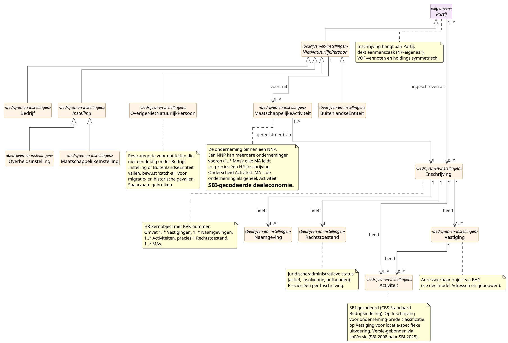

# Deelmodel: Bedrijven en instellingen

Niet-natuurlijke personen (NNP) zoals ingeschreven in het Handelsregister,
plus de HR-keten (inschrijving, vestiging, naamgeving, activiteit,
rechtstoestand) en `MaatschappelijkeActiviteit` als
ondernemings-eenheid binnen een NNP.

Natuurlijke personen vallen buiten dit deelmodel; zie
[Personen](personen.md). Het `Partij`-supertype woont in
[hoofdmodel](../hoofdmodel.md).

## Diagram

## Objecttypen

### Activiteit

**Definitie**: Een geregistreerde bedrijfsactiviteit die in het
Handelsregister wordt vastgelegd, gecodeerd volgens de CBS Standaard
Bedrijfsindeling (SBI), met onderscheid tussen hoofd- en
nevenactiviteit per inschrijving of per vestiging.

**Herkomst definitie**: Handelsregisterwet 2007 art. 12 (registratie
bedrijfsactiviteit); CBS Standaard Bedrijfsindeling (huidig SBI 2008,
opvolger SBI 2025) als classificatiestandaard; KVK Basisprofiel- en
Vestigingsprofiel-API als operationele invulling.

**Toelichting**: Activiteit is een zelfstandig gegeven omdat het bij
meerdere registraties kan horen (Inschrijving én Vestiging), een eigen
hoofd-neven-aanduiding heeft en versie-gebonden is via het
SBI-codestelsel. Activiteit hangt aan een `Inschrijving` voor de
onderneming als geheel (één of meer per Inschrijving) en optioneel aan
een `Vestiging` voor de uitvoering op een locatie (nul of meer per
Vestiging). Per drager geldt maximaal één activiteit met
`soortActiviteit = Hoofd` op enig moment. SBI-codes komen uit een
externe codelijst van het CBS.

| MIM-veld | Waarde |
|---|---|
| Naam | Activiteit |
| Begrip (URI) | `https://begrippen.gbo-semantiek.nl/id/begrip/Activiteit` |
| Herkomst | NHR; CBS Standaard Bedrijfsindeling |
| Datum opname | 2026-04-28 |
| Unieke aanduiding | samengesteld (`sbiCode` + `soortActiviteit` + drager-context) |
| Populatie | Alle SBI-gecodeerde bedrijfsactiviteiten geregistreerd op een NHR-Inschrijving of NHR-Vestiging. |

**Attribuutsoorten**:

| Naam | Type | Kard. | Authentiek | Mat. hist. | Form. hist. | Definitie | Herkomst | Toelichting |
|---|---|---|---|---|---|---|---|---|
| `sbiCode` | [`Codelijst~CBS_SBI`](../datatypes-en-codelijsten.md#stelselbrede-codelijsten) | 1 | Basisgegeven | Nee | Nee | SBI-codering volgens CBS Standaard Bedrijfsindeling. | NHR / CBS | Externe codelijst. |
| `sbiVersie` | [`Codelijst~CBS_SBI`](../datatypes-en-codelijsten.md#stelselbrede-codelijsten) | 1 | Basisgegeven | Nee | Nee | Versie van het SBI-codestelsel. | GBO | Verplicht: voorkomt verkeerde interpretatie bij SBI-revisies (SBI 2008 naar SBI 2025). |
| `omschrijving` | [Tekst](../datatypes-en-codelijsten.md#simpele-datatypes) | 0..1 | Basisgegeven | Nee | Nee | Tekstuele toelichting bij de activiteit. | NHR | KVK Basisprofiel. |
| `soortActiviteit` | [`SoortActiviteit`](#soortactiviteit) | 1 | Basisgegeven | Nee | Nee | Onderscheid tussen hoofd- en nevenactiviteit. | NHR | Zie enumeratie `SoortActiviteit`. |
| `isHoofdactiviteit` | [Indicatie](../datatypes-en-codelijsten.md#simpele-datatypes) | 0..1 | Basisgegeven | Nee | Nee | Booleaanse projectie van `soortActiviteit = Hoofd`. | NHR | KVK API-compatibiliteit. |

### Bedrijf

**Definitie**: Privaatrechtelijke commerciële entiteit die als
ondernemer in het Handelsregister staat ingeschreven. Omvat
rechtspersonen (BV, NV, coöperatie, OWM) en niet-rechtspersonen
(eenmanszaak, VOF, CV, maatschap).

**Herkomst definitie**: Handelsregisterwet 2007 art. 5 (inschrijving
van ondernemingen) en Burgerlijk Wetboek boek 2 voor de
privaatrechtelijke rechtspersonen. Rechtsvormen volgen de KVK Catalogus
Basisprofiel.

**Toelichting**: Bedrijf is één van de vier functionele vormen van
niet-natuurlijke persoon en groepeert commerciële entiteiten ongeacht
of ze eigen rechtspersoonlijkheid hebben. De eenmanszaak hoort hier
ook bij (rechtsvorm `Eenmanszaak`): het is administratief een
niet-natuurlijke persoon, terwijl het eigenaarschap formeel via een
natuurlijke persoon loopt die aan dezelfde inschrijving gekoppeld is.

| MIM-veld | Waarde |
|---|---|
| Naam | Bedrijf |
| Begrip (URI) | `https://begrippen.gbo-semantiek.nl/id/begrip/Bedrijf` |
| Herkomst | NHR |
| Datum opname | 2026-04-28 |
| Unieke aanduiding | `kvkNummer` (geërfd) |
| Populatie | Alle privaatrechtelijke commerciële entiteiten ingeschreven in het Handelsregister, met een rechtsvorm uit `Codelijst~KVK_Bedrijf`. |

**Attribuutsoorten**:

| Naam | Type | Kard. | Authentiek | Mat. hist. | Form. hist. | Definitie | Herkomst | Toelichting |
|---|---|---|---|---|---|---|---|---|
| `rechtsvorm` | [`Codelijst~KVK_Bedrijf`](#codelijsten) | 1 | Authentiek | Nee | Nee | Juridische vorm van het bedrijf. | NHR | Codelijst zie onder. |

Codelijst `KVK_Bedrijf` omvat onder meer: `BeslotenVennootschap (BV)`,
`NaamlozeVennootschap (NV)`, `Eenmanszaak`,
`EenmanszaakMetMeerdereEigenaren`, `VennootschapOnderFirma (VOF)`,
`CommanditaireVennootschap (CV)`, `Maatschap`, `Coöperatie`,
`OnderlingeWaarborgmaatschappij`, `RechtspersoonInOprichting`.

### BuitenlandseEntiteit

**Definitie**: Niet-natuurlijke persoon met hoofdvestiging buiten
Nederland en één of meer Nederlandse vestigingen of aanwijzingen die
inschrijving in het Handelsregister vereisen.

**Herkomst definitie**: Handelsregisterwet 2007 art. 5d (onderneming
van een buitenlandse rechtspersoon met hoofd- of nevenvestiging in
Nederland) en KVK Catalogus Basisprofiel voor het classificatie-deel.

**Toelichting**: BuitenlandseEntiteit groepeert NNP's waarvan de
juridische zetel in een ander land ligt. De buitenlandse rechtsvorm
wordt als vrije tekst vastgelegd omdat er geen Nederlandse codelijst
voor buitenlandse rechtsvormen bestaat; het Nederlandse type
(filiaal, hoofdkantoor, permanente vestiging) wordt wel gecodeerd voor
afnemers die op dat onderscheid filteren.

| MIM-veld | Waarde |
|---|---|
| Naam | BuitenlandseEntiteit |
| Begrip (URI) | `https://begrippen.gbo-semantiek.nl/id/begrip/BuitenlandseEntiteit` |
| Herkomst | NHR |
| Datum opname | 2026-04-28 |
| Unieke aanduiding | `kvkNummer` (geërfd; buitenlandse entiteit zonder NL-inschrijving uitgezonderd) |
| Populatie | Alle in Nederland actieve entiteiten met hoofdvestiging buiten Nederland en NHR-inschrijving op grond van een Nederlandse vestiging of aanwijzing. |

**Attribuutsoorten**:

| Naam | Type | Kard. | Authentiek | Mat. hist. | Form. hist. | Definitie | Herkomst | Toelichting |
|---|---|---|---|---|---|---|---|---|
| `landVanOprichting` | [`Codelijst~ISO3166`](../datatypes-en-codelijsten.md#stelselbrede-codelijsten) | 1 | Basisgegeven | Nee | Nee | Land waarin de entiteit is opgericht. | NHR | ISO 3166-codering. |
| `rechtsvormBuitenland` | [Tekst](../datatypes-en-codelijsten.md#simpele-datatypes) | 0..1 | Basisgegeven | Nee | Nee | Buitenlandse juridische vorm, vrije tekst. | NHR | Geen Nederlandse codelijst beschikbaar. |
| `typeBuitenlandseEntiteit` | [`TypeBuitenlandseEntiteit`](#typebuitenlandseentiteit) | 1 | Basisgegeven | Nee | Nee | Typering van de Nederlandse aanwezigheid. | GBO | Zie enumeratie `TypeBuitenlandseEntiteit`. |

### Inschrijving

**Definitie**: Een geregistreerde economische of juridische eenheid
in het Handelsregister, identificeerbaar via het KVK-nummer, waaraan
vestigingen, naamgevingen, activiteiten en rechtstoestand zijn
gekoppeld.

**Herkomst definitie**: Handelsregisterwet 2007 art. 5, 6 en 13
(inschrijvingsplicht voor ondernemingen, rechtspersonen en
activiteiten van rechtspersonen zonder onderneming) en KVK
API-specificaties (Basisprofiel, Zoeken, Naamgeving) als operationele
invulling.

**Toelichting**: Inschrijving is het kernobject van het
Handelsregister: het KVK-nummer en de oprichtingsakte-gegevens hangen
hier. Inschrijving is gekoppeld aan `Partij`, niet aan
`NietNatuurlijkPersoon`. Cardinaliteit `Partij 1..* naar Inschrijving
0..*` dekt symmetrisch: een eenmanszaak met een natuurlijke persoon
als eigenaar, een eenmanszaak met meerdere eigenaren, VOF-vennoten
die ieder als partij aan dezelfde inschrijving hangen, en
holding-structuren waarbij twee niet-natuurlijke personen ieder
inschrijvingen hebben. Verleden waarden worden over de tijd bewaard:
aktedatum en aktenummer geven aan vanaf wanneer een waarde
geregistreerd staat, zodat wijzigingen over beide tijdlijnen terug te
zoeken zijn.

| MIM-veld | Waarde |
|---|---|
| Naam | Inschrijving |
| Begrip (URI) | `https://begrippen.gbo-semantiek.nl/id/begrip/Inschrijving` |
| Herkomst | NHR; HRW 2007 |
| Datum opname | 2026-04-28 |
| Unieke aanduiding | `kvkNummer` |
| Populatie | Alle inschrijvingen in het Nederlandse Handelsregister, één per inschrijfplichtige economische of juridische eenheid. |

**Attribuutsoorten**:

| Naam | Type | Kard. | Authentiek | Mat. hist. | Form. hist. | Definitie | Herkomst | Toelichting |
|---|---|---|---|---|---|---|---|---|
| (../datatypes-en-codelijsten.md#aanvullende-datatypes) | 1 | Authentiek | Ja | Ja | Primaire identifier van de inschrijving. | NHR | 8 cijfers. |
| `startdatum` | [DatumIncompleet](../datatypes-en-codelijsten.md#aanvullende-datatypes) | 0..1 | Basisgegeven | Ja | Ja | Startdatum van de inschrijving. | NHR | KVK-API. |
| `einddatum` | [DatumIncompleet](../datatypes-en-codelijsten.md#aanvullende-datatypes) | 0..1 | Basisgegeven | Ja | Ja | Einddatum van de inschrijving. | NHR | |
| `datumEersteInschrijving` | [Datum](../datatypes-en-codelijsten.md#simpele-datatypes) | 0..1 | Basisgegeven | Ja | Ja | Datum waarop de inschrijving voor het eerst bij KVK is geregistreerd. | NHR | Immutable. |
| `documentdatum` | [Datum](../datatypes-en-codelijsten.md#simpele-datatypes) | 0..1 | Authentiek | Ja | Ja | Datum van de oprichtingsakte of meest recente wijzigingsakte. | NHR | |
| `documentnummer` | [Identificatie](../datatypes-en-codelijsten.md#simpele-datatypes) | 0..1 | Authentiek | Ja | Ja | Akte-nummer van de oprichtings- of wijzigingsakte. | NHR | |

**Relatiesoorten** (uitgaand):

| Naam | Doel | Kard. (bron→doel) | Authentiek | Mat. hist. | Form. hist. | Toelichting |
|---|---|---|---|---|---|---|
| heeftVestiging | Vestiging | 1 → 1..* | Basisgegeven | Ja | Ja | Eén Inschrijving heeft één of meer Vestigingen, waaronder precies één hoofdvestiging op enig moment. |
| heeftNaamgeving | Naamgeving | 1 → 1..* | Basisgegeven | Ja | Ja | Naamlagen (statutair, handelsnaam, alternatief) per Inschrijving. |
| heeftActiviteit | Activiteit | 1 → 1..* | Basisgegeven | Ja | Ja | SBI-gecodeerde activiteiten op onderneming-brede classificatie. |
| heeftRechtstoestand | Rechtstoestand | 1 → 1 | Basisgegeven | Ja | Ja | Precies één actuele rechtstoestand per Inschrijving. |

### Instelling

**Definitie**: Niet-commerciële niet-natuurlijke persoon, hetzij
publiekrechtelijk (overheidsorgaan) hetzij privaatrechtelijk maar
zonder winstoogmerk (zoals stichting, vereniging, kerkgenootschap).

**Herkomst definitie**: Burgerlijk Wetboek boek 2 voor de
privaatrechtelijke rechtspersonen zonder winstoogmerk en
publiekrechtelijke rechtspersoon-vormgeving uit de Algemene wet
bestuursrecht en organieke wetgeving (Gemeentewet, Provinciewet,
Waterschapswet, Kaderwet ZBO).

**Toelichting**: Instelling is het abstracte supertype boven twee
concrete vormen: `Overheidsinstelling` (Rijk, Provincie, Gemeente,
Waterschap, ZBO, RWT) en `MaatschappelijkeInstelling` (privaatrechtelijke
non-profit). De rechtsvorm staat op het abstracte supertype omdat een
stichting zowel een overheidsrol (ZBO of RWT) als een
maatschappelijke rol kan vervullen; de sectorale typering komt op het
concrete subtype.

| MIM-veld | Waarde |
|---|---|
| Naam | Instelling |
| Begrip (URI) | `https://begrippen.gbo-semantiek.nl/id/begrip/Instelling` |
| Herkomst | NHR; BW2 |
| Datum opname | 2026-04-28 |
| Indicatie abstract object | Ja |
| Unieke aanduiding | `kvkNummer` (geërfd) |
| Populatie | Alle niet-commerciële niet-natuurlijke personen, ingeschreven in het Handelsregister of herkenbaar via een ander officieel register (TOOI, RIO). |

**Attribuutsoorten**:

| Naam | Type | Kard. | Authentiek | Mat. hist. | Form. hist. | Definitie | Herkomst | Toelichting |
|---|---|---|---|---|---|---|---|---|
| `rechtsvorm` | [`Codelijst~KVK_Instelling`](#codelijsten) | 1 | Authentiek | Nee | Nee | Juridische vorm van de instelling. | NHR | Codelijst zie onder. |

Codelijst `KVK_Instelling`: `PubliekrechtelijkeRechtspersoon (PBR)`,
`Stichting`, `Vereniging`, `VerenigingMetVolledigeRechtsbevoegdheid`,
`VerenigingZonderVolledigeRechtsbevoegdheid`, `Kerkgenootschap`.

### MaatschappelijkeActiviteit

**Definitie**: Een onderneming binnen een niet-natuurlijke persoon,
het samenhangend geheel van bedrijfsactiviteiten dat onder één
economische identiteit wordt gevoerd en dat tot precies één
inschrijving in het Handelsregister leidt.

**Herkomst definitie**: Conceptueel verwant met het wettelijk
onderneming-begrip uit Handelsregisterwet 2007 art. 5; aanvulling uit
KVK Basisprofiel-API (onderneming-attributen onder een inschrijving).

**Toelichting**: MaatschappelijkeActiviteit is de ondernemings-eenheid
binnen een niet-natuurlijke persoon. Eén niet-natuurlijke persoon
voert één of meer ondernemingen (1..* MAs) en elke MA leidt tot
precies één HR-Inschrijving; één Inschrijving kan dus meerdere MAs
dragen wanneer een NNP via dezelfde KVK-registratie meerdere
onderscheiden ondernemingen heeft. Continuïteit bij rechtsvormwijziging
(eenmanszaak naar BV, fusie, splitsing) loopt via Partij en
Inschrijving, niet via MA: Partij houdt de natuurlijke identiteit
over rechtsvormen heen. Onderscheid met `Activiteit`: MA is de
onderneming als geheel ("viskraam-onderneming"), Activiteit is een
SBI-gecodeerde deelactiviteit ("46.38.1 Detailhandel in vis"). Eén
MA kan via meerdere SBI-Activiteiten worden uitgewerkt.

| MIM-veld | Waarde |
|---|---|
| Naam | MaatschappelijkeActiviteit |
| Alias | MA (GBO-afkorting); Onderneming (HR/KVK-context) |
| Begrip (URI) | `https://begrippen.gbo-semantiek.nl/id/begrip/MaatschappelijkeActiviteit` |
| Herkomst | GBO; raakvlak NHR-onderneming (HRW art. 5) |
| Datum opname | 2026-04-28 |
| Unieke aanduiding | `identificatie` |
| Populatie | Alle ondernemingen die in Nederland door niet-natuurlijke personen worden gevoerd en die tot een NHR-inschrijving leiden. |

**Attribuutsoorten**:

| Naam | Type | Kard. | Authentiek | Mat. hist. | Form. hist. | Definitie | Herkomst | Toelichting |
|---|---|---|---|---|---|---|---|---|
| **`identificatie`** | [UUID](../datatypes-en-codelijsten.md#aanvullende-datatypes) | 1 | Overig | Nee | Nee | GBO-eigen sleutel voor de ondernemings-eenheid. | GBO | Geen externe identifier in NHR voor ondernemings-eenheid binnen NNP. |
| `startdatum` | [Datum](../datatypes-en-codelijsten.md#simpele-datatypes) | 0..1 | Basisgegeven | Nee | Nee | Aanvangsdatum van de onderneming. | NHR | |
| `einddatum` | [Datum](../datatypes-en-codelijsten.md#simpele-datatypes) | 0..1 | Basisgegeven | Nee | Nee | Beëindigingsdatum van de onderneming. | NHR | Open zolang MA actief. |
| `hoofdSbiCode` | [`Codelijst~CBS_SBI`](../datatypes-en-codelijsten.md#stelselbrede-codelijsten) | 0..1 | Basisgegeven | Nee | Nee | SBI van de hoofdactiviteit van deze onderneming. | NHR | Canoniek op MA; `hoofdSbiCode` op NNP is afgeleid. |
| `omschrijving` | [Tekst](../datatypes-en-codelijsten.md#simpele-datatypes) | 0..1 | Basisgegeven | Nee | Nee | Korte beschrijving van de ondernemings-activiteit. | NHR | |

**Relatiesoorten** (uitgaand):

| Naam | Doel | Kard. (bron→doel) | Authentiek | Mat. hist. | Form. hist. | Toelichting |
|---|---|---|---|---|---|---|
| geregistreerdVia | Inschrijving | 1..* → 1 | Basisgegeven | Nee | Nee | Elke MA leidt tot precies één HR-Inschrijving. |

### MaatschappelijkeInstelling

**Definitie**: Privaatrechtelijke niet-natuurlijke persoon zonder
winstoogmerk, werkzaam in een maatschappelijke sector zoals
onderwijs, zorg, religie, sport en cultuur, welzijn of belangenbehartiging.

**Herkomst definitie**: Burgerlijk Wetboek boek 2 (rechtspersonen
zonder winstoogmerk: stichting, vereniging, kerkgenootschap); ANBI-
status volgt uit de Algemene wet inzake rijksbelastingen art. 5b.

**Toelichting**: MaatschappelijkeInstelling is een concreet subtype
van `Instelling` voor de privaatrechtelijke non-profit-entiteiten.
Sectoraal onderscheid (onderwijs, zorg, religie, sport-cultuur,
welzijn, branche-belangen, overig) wordt gevangen in een
typering-attribuut; de ANBI-status van de Belastingdienst staat als
indicatie omdat dat fiscaal relevant is voor giften en vrijstellingen.

| MIM-veld | Waarde |
|---|---|
| Naam | MaatschappelijkeInstelling |
| Begrip (URI) | `https://begrippen.gbo-semantiek.nl/id/begrip/MaatschappelijkeInstelling` |
| Herkomst | NHR; BW2; Belastingdienst (ANBI) |
| Datum opname | 2026-04-28 |
| Unieke aanduiding | `kvkNummer` (geërfd) |
| Populatie | Alle privaatrechtelijke non-profit-entiteiten ingeschreven in het Handelsregister met een rechtsvorm uit `Codelijst~KVK_Instelling`. |

**Attribuutsoorten**:

| Naam | Type | Kard. | Authentiek | Mat. hist. | Form. hist. | Definitie | Herkomst | Toelichting |
|---|---|---|---|---|---|---|---|---|
| `typeMaatschappelijk` | [`TypeMaatschappelijk`](#typemaatschappelijk) | 1 | Basisgegeven | Nee | Nee | Sectorale typering van de maatschappelijke instelling. | GBO | Zie enumeratie `TypeMaatschappelijk`. |
| `anbiStatus` | [Indicatie](../datatypes-en-codelijsten.md#simpele-datatypes) | 1 | Basisgegeven | Nee | Nee | ANBI-erkenning door de Belastingdienst. | Belastingdienst | Fiscaal-relevant voor giften en vrijstellingen. |

### Naamgeving

**Definitie**: De meerlagige naamstructuur van een inschrijving in
het Handelsregister, omvattend de statutaire naam, één of meer
handelsnamen en eventueel alternatieve benamingen, elk met een eigen
geldigheidstermijn.

**Herkomst definitie**: Handelsregisterwet 2007 art. 9-11
(naamregistratie); KVK Naamgeving-API als operationele invulling van
het meerlagige naamconcept.

**Toelichting**: Naamgeving is een gegevensgroep op
`Inschrijving`-niveau die meerdere naam-componenten bundelt:
statutaire naam (bij geregistreerde statuten), handelsnaam (onder
welke naam de onderneming naar buiten treedt), en alternatieve
benamingen zoals `ookGenoemd` voor verenigingen en stichtingen.
Geldigheidsperiodes per naamrepresentatie maken historische
naamvoering traceerbaar. Vestigings-handelsnamen worden in dit model
niet op `Vestiging` zelf vastgelegd, maar afgedekt via
Activiteit-context op Vestiging waar dat nodig is.

| MIM-veld | Waarde |
|---|---|
| Naam | Naamgeving |
| Begrip (URI) | `https://begrippen.gbo-semantiek.nl/id/begrip/Naamgeving` |
| Herkomst | NHR |
| Datum opname | 2026-04-28 |
| Unieke aanduiding | samengesteld (`naam` + `startdatum` per Inschrijving) |
| Populatie | Alle geldige en historische naamvoeringen per NHR-Inschrijving. |

**Attribuutsoorten**:

| Naam | Type | Kard. | Authentiek | Mat. hist. | Form. hist. | Definitie | Herkomst | Toelichting |
|---|---|---|---|---|---|---|---|---|
| `statutaireNaam` | [Tekst](../datatypes-en-codelijsten.md#simpele-datatypes) | 0..1 | Authentiek | Ja | Ja | Naam zoals vastgelegd in de geregistreerde statuten. | NHR | Bij rechtspersonen met statuten. |
| `naam` | [Tekst](../datatypes-en-codelijsten.md#simpele-datatypes) | 1 | Basisgegeven | Ja | Ja | Werknaam onder maatschappelijke activiteit. | NHR | Bij rechtspersoon of samenwerkingsverband. |
| `ookGenoemd` | [Tekst](../datatypes-en-codelijsten.md#simpele-datatypes) | 0..1 | Basisgegeven | Ja | Ja | Alternatieve benaming. | NHR | Bij vereniging, stichting. |
| `handelsnamen` | [Tekst](../datatypes-en-codelijsten.md#simpele-datatypes) | 0..* | Basisgegeven | Ja | Ja | Eén of meer handelsnamen waaronder de onderneming naar buiten treedt. | NHR | KVK Naamgeving-API. |
| `startdatum` | [Datum](../datatypes-en-codelijsten.md#simpele-datatypes) | 1 | Basisgegeven | Ja | Ja | Datum vanaf wanneer deze naamrepresentatie geldt. | NHR | |
| `einddatum` | [Datum](../datatypes-en-codelijsten.md#simpele-datatypes) | 0..1 | Basisgegeven | Ja | Ja | Datum tot wanneer deze naamrepresentatie geldt. | NHR | |

### NietNatuurlijkPersoon

**Definitie**: Een organisatie of rechtsfiguur, geen mens, die als
rechtsdragend subject kan deelnemen aan rechtsbetrekkingen. Omvat
rechtspersonen (BV, NV, stichting, vereniging, coöperatie,
publiekrechtelijke rechtspersoon, kerkgenootschap), entiteiten zonder
eigen rechtspersoonlijkheid (eenmanszaak, VOF, CV, maatschap) en
buitenlandse entiteiten met activiteit in Nederland.

**Herkomst definitie**: Burgerlijk Wetboek boek 2 (rechtspersonen);
Handelsregisterwet 2007 art. 5, 6 en 13 (inschrijfbare entiteiten);
semantische verbreding zodat ook entiteiten zonder rechtspersoonlijkheid
en buiten-KVK-overheidsorganen onder dit type vallen.

**Toelichting**: NietNatuurlijkPersoon is overkoepelend; een concreet
geval is altijd één van vier functionele vormen: `Bedrijf` (commercieel),
`Instelling` (publiek of non-profit), `BuitenlandseEntiteit`, of
`OverigeNietNatuurlijkPersoon`. De keuze voor *niet-natuurlijke persoon*
boven *rechtspersoon* is principieel: rechtspersoonlijkheid is geen
vereiste om als wederpartij op te treden. Een VOF heeft geen
rechtspersoonlijkheid maar wél RSIN, KVK-nummer en vestigingen; een
eenmanszaak idem. De eenmanszaak wordt daarom als niet-natuurlijke
persoon gemodelleerd (rechtsvorm `Eenmanszaak`), niet als natuurlijke
persoon met onderneming, zodat KVK-administratie en contractpartij-
registratie consistent zijn met de NHR-praktijk.

| MIM-veld | Waarde |
|---|---|
| Naam | NietNatuurlijkPersoon |
| Begrip (URI) | `https://begrippen.gbo-semantiek.nl/id/begrip/NietNatuurlijkPersoon` |
| Herkomst | NHR (basis); semantische verbreding buiten-KVK-scope |
| Datum opname | 2026-04-28 |
| Indicatie abstract object | Ja |
| Unieke aanduiding | `kvkNummer` |
| Populatie | Alle niet-natuurlijke rechtsdragende subjecten relevant voor een overheidsorganisatie, KVK-ingeschreven én entiteiten buiten KVK-scope (overheidsorganen via TOOI/OIN, buitenlandse entiteiten zonder NL-vestiging). |

**Attribuutsoorten**:

| Naam | Type | Kard. | Authentiek | Mat. hist. | Form. hist. | Definitie | Herkomst | Toelichting |
|---|---|---|---|---|---|---|---|---|
| `rsin` | [Numeriek9](../datatypes-en-codelijsten.md#simpele-datatypes) | 0..1 | Authentiek | Nee | Nee | Rechtspersonen- en Samenwerkingsverbanden Identificatie Nummer. | NHR | Fiscaal identificatienummer voor rechtspersonen en samenwerkingsverbanden. |
| `naam` | [Tekst](../datatypes-en-codelijsten.md#simpele-datatypes) | 1 | Basisgegeven | Nee | Nee | Werknaam. | NHR | Statutaire naam staat op `Naamgeving`. |
| `zetel` | [Tekst](../datatypes-en-codelijsten.md#simpele-datatypes) | 0..1 | Basisgegeven | Nee | Nee | Statutaire vestigingsplaats. | NHR / BRK | Geleverd via `KadasterNietNatuurlijkPersoon.zetel`. |
| `hoofdSbiCode` | [`Codelijst~CBS_SBI`](../datatypes-en-codelijsten.md#stelselbrede-codelijsten) | 0..1 | Basisgegeven | Nee | Nee | Afgeleide SBI-hoofdactiviteit. | NHR (afgeleid) | Summary, canoniek op MA. |
| `sector` | [`Sector`](#sector) | 1 | Overig | Nee | Nee | Functionele sector-classificatie. | GBO (afgeleid) | Zie enumeratie `Sector`. |
| `herkomst` | [`Herkomst`](#herkomst) | 1 | Overig | Nee | Nee | Binnen- of buitenlandse herkomst. | GBO (afgeleid) | Zie enumeratie `Herkomst`. |
| `aansprakelijkheid` | [`Aansprakelijkheid`](#aansprakelijkheid) | 1 | Overig | Nee | Nee | Aansprakelijkheidskarakter van de rechtsvorm. | GBO (afgeleid) | Zie enumeratie `Aansprakelijkheid`. |

**Relatiesoorten** (uitgaand):

| Naam | Doel | Kard. (bron→doel) | Authentiek | Mat. hist. | Form. hist. | Toelichting |
|---|---|---|---|---|---|---|
| voertUit | MaatschappelijkeActiviteit | 1 → 1..* | Basisgegeven | Nee | Nee | Eén NNP voert één of meer ondernemingen. |

### Overheidsinstelling

**Definitie**: Publiekrechtelijke niet-natuurlijke persoon belast met
een publieke taak, zoals Rijksoverheid, ministerie, provincie,
gemeente, waterschap, zelfstandig bestuursorgaan (ZBO) of
rechtspersoon met een wettelijke taak (RWT).

**Herkomst definitie**: Algemene wet bestuursrecht (definitie
bestuursorgaan); organieke wetten (Gemeentewet, Provinciewet,
Waterschapswet); Kaderwet zelfstandige bestuursorganen; TOOI-register
(Thesaurus voor Overheids Informatie- en Organisatie-objecten) als
operationele identificatiebron.

**Toelichting**: Overheidsinstelling is een concreet subtype van
`Instelling` voor publieke organen. De bestuurlijke typering staat in
`typeOverheid`; daarnaast is een optionele koppeling naar het
TOOI-register beschikbaar via `bevoegdGezagCode`, voor URI-traceability
naar het KOOP-register van overheidsorganisaties. Niet elke
overheidsinstelling staat in TOOI; de koppeling is daarom optioneel.

| MIM-veld | Waarde |
|---|---|
| Naam | Overheidsinstelling |
| Begrip (URI) | `https://begrippen.gbo-semantiek.nl/id/begrip/Overheidsinstelling` |
| Herkomst | NHR; TOOI (KOOP) |
| Datum opname | 2026-04-28 |
| Unieke aanduiding | `kvkNummer` (geërfd) |
| Populatie | Alle Nederlandse bestuursorganen en publieke instellingen, NHR-ingeschreven of herkenbaar via TOOI. |

**Attribuutsoorten**:

| Naam | Type | Kard. | Authentiek | Mat. hist. | Form. hist. | Definitie | Herkomst | Toelichting |
|---|---|---|---|---|---|---|---|---|
| `typeOverheid` | [`TypeOverheid`](#typeoverheid) | 1 | Basisgegeven | Nee | Nee | Bestuurlijke typering van de overheidsinstelling. | GBO | Zie enumeratie `TypeOverheid`. |
| `bevoegdGezagCode` | [`Codelijst~TOOI`](../datatypes-en-codelijsten.md#stelselbrede-codelijsten) | 0..1 | Landelijk kerngegeven | Nee | Nee | URI-koppeling naar het TOOI-register. | TOOI / KOOP | Optioneel; niet elke overheidsinstelling staat in TOOI. |

### OverigeNietNatuurlijkPersoon

**Definitie**: Restcategorie voor niet-natuurlijke personen die niet
eenduidig onder bedrijf, instelling of buitenlandse entiteit vallen,
bedoeld voor migratie- en historische gevallen.

**Herkomst definitie**: GBO-eigen restcategorie, geen wettelijke
definitie. Bewust catch-all met afbakening dat het gebruik spaarzaam
moet zijn.

**Toelichting**: OverigeNietNatuurlijkPersoon vangt entiteiten op die
in de huidige modellering niet eenduidig in een van de drie
hoofdcategorieën passen. Bedoeld voor migratie van legacy-bestanden,
historische gevallen of nog niet geclassificeerde entiteiten. Het
toelichtings-veld `omschrijving` is verplicht om reden van plaatsing
in deze categorie expliciet te maken; nieuwe gevallen moeten zoveel
mogelijk in een van de hoofdcategorieën landen.

| MIM-veld | Waarde |
|---|---|
| Naam | OverigeNietNatuurlijkPersoon |
| Begrip (URI) | `https://begrippen.gbo-semantiek.nl/id/begrip/OverigeNietNatuurlijkPersoon` |
| Herkomst | GBO |
| Datum opname | 2026-04-28 |
| Unieke aanduiding | `kvkNummer` (geërfd) |
| Populatie | Niet-natuurlijke personen die niet eenduidig in een van de drie hoofdcategorieën vallen; bewust beperkt gebruik. |

**Attribuutsoorten**:

| Naam | Type | Kard. | Authentiek | Mat. hist. | Form. hist. | Definitie | Herkomst | Toelichting |
|---|---|---|---|---|---|---|---|---|
| `omschrijving` | [Tekst](../datatypes-en-codelijsten.md#simpele-datatypes) | 1 | Overig | Nee | Nee | Reden van plaatsing in deze restcategorie. | GBO | Verplicht. |

### Rechtstoestand

**Definitie**: De juridische en administratieve status van een
inschrijving in het Handelsregister, beschrijvend of de inschrijving
actief is, of er insolventie-omstandigheden zijn en of de entiteit is
ontbonden.

**Herkomst definitie**: Handelsregisterwet 2007 art. 17-20
(registratie van faillissement, surseance van betaling en
schuldsanering); KVK Basisprofiel-API voor de statusvelden op
inschrijving.

**Toelichting**: Rechtstoestand bundelt statusvelden die conceptueel
samenhoren maar in de KVK-API geen zelfstandige resource vormen.
Precies één rechtstoestand per inschrijving geeft het actuele beeld;
historie loopt via de tweevoudige tijdregistratie op de inschrijving.
Een eventuele insolventie-procedure (faillissement, surseance,
schuldsanering) wordt in dit model niet als eigen objecttype gevolgd,
alleen via de coderingsattribuut.

| MIM-veld | Waarde |
|---|---|
| Naam | Rechtstoestand |
| Begrip (URI) | `https://begrippen.gbo-semantiek.nl/id/begrip/Rechtstoestand` |
| Herkomst | NHR |
| Datum opname | 2026-04-28 |
| Unieke aanduiding | per `Inschrijving` (precies één) |
| Populatie | Eén actuele rechtstoestand per NHR-Inschrijving. |

**Attribuutsoorten**:

| Naam | Type | Kard. | Authentiek | Mat. hist. | Form. hist. | Definitie | Herkomst | Toelichting |
|---|---|---|---|---|---|---|---|---|
| `actief` | [Indicatie](../datatypes-en-codelijsten.md#simpele-datatypes) | 1 | Basisgegeven | Ja | Ja | Geeft aan of de inschrijving actief is. | NHR | |
| `insolventieCode` | Codelijst | 0..1 | Basisgegeven | Ja | Ja | Code voor insolventie-omstandigheid. | NHR | Open dataset-codelijst (faillissement, surseance, schuldsanering). |
| `datumInsolventie` | [Datum](../datatypes-en-codelijsten.md#simpele-datatypes) | 0..1 | Basisgegeven | Ja | Ja | Ingangsdatum van de insolventie-omstandigheid. | NHR | |
| `ontbonden` | [Indicatie](../datatypes-en-codelijsten.md#simpele-datatypes) | 1 | Basisgegeven | Ja | Ja | Geeft aan of de entiteit is ontbonden. | NHR | |

### Vestiging

**Definitie**: Een fysieke of functionele locatie waar een
onderneming activiteiten uitvoert, geïdentificeerd door een
vestigingsnummer en optioneel gekoppeld aan een BAG-adresseerbaar
object.

**Herkomst definitie**: Handelsregisterwet 2007 art. 9-11
(vestigingsregistratie); KVK Vestigingsprofiel-API als operationele
invulling; BAG-koppeling via NEN 3610-identificatie voor het
adresseerbaar object.

**Toelichting**: Vestiging is gekoppeld aan `Inschrijving`: één
inschrijving heeft één of meer vestigingen, waarvan precies één
hoofdvestiging op enig moment (`typeVestiging = Hoofdvestiging`).
Adres-koppeling loopt via `adresseerbaarObjectId` naar het deelmodel
[Adressen en gebouwen](adressen-en-gebouwen.md); de vestiging zelf
bevat geen adres-kenmerken. Activiteiten op vestigingsniveau (locatie-
specifieke uitvoering, hoofd-of-neven-SBI per locatie) lopen via een
nul-of-meer-relatie naar `Activiteit`. Verleden waarden van vestiging
worden over de tijd bewaard, zodat verhuizing en typering door de
tijd correct na te lopen zijn.

| MIM-veld | Waarde |
|---|---|
| Naam | Vestiging |
| Begrip (URI) | `https://begrippen.gbo-semantiek.nl/id/begrip/Vestiging` |
| Herkomst | NHR; HRW 2007 art. 9-11 |
| Datum opname | 2026-04-28 |
| Unieke aanduiding | `vestigingsnummer` |
| Populatie | Alle vestigingen geregistreerd in het NHR, precies één hoofdvestiging per Inschrijving plus 0..n nevenvestigingen. |

**Attribuutsoorten**:

| Naam | Type | Kard. | Authentiek | Mat. hist. | Form. hist. | Definitie | Herkomst | Toelichting |
|---|---|---|---|---|---|---|---|---|
| (../datatypes-en-codelijsten.md#aanvullende-datatypes) | 1 | Authentiek | Ja | Ja | Primaire identifier van de vestiging. | NHR | 12 cijfers. |
| `typeVestiging` | [`TypeVestiging`](#typevestiging) | 1 | Basisgegeven | Ja | Ja | Onderscheid hoofd- en nevenvestiging. | NHR | Zie enumeratie `TypeVestiging`; precies één hoofdvestiging per Inschrijving op enig moment. |
| `datumAanvang` | [Datum](../datatypes-en-codelijsten.md#simpele-datatypes) | 1 | Basisgegeven | Ja | Ja | Startdatum van de vestiging. | NHR | |
| `datumEinde` | [Datum](../datatypes-en-codelijsten.md#simpele-datatypes) | 0..1 | Basisgegeven | Ja | Ja | Einddatum van de vestiging. | NHR | |
| `adresseerbaarObjectId` | [BAGID](../datatypes-en-codelijsten.md#aanvullende-datatypes) | 0..1 | Basisgegeven | Ja | Ja | Koppeling naar `AdresseerbaarObject` in BAG. | BAG | Geen NL-adres betekent geen ID. |

**Relatiesoorten** (uitgaand):

| Naam | Doel | Kard. (bron→doel) | Authentiek | Mat. hist. | Form. hist. | Toelichting |
|---|---|---|---|---|---|---|
| heeftActiviteit | Activiteit | 1 → 0..* | Basisgegeven | Ja | Ja | Locatie-specifieke SBI-uitvoering per vestiging. |

## Enumeraties

### Aansprakelijkheid

**Definitie**: Aanduiding van het aansprakelijkheidskarakter dat voor een rechtsvorm geldt: in welke mate eigenaren, bestuurders of vennoten persoonlijk instaan voor verplichtingen van de entiteit.

**Herkomst definitie**: Burgerlijk Wetboek boek 2 (rechtspersonen, beperkte aansprakelijkheid) en boek 7A (personenvennootschappen, hoofdelijke en onbeperkte aansprakelijkheid); GBO-classificatie afgeleid uit de rechtsvorm-codelijsten.

**Toelichting**: Het attribuut is een GBO-eigen afleiding op `NietNatuurlijkPersoon` die de rechtsvorm samenvat in vier brede klassen. Het ondersteunt vragen rond kredietrisico, contractering en publieke aansprakelijkheid zonder dat afnemers de volledige rechtsvorm-codelijst hoeven te interpreteren.

| MIM-veld | Waarde |
|---|---|
| Naam | Aansprakelijkheid |
| Begrip (URI) | `https://begrippen.gbo-semantiek.nl/id/begrip/Aansprakelijkheid` |
| Herkomst | GBO |
| Datum opname | 2026-04-28 |

**Gebruikt door**: `NietNatuurlijkPersoon.aansprakelijkheid`.

**Waarden**:

| Naam | Definitie | Toelichting |
|---|---|---|
| Beperkt | Aansprakelijkheid is beperkt tot het in de entiteit ingebrachte vermogen. | Typisch voor BV, NV, coöperatie. |
| Onbeperkt | Eigenaar staat met het volledige privévermogen in voor verplichtingen. | Typisch voor eenmanszaak. |
| Hoofdelijk | Vennoten zijn ieder voor het geheel aansprakelijk voor verplichtingen van de entiteit. | Typisch voor VOF en maatschap. |
| Publiek | Aansprakelijkheid valt onder publiekrechtelijk regime, doorgaans met overheidsgarantie. | Typisch voor publiekrechtelijke rechtspersonen. |

### Herkomst

**Definitie**: Aanduiding of een niet-natuurlijke persoon van Nederlandse of buitenlandse herkomst is, gemeten naar de plaats van oprichting of statutaire zetel.

**Herkomst definitie**: GBO-classificatie, afgeleid uit het subtype (`BuitenlandseEntiteit` levert `Buitenland`) en uit `landVanOprichting`.

**Toelichting**: De waarde is een GBO-eigen samenvatting op `NietNatuurlijkPersoon`. Hij maakt filteren op binnenlandse versus buitenlandse wederpartij mogelijk zonder dat afnemers het hele subtype-onderscheid hoeven te kennen.

| MIM-veld | Waarde |
|---|---|
| Naam | Herkomst |
| Begrip (URI) | `https://begrippen.gbo-semantiek.nl/id/begrip/Herkomst` |
| Herkomst | GBO |
| Datum opname | 2026-04-28 |

**Gebruikt door**: `NietNatuurlijkPersoon.herkomst`.

**Waarden**:

| Naam | Definitie | Toelichting |
|---|---|---|
| Binnenland | Entiteit met statutaire zetel in Nederland. | Default voor `Bedrijf` en `Instelling`. |
| Buitenland | Entiteit met statutaire zetel buiten Nederland. | Default voor `BuitenlandseEntiteit`. |

### Sector

**Definitie**: Functionele sector-classificatie van een niet-natuurlijke persoon, gericht op de maatschappelijke rol: commercieel, publiek, maatschappelijk of overig.

**Herkomst definitie**: GBO-classificatie, afgeleid uit subtype, rechtsvorm en indicatie van commerciële activiteit.

**Toelichting**: Sector geeft afnemers één samenvattend kenmerk om de rol van een wederpartij te plaatsen, parallel aan de subtype-indeling. De waarde is dekkend voor de vier subtypen `Bedrijf`, `Overheidsinstelling`, `MaatschappelijkeInstelling` en `OverigeNietNatuurlijkPersoon`.

| MIM-veld | Waarde |
|---|---|
| Naam | Sector |
| Begrip (URI) | `https://begrippen.gbo-semantiek.nl/id/begrip/Sector` |
| Herkomst | GBO |
| Datum opname | 2026-04-28 |

**Gebruikt door**: `NietNatuurlijkPersoon.sector`.

**Waarden**:

| Naam | Definitie | Toelichting |
|---|---|---|
| Commercieel | Privaatrechtelijke entiteit met winstoogmerk. | Sluit aan op subtype `Bedrijf`. |
| Maatschappelijk | Privaatrechtelijke entiteit zonder winstoogmerk, werkzaam in een maatschappelijke sector. | Sluit aan op subtype `MaatschappelijkeInstelling`. |
| Overheid | Publiekrechtelijke entiteit met publieke taak. | Sluit aan op subtype `Overheidsinstelling`. |
| Overig | Restcategorie voor entiteiten die niet onder de drie hoofdsectoren vallen. | Voor migratie- en grensgevallen. |

### SoortActiviteit

**Definitie**: Aanduiding of een geregistreerde activiteit een hoofd- of nevenactiviteit is binnen de inschrijving of vestiging waarop zij is vastgelegd.

**Herkomst definitie**: Handelsregisterwet 2007 art. 12 (registratie van hoofd- en nevenactiviteit); KVK Basisprofiel- en Vestigingsprofiel-API.

**Toelichting**: Per drager (Inschrijving of Vestiging) is op enig moment precies één activiteit met `Hoofd` toegestaan; nul of meer met `Neven`. Het attribuut `isHoofdactiviteit` op `Activiteit` is een booleaanse projectie van deze waarde.

| MIM-veld | Waarde |
|---|---|
| Naam | SoortActiviteit |
| Begrip (URI) | `https://begrippen.gbo-semantiek.nl/id/begrip/SoortActiviteit` |
| Herkomst | NHR |
| Datum opname | 2026-04-28 |

**Gebruikt door**: `Activiteit.soortActiviteit`.

**Waarden**:

| Naam | Definitie | Toelichting |
|---|---|---|
| Hoofd | Activiteit die als hoofdactiviteit op de drager geldt. | Maximaal één per drager op enig moment. |
| Neven | Activiteit die naast de hoofdactiviteit op de drager geldt. | Nul of meer per drager. |

### TypeBuitenlandseEntiteit

**Definitie**: Typering van de Nederlandse aanwezigheid van een entiteit met hoofdvestiging buiten Nederland.

**Herkomst definitie**: Handelsregisterwet 2007 art. 5d (onderneming van een buitenlandse rechtspersoon met hoofd- of nevenvestiging in Nederland); KVK Catalogus Basisprofiel voor het classificatie-deel.

**Toelichting**: Omdat een Nederlandse codelijst voor buitenlandse rechtsvormen ontbreekt, gebruikt GBO deze enumeratie voor het filterbare onderscheid in de aard van de Nederlandse aanwezigheid. De buitenlandse juridische vorm zelf staat als vrije tekst in `rechtsvormBuitenland`.

| MIM-veld | Waarde |
|---|---|
| Naam | TypeBuitenlandseEntiteit |
| Begrip (URI) | `https://begrippen.gbo-semantiek.nl/id/begrip/TypeBuitenlandseEntiteit` |
| Herkomst | GBO |
| Datum opname | 2026-04-28 |

**Gebruikt door**: `BuitenlandseEntiteit.typeBuitenlandseEntiteit`.

**Waarden**:

| Naam | Definitie | Toelichting |
|---|---|---|
| Filiaal | Onzelfstandig onderdeel van een buitenlandse entiteit dat in Nederland actief is. | KVK-praktijk. |
| Hoofdkantoor | Bestuurlijk centrum van een buitenlandse entiteit gevestigd in Nederland. | Komt voor bij groepsstructuren met NL-hoofdkwartier. |
| Zustermaatschappij | Met andere buitenlandse entiteit gelieerde NL-vennootschap zonder moeder-dochter-relatie. | Onderdeel van internationaal concern. |
| PermanenteVestiging | Vaste inrichting van een buitenlandse entiteit voor zakelijke activiteit in Nederland. | Fiscaal en KVK-relevant. |
| OverigBuitenlands | Overige Nederlandse aanwezigheid van een buitenlandse entiteit. | Restcategorie. |

### TypeMaatschappelijk

**Definitie**: Sectorale typering van een maatschappelijke instelling: het maatschappelijke veld waarin zij hoofdzakelijk werkzaam is.

**Herkomst definitie**: GBO-classificatie, gebaseerd op de gangbare sectorale indeling van privaatrechtelijke non-profit-entiteiten (onderwijs, zorg, welzijn, religie, sport en cultuur, brancheorganisaties).

**Toelichting**: Het attribuut bundelt de sectorale rol van een `MaatschappelijkeInstelling` in zeven categorieën. Een entiteit valt op enig moment in precies één categorie; verdere subindeling kan via aanvullende codelijsten (bv. SBI) lopen.

| MIM-veld | Waarde |
|---|---|
| Naam | TypeMaatschappelijk |
| Begrip (URI) | `https://begrippen.gbo-semantiek.nl/id/begrip/TypeMaatschappelijk` |
| Herkomst | GBO |
| Datum opname | 2026-04-28 |

**Gebruikt door**: `MaatschappelijkeInstelling.typeMaatschappelijk`.

**Waarden**:

| Naam | Definitie | Toelichting |
|---|---|---|
| Onderwijs | Instelling werkzaam in onderwijs of onderwijsondersteuning. | School, hogeschool, universiteit, onderwijskoepel. |
| Zorg | Instelling werkzaam in gezondheidszorg, jeugdzorg of langdurige zorg. | Ziekenhuis, GGZ, thuiszorg. |
| Religie | Instelling met religieus of levensbeschouwelijk doel. | Kerkgenootschap, geloofsgemeenschap. |
| Sport_Cultuur | Instelling werkzaam in sport, kunst of cultuur. | Sportvereniging, museum, theater. |
| Welzijn | Instelling werkzaam in welzijn, maatschappelijke ondersteuning of armoedebestrijding. | Voedselbank, buurthuis, jeugdwerk. |
| BrancheBelangen | Instelling die belangen behartigt van een branche of beroepsgroep. | Brancheorganisatie, vakbond. |
| OverigMaatschappelijk | Overige maatschappelijke instelling die niet onder de overige typen valt. | Restcategorie. |

### TypeOverheid

**Definitie**: Bestuurlijke typering van een overheidsinstelling: het bestuurlijke niveau of de bestuursvorm waaraan zij toebehoort.

**Herkomst definitie**: Organieke wetgeving (Grondwet, Gemeentewet, Provinciewet, Waterschapswet); Kaderwet zelfstandige bestuursorganen; TOOI-register als operationele referentie.

**Toelichting**: De waarden volgen de bestuurlijke lagen van de Nederlandse overheid plus de twee veelvoorkomende verzelfstandigingsvormen (ZBO/RWT en agentschap). Een instelling valt op enig moment in precies één bestuurlijke categorie.

| MIM-veld | Waarde |
|---|---|
| Naam | TypeOverheid |
| Begrip (URI) | `https://begrippen.gbo-semantiek.nl/id/begrip/TypeOverheid` |
| Herkomst | GBO |
| Datum opname | 2026-04-28 |

**Gebruikt door**: `Overheidsinstelling.typeOverheid`.

**Waarden**:

| Naam | Definitie | Toelichting |
|---|---|---|
| Rijksoverheid | Centrale overheid als geheel. | Voor overkoepelende rijksentiteiten. |
| Ministerie | Departement van de Rijksoverheid. | Twaalf ministeries plus AZ. |
| Provincie | Provinciaal bestuur. | Twaalf provincies. |
| Gemeente | Gemeentelijk bestuur. | Alle Nederlandse gemeenten. |
| Waterschap | Functioneel bestuur voor waterbeheer. | Eenentwintig waterschappen. |
| ZBO_RWT | Zelfstandig bestuursorgaan of rechtspersoon met een wettelijke taak. | Bestuurlijk verzelfstandigde publieke organisatie. |
| Agentschap | Uitvoeringsorganisatie binnen een ministerie met eigen baten-lasten-administratie. | Bv. Rijkswaterstaat, RVO. |
| OverigeOverheid | Overige publiekrechtelijke entiteit die niet onder de overige typen valt. | Restcategorie. |

### TypeVestiging

**Definitie**: Onderscheid tussen hoofd- en nevenvestiging binnen een inschrijving in het Handelsregister.

**Herkomst definitie**: Handelsregisterwet 2007 art. 9-11 (vestigingsregistratie); KVK Vestigingsprofiel-API.

**Toelichting**: Per inschrijving geldt op enig moment precies één vestiging als `Hoofdvestiging`; alle overige vestigingen zijn `Nevenvestiging`.

| MIM-veld | Waarde |
|---|---|
| Naam | TypeVestiging |
| Begrip (URI) | `https://begrippen.gbo-semantiek.nl/id/begrip/TypeVestiging` |
| Herkomst | NHR |
| Datum opname | 2026-04-28 |

**Gebruikt door**: `Vestiging.typeVestiging`.

**Waarden**:

| Naam | Definitie | Toelichting |
|---|---|---|
| Hoofdvestiging | Vestiging die binnen een inschrijving als hoofdvestiging is aangewezen. | Precies één per inschrijving op enig moment. |
| Nevenvestiging | Vestiging die binnen een inschrijving naast de hoofdvestiging bestaat. | Nul of meer per inschrijving. |

## Codelijsten

Deelmodel-specifieke codelijsten. Stelselbrede codelijsten
(CBS SBI voor bedrijfsindeling, TOOI voor overheidsorganisaties,
ISO 3166 voor het land van een buitenlandse entiteit) staan op de
[Datatypes en codelijsten](../datatypes-en-codelijsten.md).

De KVK-rechtsvormen worden beheerd door de
[Kamer van Koophandel](https://www.kvk.nl/) en zijn raadpleegbaar via
het [KVK Developer Portal](https://developers.kvk.nl/) (basisprofiel-API,
attribuut `materieleRegistratie.rechtsvorm`).

| Codelijst | Bron / beheerder | GBO-typering | Gebruikt door |
|---|---|---|---|
| [KVK Rechtsvormen (Bedrijf)](https://developers.kvk.nl/) | [KVK](https://www.kvk.nl/) | `Codelijst~KVK_Bedrijf` | `Bedrijf.rechtsvorm` (BV, NV, eenmanszaak, VOF, CV, maatschap, coöperatie, onderlinge waarborgmaatschappij, rechtspersoon in oprichting). |
| [KVK Rechtsvormen (Instelling)](https://developers.kvk.nl/) | [KVK](https://www.kvk.nl/) | `Codelijst~KVK_Instelling` | `Instelling.rechtsvorm` (publiekrechtelijke rechtspersoon, stichting, vereniging met of zonder volledige rechtsbevoegdheid, kerkgenootschap). |

### Onderhoudsritme

| Codelijst | Mutatieritme | Bron |
|---|---|---|
| [KVK Rechtsvormen](https://developers.kvk.nl/) | Per wijziging [Handelsregisterwet 2007](https://wetten.overheid.nl/BWBR0021777) | [KVK Developer Portal](https://developers.kvk.nl/) |

## Stelselkoppelingen

- → [Adressen en gebouwen](adressen-en-gebouwen.md):
  `Vestiging bezoekadres Binnenlandsadres` (via
  `adresseerbaarObjectId`).
- → [Personen](personen.md): gedeeld via `Partij`-supertype.
- → [Onroerende zaken](onroerende-zaken.md): `NietNatuurlijkPersoon` is
  via `Tenaamstelling` tenaamgesteld op `ZakelijkRecht`.

## Bron

Autoritatieve bron: **Handelsregister**, beheerd door de Kamer van
Koophandel (KVK). Juridische basis: Handelsregisterwet 2007. Het
Handelsregister-datamodel is niet publiek als zelfstandig
modeldocument; het is reconstrueerbaar uit de KVK Developer Portal
(Zoeken, Basisprofiel, Vestigingsprofiel, Naamgeving, Mutatieservice).
Er is **geen Haal Centraal API** voor het Handelsregister.
