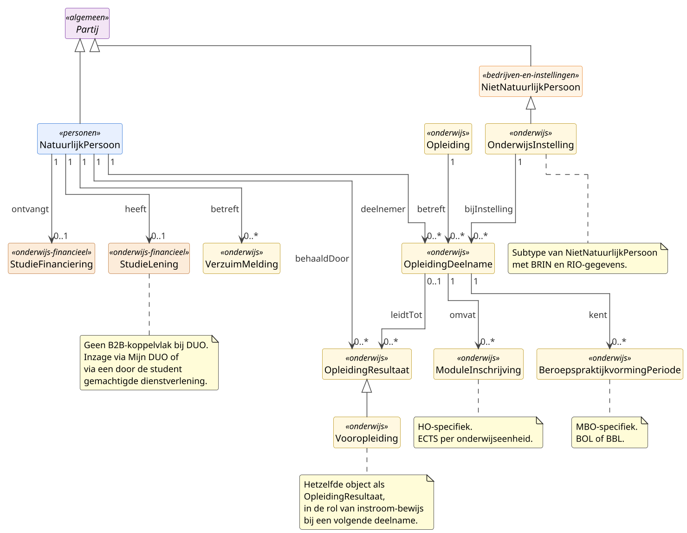

# Deelmodel: Onderwijs

Personen in een Nederlandse onderwijssector, hun lopende en
afgesloten onderwijsdeelnames, behaalde resultaten en, zolang DUO
deze administreert, hun studiefinanciering en studielening.
Inclusief de instellingen waar dit gebeurt en de wettelijke
verzuimregistratie voor leerplichtige en kwalificatieplichtige
leerlingen.

Het persoonscluster (leerling, student) is gedefinieerd in
[Personen](personen.md); een onderwijsinstelling is in het
rechtspersoon-aspect gedefinieerd in
[Bedrijven en instellingen](bedrijven-en-instellingen.md). Het
`Partij`-supertype is gedefinieerd in het
[hoofdmodel](../hoofdmodel.md).

## Diagram

## Objecttypen

### BeroepspraktijkvormingPeriode

**Definitie**: Een afgebakende periode waarin een MBO-student bij
een erkend leerbedrijf het beroepspraktijkvorming-deel van een
MBO-opleiding doorloopt.

**Herkomst definitie**: Wet educatie en beroepsonderwijs (WEB)
art. 7.2.8 en art. 7.2.9 (beroepspraktijkvorming en BPV-overeenkomst);
WEB art. 1.5.5 (erkenning leerbedrijf door SBB).

**Toelichting**: BeroepspraktijkvormingPeriode hangt als component
aan een lopende MBO-OpleidingDeelname. In de beroepsopleidende
leerweg (BOL) ligt het aandeel BPV doorgaans tussen twintig en
zestig procent van de studielast; in de beroepsbegeleidende leerweg
(BBL) bedraagt het ten minste zestig procent. Het onderscheid
BOL/BBL zit op de moederinschrijving (`OpleidingDeelname.leerweg`),
niet op de BPV-periode zelf. Erkenning van leerbedrijven verloopt
via SBB (Samenwerkingsorganisatie Beroepsonderwijs Bedrijfsleven).

| MIM-veld | Waarde |
|---|---|
| Naam | BeroepspraktijkvormingPeriode |
| Begrip (URI) | `https://begrippen.gbo-semantiek.nl/id/begrip/BeroepspraktijkvormingPeriode` |
| Herkomst | Register Onderwijsdeelnemers, cluster MBO |
| Datum opname | 2026-05-19 |
| Unieke aanduiding | `periodeId` binnen `OpleidingDeelname` |
| Populatie | Alle BPV-perioden voor MBO-studenten met een lopende OpleidingDeelname in BOL of BBL. |
| Kwaliteit | MBO-instelling levert; geldigheid van de BPV-overeenkomst wordt geborgd door SBB-erkenning van het leerbedrijf en door registratie in ROD. |

**Attribuutsoorten**:

| Naam | Type | Kard. | Authentiek | Mat. hist. | Form. hist. | Definitie | Herkomst | Toelichting |
|---|---|---|---|---|---|---|---|---|
| `periodeId` | [Tekst](../datatypes-en-codelijsten.md#simpele-datatypes) | 1 | Basisgegeven | Nee | Nee | Identificatie van de BPV-periode binnen de moederinschrijving. | PvE ROD MBO | |
| `begindatum` | [Datum](../datatypes-en-codelijsten.md#simpele-datatypes) | 1 | Basisgegeven | Ja | Ja | De startdatum van de BPV-periode. | PvE ROD MBO | |
| `einddatum` | [Datum](../datatypes-en-codelijsten.md#simpele-datatypes) | 1 | Basisgegeven | Ja | Ja | De einddatum van de BPV-periode. | PvE ROD MBO | |
| `omvangInUren` | [Geheel](../datatypes-en-codelijsten.md#simpele-datatypes) | 0..1 | Basisgegeven | Nee | Nee | De omvang van de BPV-periode in uren. | PvE ROD MBO | Alternatief in dagen wanneer de instelling die maat hanteert. |
| `leerbedrijfIdentificatie` | [Tekst](../datatypes-en-codelijsten.md#simpele-datatypes) | 1 | Basisgegeven | Ja | Ja | Verwijzing naar het SBB-erkende leerbedrijf. | PvE ROD MBO | |

**Relatiesoorten** (uitgaand):

| Naam | Doel | Kard. (bron→doel) | Authentiek | Mat. hist. | Form. hist. | Toelichting |
|---|---|---|---|---|---|---|
| binnen | OpleidingDeelname | 1 → 1 | Basisgegeven | Ja | Ja | Componentbinding aan de moeder-OpleidingDeelname (MBO). |

### ModuleInschrijving

**Definitie**: De inschrijving van een student voor een
onderwijseenheid binnen een lopende opleiding-deelname in het
hoger onderwijs, met een vastgestelde studielast in ECTS.

**Herkomst definitie**: Wet op het hoger onderwijs en
wetenschappelijk onderzoek (WHW) art. 7.3 (opleiding) en art. 7.3a
(onderwijseenheden en studiepunten); studielast uitgedrukt in EC,
conform het Europese ECTS-systeem.

**Toelichting**: ModuleInschrijving is een fijnmazige gebeurtenis
binnen een OpleidingDeelname: één deelname kan meerdere
moduleinschrijvingen omvatten. Eén EC komt overeen met circa
achtentwintig studieuren. Een moduleinschrijving levert geen
zelfstandig bewijsstuk; het cumulatief behalen van modules leidt
tot een getuigschrift, gemodelleerd als OpleidingResultaat.

| MIM-veld | Waarde |
|---|---|
| Naam | ModuleInschrijving |
| Begrip (URI) | `https://begrippen.gbo-semantiek.nl/id/begrip/ModuleInschrijving` |
| Herkomst | Register Onderwijsdeelnemers, cluster HO |
| Datum opname | 2026-05-19 |
| Unieke aanduiding | `moduleIdentificatie` binnen `OpleidingDeelname` |
| Populatie | Inschrijvingen van HO-studenten voor onderwijseenheden die de instelling op grond van de WHW als examenonderdeel registreert. |
| Kwaliteit | Aangeleverd door de HO-instelling; resultaatstatus volgt de instellings-administratie. |

**Attribuutsoorten**:

| Naam | Type | Kard. | Authentiek | Mat. hist. | Form. hist. | Definitie | Herkomst | Toelichting |
|---|---|---|---|---|---|---|---|---|
| `moduleIdentificatie` | [Tekst](../datatypes-en-codelijsten.md#simpele-datatypes) | 1 | Basisgegeven | Nee | Nee | Identificatie van de onderwijseenheid binnen de instelling. | PvE ROD HO | Instelling-eigen sleutel. |
| `ects` | [Decimaal](../datatypes-en-codelijsten.md#simpele-datatypes) | 1 | Basisgegeven | Nee | Nee | De studielast van de onderwijseenheid uitgedrukt in EC. | PvE ROD HO | |
| `inschrijfdatum` | [Datum](../datatypes-en-codelijsten.md#simpele-datatypes) | 1 | Basisgegeven | Ja | Ja | De datum waarop de student zich voor de onderwijseenheid heeft ingeschreven. | PvE ROD HO | |
| `resultaatstatus` | [Resultaatstatus](#resultaatstatus) | 0..1 | Basisgegeven | Ja | Ja | De uitkomst van de moduledeelname. | PvE ROD HO | |
| `cijfer` | [Tekst](../datatypes-en-codelijsten.md#simpele-datatypes) | 0..1 | Basisgegeven | Nee | Nee | Het beoordelingsresultaat in numerieke of pass/fail-vorm. | PvE ROD HO | Vorm-afhankelijk per instelling. |

**Relatiesoorten** (uitgaand):

| Naam | Doel | Kard. (bron→doel) | Authentiek | Mat. hist. | Form. hist. | Toelichting |
|---|---|---|---|---|---|---|
| binnen | OpleidingDeelname | 1 → 1 | Basisgegeven | Ja | Ja | Componentbinding aan de moeder-OpleidingDeelname (HO). |

### OnderwijsInstelling

**Definitie**: Een door OCW erkende rechtspersoon of bestuurlijke
entiteit die onderwijs aanbiedt in een of meer Nederlandse
onderwijssectoren.

**Herkomst definitie**: Wet op het primair onderwijs (WPO) art. 1
(basisschool); Wet voortgezet onderwijs 2020 (WVO 2020) art. 1.1
(school voor voortgezet onderwijs); Wet educatie en beroepsonderwijs
(WEB) art. 1.1.1 (instelling); Wet op het hoger onderwijs en
wetenschappelijk onderzoek (WHW) art. 1.2 (instelling).

**Toelichting**: Onderwijsinstelling is een NietNatuurlijkPersoon
in een specifieke rol als bevoegd gezag. De registratie
Instellingen en Opleidingen (RIO) kent een hiërarchie van
onderwijsbestuur, instelling, vestiging en opleidingsaanbod-eenheid.
Dit deelmodel bindt het Onderwijsinstelling-objecttype aan het
instelling-niveau. Het bestuur-niveau correspondeert met de
rechtspersoon in het Handelsregister; voor het instelling-niveau
is BRIN de korte identifier en de RIO-instellingscode de uitgebreide.

| MIM-veld | Waarde |
|---|---|
| Naam | OnderwijsInstelling |
| Begrip (URI) | `https://begrippen.gbo-semantiek.nl/id/begrip/OnderwijsInstelling` |
| Herkomst | RIO (instellings-laag); Handelsregister (rechtspersoon-laag) |
| Datum opname | 2026-05-19 |
| Unieke aanduiding | `brincode` of `instellingscodeRIO` |
| Populatie | Alle in RIO geregistreerde Nederlandse onderwijsinstellingen, zowel bekostigde publieke instellingen als private aanbieders met erkenning. |
| Kwaliteit | RIO is autoritatief; BRIN-codes worden door DUO uitgegeven; mutaties in bestuurs- of vestigingsstructuur zijn na publicatie in RIO bindend. |

**Attribuutsoorten**:

| Naam | Type | Kard. | Authentiek | Mat. hist. | Form. hist. | Definitie | Herkomst | Toelichting |
|---|---|---|---|---|---|---|---|---|
| `brincode` | [Alfanumeriek4](../datatypes-en-codelijsten.md#simpele-datatypes) | 0..1 | Basisgegeven | Ja | Ja | De vier-tekens-code waarmee een onderwijsinstelling historisch wordt aangeduid. | RIO en DUO | Voor sommige sectoren niet uitgegeven. |
| `instellingscodeRIO` | [Tekst](../datatypes-en-codelijsten.md#simpele-datatypes) | 1 | Basisgegeven | Ja | Ja | De uitgebreide instellingscode in RIO. | RIO | |
| `naam` | [Tekst](../datatypes-en-codelijsten.md#simpele-datatypes) | 1 | Basisgegeven | Ja | Nee | De officiële benaming van de instelling. | RIO | |
| `onderwijssector` | [Onderwijssector](#onderwijssector) | 1..\* | Basisgegeven | Nee | Nee | Sector waarin de instelling actief is. | RIO | Een instelling kan in meerdere sectoren actief zijn. |

**Relatiesoorten** (uitgaand):

| Naam | Doel | Kard. (bron→doel) | Authentiek | Mat. hist. | Form. hist. | Toelichting |
|---|---|---|---|---|---|---|
| heeftBestuur | NietNatuurlijkPersoon | 1 → 1 | Basisgegeven | Ja | Ja | Verwijzing naar de rechtspersoon van het schoolbestuur. |
| biedtAan | Opleiding | 1 → 0..\* | Basisgegeven | Nee | Nee | Het aanbod aan opleidingen. |

### Opleiding

**Definitie**: Een door een bevoegd gezag aangeboden, samenhangend
geheel van onderwijs- en leeractiviteiten dat tot een vooraf
vastgesteld kwalificatie- of diplomaniveau leidt.

**Herkomst definitie**: WHW art. 7.3 en 7.3a (HO-opleidingen en
studiepunten); WEB art. 7.1.3 (MBO-opleiding gekoppeld aan
kwalificatiedossier); WPO en WVO 2020 voor PO- en VO-aanbod.

**Toelichting**: Opleiding abstraheert van de sector-eigen
identificatiestelsels: CROHO (Centraal Register Opleidingen Hoger
Onderwijs) voor HO, CREBO (Centraal Register Beroepsopleidingen)
voor MBO, en schoolsoort-codes voor PO en VO. Het attribuut
`codestelsel` zegt welk stelsel de `opleidingscode` volgt.
Sectoroverstijgende vergelijking gebeurt via `opleidingsniveau` op
de NLQF-schaal (Nederlands Kwalificatieraamwerk).

| MIM-veld | Waarde |
|---|---|
| Naam | Opleiding |
| Begrip (URI) | `https://begrippen.gbo-semantiek.nl/id/begrip/Opleiding` |
| Herkomst | RIO; sector-codelijsten CROHO, CREBO en schoolsoort |
| Datum opname | 2026-05-19 |
| Unieke aanduiding | `opleidingscode` binnen `codestelsel` |
| Populatie | Alle opleidingen die in een Nederlandse onderwijssector door een erkend bevoegd gezag worden aangeboden en in RIO of de bijbehorende sectorlijst zijn geregistreerd. |
| Kwaliteit | CROHO-registratie is voorwaarde voor bekostiging van HO-opleidingen; CREBO-registratie geldt analoog voor MBO. Een opleiding zonder geldige registratie geeft geen recht op bekostigde diploma-uitreiking. |

**Attribuutsoorten**:

| Naam | Type | Kard. | Authentiek | Mat. hist. | Form. hist. | Definitie | Herkomst | Toelichting |
|---|---|---|---|---|---|---|---|---|
| `opleidingscode` | [Tekst](../datatypes-en-codelijsten.md#simpele-datatypes) | 1 | Basisgegeven | Nee | Nee | De sector-specifieke code van de opleiding. | RIO of sectorlijst | Vorm en patroon zijn afhankelijk van het codestelsel. |
| `codestelsel` | [Codestelsel](#codestelsel) | 1 | Basisgegeven | Nee | Nee | Het identificatiestelsel waarvan de opleidingscode deel uitmaakt. | GBO-Kern | |
| `opleidingsnaam` | [Tekst](../datatypes-en-codelijsten.md#simpele-datatypes) | 1 | Basisgegeven | Ja | Nee | De officiële benaming van de opleiding. | RIO | |
| `opleidingsniveau` | `Codelijst~NLQF` | 0..1 | Basisgegeven | Nee | Nee | Het kwalificatieniveau op de NLQF-schaal van een tot acht. | Afgeleide; NCP-NLQF | Sectoroverstijgende vergelijking. |
| `onderwijssector` | [Onderwijssector](#onderwijssector) | 1 | Basisgegeven | Nee | Nee | De sector waarin de opleiding wordt aangeboden. | RIO | |

**Relatiesoorten** (uitgaand):

| Naam | Doel | Kard. (bron→doel) | Authentiek | Mat. hist. | Form. hist. | Toelichting |
|---|---|---|---|---|---|---|
| wordtAangebodenDoor | OnderwijsInstelling | 0..\* → 1..\* | Basisgegeven | Nee | Nee | De instelling waar de opleiding wordt aangeboden. |

### OpleidingDeelname

**Definitie**: De inschrijving van een natuurlijk persoon voor het
volgen van een opleiding bij een onderwijsinstelling, geldig
binnen een afgebakende periode.

**Herkomst definitie**: Wet op het onderwijsnummer art. 1 onder b
(deelnemer); sectorwetten WPO, WVO 2020, WEB en WHW; operationele
invulling in het Programma van Eisen voor het Register
Onderwijsdeelnemers per sector.

**Toelichting**: OpleidingDeelname is de centrale registratie van
het feit dat een persoon onderwijs volgt. Eén deelname dekt één
combinatie van Persoon, Opleiding en Onderwijsinstelling binnen
één periode. Een wijziging van leerweg of vestiging leidt
doorgaans tot een nieuwe deelname; de exacte sectorregel staat in
het bijbehorende PvE. Een afgeronde deelname leidt vaak, niet
altijd, tot een OpleidingResultaat. Voortijdige beëindiging zonder
resultaat heeft een `redenUitschrijving` uit de sector-specifieke
codelijst.

| MIM-veld | Waarde |
|---|---|
| Naam | OpleidingDeelname |
| Begrip (URI) | `https://begrippen.gbo-semantiek.nl/id/begrip/OpleidingDeelname` |
| Herkomst | Register Onderwijsdeelnemers per sector |
| Datum opname | 2026-05-19 |
| Unieke aanduiding | `deelnameId` |
| Populatie | Alle inschrijvingen die op grond van een sectorwet aan ROD moeten worden gemeld: in PO en VO ingeschreven leerlingen, in MBO en VAVO ingeschreven studenten, in HO ingeschreven studenten en, waar van toepassing, extranei. |
| Kwaliteit | ROD-bijhouding is per sector wettelijk verplicht; de onderwijsinstelling levert via Edukoppeling. Tijdigheid van overgangs- en uitschrijfmeldingen en juistheid van peilmoment worden door DUO teruggekoppeld aan de instelling. |

**Attribuutsoorten**:

| Naam | Type | Kard. | Authentiek | Mat. hist. | Form. hist. | Definitie | Herkomst | Toelichting |
|---|---|---|---|---|---|---|---|---|
| `deelnameId` | [Tekst](../datatypes-en-codelijsten.md#simpele-datatypes) | 1 | Basisgegeven | Nee | Nee | Interne identificatie van de deelname. | GBO-Kern | |
| `inschrijfdatum` | [Datum](../datatypes-en-codelijsten.md#simpele-datatypes) | 1 | Basisgegeven | Ja | Ja | De datum waarop de deelname is aangevangen. | PvE ROD per sector | |
| `uitschrijfdatum` | [Datum](../datatypes-en-codelijsten.md#simpele-datatypes) | 0..1 | Basisgegeven | Ja | Ja | De datum waarop de deelname is geëindigd. | PvE ROD per sector | Leeg zolang de deelname loopt. |
| `redenUitschrijving` | `Codelijst~RedenUitschrijving` | 0..1 | Basisgegeven | Nee | Nee | De reden waarom de deelname is geëindigd. | PvE ROD per sector | Sector-specifieke codelijst. |
| `onderwijssoort` | [Onderwijssoort](#onderwijssoort) | 1 | Basisgegeven | Nee | Nee | Het soort onderwijs binnen de sector. | PvE ROD per sector | |
| `leerweg` | [Leerweg](#leerweg) | 0..1 | Basisgegeven | Nee | Nee | De leerweg waarbinnen de deelname valt, voor zover de sector dit hanteert. | PvE ROD MBO en VO | |
| `cohort` | [Geheel](../datatypes-en-codelijsten.md#simpele-datatypes) | 0..1 | Basisgegeven | Nee | Nee | Het instroomjaar waarmee de deelname is gestart. | PvE ROD MBO en HO | |

**Relatiesoorten** (uitgaand):

| Naam | Doel | Kard. (bron→doel) | Authentiek | Mat. hist. | Form. hist. | Toelichting |
|---|---|---|---|---|---|---|
| deelnemer | NatuurlijkPersoon | 1 → 1 | Basisgegeven | Nee | Ja | De persoon die de opleiding volgt. |
| betreft | Opleiding | 1 → 1 | Basisgegeven | Nee | Ja | De opleiding waarvoor is ingeschreven. |
| bijInstelling | OnderwijsInstelling | 1 → 1 | Basisgegeven | Nee | Ja | De instelling die het onderwijs verzorgt. |
| omvat | ModuleInschrijving | 1 → 0..\* | Basisgegeven | Nee | Nee | Onderwijseenheid-inschrijvingen binnen de deelname (HO). |
| kent | BeroepspraktijkvormingPeriode | 1 → 0..\* | Basisgegeven | Nee | Nee | BPV-periodes binnen de deelname (MBO). |
| leidtTot | OpleidingResultaat | 0..1 → 0..\* | Basisgegeven | Nee | Nee | Resultaten die uit de deelname zijn voortgekomen. |

### OpleidingResultaat

**Definitie**: Het door een natuurlijk persoon behaalde resultaat
voor een opleiding of onderdeel daarvan bij een
onderwijsinstelling, blijkend uit een diploma, certificaat,
deelcertificaat of vergelijkbaar bewijsstuk.

**Herkomst definitie**: WHW art. 7.10a (HO-getuigschrift); WEB
art. 7.4.6 (MBO-diploma); WVO 2020 art. 2.61 (VO-eindexamen);
Wet op het onderwijsnummer voor de meldingsplicht naar DUO.

**Toelichting**: OpleidingResultaat ontstaat na succesvolle
afronding of bij een deelresultaat zoals een propedeuse in HO of
een deelcertificaat in MBO. Een uitschrijving zonder resultaat
leidt niet tot een OpleidingResultaat-record. Hetzelfde
resultaat-record speelt twee rollen in het deelmodel: als
afsluiting van een OpleidingDeelname via `leidtTot` en als
Vooropleiding bij een volgende deelname. In het HO is
"Getuigschrift" de wettelijke benaming voor het bachelor- of
master-bewijsstuk; dat is een voorkomen met
`resultaatsoort = Getuigschrift`.

| MIM-veld | Waarde |
|---|---|
| Naam | OpleidingResultaat |
| Begrip (URI) | `https://begrippen.gbo-semantiek.nl/id/begrip/OpleidingResultaat` |
| Herkomst | Register Onderwijsdeelnemers per sector |
| Datum opname | 2026-05-19 |
| Unieke aanduiding | `resultaatId` |
| Populatie | Alle resultaten die op grond van de sectorregels in ROD worden gemeld: diploma's, certificaten, deelcertificaten en in HO afsluitende getuigschriften plus tussentijdse propedeuse-uitkomsten. |
| Kwaliteit | Resultaatmelding is verplicht na uitreiken. Authenticiteit is geborgd doordat alleen erkende instellingen mogen melden via Edukoppeling. Een ten onrechte verstrekt diploma kan via een terugkoppelmelding worden ingetrokken; de bijhouding registreert dat als correctie. |

**Attribuutsoorten**:

| Naam | Type | Kard. | Authentiek | Mat. hist. | Form. hist. | Definitie | Herkomst | Toelichting |
|---|---|---|---|---|---|---|---|---|
| `resultaatId` | [Tekst](../datatypes-en-codelijsten.md#simpele-datatypes) | 1 | Basisgegeven | Nee | Nee | Interne identificatie van het resultaat. | GBO-Kern | |
| `behaaldatum` | [Datum](../datatypes-en-codelijsten.md#simpele-datatypes) | 1 | Basisgegeven | Ja | Ja | De datum waarop het resultaat is behaald. | PvE ROD per sector | |
| `diplomasoort` | `Codelijst~Diplomasoort` | 0..1 | Basisgegeven | Nee | Nee | De aanduiding van het diploma of bewijsstuk. | PvE ROD per sector | Sector-specifieke codelijst. |
| `resultaatsoort` | [Resultaatsoort](#resultaatsoort) | 1 | Basisgegeven | Nee | Nee | Het type resultaat. | PvE ROD per sector | |
| `graad` | [Tekst](../datatypes-en-codelijsten.md#simpele-datatypes) | 0..1 | Basisgegeven | Nee | Nee | De academische graad bij HO-resultaten. | PvE ROD HO | Bachelor, Master of Associate degree. |
| `specialisatie` | [Tekst](../datatypes-en-codelijsten.md#simpele-datatypes) | 0..1 | Basisgegeven | Nee | Nee | De afstudeerrichting of track binnen de opleiding. | PvE ROD HO | |

**Relatiesoorten** (uitgaand):

| Naam | Doel | Kard. (bron→doel) | Authentiek | Mat. hist. | Form. hist. | Toelichting |
|---|---|---|---|---|---|---|
| behaaldDoor | NatuurlijkPersoon | 1 → 1 | Basisgegeven | Nee | Ja | De persoon aan wie het resultaat is uitgereikt. |
| voorOpleiding | Opleiding | 1 → 1 | Basisgegeven | Nee | Ja | De opleiding waarop het resultaat betrekking heeft. |
| uitgereiktDoor | OnderwijsInstelling | 1 → 1 | Basisgegeven | Nee | Ja | De instelling die het resultaat heeft uitgereikt. |
| volgtOpDeelname | OpleidingDeelname | 0..1 → 0..1 | Basisgegeven | Nee | Nee | De voorafgaande deelname waaruit het resultaat is voortgekomen, voor zover bekend. |

### VerzuimMelding

**Definitie**: Een wettelijk verplichte melding door een
onderwijsinstelling van ongeoorloofd verzuim van een leerplichtige
of kwalificatieplichtige leerling, of van verzuim van een
achttienplus-deelnemer dat langer dan vier weken aaneengesloten
duurt.

**Herkomst definitie**: Leerplichtwet 1969 art. 21a (meldingsplicht
ongeoorloofd verzuim); WEB art. 8.1.7 (kwalificatieplicht en
verzuim achttienplus); WVO 2020 art. 8.6.4.

**Toelichting**: VerzuimMelding zit niet in het PO-koppelvlak;
het verzuimregime begint in het voortgezet onderwijs vanaf de
leerplicht-leeftijd en loopt door tot achttien jaar via de
kwalificatieplicht. Drie regimes:
leerplicht voor leeftijd vijf tot zestien jaar, kwalificatieplicht
voor zestien tot achttien jaar zonder startkwalificatie, en
achttienplus-verzuim in MBO. DUO routeert de melding op grond van
leeftijd en regime naar de leerplicht-ambtenaar van de gemeente of
naar het Regionaal Meld- en Coördinatiepunt (RMC). Geoorloofd
verzuim, zoals ziekte of vakantie met toestemming, valt niet onder
de wettelijke meldingsplicht en daarmee niet onder dit objecttype.

| MIM-veld | Waarde |
|---|---|
| Naam | VerzuimMelding |
| Begrip (URI) | `https://begrippen.gbo-semantiek.nl/id/begrip/VerzuimMelding` |
| Herkomst | Register Onderwijsdeelnemers, clusters VO en MBO |
| Datum opname | 2026-05-19 |
| Unieke aanduiding | `meldingId` |
| Populatie | Alle door scholen en MBO-instellingen aan DUO gemelde verzuim-incidenten die voldoen aan de wettelijke drempel. |
| Kwaliteit | Aanlevering binnen wettelijke termijn (zeven dagen na constatering) bepaalt of de melding rechtsgeldig in ROD staat. |

**Attribuutsoorten**:

| Naam | Type | Kard. | Authentiek | Mat. hist. | Form. hist. | Definitie | Herkomst | Toelichting |
|---|---|---|---|---|---|---|---|---|
| `meldingId` | [Tekst](../datatypes-en-codelijsten.md#simpele-datatypes) | 1 | Basisgegeven | Nee | Nee | Identificatie van de melding. | PvE ROD VO en MBO | |
| `begindatum` | [Datum](../datatypes-en-codelijsten.md#simpele-datatypes) | 1 | Basisgegeven | Ja | Ja | De eerste verzuim-dag. | PvE ROD VO en MBO | |
| `einddatum` | [Datum](../datatypes-en-codelijsten.md#simpele-datatypes) | 0..1 | Basisgegeven | Ja | Ja | De einddatum van het verzuim. | PvE ROD VO en MBO | Leeg zolang het verzuim voortduurt. |
| `grondslag` | [Grondslag](#grondslag) | 1 | Basisgegeven | Nee | Nee | Het regime waaronder de melding valt. | PvE ROD VO en MBO | |
| `omvang` | [Tekst](../datatypes-en-codelijsten.md#simpele-datatypes) | 0..1 | Basisgegeven | Nee | Nee | Het aantal lesuren of aaneengesloten dagen. | PvE ROD VO en MBO | Eenheid hangt af van het regime. |

**Relatiesoorten** (uitgaand):

| Naam | Doel | Kard. (bron→doel) | Authentiek | Mat. hist. | Form. hist. | Toelichting |
|---|---|---|---|---|---|---|
| betreft | NatuurlijkPersoon | 1 → 1 | Basisgegeven | Nee | Ja | De persoon waarop het verzuim betrekking heeft. |
| gemeldDoor | OnderwijsInstelling | 1 → 1 | Basisgegeven | Nee | Ja | De instelling die de melding heeft gedaan. |

### Vooropleiding

**Definitie**: Een eerder behaald opleidingsresultaat dat bij een
volgende onderwijsdeelname wordt aangereikt als bewijs voor de
toelating tot of de instroompositionering in een opleiding.

**Herkomst definitie**: WHW art. 7.24 en volgende (toelatingseisen
HO); WEB art. 8.2.1 (toelating MBO); WVO 2020 voor doorstroomeisen
binnen VO.

**Toelichting**: Vooropleiding is hetzelfde objecttype als
OpleidingResultaat, ingezet in een tweede rol. Een MBO-deelname
met een HAVO-diploma als vooropleiding wordt in ROD doorgegeven
met een verwijzing naar het VO-OpleidingResultaat; analoog voor
een HO-deelname met een MBO-niveau-4-diploma als instroom.
Buitenlandse vooropleidingen worden niet door ROD geverifieerd
tegen een binnenlands resultaat; de instelling beoordeelt de
gelijkstelling, doorgaans op basis van een
gelijkwaardigheidsverklaring (door DUO of Nuffic afgegeven).

| MIM-veld | Waarde |
|---|---|
| Naam | Vooropleiding |
| Begrip (URI) | `https://begrippen.gbo-semantiek.nl/id/begrip/Vooropleiding` |
| Herkomst | Register Onderwijsdeelnemers per sector |
| Datum opname | 2026-05-19 |
| Unieke aanduiding | Combinatie van persoon, diplomasoort, behaaldatum en verstrekkende instelling. |
| Populatie | Alle door instellingen geregistreerde vooropleidingen bij ROD-inschrijvingen, inclusief in het buitenland behaalde gelijkstellingen. |
| Kwaliteit | ROD valideert de combinatie persoon-vooropleiding tegen het bestaande OpleidingResultaat-record waar aanwezig. Buitenlandse vooropleidingen worden aangereikt zonder ROD-tegenpaar; de instelling staat in voor de gelijkstelling. |

**Attribuutsoorten**:

| Naam | Type | Kard. | Authentiek | Mat. hist. | Form. hist. | Definitie | Herkomst | Toelichting |
|---|---|---|---|---|---|---|---|---|
| `behaaldatum` | [Datum](../datatypes-en-codelijsten.md#simpele-datatypes) | 1 | Basisgegeven | Ja | Ja | De datum waarop de vooropleiding is behaald. | PvE ROD per sector | Geërfd van OpleidingResultaat. |
| `diplomasoort` | `Codelijst~Diplomasoort` | 1 | Basisgegeven | Nee | Nee | De aanduiding van het instroom-bewijs. | PvE ROD per sector | |
| `verstrekkendeInstellingscode` | [Tekst](../datatypes-en-codelijsten.md#simpele-datatypes) | 0..1 | Basisgegeven | Ja | Ja | De BRIN of, voor buitenlandse vooropleidingen, een landcode. | PvE ROD per sector | |
| `landVerwerving` | [`Codelijst~ISO3166`](../datatypes-en-codelijsten.md#stelselbrede-codelijsten) | 0..1 | Basisgegeven | Nee | Nee | Het land waar de vooropleiding is behaald. | PvE ROD per sector | NL bij binnenlandse vooropleiding. |

**Relatiesoorten** (uitgaand):

| Naam | Doel | Kard. (bron→doel) | Authentiek | Mat. hist. | Form. hist. | Toelichting |
|---|---|---|---|---|---|---|
| isBaseerd | OpleidingResultaat | 1 → 0..1 | Basisgegeven | Nee | Ja | De binnenlandse resultaatregistratie waarop deze vooropleiding teruggrijpt, voor zover aanwezig. |
| toelatingsbewijsBij | OpleidingDeelname | 1 → 1 | Basisgegeven | Nee | Ja | De volgende deelname die op grond van deze vooropleiding is toegestaan. |

## DUO-administraties zonder formele registratie

Studiefinanciering en studielening worden door DUO geadministreerd
maar vallen niet onder een wettelijk register zoals ROD of RIO.
Voor beide geldt: geen publiek B2B-koppelvlak. Derden zijn
afhankelijk van inzage door de (oud-)student via Mijn DUO of via
een door de student gemachtigde dienstverlening.

### StudieFinanciering

**Definitie**: Een door DUO aan een student toegekende tegemoetkoming
in de kosten van levensonderhoud en studie, in de vorm van een
basisbeurs, aanvullende beurs, studentenreisproduct of bestuursbeurs.

**Herkomst definitie**: Wet studiefinanciering 2000 (WSF 2000);
voor onderdelen MBO en VO ook de Wet tegemoetkoming
onderwijsbijdrage en schoolkosten (WTOS).

**Toelichting**: StudieFinanciering omvat de beurscomponent en
het reisproduct, niet de leencomponent (zie StudieLening
hieronder). Een basisbeurs is forfaitair en voor HO-studenten;
sinds het studiejaar 2023-2024 is deze terug na de
leenstelsel-periode 2015 tot 2023. Een aanvullende beurs is
inkomensafhankelijk. Het studentenreisproduct is een OV-product op
werkdagen of weekenden. Een bestuursbeurs ondersteunt bestuurlijke
activiteiten aan een HO-instelling. Voor MBO geldt deels de WTOS
voor jongeren tot achttien en deels de WSF 2000 boven achttien.

| MIM-veld | Waarde |
|---|---|
| Naam | StudieFinanciering |
| Begrip (URI) | `https://begrippen.gbo-semantiek.nl/id/begrip/StudieFinanciering` |
| Herkomst | DUO-administratie studiefinanciering |
| Datum opname | 2026-05-19 |
| Unieke aanduiding | Combinatie van persoon, beurssoort en periode. |
| Populatie | Personen die op grond van WSF 2000 of WTOS aanspraak maken op tegemoetkoming, beperkt tot HBO-, WO- en (voor reisproduct en aanvullende toelage) MBO-studenten. |
| Kwaliteit | DUO is autoritatief; status (toegekend, ingetrokken, omgezet in gift) wordt door DUO bijgehouden. Bevestiging aan derden alleen via gewaarmerkte burgerinzage of een door de student gemachtigde dienstverlening. |

**Attribuutsoorten**:

| Naam | Type | Kard. | Authentiek | Mat. hist. | Form. hist. | Definitie | Herkomst | Toelichting |
|---|---|---|---|---|---|---|---|---|
| `beurssoort` | [Beurssoort](#beurssoort) | 1 | Basisgegeven | Nee | Nee | De vorm van de tegemoetkoming. | DUO | |
| `toekenningsbedragMaand` | [Bedrag](../datatypes-en-codelijsten.md#aanvullende-datatypes) | 0..1 | Basisgegeven | Ja | Ja | Het maandelijks toegekende bedrag. | DUO | Niet van toepassing voor reisproduct. |
| `ingangsdatum` | [Datum](../datatypes-en-codelijsten.md#simpele-datatypes) | 1 | Basisgegeven | Ja | Ja | De datum waarop de tegemoetkoming is ingegaan. | DUO | |
| `einddatum` | [Datum](../datatypes-en-codelijsten.md#simpele-datatypes) | 0..1 | Basisgegeven | Ja | Ja | De datum waarop de tegemoetkoming is geëindigd. | DUO | |
| `status` | [Tekst](../datatypes-en-codelijsten.md#simpele-datatypes) | 1 | Basisgegeven | Ja | Ja | Administratieve status van de toekenning. | DUO | Toegekend, Ingetrokken, OmgezetInGift. |

**Relatiesoorten** (uitgaand):

| Naam | Doel | Kard. (bron→doel) | Authentiek | Mat. hist. | Form. hist. | Toelichting |
|---|---|---|---|---|---|---|
| ontvanger | NatuurlijkPersoon | 1 → 1 | Basisgegeven | Nee | Ja | De persoon aan wie de tegemoetkoming is toegekend. |
| voorOpleiding | Opleiding | 0..1 → 1 | Basisgegeven | Nee | Ja | De opleiding waarbinnen de tegemoetkoming is toegekend. |

### StudieLening

**Definitie**: Het door een (oud-)student bij DUO opgebouwde
renteloze of laagrentende leningbedrag op grond van de Wet
studiefinanciering 2000, samen met de aflosregeling waaronder het
bedrag moet worden terugbetaald.

**Herkomst definitie**: WSF 2000 hoofdstuk 6 (lening en
terugbetaling); aanvullende regelingen rond aflosregimes per
leenstelsel-cohort.

**Toelichting**: Het aflosregime hangt af van het
leenstelsel-cohort waaronder de lening is opgebouwd. In de oude
regeling, geldend tot 2015-2016, geldt een aflostermijn van
vijftien jaar. In het leenstelsel, geldend tussen 2015-2016 en
2022-2023, geldt een aflostermijn van vijfendertig jaar met
prestatiebeurs-elementen. In de hervormde regeling vanaf
2023-2024 is de basisbeurs teruggekeerd en blijft de
aflostermijn voor het leen-deel vijfendertig jaar. Een OV-schuld
kan ontstaan wanneer een studentenreisproduct niet binnen de
gestelde termijn in een gift wordt omgezet (afhankelijk van het
behalen van een diploma binnen tien jaar).

**Beschikbaarheid voor derden**: DUO biedt geen publiek
B2B-koppelvlak voor studielening-data. Dit is geen tijdelijke
beperking maar een vastgestelde lijn, bevestigd in een Kamerbrief
uit 2019 (kenmerk 2019Z18615) nadat de Tweede Kamer per motie
verzocht de in ontwikkeling zijnde "Blauwe Knop", een gewaarmerkte
digitale schuldverklaring, niet uit te rollen. DUO heeft die
ontwikkeling stopgezet. De facto-routes waarlangs derden,
bijvoorbeeld hypotheekverstrekkers in het kader van een
woonlastentoets onder de Wet op het financieel toezicht art. 4:34,
studielening-gegevens kunnen ontvangen, zijn:
inzage door de student zelf via Mijn DUO (handmatige download van
een gewaarmerkt overzicht), of een door de student gemachtigde
dienstverlening die Mijn DUO uitleest. De wettelijke verplichting
om studieschuld in de kredietbeoordeling mee te wegen bestaat dus
zonder een verplichte bron.

| MIM-veld | Waarde |
|---|---|
| Naam | StudieLening |
| Begrip (URI) | `https://begrippen.gbo-semantiek.nl/id/begrip/StudieLening` |
| Herkomst | DUO-administratie studielening |
| Datum opname | 2026-05-19 |
| Unieke aanduiding | Per persoon één lening-administratie. |
| Populatie | Alle (oud-)studenten met een uitstaande studieschuld bij DUO, ongeacht aflosfase. |
| Kwaliteit | DUO is autoritatief; aflosregeling-cohort bepaalt aflostermijn en renteregime. Gegevenskwaliteit voor derden is afhankelijk van de gebruikte alternatieve route. |

**Attribuutsoorten**:

| Naam | Type | Kard. | Authentiek | Mat. hist. | Form. hist. | Definitie | Herkomst | Toelichting |
|---|---|---|---|---|---|---|---|---|
| `openstaandSaldo` | [Bedrag](../datatypes-en-codelijsten.md#aanvullende-datatypes) | 1 | Basisgegeven | Ja | Ja | Het bedrag dat nog openstaat ter terugbetaling. | DUO via burgerinzage | Per peildatum. |
| `maandelijkseAflossing` | [Bedrag](../datatypes-en-codelijsten.md#aanvullende-datatypes) | 0..1 | Basisgegeven | Ja | Ja | Het maandelijkse aflosbedrag. | DUO via burgerinzage | Pas relevant na aanvang aflosfase. |
| `aflostermijnTotaalMaanden` | [Geheel](../datatypes-en-codelijsten.md#simpele-datatypes) | 1 | Basisgegeven | Nee | Nee | De volledige aflostermijn in maanden. | Afgeleid uit leenstelsel-cohort | 180 voor de oude regeling, 420 voor het leenstelsel en de hervormde regeling. |
| `aflostermijnRestantMaanden` | [Geheel](../datatypes-en-codelijsten.md#simpele-datatypes) | 0..1 | Basisgegeven | Ja | Ja | De resterende aflostermijn in maanden. | DUO via burgerinzage | Pas relevant na aanvang aflosfase. |
| `leenstelselCohort` | [LeenstelselCohort](#leenstelselcohort) | 1 | Basisgegeven | Nee | Nee | Het regime waaronder de lening is opgebouwd. | DUO | |
| `renteregime` | [Tekst](../datatypes-en-codelijsten.md#simpele-datatypes) | 0..1 | Basisgegeven | Nee | Nee | Het renteregime dat op de lening van toepassing is. | DUO | Vast of variabel, cohort-afhankelijk. |

**Relatiesoorten** (uitgaand):

| Naam | Doel | Kard. (bron→doel) | Authentiek | Mat. hist. | Form. hist. | Toelichting |
|---|---|---|---|---|---|---|
| schuldenaar | NatuurlijkPersoon | 1 → 1 | Basisgegeven | Nee | Ja | De (oud-)student aan wie de lening is toegekend. |

## Enumeraties

### Beurssoort

**Definitie**: Type tegemoetkoming binnen de Wet studiefinanciering
2000 en de Wet tegemoetkoming onderwijsbijdrage en schoolkosten.

**Herkomst definitie**: WSF 2000 hoofdstuk 3 (beurzen) en art. 3.7
(studentenreisproduct); WTOS voor de MBO-toelage.

**Toelichting**: De keuzelijst onderscheidt de hoofdvormen van
beurs en reisproduct. De leencomponent is geen waarde in deze
lijst; die wordt op het zelfstandige objecttype StudieLening
bijgehouden.

| MIM-veld | Waarde |
|---|---|
| Naam | Beurssoort |
| Begrip (URI) | `https://begrippen.gbo-semantiek.nl/id/begrip/Beurssoort` |
| Herkomst | WSF 2000 en WTOS |
| Datum opname | 2026-05-19 |

**Gebruikt door**: `StudieFinanciering.beurssoort`.

**Waarden**:

| Naam | Definitie | Toelichting |
|---|---|---|
| Basisbeurs | Forfaitaire maandbeurs voor HO-studenten. | Sinds studiejaar 2023-2024 weer ingevoerd. |
| AanvullendeBeurs | Inkomensafhankelijke maandbeurs. | Hoogte afhankelijk van ouderlijk inkomen. |
| Studentenreisproduct | OV-product voor werkdagen of weekenden. | Niet uitgedrukt als maandbedrag in `toekenningsbedragMaand`. |
| Bestuursbeurs | Tegemoetkoming voor bestuurlijke activiteiten aan een HO-instelling. | |

### Codestelsel

**Definitie**: Identificatiestelsel waarvan een opleidingscode
deel uitmaakt.

**Herkomst definitie**: GBO-Kern, op basis van de sectorpraktijk
in RIO en de PvE ROD per sector.

**Toelichting**: Het stelsel bepaalt vorm en betekenis van de
opleidingscode. CROHO geldt voor het hoger onderwijs, CREBO voor
het middelbaar beroepsonderwijs; voor PO en VO is er geen unieke
nationale opleidingscode, daar werkt het deelmodel met een
schoolsoort-code.

| MIM-veld | Waarde |
|---|---|
| Naam | Codestelsel |
| Begrip (URI) | `https://begrippen.gbo-semantiek.nl/id/begrip/Codestelsel` |
| Herkomst | GBO-Kern |
| Datum opname | 2026-05-19 |

**Gebruikt door**: `Opleiding.codestelsel`.

**Waarden**:

| Naam | Definitie | Toelichting |
|---|---|---|
| CROHO | Centraal Register Opleidingen Hoger Onderwijs. | Voor HO. |
| CREBO | Centraal Register Beroepsopleidingen. | Voor MBO en VAVO. |
| SchoolsoortPO | Sectorlijst voor primair onderwijs. | Geen unieke opleidingscode op landelijk niveau. |
| SchoolsoortVO | Sectorlijst voor voortgezet onderwijs. | VMBO met leerweg, HAVO, VWO. |

### Grondslag

**Definitie**: Het regime op grond waarvan een VerzuimMelding moet
worden gedaan.

**Herkomst definitie**: Leerplichtwet 1969 (leerplicht en
kwalificatieplicht); WEB art. 8.1.7 (verzuim achttienplus).

**Toelichting**: Een melding valt onder precies één regime. Het
regime bepaalt naar welke partij DUO de melding routeert (gemeente
voor leerplicht, RMC voor kwalificatieplicht en achttienplus).

| MIM-veld | Waarde |
|---|---|
| Naam | Grondslag |
| Begrip (URI) | `https://begrippen.gbo-semantiek.nl/id/begrip/GrondslagVerzuim` |
| Herkomst | Leerplichtwet 1969; WEB |
| Datum opname | 2026-05-19 |

**Gebruikt door**: `VerzuimMelding.grondslag`.

**Waarden**:

| Naam | Definitie | Toelichting |
|---|---|---|
| Leerplicht | Verzuim van een leerplichtige leerling. | Vijf tot zestien jaar; melddrempel zestien lesuren in vier weken. |
| Kwalificatieplicht | Verzuim van een kwalificatieplichtige leerling. | Zestien tot achttien jaar zonder startkwalificatie. |
| Achttienplus | Verzuim van een MBO-deelnemer van achttien jaar of ouder. | Melddrempel langer dan vier weken aaneengesloten. |

### LeenstelselCohort

**Definitie**: Het studiefinancieringsregime waaronder een
studielening is opgebouwd.

**Herkomst definitie**: WSF 2000 met de aanpassingen van het
leenstelsel (Wet studievoorschot hoger onderwijs, 2015) en van de
hervorming basisbeurs (Wet hervorming studiefinanciering, 2023).

**Toelichting**: Het cohort bepaalt aflostermijn en regelingen
rond prestatiebeurs-omzetting. Een student die zowel in een oud
als in een nieuw regime heeft geleend kan over meer dan één
cohort beschikken in zijn lening-administratie; in dit deelmodel
geldt per studielening het hoofdcohort, met de overige cohorten
als toelichting bij DUO zelf.

| MIM-veld | Waarde |
|---|---|
| Naam | LeenstelselCohort |
| Begrip (URI) | `https://begrippen.gbo-semantiek.nl/id/begrip/LeenstelselCohort` |
| Herkomst | WSF 2000 |
| Datum opname | 2026-05-19 |

**Gebruikt door**: `StudieLening.leenstelselCohort`.

**Waarden**:

| Naam | Definitie | Toelichting |
|---|---|---|
| OudeRegeling | Studiefinanciering uit de periode tot 2015-2016. | Aflostermijn vijftien jaar. |
| Leenstelsel | Studiefinanciering uit de periode 2015-2016 tot 2022-2023. | Aflostermijn vijfendertig jaar; prestatiebeurs-elementen. |
| Hervormd | Studiefinanciering vanaf 2023-2024. | Basisbeurs terug; aflostermijn vijfendertig jaar voor leen-deel. |

### Leerweg

**Definitie**: De manier waarop een onderwijsdeelname is
ingericht, voor zover de sectorregels die onderscheiden.

**Herkomst definitie**: WEB voor het MBO (BOL en BBL); WVO 2020
voor de VMBO-leerwegen.

**Toelichting**: Leerweg is alleen relevant in het MBO en in
VMBO-deelnames; voor andere sectoren blijft het attribuut leeg.

| MIM-veld | Waarde |
|---|---|
| Naam | Leerweg |
| Begrip (URI) | `https://begrippen.gbo-semantiek.nl/id/begrip/Leerweg` |
| Herkomst | WEB; WVO 2020 |
| Datum opname | 2026-05-19 |

**Gebruikt door**: `OpleidingDeelname.leerweg`.

**Waarden**:

| Naam | Definitie | Toelichting |
|---|---|---|
| BOL | Beroepsopleidende leerweg in het MBO. | Onderwijs op school met BPV-aandeel doorgaans twintig tot zestig procent. |
| BBL | Beroepsbegeleidende leerweg in het MBO. | Werken bij een leerbedrijf met schoolbegeleiding; BPV-aandeel ten minste zestig procent. |
| BB | Basisberoepsgerichte leerweg VMBO. | |
| KB | Kaderberoepsgerichte leerweg VMBO. | |
| GL | Gemengde leerweg VMBO. | |
| TL | Theoretische leerweg VMBO. | |

### Onderwijssector

**Definitie**: De onderwijssector in het Nederlandse stelsel
waaronder een opleiding of instelling valt.

**Herkomst definitie**: Wet op het onderwijsnummer; sectorwetten
WPO, WVO 2020, WEB en WHW.

**Toelichting**: Een instelling kan in meerdere sectoren actief
zijn (een ROC bedient typisch MBO en VAVO; een AOC ook VO). Een
opleiding hoort altijd tot precies één sector.

| MIM-veld | Waarde |
|---|---|
| Naam | Onderwijssector |
| Begrip (URI) | `https://begrippen.gbo-semantiek.nl/id/begrip/Onderwijssector` |
| Herkomst | Sectorwetten WPO, WVO 2020, WEB, WHW |
| Datum opname | 2026-05-19 |

**Gebruikt door**: `OnderwijsInstelling.onderwijssector`,
`Opleiding.onderwijssector`.

**Waarden**:

| Naam | Definitie | Toelichting |
|---|---|---|
| PO | Primair onderwijs. | WPO. |
| VO | Voortgezet onderwijs. | WVO 2020. |
| VAVO | Voortgezet algemeen volwassenenonderwijs. | Onder de WEB belegd. |
| MBO | Middelbaar beroepsonderwijs. | WEB. |
| HBO | Hoger beroepsonderwijs. | WHW. |
| WO | Wetenschappelijk onderwijs. | WHW. |

### Onderwijssoort

**Definitie**: Het soort onderwijs binnen een onderwijssector.

**Herkomst definitie**: Sector-specifieke aanduiding in PvE ROD
per sector.

**Toelichting**: Onderwijssoort verfijnt de sector waar de
sectorregels dat vragen: BOL of BBL in het MBO,
voltijd-deeltijd-duaal in het HO, schoolsoort-aanduidingen in
PO en VO.

| MIM-veld | Waarde |
|---|---|
| Naam | Onderwijssoort |
| Begrip (URI) | `https://begrippen.gbo-semantiek.nl/id/begrip/Onderwijssoort` |
| Herkomst | PvE ROD per sector |
| Datum opname | 2026-05-19 |

**Gebruikt door**: `OpleidingDeelname.onderwijssoort`.

**Waarden**:

| Naam | Definitie | Toelichting |
|---|---|---|
| BOL | Beroepsopleidende leerweg MBO. | Idem als waarde in `Leerweg`; in MBO worden onderwijssoort en leerweg samen gehanteerd. |
| BBL | Beroepsbegeleidende leerweg MBO. | |
| Voltijd | Voltijds HO-onderwijs. | |
| Deeltijd | Deeltijds HO-onderwijs. | |
| Duaal | Duaal HO-onderwijs (combinatie werken en studeren). | |
| Basisonderwijs | Regulier primair onderwijs. | WPO. |
| SpeciaalBasisonderwijs | Primair onderwijs voor leerlingen met extra ondersteuningsbehoefte. | WPO. |
| VMBO | Voortgezet onderwijs op het VMBO-niveau. | Met leerweg-attribuut voor de verfijning. |
| HAVO | Voortgezet onderwijs op het HAVO-niveau. | |
| VWO | Voortgezet onderwijs op het VWO-niveau. | Atheneum of gymnasium. |

### Resultaatsoort

**Definitie**: Het type onderwijsresultaat dat in ROD wordt
geregistreerd.

**Herkomst definitie**: WHW art. 7.10a (HO-getuigschrift); WEB
art. 7.4.6 (MBO-diploma en deelcertificaat); WVO 2020 art. 2.61
(VO-diploma).

**Toelichting**: Resultaatsoort onderscheidt het zelfstandig
bewijsstuk (diploma, getuigschrift) van een tussenresultaat
(certificaat, deelcertificaat, propedeuse).

| MIM-veld | Waarde |
|---|---|
| Naam | Resultaatsoort |
| Begrip (URI) | `https://begrippen.gbo-semantiek.nl/id/begrip/Resultaatsoort` |
| Herkomst | WHW; WEB; WVO 2020 |
| Datum opname | 2026-05-19 |

**Gebruikt door**: `OpleidingResultaat.resultaatsoort`,
`ModuleInschrijving.resultaatstatus` (deeloverlap).

**Waarden**:

| Naam | Definitie | Toelichting |
|---|---|---|
| Diploma | Afsluitend bewijsstuk in PO, VO en MBO. | |
| Getuigschrift | Afsluitend bewijsstuk in HO (bachelor, master, associate degree). | WHW-terminologie. |
| Certificaat | Tussenliggend bewijsstuk in MBO. | Onderdeel van een diploma-uitkering. |
| Deelcertificaat | Bewijsstuk voor een afgerond deel van een MBO-opleiding. | |
| Propedeuse | Tussentijds resultaat in HO. | Markeert succesvolle afronding van het propedeutisch jaar. |

### Resultaatstatus

**Definitie**: Uitkomststatus van een moduledeelname in het hoger
onderwijs.

**Herkomst definitie**: PvE ROD HO; uitexaminerings-praktijk per
HO-instelling.

**Toelichting**: De status zegt of de student de onderwijseenheid
heeft afgerond. Een numeriek of pass/fail-cijfer staat in
`ModuleInschrijving.cijfer`; de status hier dient als koppelbare
samenvatting.

| MIM-veld | Waarde |
|---|---|
| Naam | Resultaatstatus |
| Begrip (URI) | `https://begrippen.gbo-semantiek.nl/id/begrip/Resultaatstatus` |
| Herkomst | PvE ROD HO |
| Datum opname | 2026-05-19 |

**Gebruikt door**: `ModuleInschrijving.resultaatstatus`.

**Waarden**:

| Naam | Definitie | Toelichting |
|---|---|---|
| Behaald | Module met succes afgerond. | |
| NietBehaald | Module niet succesvol afgerond. | |
| Vrijstelling | Module vrijgesteld op grond van eerdere prestaties. | |

## Codelijsten

Deelmodel-specifieke codelijsten. Stelselbrede codelijsten
(ISO 3166 voor landcodes) staan op de
[Datatypes en codelijsten](../datatypes-en-codelijsten.md).

| Codelijst | Bron / beheerder | GBO-typering | Gebruikt door |
|---|---|---|---|
| CROHO Opleidingsaanbod HO | [DUO en RIO](https://www.rio-onderwijs.nl/) | `Codelijst~CROHO` | `Opleiding.opleidingscode` voor HO. |
| CREBO Beroepsopleidingen | [DUO en RIO](https://www.rio-onderwijs.nl/) | `Codelijst~CREBO` | `Opleiding.opleidingscode` voor MBO. |
| NLQF Kwalificatieniveaus | [NCP-NLQF](https://www.nlqf.nl/) | `Codelijst~NLQF` | `Opleiding.opleidingsniveau`. |
| BRIN Onderwijsinstellingen | [DUO](https://duo.nl/) | `Codelijst~BRIN` | `OnderwijsInstelling.brincode` (validatie). |
| Diplomasoort per sector | DUO via PvE ROD per sector | `Codelijst~Diplomasoort` | `OpleidingResultaat.diplomasoort`, `Vooropleiding.diplomasoort`. |
| RedenUitschrijving per sector | DUO via PvE ROD per sector | `Codelijst~RedenUitschrijving` | `OpleidingDeelname.redenUitschrijving`. |
| Verblijfstitelcode (VBT) MBO | DUO via PvE ROD MBO | `Codelijst~VBT` | Bekostigingsrecht achttienplus in MBO (niet als hoofd-attribuut in dit deelmodel). |

### Onderhoudsritme

| Codelijst | Mutatieritme | Bron |
|---|---|---|
| CROHO | Per studiejaar | [DUO en RIO](https://www.rio-onderwijs.nl/) |
| CREBO | Per studiejaar | [DUO en RIO](https://www.rio-onderwijs.nl/) |
| NLQF | Sporadisch | [NCP-NLQF](https://www.nlqf.nl/) |
| BRIN | Continu (bij elke nieuwe instelling) | [DUO](https://duo.nl/) |
| Diplomasoort per sector | Sporadisch, per sectorwet-aanpassing | DUO per PvE-uitgave |
| RedenUitschrijving per sector | Sporadisch | DUO per PvE-uitgave |
| Verblijfstitelcode (VBT) | Per IND-beleidswijziging | DUO via PvE ROD MBO |

## Stelselkoppelingen

- → [Personen](personen.md):
  `NatuurlijkPersoon` is de leerling of student in
  `OpleidingDeelname`, `OpleidingResultaat`, `VerzuimMelding`,
  `StudieFinanciering` en `StudieLening`. Identificatie via BSN of,
  bij ontbreken, via het door DUO uitgegeven onderwijsnummer van
  tien cijfers.
- → [Bedrijven en instellingen](bedrijven-en-instellingen.md):
  `OnderwijsInstelling` is een subtype van `NietNatuurlijkPersoon`.
  Het bestuur van de onderwijsinstelling staat als rechtspersoon
  in het Handelsregister.

## Bron

Autoritatieve bron voor het deelnemers- en resultatenspoor:
**Register Onderwijsdeelnemers (ROD)**, beheerd door DUO onder
verantwoordelijkheid van het Ministerie van OCW. ROD is geen
basisregistratie in de zin van de Wet eenmalige gegevensuitvraag,
maar wel een wettelijk verplichte registratie op grond van de Wet
op het onderwijsnummer en de sectorwetten WPO, WVO 2020, WEB en
WHW. Per sector publiceert DUO een Programma van Eisen dat het
koppelvlak tussen instellings-LAS en DUO specificeert; transport
loopt via Edukoppeling.

Autoritatieve bron voor het aanbod- en instellingen-spoor: **RIO**
(Registratie Instellingen en Opleidingen), eveneens door DUO
beheerd. RIO en ROD draaien naast elkaar; ROD-meldingen verwijzen
naar RIO-codes voor instelling en opleiding.

Studiefinanciering en studielening worden door DUO geadministreerd
zonder formeel register-statuut. Voor beide ontbreekt een publiek
B2B-koppelvlak; bevestiging aan derden loopt via inzage door de
(oud-)student of via een door de student gemachtigde
dienstverlening.
