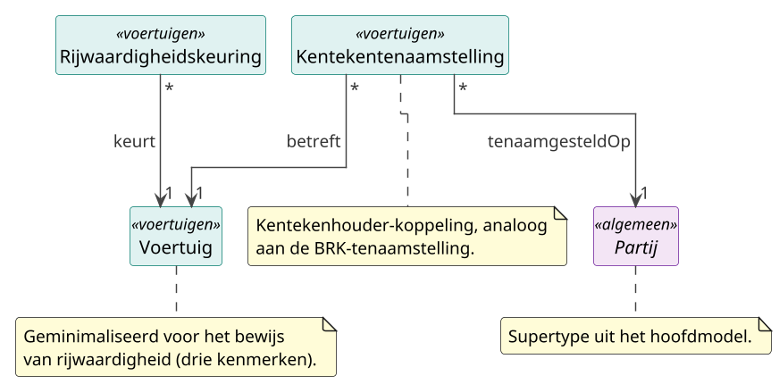

# Deelmodel: Voertuigen

Kentekenhoudende voertuigen zoals geregistreerd in het kentekenregister
(de Basisregistratie Voertuigen, beheerd door de RDW), met de
rijwaardigheidskeuring (APK) die eraan hangt en de tenaamstelling die een
voertuig aan een kentekenhouder koppelt.

Dit deelmodel is een geminimaliseerde, afnemer-gedreven snede van de
Basisregistratie Voertuigen. Opgenomen zijn alleen de kenmerken die nodig zijn
voor de grensoverschrijdende uitwisseling van het bewijs van rijwaardigheid
onder de Single Digital Gateway: drie kenmerken op het voertuig en vijf op de
keuring. De volledige voertuigregel (circa honderd open-data-kolommen plus
afgeschermde gegevens) wordt niet overgenomen. Grondslag is
gegevensminimalisatie en de proportionaliteit die aan bewijsuitwisseling wordt
gesteld: een bewijsstuk draagt niet meer gegevens dan de procedure nodig heeft.

De `Kentekentenaamstelling` valt buiten die bewijsbehoefte, maar is opgenomen om
de houderschapsrelatie expliciet te maken en het subdomein te verbinden met de
deelmodellen [Personen](personen.md) en
[Bedrijven en instellingen](bedrijven-en-instellingen.md). De constructie is
gelijk aan de tenaamstelling in [Onroerende zaken](onroerende-zaken.md).

## Diagram

## Objecttypen

### Kentekentenaamstelling

**Definitie**: De geregistreerde rechtsbetrekking waarbij een kenteken, en
daarmee een voertuig, op naam van een partij staat; die partij is daarmee de
kentekenhouder.

**Herkomst definitie**: Wegenverkeerswet 1994 en het Kentekenreglement
(tenaamstelling van een kenteken); Stelselcatalogus BRV.

**Toelichting**: Kentekentenaamstelling is een verbinding met eigen kenmerken
tussen `Partij` (de kentekenhouder) en `Voertuig`. De constructie is bewust
gelijk aan de tenaamstelling in de Basisregistratie Kadaster: de verbinding
draagt zelf gegevens (datum, historie) en laat opvolging over de tijd toe.
Omdat een partij zowel een persoon als een organisatie kan zijn, dekt deze ene
relatieklasse zowel het particuliere kenteken (op naam van een persoon) als het
zakelijke kenteken (op naam van een rechtspersoon). De identiteit van de houder
is een afgeschermd gegeven: in de open data is alleen de datum van tenaamstelling
beschikbaar, niet de persoon.

| MIM-veld | Waarde |
|---|---|
| Naam | Kentekentenaamstelling |
| MIM-element | Relatieklasse |
| Alias | Tenaamstelling (voertuig), Kentekenhouderschap |
| Begrip (URI) | `https://begrippen.gbo-semantiek.nl/id/begrip/Kentekentenaamstelling` |
| Herkomst | BRV (basisregistratie), RDW |
| Datum opname | 2026-06-16 |
| Unieke aanduiding | Samengesteld uit (Partij, Voertuig, datumTenaamstelling) |
| Populatie | Alle in het kentekenregister geregistreerde tenaamstellingen, historisch en actueel, die een kentekenhouder aan een voertuig koppelen. |

**Attribuutsoorten**:

| Naam | Type | Kard. | Authentiek | Mat. hist. | Form. hist. | Definitie | Herkomst | Toelichting |
|---|---|---|---|---|---|---|---|---|
| datumTenaamstelling | [Datum](../datatypes-en-codelijsten.md#simpele-datatypes) | 1 | Authentiek | Ja | Ja | Datum waarop het voertuig op naam van deze partij is gesteld. | BRV (RDW) | Open data. |
| datumEinde | [Datum](../datatypes-en-codelijsten.md#simpele-datatypes) | 0..1 | Authentiek | Ja | Ja | Datum waarop de tenaamstelling is geëindigd. | BRV (RDW) | Leeg betekent lopend. |
| voorkomen | Voorkomen | 1 | Basisgegeven | Ja | Ja | Bitemporele markering van werkelijke en registratie-tijdlijn. | GBO (mixin) | Zie patroon Voorkomen-mixin in [Patronen](../hoofdmodel.md#voorkomen-mixin-bitemporaliteit). |

**Relatiesoorten** (uitgaand):

| Naam | Doel | Kard. (bron→doel) | Authentiek | Mat. hist. | Form. hist. | Toelichting |
|---|---|---|---|---|---|---|
| tenaamgesteldOp | Partij | * → 1 | Authentiek | Ja | Ja | De partij op wiens naam het voertuig staat (de kentekenhouder). |
| betreft | Voertuig | * → 1 | Authentiek | Ja | Ja | Het voertuig waarop de tenaamstelling betrekking heeft. |

### Rijwaardigheidskeuring

**Definitie**: De periodieke keuring waarmee wordt vastgesteld of een voertuig
veilig en milieuverantwoord aan het verkeer kan deelnemen; in Nederland de APK
(Algemene Periodieke Keuring).

**Herkomst definitie**: Richtlijn 2014/45/EU bijlage II (technische controle);
Wegenverkeerswet 1994 en de Regeling voertuigen (APK).

**Toelichting**: De keuring wordt door een erkende keuringsinstantie aan de RDW
gemeld en in het kentekenregister vastgelegd. Een voertuig kan meerdere
keuringen over de tijd hebben; het bewijs van rijwaardigheid projecteert
doorgaans de laatst uitgevoerde, nog geldige keuring. Twee van de vijf
keuringsgegevens (keuringsdatum en vervaldatum) zijn open data; de naam van de
keuringsinstantie, de kilometerstand en de keuringsplaats zijn afgeschermd en
vergen het authentieke register of een specifiek koppelvlak.

| MIM-veld | Waarde |
|---|---|
| Naam | Rijwaardigheidskeuring |
| Alias | APK, Algemene Periodieke Keuring |
| Begrip (URI) | `https://begrippen.gbo-semantiek.nl/id/begrip/Rijwaardigheidskeuring` |
| Herkomst | BRV (basisregistratie), RDW; keuringsmelding erkende keuringsinstantie |
| Datum opname | 2026-06-16 |
| Indicatie abstract object | Nee |
| Unieke aanduiding | keuringId |
| Populatie | Elke uitgevoerde rijwaardigheidskeuring (APK) van een gekentekend voertuig. |

**Attribuutsoorten**:

| Naam | Type | Kard. | Authentiek | Mat. hist. | Form. hist. | Definitie | Herkomst | Toelichting |
|---|---|---|---|---|---|---|---|---|
| keuringId | [UUID](../datatypes-en-codelijsten.md#aanvullende-datatypes) | 1 | Basisgegeven | Nee | Nee | Interne identificatie van de keuring. | GBO Core | |
| keuringsdatum | [Datum](../datatypes-en-codelijsten.md#simpele-datatypes) | 1 | Basisgegeven | Nee | Ja | Datum waarop de keuring is uitgevoerd. | BRV (RDW) | Open data. |
| vervaldatum | [Datum](../datatypes-en-codelijsten.md#simpele-datatypes) | 1 | Basisgegeven | Nee | Ja | Uiterste datum waarop een nieuwe keuring moet zijn uitgevoerd. | BRV (RDW) | Open data; einde geldigheid van de laatste keuring. |
| keuringsinstantie | [CharacterString](../datatypes-en-codelijsten.md#simpele-datatypes) | 0..1 | Basisgegeven | Nee | Nee | Naam van de erkende instantie die de keuring heeft uitgevoerd. | BRV (RDW) | Afgeschermd; in de open data alleen een soort-erkenning-code. |
| kilometerstand | [Decimaal](../datatypes-en-codelijsten.md#simpele-datatypes) | 0..1 | Basisgegeven | Nee | Nee | Kilometerstand van het voertuig op het moment van de keuring. | BRV (RDW) | Afgeschermd. |
| keuringsplaats | [CharacterString](../datatypes-en-codelijsten.md#simpele-datatypes) | 0..1 | Basisgegeven | Nee | Nee | Plaats waar de keuring is uitgevoerd. | BRV (RDW) | Afgeschermd. |

**Relatiesoorten** (uitgaand):

| Naam | Doel | Kard. (bron→doel) | Authentiek | Mat. hist. | Form. hist. | Toelichting |
|---|---|---|---|---|---|---|
| keurt | Voertuig | * → 1 | Basisgegeven | Nee | Ja | Het gekeurde voertuig. Elke keuring hoort bij precies één voertuig. |

### Voertuig

**Definitie**: Een voertuig dat in het kentekenregister staat geregistreerd en
daarvoor een kenteken heeft gekregen, zoals een personenauto, motorfiets,
vrachtwagen, aanhangwagen of bromfiets met kenteken.

**Herkomst definitie**: Wegenverkeerswet 1994 (kentekenregister),
Kentekenreglement; Stelselcatalogus BRV.

**Toelichting**: Het voertuig is de stabiele kapstok waaraan de keuringen als
aparte feiten hangen. In dit deelmodel zijn alleen de drie identificerende en
typerende kenmerken opgenomen die het bewijs van rijwaardigheid vraagt: het
kenteken, het voertuigidentificatienummer en de voertuigcategorie. Het
voertuigidentificatienummer is in de Nederlandse open data afgeschermd, maar wel
een authentiek gegeven uit het register.

| MIM-veld | Waarde |
|---|---|
| Naam | Voertuig |
| Alias | Kentekenhoudend voertuig, Motorrijtuig |
| Begrip (URI) | `https://begrippen.gbo-semantiek.nl/id/begrip/Voertuig` |
| Herkomst | BRV (basisregistratie), kentekenregister, RDW |
| Datum opname | 2026-06-16 |
| Indicatie abstract object | Nee |
| Unieke aanduiding | kenteken |
| Populatie | Alle in het kentekenregister (BRV) opgenomen voertuigen met een toegekend kenteken. |

**Attribuutsoorten**:

| Naam | Type | Kard. | Authentiek | Mat. hist. | Form. hist. | Definitie | Herkomst | Toelichting |
|---|---|---|---|---|---|---|---|---|
| **`kenteken`** | Kenteken | 1 | Basisgegeven | Nee | Ja | Het aan het voertuig toegekende registratiekenteken. | BRV (RDW) | Open data; identificerend. Formaat-gevalideerde aanduiding. |
| voertuigidentificatienummer | [CharacterString](../datatypes-en-codelijsten.md#simpele-datatypes) | 0..1 | Basisgegeven | Nee | Nee | Het voertuigidentificatienummer (VIN) van het voertuig. | BRV (RDW) | Afgeschermd; niet in de open data. |
| voertuigcategorie | `Codelijst~EUVoertuigcategorie` | 1 | Basisgegeven | Nee | Nee | De Europese voertuigcategorie volgens de EU-typegoedkeuring. | BRV (RDW) | Open data; categorieën M, N, O en L. |

## Codelijsten

Deelmodel-specifieke codelijst. Stelselbrede codelijsten staan op de
[Datatypes en codelijsten](../datatypes-en-codelijsten.md).

| Codelijst | Bron / beheerder | GBO-typering | Gebruikt door |
|---|---|---|---|
| EU-voertuigcategorie (typegoedkeuring) | [EU-typegoedkeuring, Verordening (EU) 2018/858](https://eur-lex.europa.eu/legal-content/NL/TXT/?uri=CELEX:32018R0858), geregistreerd door [RDW](https://www.rdw.nl/) | `Codelijst~EUVoertuigcategorie` | `Voertuig.voertuigcategorie`. Hoofdcategorieën M (personen), N (goederen), O (aanhangwagens) en L (twee- en driewielers). |

## Stelselkoppelingen

- → [Personen](personen.md): `NatuurlijkPersoon` als kentekenhouder via
  `Kentekentenaamstelling` (particulier kenteken).
- → [Bedrijven en instellingen](bedrijven-en-instellingen.md):
  `NietNatuurlijkPersoon` als kentekenhouder via `Kentekentenaamstelling`
  (zakelijk kenteken). Beide takken via het `Partij`-supertype uit het
  [hoofdmodel](../hoofdmodel.md).

## Bron

Autoritatieve bron: **BRV** (Basisregistratie Voertuigen, het kentekenregister),
beheerd door de RDW. Juridische basis: Wegenverkeerswet 1994, Kentekenreglement
en de Regeling voertuigen; voor de keuring Richtlijn 2014/45/EU bijlage II.

Een deel van de gegevens is open data (kenteken, voertuigcategorie,
keuringsdatum, vervaldatum APK en datum van tenaamstelling). Het
voertuigidentificatienummer, de keuringsdetails (instantie, kilometerstand,
plaats) en de identiteit van de kentekenhouder zijn afgeschermd en alleen via
het authentieke register of een specifiek koppelvlak beschikbaar.
