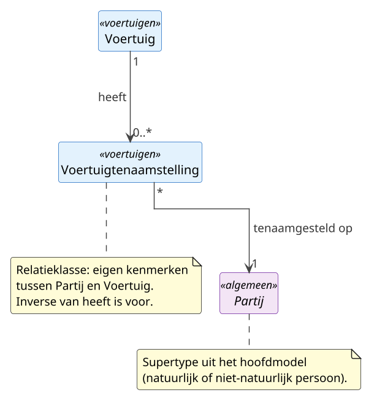

# Deelmodel: Voertuigen

Voertuigen uit de [Basisregistratie Voertuigen](https://www.rdw.nl/) (BRV,
beheerd door de RDW) en hun tenaamstelling op een partij. Het deelmodel
beschrijft de administratieve en technische kerngegevens van een voertuig
(`Voertuig`) en de rechtsbetrekking tot de eigenaar of houder
(`Voertuigtenaamstelling`).

De tenaamgestelde is een `Partij` uit het [hoofdmodel](../hoofdmodel.md):
een natuurlijk persoon (deelmodel [Personen](personen.md)) of een
niet-natuurlijke persoon (deelmodel
[Bedrijven en instellingen](bedrijven-en-instellingen.md)). RDW-sub-
registraties op detailniveau (assen, carrosserie, brandstof per meting,
geconstateerde gebreken) vallen buiten dit deelmodel.

## Diagram

## Objecttypen

### Voertuig

**Definitie**: Een door de RDW in de Basisregistratie Voertuigen
geregistreerd vervoermiddel dat met een uniek kenteken aan het verkeer
kan deelnemen, met de bij dat kenteken horende technische en
administratieve kerngegevens.

**Herkomst definitie**: Wegenverkeerswet 1994 (art. 1, art. 36 e.v.);
Kentekenreglement; RDW Kentekenregister / Open Data RDW (dataset
Gekentekende voertuigen).

**Toelichting**: Het kenteken is de praktische unieke aanduiding; het
voertuigidentificatienummer (VIN) is de wereldwijd stabiele
fabrikant-identificatie die niet wijzigt als het kenteken wijzigt.
Geschorste, geëxporteerde en gesloopte voertuigen blijven historisch
kenbaar.

| MIM-veld | Waarde |
|---|---|
| Naam | Voertuig |
| Begrip (URI) | `https://begrippen.gbo-semantiek.nl/id/begrip/Voertuig` |
| Herkomst | BRV (basisregistratie) |
| Datum opname | 2026-06-16 |
| Unieke aanduiding | kenteken |
| Populatie | Alle voertuigen in de Basisregistratie Voertuigen, inclusief geschorste, geëxporteerde en gesloopte voertuigen die nog historisch kenbaar zijn. |

**Attribuutsoorten**:

| Naam | Type | Kard. | Authentiek | Mat. hist. | Form. hist. | Definitie | Herkomst | Toelichting |
|---|---|---|---|---|---|---|---|---|
| kenteken | [Tekst](../datatypes-en-codelijsten.md#simpele-datatypes) (8) | 1 | Authentiek | Ja | Ja | Uniek kenteken van het voertuig in de Nederlandse sidecode-notatie. | RDW Kentekenregister | Notatie met streepjes, bijvoorbeeld `12-ABC-3`. |
| voertuigidentificatienummer | [Alfanumeriek](../datatypes-en-codelijsten.md#simpele-datatypes) (17) | 1 | Authentiek | Nee | Ja | Wereldwijd uniek voertuigidentificatienummer (VIN / chassisnummer). | RDW Kentekenregister / ISO 3779 | Stabiel over de levensloop; kenteken kan wijzigen, VIN niet. |
| voertuigsoort | [`Voertuigsoort`](#voertuigsoort) | 1 | Authentiek | Ja | Ja | Soort voertuig volgens de RDW-indeling. | RDW Kentekenregister | Zie [Enumeraties](#enumeraties). |
| merk | [`CodelijstRDWMerk`](#codelijsten) | 1 | Authentiek | Ja | Ja | Merk van het voertuig. | RDW Kentekenregister | Open lijst; door de RDW beheerd. |
| handelsbenaming | [Tekst](../datatypes-en-codelijsten.md#simpele-datatypes) (40) | 0..1 | Basisgegeven | Ja | Ja | Handelsbenaming (type-/modelaanduiding) van het voertuig. | RDW Kentekenregister | |
| europeseVoertuigcategorie | [`CodelijstEUVoertuigcategorie`](#codelijsten) | 0..1 | Basisgegeven | Ja | Ja | Europese voertuigcategorie (bijvoorbeeld M1, N1, L3e, O1). | EU 2018/858 / EU 168/2013 | |
| datumEersteToelating | [Datum](../datatypes-en-codelijsten.md#simpele-datatypes) | 1 | Authentiek | Ja | Ja | Datum waarop het voertuig voor het eerst tot het verkeer is toegelaten. | RDW Kentekenregister | |
| datumEersteTenaamstellingNederland | [Datum](../datatypes-en-codelijsten.md#simpele-datatypes) | 0..1 | Basisgegeven | Ja | Ja | Datum van de eerste tenaamstelling van het voertuig in Nederland. | RDW Kentekenregister | |
| brandstof | [`Brandstof`](#brandstof) | 1..* | Authentiek | Ja | Ja | Brandstof of energiedrager(s) van het voertuig. | RDW Kentekenregister | Meervoudig bij hybride aandrijving. |
| cilinderinhoud | [Numeriek](../datatypes-en-codelijsten.md#simpele-datatypes) (5) | 0..1 | Basisgegeven | Ja | Ja | Cilinderinhoud van de motor in cm³. | RDW Kentekenregister | |
| massaLedigVoertuig | [Numeriek](../datatypes-en-codelijsten.md#simpele-datatypes) (6) | 0..1 | Basisgegeven | Ja | Ja | Massa van het lege voertuig in kg. | RDW Kentekenregister | |
| toegestaneMaximumMassa | [Numeriek](../datatypes-en-codelijsten.md#simpele-datatypes) (6) | 0..1 | Basisgegeven | Ja | Ja | Technisch toegestane maximummassa van het voertuig in kg. | RDW Kentekenregister | |
| aantalZitplaatsen | [Numeriek](../datatypes-en-codelijsten.md#simpele-datatypes) (2) | 0..1 | Basisgegeven | Ja | Ja | Aantal zitplaatsen inclusief bestuurder. | RDW Kentekenregister | |
| eersteKleur | [Tekst](../datatypes-en-codelijsten.md#simpele-datatypes) (20) | 0..1 | Basisgegeven | Ja | Ja | Primaire kleur van het voertuig. | RDW Kentekenregister | |
| vervaldatumApk | [Datum](../datatypes-en-codelijsten.md#simpele-datatypes) | 0..1 | Basisgegeven | Ja | Ja | Datum waarop de algemene periodieke keuring (APK) verloopt. | RDW Kentekenregister | |
| voertuigstatus | [`Voertuigstatus`](#voertuigstatus) | 1 | Authentiek | Ja | Ja | Administratieve status van het voertuig. | RDW Kentekenregister | Zie [Enumeraties](#enumeraties). |
| voorkomen | Voorkomen | 1 | Authentiek | Ja | Ja | Bitemporele markering van werkelijke en registratie-tijdlijn. | GBO (mixin) | Zie patroon Voorkomen-mixin in [Patronen](../hoofdmodel.md#voorkomen-mixin-bitemporaliteit). |

**Relatiesoorten** (uitgaand):

| Naam | Doel | Kard. (bron→doel) | Authentiek | Mat. hist. | Form. hist. | Toelichting |
|---|---|---|---|---|---|---|
| heeft | Voertuigtenaamstelling | 1 → 0..* | Authentiek | Ja | Ja | De tenaamstelling(en) van dit voertuig, historisch en actueel. |

### Voertuigtenaamstelling

**Definitie**: De geregistreerde rechtsbetrekking tussen een partij en
een voertuig, waarmee de partij als eigenaar en/of houder van het
voertuig is geregistreerd.

**Herkomst definitie**: Wegenverkeerswet 1994 (tenaamstelling, art. 42
e.v.); Kentekenreglement; RDW Kentekenregister.

**Toelichting**: `Voertuigtenaamstelling` is een verbinding met eigen
kenmerken tussen `Partij` en `Voertuig`, vergelijkbaar met
`Tenaamstelling` in het deelmodel [Onroerende zaken](onroerende-zaken.md).
Een overdracht leidt tot een nieuwe tenaamstelling met latere
`datumTenaamstelling` terwijl de oude een `datumEinde` krijgt; zo blijven
historie en eigendomsverloop modelleerbaar.

| MIM-veld | Waarde |
|---|---|
| Naam | Voertuigtenaamstelling |
| MIM-element | Relatieklasse |
| Begrip (URI) | `https://begrippen.gbo-semantiek.nl/id/begrip/Voertuigtenaamstelling` |
| Herkomst | BRV (basisregistratie) |
| Datum opname | 2026-06-16 |
| Unieke aanduiding | Samengesteld uit (Partij, Voertuig, datumTenaamstelling) |
| Populatie | Alle in de Basisregistratie Voertuigen geregistreerde tenaamstellingen, historisch en actueel, die een partij aan een voertuig koppelen. |

**Attribuutsoorten**:

| Naam | Type | Kard. | Authentiek | Mat. hist. | Form. hist. | Definitie | Herkomst | Toelichting |
|---|---|---|---|---|---|---|---|---|
| rol | [`Tenaamstellingsrol`](#tenaamstellingsrol) | 1 | Authentiek | Ja | Ja | Hoedanigheid waarin de partij is tenaamgesteld: eigenaar, houder of beide. | RDW Kentekenregister | Zie [Enumeraties](#enumeraties). |
| datumTenaamstelling | [Datum](../datatypes-en-codelijsten.md#simpele-datatypes) | 1 | Authentiek | Ja | Ja | Datum waarop de tenaamstelling is ingegaan. | RDW Kentekenregister | |
| datumEinde | [Datum](../datatypes-en-codelijsten.md#simpele-datatypes) | 0..1 | Authentiek | Ja | Ja | Datum waarop de tenaamstelling is geëindigd. | RDW Kentekenregister | Leeg betekent lopend. |
| voorkomen | Voorkomen | 1 | Authentiek | Ja | Ja | Bitemporele markering van werkelijke en registratie-tijdlijn. | GBO (mixin) | Zie patroon Voorkomen-mixin in [Patronen](../hoofdmodel.md#voorkomen-mixin-bitemporaliteit). |

**Relatiesoorten** (uitgaand):

| Naam | Doel | Kard. (bron→doel) | Authentiek | Mat. hist. | Form. hist. | Toelichting |
|---|---|---|---|---|---|---|
| tenaamgesteldeOp | Partij | * → 1 | Authentiek | Ja | Ja | De partij die als eigenaar en/of houder is geregistreerd. |
| voor | Voertuig | * → 1 | Authentiek | Ja | Ja | Voertuig waarvoor de tenaamstelling geldt. |

## Enumeraties

### Voertuigsoort

**Definitie**: Soort voertuig volgens de indeling van de RDW.

**Herkomst definitie**: RDW Kentekenregister; Wegenverkeerswet 1994;
Kentekenreglement.

**Toelichting**: Verzameling van de gangbare RDW-voertuigsoorten; bepaalt
mede welke keurings- en kentekenregels van toepassing zijn.

| MIM-veld | Waarde |
|---|---|
| Naam | Voertuigsoort |
| Begrip (URI) | `https://begrippen.gbo-semantiek.nl/id/begrip/Voertuigsoort` |
| Herkomst | RDW |
| Datum opname | 2026-06-16 |

**Gebruikt door**: `Voertuig.voertuigsoort`.

**Waarden**:

| Naam | Definitie |
|---|---|
| Personenauto | Motorvoertuig voor het vervoer van personen (categorie M1). |
| Bedrijfsauto | Motorvoertuig voor het vervoer van goederen (categorie N). |
| Bus | Motorvoertuig voor het vervoer van meer dan acht personen naast de bestuurder. |
| Motorfiets | Tweewielig motorvoertuig (categorie L3e/L4e). |
| Bromfiets | Licht twee- of driewielig motorvoertuig met beperkte constructiesnelheid (categorie L1e/L2e). |
| DriewieligMotorrijtuig | Driewielig motorrijtuig (categorie L5e). |
| Aanhangwagen | Niet-zelfstandig voertuig dat wordt voortbewogen. |
| Oplegger | Aanhangwagen die met een deel van zijn massa op het trekkende voertuig rust. |
| LandOfBosbouwtrekker | Land- of bosbouwtrekker (categorie T). |
| MobieleMachine | Zelfrijdende of getrokken mobiele machine. |

### Brandstof

**Definitie**: Brandstof of energiedrager waarmee een voertuig wordt
aangedreven.

**Herkomst definitie**: RDW Kentekenregister (brandstof-omschrijving).

**Toelichting**: Een voertuig kan meerdere brandstoffen voeren (hybride
aandrijving); daarom is het attribuut `Voertuig.brandstof` meervoudig.

| MIM-veld | Waarde |
|---|---|
| Naam | Brandstof |
| Begrip (URI) | `https://begrippen.gbo-semantiek.nl/id/begrip/Brandstof` |
| Herkomst | RDW |
| Datum opname | 2026-06-16 |

**Gebruikt door**: `Voertuig.brandstof`.

**Waarden**:

| Naam | Definitie |
|---|---|
| Benzine | Aandrijving op benzine. |
| Diesel | Aandrijving op diesel. |
| LPG | Aandrijving op lpg (autogas). |
| CNG | Aandrijving op aardgas (CNG). |
| Elektriciteit | Volledig elektrische aandrijving. |
| Waterstof | Aandrijving op waterstof (brandstofcel of verbranding). |
| Alcohol | Aandrijving op alcohol/ethanol. |
| Overige | Andere brandstof of energiedrager. |

### Voertuigstatus

**Definitie**: Administratieve status van een voertuig in de
Basisregistratie Voertuigen.

**Herkomst definitie**: RDW Kentekenregister; Wegenverkeerswet 1994.

**Toelichting**: Een voertuig heeft op elk moment precies één status.

| MIM-veld | Waarde |
|---|---|
| Naam | Voertuigstatus |
| Begrip (URI) | `https://begrippen.gbo-semantiek.nl/id/begrip/Voertuigstatus` |
| Herkomst | RDW |
| Datum opname | 2026-06-16 |

**Gebruikt door**: `Voertuig.voertuigstatus`.

**Waarden**:

| Naam | Definitie |
|---|---|
| Tenaamgesteld | Het voertuig staat op naam van een partij. |
| Bedrijfsvoorraad | Het voertuig staat in de bedrijfsvoorraad van een erkend bedrijf en is niet op naam gesteld. |
| Geschorst | De tenaamstelling is geschorst; het voertuig mag tijdelijk niet aan het verkeer deelnemen. |
| Geexporteerd | Het voertuig is uit Nederland uitgevoerd. |
| Gesloopt | Het voertuig is aantoonbaar vernietigd (gesloopt). |
| Vermist | Het voertuig is als vermist of gestolen geregistreerd. |

### Tenaamstellingsrol

**Definitie**: Hoedanigheid waarin een partij op een voertuig is
tenaamgesteld.

**Herkomst definitie**: Wegenverkeerswet 1994 (eigenaar/houder);
Kentekenreglement.

**Toelichting**: Onderscheidt eigendom van houderschap; bij lease is de
leasemaatschappij doorgaans eigenaar en de leasenemer houder.

| MIM-veld | Waarde |
|---|---|
| Naam | Tenaamstellingsrol |
| Begrip (URI) | `https://begrippen.gbo-semantiek.nl/id/begrip/Tenaamstellingsrol` |
| Herkomst | RDW |
| Datum opname | 2026-06-16 |

**Gebruikt door**: `Voertuigtenaamstelling.rol`.

**Waarden**:

| Naam | Definitie |
|---|---|
| Eigenaar | De partij is eigenaar van het voertuig. |
| Houder | De partij is houder van het voertuig (bijvoorbeeld lease) zonder eigenaar te zijn. |
| EigenaarEnHouder | De partij is zowel eigenaar als houder. |

## Codelijsten

Deelmodel-specifieke codelijsten; extern beheerd en daarom als
`«Codelijst»`-type gemodelleerd (geen gesloten enumeratie).

| Codelijst | Bron / beheerder | Gebruikt door |
|---|---|---|
| `CodelijstRDWMerk` | [RDW Open Data](https://opendata.rdw.nl/) | `Voertuig.merk`. Open, door de RDW beheerde merkenlijst. |
| `CodelijstEUVoertuigcategorie` | [EU 2018/858](https://eur-lex.europa.eu/legal-content/NL/TXT/?uri=CELEX:32018R0858) / [EU 168/2013](https://eur-lex.europa.eu/legal-content/NL/TXT/?uri=CELEX:32013R0168) | `Voertuig.europeseVoertuigcategorie`. Europese voertuigcategorieën (M, N, O, L, T, ...). |

## Stelselkoppelingen

- → [Personen](personen.md): `NatuurlijkPersoon` als tenaamgestelde via
  `Voertuigtenaamstelling`.
- → [Bedrijven en instellingen](bedrijven-en-instellingen.md):
  `NietNatuurlijkPersoon` als tenaamgestelde via
  `Voertuigtenaamstelling`. Beide takken via het `Partij`-supertype uit
  het [hoofdmodel](../hoofdmodel.md).

## Bron

Autoritatieve bron: **BRV** (Basisregistratie Voertuigen), beheerd door
de [RDW](https://www.rdw.nl/). Juridische basis: Wegenverkeerswet 1994,
Kentekenreglement. Het kentekenregister wordt ontsloten via
[Open Data RDW](https://opendata.rdw.nl/) (dataset Gekentekende
voertuigen) en de RDW-bevragings-API's. Detailgegevens van de RDW
(assen, carrosserie, brandstof per meting, geconstateerde gebreken,
terugroepacties) vallen buiten dit deelmodel; ze kunnen later via
hetzelfde patroon (L1 datamodel of catalogus, L2 koppelvlak) worden
toegevoegd.
