# Hoofdmodel (compact)

Compacte projectie van het [hoofdmodel](hoofdmodel.md), bedoeld voor
presentaties en overzichts-slides. Subtypen, cardinaliteiten en
edge-labels zijn weggelaten; alleen de klassen die de DVTP-databehoefte
dragen blijven zichtbaar.

Per deelmodel staat de klasse waarmee de DVTP-pilot-rijen direct
mappen voorop: `StudieLening` (saldo, maandtermijn, aflostermijn)
voor DUO, `Arbeidsverhouding` plus `LoonBestanddeel` voor de
UWV-loonketen, `Aftrekpost` plus `AuthentiekInkomen` voor de
Belastingdienst, `KredietOvereenkomst` plus `AchterstandRegistratie`
voor BKR, en `Tenaamstelling` plus `ZakelijkRecht` voor Kadaster.

Voor de volledige versie met subtypen en cardinaliteiten, zie
[hoofdmodel](hoofdmodel.md). Voor de details per deelmodel, zie de
[deelmodellen](deelmodellen/).

## Diagram

```plantuml
@startuml
!pragma layout elk

skinparam dpi 110
skinparam classAttributeIconSize 0
skinparam shadowing false
skinparam roundCorner 6
skinparam ClassBackgroundColor #FAFAFA
skinparam ClassBorderColor #555555
skinparam ArrowColor #444444
skinparam ArrowFontColor #333333
skinparam ArrowFontSize 10
hide empty members
hide circle

skinparam class<<algemeen>> {
  BackgroundColor #f3e5f5
  BorderColor #6a1b9a
  HeaderBackgroundColor #f3e5f5
}
skinparam class<<personen>> {
  BackgroundColor #e8f0fe
  BorderColor #1967d2
  HeaderBackgroundColor #e8f0fe
}
skinparam class<<bedrijven-en-instellingen>> {
  BackgroundColor #fff4e5
  BorderColor #e67e22
  HeaderBackgroundColor #fff4e5
}
skinparam class<<adressen-en-gebouwen>> {
  BackgroundColor #e8f5e9
  BorderColor #2e7d32
  HeaderBackgroundColor #e8f5e9
}
skinparam class<<onroerende-zaken>> {
  BackgroundColor #fde8d6
  BorderColor #a04000
  HeaderBackgroundColor #fde8d6
}
skinparam class<<waarde-onroerende-zaken>> {
  BackgroundColor #fce4ec
  BorderColor #ad1457
  HeaderBackgroundColor #fce4ec
}
skinparam class<<belastingen>> {
  BackgroundColor #ede7f6
  BorderColor #4527a0
  HeaderBackgroundColor #ede7f6
}
skinparam class<<krediet>> {
  BackgroundColor #e1f0fa
  BorderColor #1e6091
  HeaderBackgroundColor #e1f0fa
}
skinparam class<<onderwijs>> {
  BackgroundColor #fff8e1
  BorderColor #b08800
  HeaderBackgroundColor #fff8e1
}
skinparam class<<werk-en-inkomen>> {
  BackgroundColor #ffe9c2
  BorderColor #b87a00
  HeaderBackgroundColor #ffe9c2
}

' ---- Supertype + persoons-kern (BRP / KVK) ----
abstract class Partij <<algemeen>>
class NatuurlijkPersoon <<personen>>
class Verbintenis <<personen>>
abstract class NietNatuurlijkPersoon <<bedrijven-en-instellingen>>
class Vestiging <<bedrijven-en-instellingen>>

' ---- Vastgoed: BAG ----
together {
  abstract class Adres <<adressen-en-gebouwen>>
  abstract class AdresseerbaarObject <<adressen-en-gebouwen>>
  class Pand <<adressen-en-gebouwen>>
}

' ---- Vastgoed: Kadaster (BRK) ----
together {
  abstract class KadastraleOnroerendeZaak <<onroerende-zaken>>
  class Tenaamstelling <<onroerende-zaken>>
  class ZakelijkRecht <<onroerende-zaken>>
}

' ---- Vastgoed: WOZ ----
class WOZWaarde <<waarde-onroerende-zaken>>

' ---- Fiscaal (Belastingdienst) ----
together {
  class AuthentiekInkomen <<belastingen>>
  class LoonBestanddeel <<belastingen>>
  abstract class Aftrekpost <<belastingen>>
}

' ---- Werk en inkomen (UWV / SVB) ----
together {
  class Arbeidsverhouding <<werk-en-inkomen>>
  abstract class Uitkering <<werk-en-inkomen>>
}

' ---- Krediet (BKR) ----
together {
  abstract class KredietOvereenkomst <<krediet>>
  class AchterstandRegistratie <<krediet>>
}

' ---- Onderwijs (DUO) ----
class StudieLening <<onderwijs>>

' ---- Generalisatie ----
Partij <|-- NatuurlijkPersoon
Partij <|-- NietNatuurlijkPersoon

' ---- Persoons-relaties ----
NatuurlijkPersoon --> Verbintenis
NietNatuurlijkPersoon --> Vestiging

' ---- Adressen + BAG ----
NatuurlijkPersoon --> Adres
Vestiging --> Adres
AdresseerbaarObject --> Adres
Pand --> KadastraleOnroerendeZaak

' ---- BRK + WOZ ----
ZakelijkRecht --> KadastraleOnroerendeZaak
Tenaamstelling --> ZakelijkRecht
Partij --> Tenaamstelling
WOZWaarde --> AdresseerbaarObject

' ---- Fiscaal (BD) ----
AuthentiekInkomen --> NatuurlijkPersoon
LoonBestanddeel --> Arbeidsverhouding
Aftrekpost --> NatuurlijkPersoon
Aftrekpost --> KadastraleOnroerendeZaak

' ---- Werk en inkomen (UWV) ----
Arbeidsverhouding --> NatuurlijkPersoon
Arbeidsverhouding --> NietNatuurlijkPersoon
Uitkering --> NatuurlijkPersoon

' ---- Krediet (BKR) ----
KredietOvereenkomst --> NatuurlijkPersoon
KredietOvereenkomst --> KadastraleOnroerendeZaak
AchterstandRegistratie --> KredietOvereenkomst

' ---- Onderwijs (DUO) ----
StudieLening --> NatuurlijkPersoon

@enduml
```

