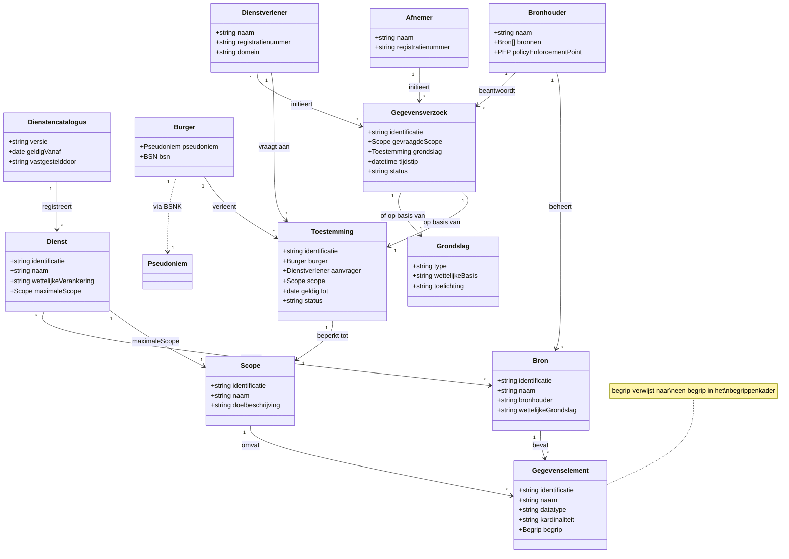

# Informatiemodel GBO-Voorzieningen

Het informatiemodel voor de Gemeenschappelijke Bron Ontsluiting opereert als laag 2 in de semantische architectuur: het definieert de *structuur* van gegevens en verwijst voor *betekenis* naar het begrippenkader (laag 1). Zie de [gegevensarchitectuur](../architectuur/gegevensarchitectuur.md) voor de positie van dit model in het geheel.

Het informatiemodel beschrijft in één samenhangend geheel welke gegevens er zijn, wie erbij betrokken is en onder welke voorwaarden gegevens mogen worden gedeeld. Per domein kunnen **extensies** worden gemaakt die het generieke model uitbreiden met domeinspecifieke gegevenselementen.

!!! info "Afbakening"
    Begrippen (definities, labels, relaties tussen termen) worden *niet* in het informatiemodel beheerd maar in het begrippenkader. Elk objecttype en gegevenselement in het informatiemodel verwijst naar precies één begrip in het begrippenkader voor zijn betekenis.

---

## Objecttypen en relaties

Het informatiemodel definieert de herbruikbare objecttypen die voor elk GBO-domein gelden. Een nieuw domein importeert dit model en voegt alleen domeinspecifieke gegevenselementen toe.

---

## Toelichting objecttypen

**Gegevenselement** is de kleinste adresseerbare eenheid van data. Elk gegevenselement verwijst via `begrip` naar precies één begrip in het begrippenkader. Het gegevenselement voegt structuurinformatie toe die het begrip niet heeft: datatype, kardinaliteit en positie in een objectstructuur.

**Bron** is een registratie of gegevensverzameling bij een bronhouder. Een bron bevat gegevenselementen en heeft een wettelijke grondslag. Voorbeelden: BRP, Kadaster, BRK.

**Dienst** beschrijft een afgebakend doel waarvoor gegevens mogen worden opgevraagd. Een dienst is wettelijk verankerd (AMvB of ministeriële regeling) en heeft een maximale scope.

**Scope** is een benoemde verzameling gegevenselementen. De maximale scope wordt bepaald door wetgeving; een afnemer kan een kleinere scope aanvragen (dataminimalisatie).

**Dienstencatalogus** is het register van alle beschikbare diensten met hun scopes.

**Burger** is de persoon over wie gegevens worden uitgewisseld. In de context van GBO heeft de burger altijd een BSN, maar private dienstverleners ontvangen een pseudoniem via het BSNK-koppelregister. De burger verleent expliciet toestemming via het toestemmingsportaal.

**Bronhouder** beheert een of meer bronregistraties en is verantwoordelijk voor het Policy Enforcement Point (PEP) dat elk gegevensverzoek toetst op identiteit, autorisatie en grondslag.

**Dienstverlener** is de partij die namens of ten behoeve van de burger gegevens opvraagt. De dienstverlener vraagt toestemming aan bij de burger en specificeert daarbij een scope.

**Afnemer** is de partij die de gegevens uiteindelijk gebruikt. Dit kan dezelfde partij zijn als de dienstverlener, of een andere partij (bijvoorbeeld de bank die een hypotheek verstrekt, met een aparte toestemming).

**Toestemming** is het expliciete akkoord van de burger dat een specifieke dienstverlener een specifieke set gegevens mag opvragen. Een toestemming is altijd gebonden aan een scope, heeft een geldigheidsduur en is niet overdraagbaar.

**Gegevensverzoek** is de technische transactie waarmee een dienstverlener of afnemer brondata opvraagt. Elk verzoek verwijst naar een toestemming (of een wettelijke grondslag) en specificeert welke gegevenselementen worden opgevraagd.

**Grondslag** beschrijft de juridische basis voor gegevensuitwisseling. Dit kan toestemming van de burger zijn, maar ook een wettelijke verplichting (bijvoorbeeld bij leningverstrekking waar BSN noodzakelijk is).
