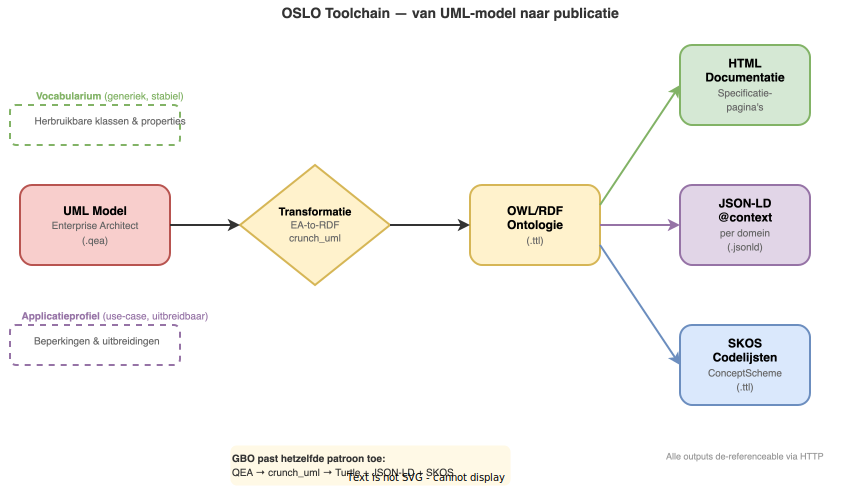

# Inspiratie uit vergelijkbare initiatieven

GBO-Semantiek bouwt voort op bewezen patronen van vergelijkbare initiatieven. Dit hoofdstuk beschrijft de vier belangrijkste referenties en de lessen die GBO daaruit trekt.

## OSLO — Open Standaarden voor Linkende Organisaties

[OSLO](https://data.vlaanderen.be/) is het Vlaamse initiatief voor semantische interoperabiliteit en het meest vergelijkbare voorbeeld voor GBO. De kernstructuur werkt met twee lagen:

- **Vocabularia** — generieke, herbruikbare klassen en properties, gepubliceerd als OWL-ontologie in Turtle
- **Applicatieprofielen** — use-case-specifieke uitbreidingen en beperkingen van die vocabularia

De OSLO-toolchain loopt van UML-modellering in Enterprise Architect via een transformatietool (`EA-to-RDF`) naar een Turtle-ontologie. Daaruit worden vervolgens HTML-documentatie en **JSON-LD context-bestanden per domein** gegenereerd (bijv. `adres.jsonld`, `persoon.jsonld`, `organisatie.jsonld`). Codelijsten en waardelijsten worden als SKOS `ConceptScheme` gepubliceerd en zijn de-referenceable via HTTP.

!!! tip "Les voor GBO"
    De scheiding tussen *vocabularium* (generiek, stabiel) en *applicatieprofiel* (use-case-specifiek, uitbreidbaar) is architectureel cruciaal. GBO past hetzelfde patroon toe: QEA-model → crunch_uml → Turtle ontologie + JSON-LD context + SKOS codelijsten.

## TOOI — Thesauri en Ontologieën voor OverheidsInformatie

[TOOI](https://tardis.overheid.nl/) is het Nederlandse rijksoverheid-equivalent en hanteert een modulaire documentstructuur met vier typen modules:

| Module-type | Beschrijving | Technologie |
|-------------|--------------|-------------|
| **Ontologie** | Klassen, properties, bedrijfsregels | RDF/OWL |
| **Thesaurus** | Gestructureerde begrippenverzameling | SKOS |
| **Register** | Authentieke gegevensverzameling | RDF + SKOS |
| **Waardelijst** | Selectie uit thesaurus/register | SKOS subset |

De ontologie en thesauri zijn **gescheiden documenten** die apart worden beheerd en gepubliceerd, maar via URI's en `skos:exactMatch`-relaties aan elkaar worden gekoppeld. Dit maakt duidelijk dat de thesaurus de *betekenis* legt (begrijpelijk voor domeinexperts) en de ontologie de *structuur* formaliseert (bruikbaar door machines en ontwikkelaars).

!!! tip "Les voor GBO"
    GBO neemt de modulaire publicatiestrategie over: begrippenkader (SKOS), informatiemodel (MIM), ontologie (OWL) en context-bestanden (JSON-LD) worden elk als apart artefact met een eigen URI gepubliceerd.

## GGM en RSGB: gemeentelijke bronmodellen

Het [Gemeentelijk Gegevensmodel (GGM)](https://github.com/gemeenteshertogenbosch/GGM) is een open informatiemodel dat de gegevensstructuren beschrijft die gemeenten gebruiken in hun informatiehuishouding. Het GGM is MIM-conform, wordt beheerd in Enterprise Architect en dekt een breed scala aan gemeentelijke domeinen, van burgerzaken en sociaal domein tot ruimtelijke ordening. Het oudere [Referentiemodel Stelsel van Gemeentelijke Basisgegevens (RSGB)](https://www.gemmaonline.nl/index.php/Referentiemodel_Stelsel_van_Gemeentelijke_Basisgegevens) vormt daarbinnen de historische baseline voor de kern van basisregistratiegegevens.

GBO-Semantiek gebruikt het GGM, samen met het RSGB en de modellen van de landelijke basisregistraties, als **belangrijke inhoudelijke bron** voor het informatiemodel. De toolchain van het GGM (Enterprise Architect, crunch_uml, gegenereerde documentatie en artefacten) is overgenomen en uitgebreid met semantische publicatie (ontologie, JSON-LD context, SKOS begrippenkader).

!!! tip "Les voor GBO"
    GGM en RSGB leveren het bewijs dat een breed, MIM-conform informatiemodel voor gemeenten haalbaar en onderhoudbaar is. GBO bouwt hierop voort, verbreedt de scope tot een landelijke, sectoroverstijgende standaard en voegt de semantische laag toe: van gegevensmodel naar betekenismodel.

## UBO — Uniforme Bronontsluiting

De architectuur voor Uniforme Bronontsluiting (UBO) — het concrete uitvoeringsproject van GBO — hanteert een documentstructuur met per architectuuronderdeel: kaders, ontwerpbeslissingen, processtappen en componenten. De datamodellen in UBO zijn gebaseerd op het GGM.

!!! tip "Les voor GBO"
    Het UBO-architectuurdocument biedt een goede basisstructuur per architectuuronderdeel, die GBO uitbreidt met een volledig semantisch raamwerk.
