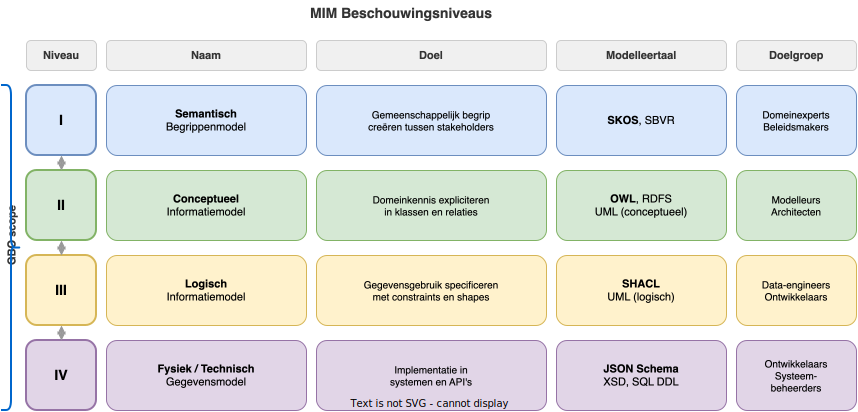

# Kaders  en standaarden

GBO-Semantiek opereert binnen een landschap van architectuurkaders en technische standaarden. Dit hoofdstuk beschrijft eerst de kaders die de context en spelregels bepalen, en vervolgens de standaarden die GBO technisch invullen.

## Kaders

### NORA — Nederlandse Overheid Referentie Architectuur

[NORA](https://www.noraonline.nl/) is het overkoepelende architectuurkader voor de Nederlandse overheid. Het beschrijft principes, richtlijnen en standaarden voor de informatievoorziening van alle overheidsorganisaties.

**Toepassing in GBO-Semantiek:**
GBO volgt de NORA-principes die direct raken aan gegevensuitwisseling: *eenmalige registratie, meervoudig gebruik*, *open standaarden*, en *transparantie*. Het semantisch raamwerk is een concrete invulling van het NORA-principe dat gegevens een eenduidige betekenis moeten hebben die door alle partijen wordt begrepen.

### Federatief Datastelsel (FDS)

Het [Federatief Datastelsel](https://federatiefdatastelsel.nl/) is een programma van de Nederlandse overheid dat beoogt overheidsdata beter vindbaar, toegankelijk en herbruikbaar te maken door bronnen federatief te verbinden.

**Toepassing in GBO-Semantiek:**
GBO ondersteunt de FDS-ambities door gegevens als Linked Data te publiceren met persistente URI's, machine-leesbare metadata en gestandaardiseerde vocabulaires. Het begrippenkader en de ontologie maken GBO-gegevens vindbaar en koppelbaar binnen het bredere federatieve stelsel.

---

## Standaarden

### MIM — Metamodel Informatiemodellering

[MIM](https://www.geonovum.nl/geo-standaarden/mim) is de Nederlandse overheidsstandaard voor het beschrijven van informatiemodellen, ontwikkeld door Geonovum in samenwerking met VNG en Kadaster. MIM onderscheidt vier beschouwingsniveaus:

**Rol in GBO-Semantiek:**
MIM is het metamodel waarmee het GBO-informatiemodel is opgesteld. GBO adresseert alle vier de MIM-niveaus: het begrippenkader (niveau I, SKOS), het conceptueel en logisch informatiemodel (niveau II/III, OWL/SHACL), en de technische representatie (niveau IV, JSON-LD/JSON Schema). MIM maakt duidelijk dat begrippenkader en informatiemodel *verschillende lagen* zijn die elk hun eigen doelgroep hebben.

:material-check-circle: **Forum Standaardisatie:** MIM staat op de [lijst met aanbevolen standaarden](https://forumstandaardisatie.nl/open-standaarden/mim).

### NEN 3610 — Basismodel Geo-informatie

[NEN 3610](https://www.geonovum.nl/geo-standaarden/nen-3610-basismodel-geo-informatie) is het Nederlandse basismodel voor geo-gerelateerde informatieobjecten. Het biedt een gemeenschappelijk kader voor de modellering van geo-informatie en definieert basisconcepten zoals geo-object, registratief object en functioneel object.

**Rol in GBO-Semantiek:**
Waar het GBO-informatiemodel geo-gerelateerde objecten bevat (bijv. locaties, adressen, gebieden), wordt NEN 3610 gevolgd voor de modellering daarvan. Dit garandeert interoperabiliteit met andere geo-informatiemodellen binnen de overheid.

:material-check-circle: **Forum Standaardisatie:** NEN 3610 staat op de [lijst met verplichte standaarden](https://forumstandaardisatie.nl/open-standaarden/nen-3610) (pas-toe-of-leg-uit).

### DCAT-AP-NL

[DCAT-AP-NL](https://data.overheid.nl/ondersteuning/open-data/dcat) is de Nederlandse toepassing van de Europese DCAT-standaard (Data Catalog Vocabulary Application Profile) voor het beschrijven van datasets in datacatalogi. Het is gebaseerd op het W3C DCAT-vocabularium en de Europese DCAT-AP.

**Rol in GBO-Semantiek:**
De gepubliceerde GBO-artefacten (ontologie, begrippenkader, waardelijsten) worden beschreven conform DCAT-AP-NL, zodat ze vindbaar zijn in datacatalogi zoals data.overheid.nl en het Nationaal Georegister.

:material-check-circle: **Forum Standaardisatie:** DCAT staat op de [lijst met aanbevolen standaarden](https://forumstandaardisatie.nl/open-standaarden/dcat).

### SKOS — Simple Knowledge Organization System

[SKOS](https://www.w3.org/2004/02/skos/) is de W3C-standaard voor het beschrijven van begrippenkaders, thesauri en taxonomieën in RDF. SKOS biedt een eenvoudig vocabularium voor het vastleggen van begrippen (`skos:Concept`), hun definities, hiërarchische relaties (breder/smaller) en associatieve relaties.

**Rol in GBO-Semantiek:**
SKOS is de taal van het **begrippenkader** — de semantische basis van GBO. Alle domeinbegrippen worden gepubliceerd als SKOS ConceptScheme. Waardelijsten en codelijsten worden eveneens als SKOS gepubliceerd, zodat ze de-referenceable en machine-leesbaar zijn.

:material-check-circle: **Forum Standaardisatie:** SKOS staat op de [lijst met aanbevolen standaarden](https://forumstandaardisatie.nl/open-standaarden/skos).

### NL-SBB — Standaard voor het Beschrijven van Begrippen

[NL-SBB](https://docs.geostandaarden.nl/nl-sbb/nl-sbb/) is de Nederlandse standaard voor het beschrijven van begrippen, ontwikkeld door Geonovum. NL-SBB biedt een profiel bovenop SKOS dat specifiek is afgestemd op de Nederlandse overheidspraktijk. Het schrijft voor hoe begrippen, hun definities, bronverwijzingen en onderlinge relaties worden vastgelegd, zodat begrippenkaders van verschillende organisaties onderling vergelijkbaar en koppelbaar zijn.

**Rol in GBO-Semantiek:**
Het GBO-begrippenkader wordt opgesteld conform NL-SBB. Dit garandeert dat de begrippen aansluiten bij andere overheids-begrippenkaders (zoals die van basisregistraties) en opgenomen kunnen worden in de stelselcatalogus.

:material-check-circle: **Forum Standaardisatie:** NL-SBB staat op de [lijst met aanbevolen standaarden](https://forumstandaardisatie.nl/open-standaarden/nl-sbb).

### OWL — Web Ontology Language

[OWL](https://www.w3.org/OWL/) is de W3C-standaard voor het beschrijven van ontologieën op het semantische web. OWL maakt het mogelijk om klassen, eigenschappen, restricties en hiërarchieën formeel te definiëren, zodat machines hierover kunnen redeneren.

**Rol in GBO-Semantiek:**
OWL is de taal van de **gepubliceerde ontologie**. Het informatiemodel (opgesteld in MIM/UML) wordt getransformeerd naar een OWL-ontologie in Turtle-formaat. Deze ontologie vormt het machine-leesbare contract waaraan API's en datapublicaties refereren.

### JSON-LD — JSON for Linking Data

[JSON-LD](https://www.w3.org/TR/json-ld11/) is de W3C-standaard die reguliere JSON-data voorziet van semantische context door middel van een `@context`-verwijzing naar een ontologie. JSON-LD maakt het mogelijk om bestaande JSON-API's met minimale aanpassing Linked Data-compatibel te maken.

**Rol in GBO-Semantiek:**
JSON-LD is het **publicatieformaat voor API-responses**. De `@context`-bestanden koppelen JSON-sleutels aan ontologie-URI's, zodat elke ontvanger weet wat de gegevens semantisch betekenen. GBO publiceert context-bestanden per informatiemodel, naar het OSLO-patroon.

### SHACL — Shapes Constraint Language

[SHACL](https://www.w3.org/TR/shacl/) is de W3C-standaard voor het valideren van RDF-data. SHACL-shapes beschrijven de verwachte structuur van data: welke klassen welke eigenschappen moeten hebben, met welke cardinaliteit en welke datatypes.

**Rol in GBO-Semantiek:**
SHACL wordt ingezet voor **kwaliteitsborging**. De shapes valideren of gepubliceerde data conform de ontologie is: verplichte velden aanwezig, datatypes correct, cardinaliteiten gerespecteerd. SHACL is complementair aan JSON Schema-validatie en werkt op RDF-niveau.

### RDF — Resource Description Framework

[RDF](https://www.w3.org/RDF/) is het W3C-fundament voor Linked Data. RDF beschrijft gegevens als een graaf van subject-predikaat-object triples, waardoor data uit verschillende bronnen naadloos kan worden gecombineerd.

**Rol in GBO-Semantiek:**
RDF is de **onderliggende datataal** van alle semantische artefacten. Het begrippenkader (SKOS), de ontologie (OWL) en de validatieshapes (SHACL) zijn allemaal RDF-gebaseerd. Het primaire serialisatieformaat is Turtle (`.ttl`) vanwege de leesbaarheid.

### VC — verifiable Credentials

[Verifiable Credentials](https://www.w3.org/TR/vc-data-model/) is de W3C-standaard voor het uitwisselen van cryptografisch ondertekende, verifieerbare verklaringen over een subject. Een VC is controleerbaar door een ontvanger zonder dat de uitgever opnieuw geraadpleegd hoeft te worden, en vormt samen met Decentralized Identifiers (DID's) de basis voor betrouwbare digitale gegevensuitwisseling.

**Rol in GBO-Semantiek:**
VC's bieden een mechanisme om GBO-gegevens **verifieerbaar uit te wisselen** tussen gemeenten, ketenpartners en burgers. Doordat VC's gebruikmaken van JSON-LD en `@context`, sluiten ze direct aan op de GBO-ontologie: de semantiek van de uitgewisselde attributen is eenduidig vastgelegd conform het begrippenkader.
