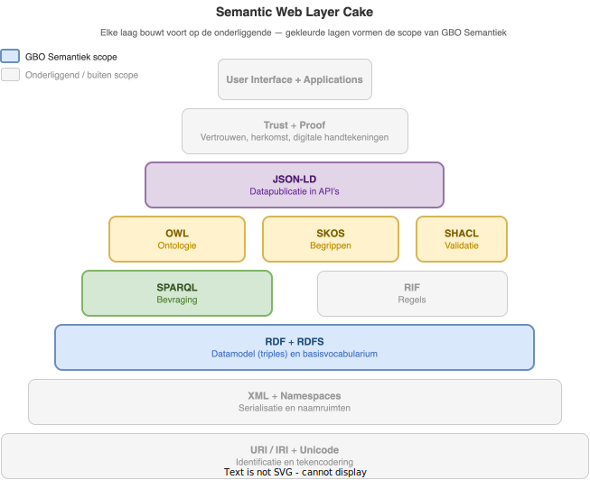
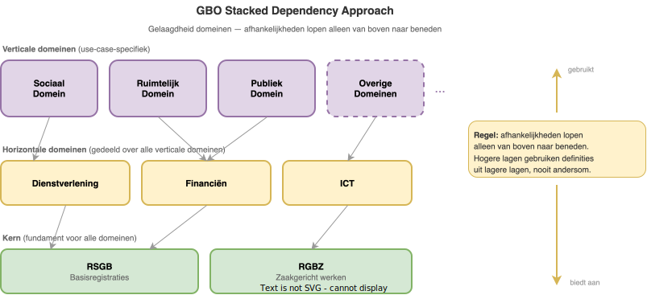

# Ontwerpprincipes

Ontwerpprincipes zijn de richtinggevende uitgangspunten voor alle keuzes bij het ontwerp van het semantisch raamwerk van GBO. Ze beschrijven *waarom* we iets op een bepaalde manier doen en vormen de toetssteen bij het maken van het begrippenkader, het informatiemodel, de ontologie en de JSON-LD publicatie.

De principes zijn afgeleid uit de Nederlandse overheidskaders (NORA, GEMMA, MIM), het Vlaamse OSLO-initiatief, de W3C Linked Data best practices, de FAIR-principes en internationale ontologiemethodologieën (LOT, MODDALS). Ze dienen als basis voor de ontwikkeling van GBO-Semantiek en zijn bindend voor alle betrokken partijen.

## Linked Data principes

GBO-Semantiek publiceert volgens de standaarden van het Semantic Web. Het onderstaande [*layer cake*-model](https://en.wikipedia.org/wiki/Semantic_Web_Stack) toont hoe de technologieën op elkaar voortbouwen, van URI's als fundament tot applicaties aan de top. De gekleurde lagen zijn de technologieën die GBO-Semantiek inzet; de grijze lagen zijn onderliggende infrastructuur of vallen buiten scope.

De vier [Linked Data-principes](https://www.w3.org/DesignIssues/LinkedData.html) van Tim Berners-Lee zijn het fundament van de semantische publicatiestrategie:

1. **Gebruik URI's als namen voor dingen**, zowel voor concepten, klassen, properties als instanties
2. **Gebruik HTTP-URI's** zodat dingen kunnen worden opgezocht en ge-dereferenced
3. **Lever nuttige informatie bij het opvragen van een URI**, via open standaarden (RDF, SPARQL)
4. **Leg links naar andere URI's** zodat meer dingen ontdekt kunnen worden

Voor GBO betekent dit dat elk modelelement (klasse, property, begrip) een stabiele HTTP-URI krijgt waarop content-negotiation actief is: een browser krijgt HTML-documentatie, een machine krijgt Turtle of JSON-LD.

De W3C Best Practices voegen hieraan toe: gebruik bestaande standaardvocabularia zoveel mogelijk en maak alleen een nieuw vocabularium als er geen passend bestaand bestaat.

## FAIR als basisraamwerk

De [FAIR-principes](https://www.go-fair.org/fair-principles/) (Findable, Accessible, Interoperable, Reusable) vormen de overkoepelende basis voor alle ontwerpkeuzes rond data en semantische artefacten. NORA vertaalt deze principes expliciet naar de Nederlandse overheidscontext als architectuurprincipe 1.1: *"Gegevens die kunnen worden gedeeld zijn vindbaar, toegankelijk, interoperabel en herbruikbaar"*.

Voor ontologieën geldt dat FAIR niet alleen op data maar ook op de semantische artefacten zelf van toepassing is, de ontologie, het begrippenkader en de context-bestanden moeten zelf ook FAIR zijn.

De vier FAIR-dimensies vertalen zich concreet naar semantiek en informatiemodellen:

| FAIR-principe | Implicatie voor semantiek en informatiemodel |
|---|---|
| **Findable** | Globaal unieke, persistente URI's voor alle modelelementen; publicatie in doorzoekbare catalogus |
| **Accessible** | De-referenceable URI's via HTTP; content-negotiation (HTML voor mensen, Turtle voor machines) |
| **Interoperable** | Formele taal (OWL, SHACL, SKOS); gebruik van gedeelde vocabularia; gekwalificeerde links |
| **Reusable** | Rijke metadata bij artefacten; expliciete licenties; herkomst traceerbaar; conform domeinstandaarden |

## URI-strategie en naamgeving

Een consistente URI-strategie is de hoeksteen van een duurzame semantische publicatie. GBO hanteert de volgende principes:

- **Persistentie**, URI's veranderen niet na publicatie; gebruik een stabiel domein dat los staat van technische implementatie
- **Uniekheid**, elke URI identificeert precies een ding (klasse, begrip, property, instantie); geen hergebruik van URI's voor meerdere concepten
- **Dereferenceerbaarheid**, elke URI is opvraagbaar via HTTP en levert nuttige informatie terug
- **Onderscheid document vs. ding**, gebruik aparte URI's voor een real-world concept en het document dat het beschrijft (via `303 redirect` of `#hash URI`)
- **Leesbaarheid**, geef URI-paden een beschrijvende naam (bijv. `/ontologie/Zaak` in plaats van `/id/a4f2`), maar houd namen stabiel bij naamswijzigingen via `owl:sameAs`
- **Naamruimte-consistentie**, een consistente naamruimte per artefacttype (ontologie, begrippenkader, context-bestanden, instanties)

NORA stelt als implicatie van principe 1.1 dat *"gegevens en hun metagegevens zijn voorzien van wereldwijd unieke en stabiele identificaties"*, wat direct aansluit bij deze URI-eisen.

De concrete URI-patronen voor GBO staan beschreven in [URI-strategie](../implementatie/uri-strategie.md).

## Modulariteit: generiek vs. use-case-specifiek

### Vocabularium en applicatieprofiel

Het [OSLO](https://data.vlaanderen.be/)-initiatief introduceert het patroon van *vocabularia* (generiek, herbruikbaar) versus *applicatieprofielen* (use-case-specifiek, beperkingen opleggen). Dit is een directe toepassing van het separation of concerns-principe: generieke kennis wordt een keer gedefinieerd en door meerdere applicatieprofielen hergebruikt.

Een applicatieprofiel voegt nooit nieuwe klassen toe aan de generieke vocabularia, het legt uitsluitend beperkingen op (cardinaliteiten, waardelijsten) of combineert klassen uit meerdere vocabularia.

GBO past dit patroon toe:

- Het **generieke informatiemodel** (GBO-kern) bevat klassen en attributen die over alle use cases heen geldig zijn
- **Applicatieprofielen** per use case verfijnen het generieke model met specifieke beperkingen

### Stacked Dependency Approach (GGM)

Het [Gemeentelijk Gegevensmodel (GGM)](https://www.gemeentelijkgegevensmodel.nl/) past dit modulariteitsprincipe toe als de **Stacked Dependency Approach**: een gelaagde opbouw waarbij verschillende objecttypen over beleidsdomeinen heen zoveel mogelijk zijn ontkoppeld. GBO neemt dit patroon over.

Het informatiemodel kent drie lagen:

1. **Kern** (RSGB en RGBZ), de gegevensdefinities voor basisregistraties en zaakgericht werken, gedeeld door alle domeinen
2. **Horizontale domeinen** (Dienstverlening, Financiën, ICT), gedeelde definities die door meerdere verticale domeinen worden gebruikt
3. **Verticale domeinen** (Sociaal Domein, Ruimtelijk Domein, etc.), use-case-specifieke definities per beleidsdomein

De centrale regel is: **afhankelijkheden lopen alleen van boven naar beneden**. Gegevensdefinities in een (sub)domein gebruiken alleen definities uit onderliggende (sub)domeinen, nooit andersom. Alle verticale domeinen kunnen putten uit de kern en de horizontale domeinen, maar de kern is onafhankelijk van de bovenliggende lagen.

Dit principe garandeert dat wijzigingen in een specifiek domein geen onverwachte impact hebben op andere domeinen, en dat de kern stabiel blijft als fundament voor het geheel.

### Gelaagd ontologie-netwerk

De MODDALS-methodologie formaliseert dit als een gelaagd ontologie-netwerk: gemeenschappelijke domeinkennis (hergebruikt door de meeste toepassingen) bevindt zich in hogere lagen, variant domeinkennis (hergebruikt door specifieke toepassingen) in lagere lagen. De GGM Stacked Dependency Approach is een concrete toepassing van dit patroon.

### Modulair publiceren

Naar het voorbeeld van TOOI publiceert GBO elk artefact als apart, versioned document met een stabiele URI:

| Artefact | Beschrijving | Technologie |
|----------|-------------|-------------|
| Begrippenkader | Gestructureerde begrippenverzameling | SKOS |
| Informatiemodel | Klassen, attributen, relaties | MIM/UML |
| Ontologie | Formele beschrijving voor machines | OWL/RDF |
| Waardelijsten | Selecties uit begrippenkader | SKOS subset |
| JSON-LD context | Mapping naar ontologie-URI's | JSON-LD |

Dit maakt onafhankelijk beheer en hergebruik per artefact mogelijk.

## Principes voor het begrippenkader

Het begrippenkader als SKOS-thesaurus volgt specifieke principes:

- **Begrippen-first**, NORA-principe 3.1 stelt dat *"gemeenschappelijke begripsvorming het startpunt is"*: begrippen worden geexpliciteerd voordat informatiemodellen worden gemaakt
- **Een gezaghebbende definitie per begrip**, elk `skos:Concept` heeft precies een `skos:prefLabel` per taal en een `skos:definition`; meerdere namen zijn synoniemen (`skos:altLabel`)
- **Hierarchische coherentie**, `skos:broader`/`skos:narrower` relaties zijn transitief en mogen geen cycli bevatten
- **Expliciete scopeNotes**, gebruik `skos:scopeNote` voor het afbakenen van het gebruik van een begrip in de specifieke GBO-context, naast een algemene definitie
- **Scheiding begrip en waardelijst**, gebruik `skos:ConceptScheme` voor begrippenkaders en aparte schemes voor codelijsten/enumeraties; vermeng ze niet
- **Koppeling aan bronwetgeving**, leg via `skos:exactMatch` of `dct:source` vast welke wet of regeling aan de grondslag ligt van een definitie
- **Publiceer als Linked Data**, het begrippenkader is de-referenceable, conform NORA-principe 3.5: *"Metagegevens zijn beschikbaar als Linked Data"*

## Principes voor het informatiemodel

### Naamgeving conform MIM

Het informatiemodel volgt de naamgevingsconventies van [MIM](https://www.geonovum.nl/geo-standaarden/mim):

| MIM-element | Conventie | Voorbeeld |
|-------------|-----------|-----------|
| Objecttype | UpperCamelCase, enkelvoud, zelfstandig naamwoord | `NatuurlijkPersoon`, `Zaak` |
| Attribuutsoort | lowerCamelCase, zelfstandig naamwoord | `geboortedatum`, `postcode` |
| Relatiesoort | lowerCamelCase, werkwoord of samenstelling | `heeftAlsAdres`, `isVan` |
| Relatierol | lowerCamelCase, zelfstandig naamwoord | `adres`, `eigenaar` |
| Gegevensgroeptype | UpperCamelCase, enkelvoud | `Contactgegevens` |
| Enumeratie | UpperCamelCase, enkelvoud | `Geslachtsaanduiding` |
| Enumeratiewaarde | Zoals in de bron gedefinieerd | `man`, `vrouw`, `onbekend` |

Aanvullend:

- Definities zijn in het **Nederlands** en gekoppeld aan het begrippenkader
- Namen zijn **betekenisvol** en herkenbaar voor domeinexperts, geen afkortingen of technische codes

### Minimale ontologische committering

Definieer in het generieke informatiemodel alleen wat door alle use cases gedeeld wordt. Het principe van *minimal ontological commitment* stelt: modeleer alleen wat noodzakelijk is en laat de rest open voor applicatieprofielen. Te veel beperkingen in het generieke model maakt hergebruik moeilijk.

### Hergebruik boven herontwikkeling

Bestaande informatiemodellen en ontologieën worden hergebruikt boven het opnieuw ontwikkelen van dezelfde kennis. De LOT-methodologie (Linked Open Terms) formaliseert dit als kernprincipe.

**Hergebruik van informatiemodellen**

GBO bouwt voort op bestaande, MIM-conforme informatiemodellen in plaats van modellen from scratch te ontwikkelen:

| Informatiemodel | Beheerder | Hergebruik in GBO |
|---|---|---|
| [GGM](https://www.gemeentelijkgegevensmodel.nl/) (Gemeentelijk Gegevensmodel) | VNG | Directe basis voor het GBO-informatiemodel; kern (RSGB/RGBZ) en domeinen |
| [RSGB](https://www.gemmaonline.nl/wiki/RSGB) | VNG/KING | Basisregistratiegegevens (personen, adressen, kadaster) |
| [RGBZ](https://www.gemmaonline.nl/wiki/RGBZ) | VNG/KING | Zaakgericht werken (zaken, documenten, besluiten) |
| [SIM/StUF](https://www.gemmaonline.nl/wiki/StUF) | VNG | Berichtenstandaard; objectdefinities als referentie |
| [IMGeo/BGT](https://www.geonovum.nl/geo-standaarden/bgt-imgeo) | Geonovum | Geo-objecten waar relevant voor het ruimtelijk domein |

**Hergebruik van vocabularia**

Voor de ontologie-publicatie worden bestaande W3C- en overheidsvocabularia hergebruikt:

| Vocabularium | Inzetbaar voor |
|---|---|
| `schema:` (Schema.org) | Personen, organisaties, adressen, events |
| `org:` (W3C Organization Ontology) | Overheidsorganisaties, afdelingen, rollen |
| `dcat:` (Data Catalog Vocabulary) | Datasets, distributies, catalogi |
| `dcterms:` (Dublin Core Terms) | Metadata (titel, datum, herkomst, licentie) |
| `prov:` (PROV-O) | Herkomst en bewerkingen van gegevens |
| `skos:` | Begrippenkaders, codelijsten, thesauri |
| `time:` (OWL-Time) | Temporele aspecten van gegevens |

### Versioning en evolutie

Modellen evolueren. GBO hanteert versiebeheer op twee niveaus:

**Informatiemodel (MIM/UML)**

Het informatiemodel volgt [Semantic Versioning](https://semver.org/lang/nl/) (`MAJOR.MINOR.PATCH`):

- **MAJOR**, achterwaarts incompatibele wijzigingen (bijv. verwijderen of hernoemen van objecttypen)
- **MINOR**, achterwaarts compatibele uitbreidingen (bijv. nieuwe objecttypen of optionele attributen)
- **PATCH**, correcties zonder structuurwijziging (bijv. aangepaste definities of typfouten)

Elke versie wordt opgeslagen in een eigen map in de repository (`/v0.1/`, `/v0.2/`, etc.) en is daarmee onveranderlijk na publicatie.

**Ontologie (OWL/RDF)**

De gepubliceerde ontologie legt versie-informatie vast via standaard metadata-properties:

- `owl:versionInfo`, het versienummer van de ontologie
- `dct:issued`, de publicatiedatum
- `dct:modified`, de datum van de laatste wijziging

Verouderde klassen en properties worden gemarkeerd met `owl:deprecated` in plaats van verwijderd, zodat bestaande data geldig blijft en verwijzingen niet breken. Dit garandeert dat historische JSON-LD payloads ook na een modelwijziging interpreteerbaar blijven.

## Principes voor semantische publicatie en koppeling

### Content-negotiation

Publiceer elk semantisch artefact via een URI met content-negotiation: HTML voor mensen, Turtle voor machines, JSON-LD als alternatief. Dit implementeert tegelijk de Linked Data-principes en FAIR-principe A1 (opvraagbaarheid via standaard protocol).

### Koppeling tussen artefacten

Leg koppelingen tussen artefacten altijd expliciet vast met de juiste eigenschappen:

| Property | Gebruik |
|----------|---------|
| `skos:exactMatch` | Begrip en ontologieklasse beschrijven exact hetzelfde concept |
| `rdfs:isDefinedBy` | Een term is gedefinieerd in een ander begrippenkader of ontologie |
| `owl:equivalentClass` / `owl:equivalentProperty` | Twee termen in verschillende ontologieën zijn equivalent |
| `skos:broadMatch` / `skos:closeMatch` | Bredere of nabije overeenkomsten met externe thesauri |

NORA-principe 3.4 stelt dat *"modelelementen in informatie- en gegevensmodellen expliciet verwijzen naar de gedefinieerde begrippen die ze representeren"*. Dit impliceert dat elke `owl:Class` in het GBO-informatiemodel een `skos:exactMatch`-koppeling heeft naar het corresponderende begrip in het SKOS-begrippenkader.

### JSON-LD context-ontwerp

Principes voor het ontwerp van JSON-LD context-bestanden:

- Publiceer een context per vocabularium of use case op een stabiele URI
- Gebruik compacte, begrijpelijke sleutelnamen die overeenkomen met de property-namen in het domein
- Voorkom naamconflicten door een consistent prefix-schema
- Zorg dat context-bestanden afzonderlijk en gecombineerd (`"@context": [...]`) bruikbaar zijn
- Leg de koppeling tussen JSON-sleutel en ontologie-term expliciet vast in documentatie

### Betekenis zit in de data, niet in de applicatie

Een fundamenteel principe is dat de **betekenis van data niet in de applicatie thuishoort, maar in de data zelf wordt meegegeven**. JSON-LD realiseert dit door bij elke datapayload via `@context` een verwijzing op te nemen naar de gepubliceerde ontologie, waardoor de semantische interpretatie van elk veld machine-leesbaar en ontvanger-onafhankelijk is.

Dit principe heeft concrete consequenties voor GBO:

- Elke JSON-LD payload is **zelfbeschrijvend**: een ontvanger zonder voorkennis van de GBO-API kan de betekenis van elk veld afleiden door de `@context`-URI te de-referencen
- De koppeling tussen data en semantiek is **duurzaam**: ook jaren na publicatie blijft de betekenis van historische payloads reconstrueerbaar, zolang de ontologie-URI persistent is
- Semantisch equivalente data uit **verschillende bronnen** (bijv. twee gemeenten die dezelfde ontologie gebruiken) is automatisch combineerbaar zonder aparte mapping
- **Validatie op semantisch niveau** (via SHACL) wordt mogelijk zodra data naar de ontologie verwijst
